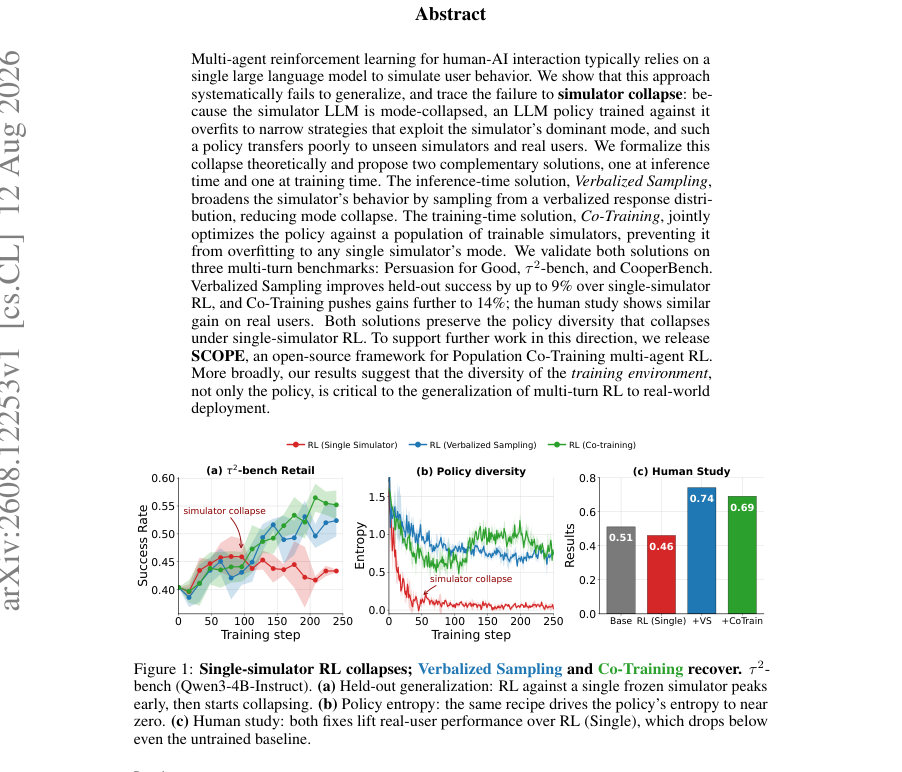
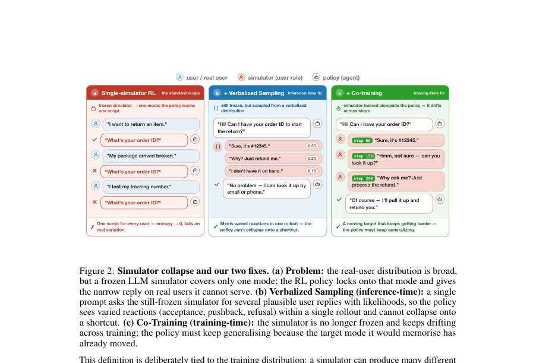
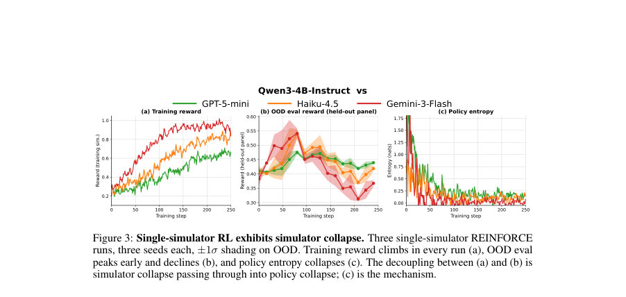

# One Frozen Simulator Is Not Enough: Simulator Collapse in Multi-Agent RL

- **게시일:** 2026-08-14
- **arXiv:** [2608.12253v1](http://arxiv.org/abs/2608.12253v1) · [PDF](https://arxiv.org/pdf/2608.12253v1)
- **저자:** Simon Yu, Nicholas Tomlin, Marwa Abdulhai, Ximing Lu, Derek Chong, Abe Hou, Dilara Soylu, Sergey Levine, Christopher D. Manning, Weiyan Shi
- **분야:** cs.CL, cs.AI, cs.LG
- **선정 점수:** 5.27
- **선정 이유:** 최근성 0.8, 인용 영향 0.0 (인용 0회), 저자 영향 0.0 (최고 h-index 0), AI 주제 적합성 3.0, 개발자 관심 1.2, 학술 신호 0.3, 오픈 웨이트·주요 연구조직 신호 0.0

[← 2026-08-14 목록으로 돌아가기](../daily/2026-08-14.html)

<!-- paper-visuals:start -->
## 주요 Figure

> 원문 PDF에서 실제 Figure 캡션과 그림 영역이 함께 확인된 자료만 자동 추출했다.

*Figure · 원문 PDF 1쪽 · Figure 1: Single-simulator RL collapses; Verbalized Sampling and Co-Training recover. τ 2-*

*Figure · 원문 PDF 4쪽 · Figure 2: Simulator collapse and our two fixes. (a) Problem: the real-user distribution is broad,*

*Figure · 원문 PDF 6쪽 · Figure 3: Single-simulator RL exhibits simulator collapse. Three single-simulator REINFORCE*

<!-- paper-visuals:end -->

## 한 문장 요약

동결된 하나의 LLM 사용자 시뮬레이터로 다중턴 RL을 학습하면 정책이 시뮬레이터의 우세 모드에 과적합되어 일반화에 실패하므로, 본문은 (1) 시뮬레이터 붕괴(simulator collapse)를 이론적으로 정형화하고, (2) 추론시 Verbalized Sampling과 학습시 Co-Training(및 Population Co-Training)이라는 두 보완적 해법을 제안해 OOD 및 실제 사용자로의 전이를 회복함을 보인다.

## 해결하려는 문제

기존의 다중턴 인간–AI 상호작용 RL은 단일(동결된) LLM을 사용자 시뮬레이터로 사용하는 관행을 따르는데, 정렬된 LLM 시뮬레이터는 특정(모달) 반응으로 모드집중(mode collapse)하는 경향이 있다. 이때 정책을 그 단일 시뮬레이터로 학습하면 정책 그래디언트가 시뮬레이터의 모드에 편향되어 정책 엔트로피가 급격히 감소하고(정책이 좁은 'exploit' 전략에 몰림) 결과적으로 보이지 않는 시뮬레이터나 실제 사용자에게 전이 성능이 크게 떨어진다. 연구 질문은 (i) 왜 단일 시뮬레이터 기반 RL이 이런 실패를 보이는가(시뮬레이터 붕괴의 메커니즘), (ii) 추론 단계와 학습 단계에서 각각 어떻게 이를 완화할 수 있는가이다.

## 핵심 기여

- 시뮬레이터 붕괴(simulator collapse)를 수식적으로 정형화하고, 모드집중된 시뮬레이터가 정책 그래디언트를 모드-사용자(mode-user) 목표로 편향시키며 정책 질량이 기하급수적으로 모드-익스플oit 집합으로 집중된다는 이론적 근거(정리 3.2, 보조명제들)를 제시함.
- 추론-단계 해법 Verbalized Sampling을 제안해 시뮬레이터의 per-turn 분포를 'verbalized response distribution'에서 샘플링함으로써 시뮬레이터 내 다양성을 회복하고 모드 편향을 완화함(재학습 불필요).
- 학습-단계 해법 Co-Training(및 Population Co-Training)을 제안해 정책과 사용자 시뮬레이터를 동일 대화 롤아웃에서 동시에 업데이트함으로써 시뮬레이터의 모드가 학습 중에 계속 이동하게 하여 정책의 고정 목표로의 수렴을 방지함.
- 세 가지 멀티턴 벤치마크(Persuasion for Good, τ2-bench, CooperBench)와 인간 실험을 통한 광범위한 실험으로 두 방법이 단일-시뮬레이터 RL이 보이는 OOD 성능 붕괴를 회복함을 실증하고, SCOPE라는 오픈소스 Population Co-Training 프레임워크를 공개함.
- 정책 엔트로피와 배치 수준 진단(예: zero-variance batch fraction)을 통해 시뮬레이터 붕괴의 학습 동학을 실증적으로 분석하고, 보정 방법들이 정책 다양성을 보존함을 보임.

## 접근 방법

* 모델링: 두 플레이어(에이전트 정책 πθ, 사용자 시뮬레이터 ϕψ)를 공유 대화 히스토리를 갖는 POMDP로 모델링하고, 에이전트는 롤아웃 전체의 종단 보상 R(τ)를 최대화하도록 REINFORCE(그룹-정규화된 z-스코어 이점을 사용)로 업데이트한다.
* 문제 정의: 시뮬레이터의 각 시뮬레이터 턴에서의 모드를 a*ϕ(s,aπ)로 정의하고, 그 턴에서 시뮬레이터가 모드에서 벗어날 확률을 ϵϕ(s,aπ)=1−ϕψ(a*ϕ\|...)로 정의하여 'ϵ⋆-collapsed on the training rollouts' 개념을 도입한다.
* 이론: 시뮬레이터 붕괴는 궤적 분포와 정책 그래디언트를 모드-사용자 환경 Mmode로 편향시켜(정리 3.2), 그룹-정규화된 업데이트가 모드-익스플oit 집합 Ax에 정책 질량을 집중시키는 메커니즘(명제 3.4, 추론)을 도출한다.
* Verbalized Sampling(추론 시): 동결된 시뮬레이터에게 각 턴에서 K개의 후보 응답과 그 확률을 'verbalize'하도록 질의하고 해당 분포에서 샘플링하여 시뮬레이터의 per-turn 다양성을 복원함(명제 3.7으로 reference-gradient 근사 주장).
* Co-Training(학습 시): 동일 롤아웃에서 에이전트와 시뮬레이터를 동시에 업데이트하고(시뮬레이터는 과제에 맞는 보상으로 학습), Population Co-Training은 최근 체크포인트 풀에서 활성 시뮬레이터를 샘플링하여 추가적인 환경 다양성을 제공한다.
* 구현: 모든 패러다임은 SCOPE 프레임워크로 통합되며, 비교군으로 Persona-Guided, frozen Ensemble(K=3), Self-play 등을 사용했다.
* 실험적 세부: τ2-bench와 P4G는 POSG, CooperBench는 Dec-POMDP로 설정했고, τ2-bench의 시뮬레이터 학습에는 SPICE식 커리큘럼(내부 배치 분산 목표 σ^2≈0.25) 보상을 사용해 시뮬레이터 변이를 보존했다.

## 주요 결과

- 전형적 collapse 현상: 단일 동결 시뮬레이터(RL Single)로 학습하면 학습(훈련) 보상은 상승하나 OOD(held-out 6-모델 패널) 성능은 초기 정점 이후 감소하고 정책 토큰 수준 엔트로피가 거의 0으로 붕괴함(예: 엔트로피가 약 1.9→0.4 nats로 감소, Appendix F.3).
- 정량적 보정 성과(표 1, Qwen3-4B-Instruct 기준): τ2-bench Retail에서 Base 40.4% → RL(Single) 46.1% → Verbalized Sampling 55.5% → Co-Training 60.5% → Population Co-Training 62.2% (패널 표준편차 표기). τ2-bench Airline: Base 24.0% → RL 29.8% → VS 36.9% → Co-Training 44.4% → Pop Co-Training 45.7%. Persuasion for Good(P4G) 보상: Base 0.216 → RL 0.275 → VS 0.484 → Co-Training 0.438 → Pop Co-Training 0.508.
- 전반적 개선 규모: 논문 요약·본문은 Verbalized Sampling이 단일-시뮬레이터 RL 대비 held-out 성공률을 최대 약 9%p 개선하고, Co-Training이 최대 약 14%p 추가 개선을 달성한다고 보고함(구체적 셀별 수치가 표 1에 제시됨).
- 인간 실험(사전등록, N=40/조건): τ2-bench에서 과제 성과(0–1)는 Base 0.41, RL(Single) 0.43, VS 0.63**, Co-Training 0.70**로 Co-Training이 RL(Single)보다 유의하게 향상했음; P4G에서는 의도 기부액과 자연스러움 등 지표에서 VS·Co-Training이 RL(Single)보다 유의한 개선을 보였음(본문 및 부록 수치와 유의성 표기).
- 기타: Population pool 크기 실험에서 K=5가 K=1,3,10보다 최적의 수렴·최종 평가를 보이는 경향을 보였고(그림 17), Co-Training은 per-step 계산비가 약 2× 증가하지만(본문, Appendix C.4) matched optimizer-step로 비교했음.

## 한계

- 저자가 명시한 한계: 실험은 텍스트 전용, 두 에이전트(2-player), 영어 환경, LLM 패널(6개 모델)로 평가되었으므로 N-에이전트, 다중모달, 비영어 환경으로의 확장성은 미검증 상태이다; Verbalized Sampling의 'reference-recovery' 가정(DTV(pVSϕ, P) ≤ η)은 경험적 가정이며 언제 성립하는지 케이스별로 다를 수 있음(본문 §3.4, Appendix F.5 설명).
- 저자가 언급한 구현·실험 제약(본문·부록에서 드러나는 제약): Co-Training이 유효하려면 시뮬레이터 보상 설계가 중요하며(τ2-bench에서 SPICE/커리큘럼 보상 σ^2≈0.25 사용), 대립적(adversarial) 혹은 완전 협력적 보상은 시뮬레이터를 다시 모드로 붕괴시켜 성능 저하를 초래할 수 있음(Appendix F.8).
- 검증 범위의 한계: held-out 평가는 LLM 패널에 대한 성능이며, 실제 사용자 전이성은 소규모 인간 실험(N=40/조건)으로 일부 검증했으나 다양한 도메인·사용자 풀에 대한 일반화는 추가 검증이 필요함.
- 세부 구현·하이퍼파라미터·계산 비용 관련 불확실성: 논문은 per-step 계산비와 총 GPU-시간을 부록에 제시한다고 하나 본문만으로는 정확한 학습 비용·하이퍼파라미터 전부를 재현할 수 없음(Appendix C.4에 상세).

## 개발자 관점

- 단일 동결 LLM 시뮬레이터만으로 다중턴 RL을 진행할 경우 학습 중 정책 엔트로피와 OOD 성능이 붕괴할 수 있으니, 정책 엔트로피(토큰 수준)와 배치 수준 진단(예: zero-variance batch fraction, all-failure/all-success 배치 비율)을 교육 중에 모니터링하라(논문은 zero-variance 배치 비율이 60%→85%로 상승한 사례를 보고함).
- 추론 수준 대응(Verbalized Sampling)은 재학습 없이 적용 가능하므로 빠르게 도입해 시뮬레이터의 per-turn 다양성을 회복시키는 일차적 수단으로 권장된다. 다만 VS는 '참조 분포' 근사 가정에 의존하므로 시뮬레이터가 후보 행동군을 제대로 verbalize하는지 샘플 검토·클러스터링으로 검증해야 한다.
- 학습 수준 대응(Co-Training/Population Co-Training)은 장기적으로 더 큰 OOD·실사용 이득을 준다. 구현 시 시뮬레이터 보상 설계(예: τ2-bench에서의 커리큘럼 보상으로 within-batch 분산 σ^2≈0.25 목표)가 중요하며, 잘못된 보상(완전 적대적/완전 협력적)은 시뮬레이터를 다시 모드로 집중시킬 수 있다.
- Population Co-Training 구현 제안: 최근 체크포인트 풀에서 K≈5를 기본값으로 시도해보고(논문 실험에서 K=5가 좋은 성능을 보임), 풀 크기·체크포인트 갱신 주기를 실험적으로 조정하라. 또한 Co-Training은 per-step 연산이 증가하므로(대략 2×) 계산 예산을 고려해 matched-optimizer-step가 아닌 matched-compute 기준으로 성능·비용을 비교하라(논문 부록에 상세).
- 재현·검증을 위해 SCOPE 프레임워크를 활용하라(저자 공개). 실제 사용자 전이에 민감하므로 소규모 인간 평가를 조기 도입하여 VS/Co-Training의 실제 사용자 효과를 검증하라.

**근거 범위:** 이 분석은 제공된 논문 PDF 본문(주요 본문과 부록에서 추출한 텍스트)을 기반으로 작성되었으며, 본문과 표·그림에서 직접 보고된 이론 정리, 수식, 표 1·2·3의 수치 및 부록의 실험 관찰을 근거로 요약했습니다. 구현 세부 하이퍼파라미터, 전체 GPU 시간 등은 본문이 아닌 부록(C.4 등)에 일부 기재되어 있어 본 요약에서는 부록의 핵심 결과와 본문 서술을 우선 인용했습니다. 본문에 명시되지 않은 내부 구현 세부나 미표기 수치는 생성하지 않았습니다.
