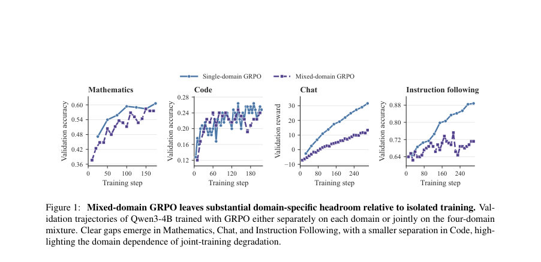
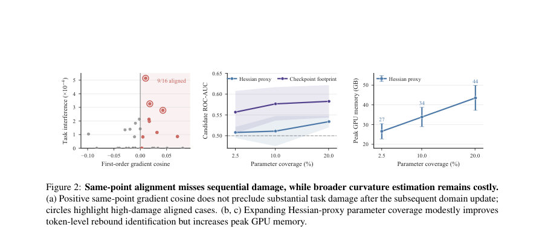
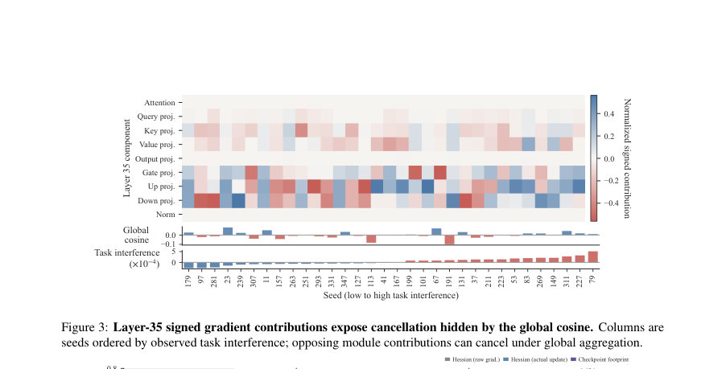

# One Step, One Lead: Mitigating Higher-Order Interference in Multi-Domain Reinforcement Learning via Cross-Step Control

- **게시일:** 2026-09-09
- **arXiv:** [2609.06469v1](http://arxiv.org/abs/2609.06469v1) · [PDF](https://arxiv.org/pdf/2609.06469v1)
- **저자:** Zihan Lin, Xiaohan Wang, Jie Cao, Jiajun Chai, Guojun Yin, Wei Lin, Ran He
- **분야:** cs.LG, cs.CL
- **선정 점수:** 4.66
- **선정 이유:** 최근성 0.4, 인용 영향 0.0 (인용 0회), 저자 영향 0.0 (최고 h-index 0), AI 주제 적합성 2.5, 개발자 관심 0.0, 학술 신호 0.6, 오픈 웨이트·주요 연구조직 신호 1.2

[← 2026-09-09 목록으로 돌아가기](../daily/2026-09-09.html)

<!-- paper-visuals:start -->
## 주요 Figure

> 원문 PDF에서 실제 Figure 캡션과 그림 영역이 함께 확인된 자료만 자동 추출했다.

*Figure · 원문 PDF 2쪽 · Figure 1: Mixed-domain GRPO leaves substantial domain-specific headroom relative to isolated training. Val-*

*Figure · 원문 PDF 3쪽 · Figure 2: Same-point alignment misses sequential damage, while broader curvature estimation remains costly.*

*Figure · 원문 PDF 9쪽 · Figure 3: Layer-35 signed gradient contributions expose cancellation hidden by the global cosine. Columns are*

<!-- paper-visuals:end -->

## 한 문장 요약

인접 체크포인트의 토큰 로그확률 '발자국(footprint)'을 이용해 연속 업데이트에서 발생하는 출력공간의 역행(backtracking)을 검출·억제하는 온라인 교정 기법(OSOL)을 제안하여 다영역 강화학습의 도메인 간 간섭을 완화한다.

## 해결하려는 문제

다영역(혼합 도메인) 정책 최적화에서 공동 학습은 특정 도메인 성능 저하 및 최적화 불안정을 유발한다. 기존 연구는 주로 동일 체크포인트에서의 1차(그라디언트 정렬) 또는 겉보기 곡률(헤시안 유사) 관점으로 진단·제어했으나, 동일-시점 진단은 연속된 실제 업데이트들 사이에서 출력이 부분적으로 되돌려지는 '교차-스텝(크로스-스텝) 간섭'을 포착하지 못한다. 또한 헤시안 기반 고차근사(파라미터 범위 확대)는 토큰 수준 rebound 식별 성능을 약간만 개선하면서 GPU 메모리 비용이 크게 증가하는 트레이드오프를 갖는다.

## 핵심 기여

- 크로스-스텝 관점 도입: 인접 체크포인트의 토큰 로그확률 발자국이 출력공간에서 연속 업데이트 간의 혼합 상호작용을 관찰 가능하게 하며, 이 상호작용은 경험적 출력 Fisher 행렬 하에서 이중적(dual)으로 2차 항을 회복함을 보였다(정리·증명 포함).
- OSOL 제안: 각 반복마다 하나의 focus 도메인을 지정하고 직전 체크포인트 발자국을 이용해 토큰별 반동(rebound) 위험을 순위화한 뒤, 순위에 따른 음의 보정(residual)을 base GRPO 계수에 적응적으로 추가하는 온라인 교정기를 설계·통합함.
- 이론적 보장: 출력 KL의 헤시안이 출력 Fisher임(Lemma 1), 인접 체크포인트 발자국 내적이 mixed output interaction을 근사함(Theorem 1), 그리고 제안한 음수 보정이 음→양 반동(negative-to-positive backtracking) 성분을 축소함을 보이는 수학적 보장을 제시함(명제·보조정리 포함).
- 실험적 검증: 통제 연구에서 크로스-스텝 backtracking이 이후 태스크 손상과 더 강한 상관(ρs=0.40, 95% CI [0.05,0.69])을 보였고, 직전 체크포인트 발자국 기반 순위가 헤시안 기반 프록시보다 토큰-level rebound 식별에서 ROC-AUC 및 precision 개선을 보였으며, 대규모 실험(Qwen3-30B-A3B, Qwen3-8B-Base)에서 기존 방법들을 능가함.

## 접근 방법

* OSOL(One Step, One Lead) 전체 흐름은 다음과 같다.
* 각 학습 반복 k에서: (1) focus 도메인 fk를 선택(제약: 직전 focus와는 다르게 샘플)하고 혼합 도메인 배치를 그대로 사용해 표준 GRPO 기반의 base 계수 Abase_i를 계산한다(Abase_i는 도메인 가중치 wf>wnf로 정규화됨).
* (2) 현재 롤아웃에서 focus 도메인의 실제 응답 토큰 집합 Ek에 대해 직전 체크포인트 θ_{k-1}로부터의 토큰별 로그확률 차이 u_i = log π_{θ_k}(a_i\|x_i) − log π_{θ_{k-1}}(a_i\|x_i)을 계산하고 후보 집합 Ck = {i ∈ Ek : u_i < 0}을 정의한다(이때 모든 체크포인트 기반 계산은 stop-gradient 처리).
* (3) 후보 토큰들을 u_i의 오름차순(더 음수인 것에 강한 우선순위)으로 랭킹한 뒤 랭크 기반 양상을 클리핑하여 정규화된 음수 프로파일 ¯r_i를 만든다(파라미터: plo=0.1, phi=1, rmin=−1, rmax=0).
* (4) 배치 단위 스케일링 κ_k = τ·std_E(Abase)/std_E(q) (표준값 τ=0.03)를 적용해 최종 잔류 r^{OSOL}_i = κ_k q_i를 얻고, eA_i = clip(Abase_i + r^{OSOL}_i, −3, 3)로 계수를 업데이트한다.
* (5) 변경된 계수 eA_i를 그대로 기존의 clipped PPO/GRPO 목적에 넣어(클리핑 비율 ϵ_c=0.2) 최적화한다.
* 이 방식은 추가적인 고차 미분 없이 직전-현재 발자국(u,d^0)의 내적이 δ_{k-1}^T F_k δ^0_k을 근사함(Thm.1)을 이용하고, 음수 보정은 토큰 단위로 negative→positive rebound 성분을 수학적으로 수축함(Prop.1).

## 주요 결과

- 메인(모듈 혼합·MoE) Qwen3-30B-A3B: OSOL의 도메인-매크로 평균(domain-macro avg.)은 0.4822로, MGS(가장 강한 비교군) 0.4560 대비 +0.0262 포인트(상대 5.7%) 개선을 보였다. (세부: Math 0.5822, Code 0.4529, IF 0.1933, Chat 0.7003; 단 IF는 베이스보다 낮음)
- Dense 백본 Qwen3-8B-Base: OSOL domain-macro 0.3735로 표준 GRPO(0.3511) 대비 +0.0224(약 6.4%) 개선을 기록했고, GRPO+KL0.001 대비 +0.0035(0.9%)로 가장 높은 도메인 평균을 달성했다. (세부: Math 0.3111, Code 0.2173, IF 0.2933, Chat 0.6723)
- 통제 연구(Study I): 연속된 업데이트의 실현된 크로스-스텝 backtracking mass는 이후 태스크 손상과 양(positive) 상관관계를 보였다(스피어만 ρs=0.40, 95% 부트스트랩 CI [0.05,0.69]). 동일-시점 진단(글로벌 첫-차 코사인, 모듈별 갈등)은 각각 −0.19, −0.22로 양의 정렬을 제공하지 못했다.
- 토큰 레벨 rebound 식별(Study II): 직전 체크포인트 발자국 기반 랭킹은 negative-drift 후보 내에서 ROC-AUC 0.567, 평균 정밀도(avg precision) 0.627, 상위 5% precision 0.661을 달성했고, 동일 조건의 헤시안(유한차분) 프록시는 ROC-AUC 0.498, avg precision 0.579, top-5% precision 0.551에 그쳤다. 또한 헤시안 프록시는 파라미터 범위 확장 시(2.5%→10%→20% 파라미터 커버리지) 피크 GPU 메모리가 26.6→33.8→43.5 GB로 증가하는 동안 ROC-AUC는 0.508→0.511→0.534로만 완만히 개선되어 비용 대비 효율이 낮음을 보였음. (부록 수치)
- 무작위·집중성 실험(절제): OSOL에서 히스토리 잔류를 제거한 변형은 domain-macro 0.3600(완전 OSOL 0.3735 대비 −3.8%); 초점-가중치 균등화(equal task weights) 또는 무작위 잔류(random residual)는 각각 0.1815, 0.1838로 성능이 크게 하락(약 −51% 수준)하여 초점 가중화 및 drift 기반 배분의 중요성을 확인함.

## 한계

- 저자가 명시한 한계: 출력 Fisher(empirical Fisher)가 임의 목적 함수의 일반적 Hessian을 대체한다고 볼 수 없다는 점을 논의하고 있으며(본문과 Appendix C), 헤시안 기반 고차 추정은 파라미터 커버리지를 넓힐수록 GPU 메모리 비용이 크게 증가해 실시간·대규모 적용에 부담이 있다는 점을 지적한다. 또한 유한차분 기반 헤시안 프록시는 probe 스케일(ϵ)에 민감하여 출력공간으로 전파되는 가상 변위 규모가 달라질 수 있음을 보였고(App. B, Fig.9), OSOL의 이론적 보장은 국소 근사(η 작을 때)와 로컬 우세성(잔류→출력 전이 조건) 가정에 의존한다(로컬 잔여·삼차항 오차 O(η^3)).
- 실험·설계에서 합리적으로 확인되는 제약(본문 근거): OSOL은 일부 도메인(IF)에서 성능 하락을 보인 케이스가 존재함(Qwen3-30B-A3B에서 IF 0.1933 < base 0.2100), 즉 모든 도메인에서 일관된 이득을 보장하지는 않는다. 또한 직전 체크포인트로 대상 토큰을 재평가하기 위한 추가 전방 패스가 필요하므로 계산량(추가 GPU 시간)과 I/O(체크포인트 접근)가 추가로 요구된다. 초점 스케줄링, τ 및 랭크·클리핑 파라미터 등 하이퍼파라미터에 의존하며, 강한 크로스-토큰 커플링 상황에서는 잔류가 음수 계수로 바로 출력 음수 변화를 보장하지 못해(KE의 비대각 성분 영향) 제어 효과가 약화될 가능성이 있다.

## 개발자 관점

- 재현·구현: OSOL은 표준 GRPO(PPO 클리핑 포함) 파이프라인에 '계수 수정'으로 통합되며 추가 손실 항이나 별도 모델을 요구하지 않는다. 핵심 구현 요소는 직전 체크포인트 θ_{k-1}에서의 focus 도메인 응답 토큰 재점수(rescore), 후보 집합(Ck: u_i<0) 형성, 랭크 기반 음수 프로파일(plo=0.1,phi=1,rmin=−1,rmax=0), 배치 정규화(scale κ_k, τ 기본 0.03), 계수 클리핑([-3,3]), 그리고 수정된 계수를 기존 clipped PPO surrogate에 그대로 사용하는 것이다.
- 연산·자원 고려: OSOL은 헤시안 추정에 비해 고비용 행렬 연산·메모리(박스별 Hessian 계산)를 피하지만, 직전 체크포인트로의 추가 전방 연산(동일 토큰 재점수)이 필요해 GPU/추론 비용이 증가한다. 대안적 곡률 접근은 파라미터 커버리지 확대 시 메모리 요구가 급증함(예: 26.6→43.5 GB)과 성능 개선이 완만함을 참고해 선택해야 한다.
- 안정성·적용정책: 역사 기반 보정은 'penalty-only' 설계(음수 보정만 적용)로 노이즈 또는 우연한 증가를 강화하는 보상 인센티브를 피한다(안전성 설계). 따라서 실무 적용 시에도 history→positive reward 루프를 만들지 않도록 주의해야 한다.
- 모니터링 권고: 도메인별(특히 IF처럼 민감한 도메인) 검증 지표를 개별 모니터링하고, OSOL 잔류 스케일 τ, 후보 분포 희소성, 초점 스케줄 정책의 민감도를 검증하는 것이 중요하다. ablation에서 알 수 있듯이 초점 가중화 및 drift 기반 배분은 성능에 큰 영향을 미친다.
- 배포·운영: 체크포인트 재점수는 분산/비동기 학습 환경에서 I/O·동기화 문제를 야기할 수 있으므로, 실서비스 규모에서는 체크포인트 접근 전략(메모리 캐시, 동기화 빈도 조절)과 추가 비용을 설계에 반영해야 한다.

**근거 범위:** 본 분석은 제공된 논문 PDF 본문(본문 및 부록 포함)에서 직접 추출한 내용에 기반한다. 수치(예: 결과 표, ROC-AUC, 상관계수, 메모리 측정 등)와 알고리즘 설계·하이퍼파라미터는 본문·부록에 명시된 값만을 사용하였다. 코드 수준의 구현 세부(정밀한 최적화 트릭, 분산 I/O 처리 등)나 외부 데이터 전처리 파이프는 PDF에 상세히 기재되지 않아 확인이 제한적이다.
