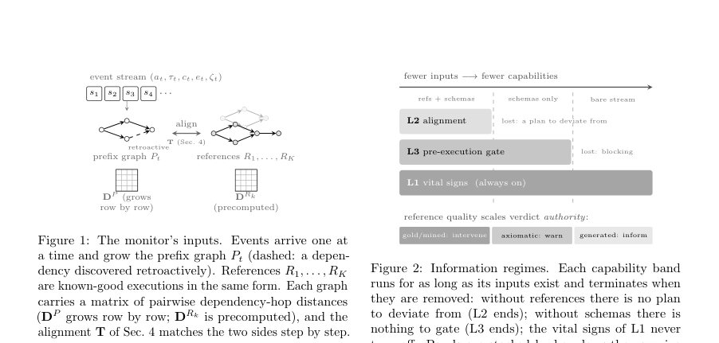
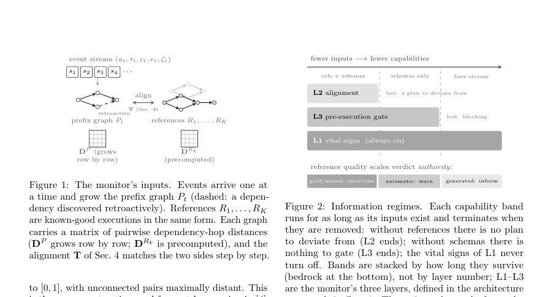
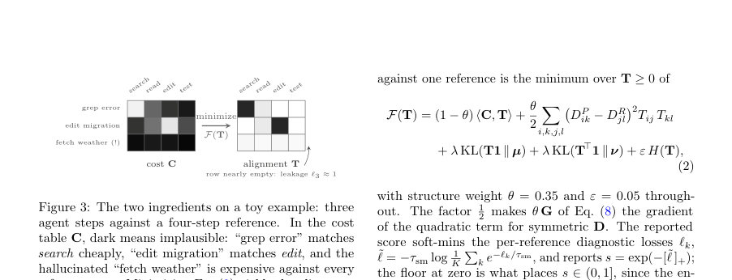

# OnTrack: Real-Time Monitoring and Intervention in LLM Agent Trajectories via Streaming Structure-Aware Optimal Transport

- **게시일:** 2026-10-09
- **arXiv:** [2610.12375v1](http://arxiv.org/abs/2610.12375v1) · [PDF](https://arxiv.org/pdf/2610.12375v1)
- **저자:** Babak Barazandeh, Connor Swanson, Chinmay Kulkarni, Nikhil Mungel
- **분야:** cs.AI, cs.CL, cs.CY, cs.LG
- **선정 점수:** 5.18
- **선정 이유:** 최근성 1.3, 인용 영향 0.0 (인용 0회), 저자 영향 0.0 (최고 h-index 0), AI 주제 적합성 3.0, 개발자 관심 0.6, 학술 신호 0.3, 오픈 웨이트·주요 연구조직 신호 0.0

[← 2026-10-09 목록으로 돌아가기](../daily/2026-10-09.html)

<!-- paper-visuals:start -->
## 주요 Figure

> 원문 PDF에서 실제 Figure 캡션과 그림 영역이 함께 확인된 자료만 자동 추출했다.

*Figure · 원문 PDF 4쪽 · Figure 1: The monitor’s inputs. Events arrive one at*

*Figure · 원문 PDF 4쪽 · Figure 2: Information regimes. Each capability band*

*Figure · 원문 PDF 5쪽 · Figure 3: The two ingredients on a toy example: three*

<!-- paper-visuals:end -->

## 한 문장 요약

실시간으로 성장하는 에이전트 실행 그래프를 참조 실행들과 구조적으로 정렬하는 스트리밍 구조인식 최적수송(Streaming structure-aware optimal transport) 기반 모니터링(OnTrack)을 제안하여, 각 단계당 약 밀리초 수준 연산으로 조기 경고·중단 결정을 내릴 수 있게 한다.

## 해결하려는 문제

LLM 기반 에이전트가 자율적으로 도구를 호출하며 수행하는 실행은 단계들 간 의존성으로 구성된 DAG이다. 기존의 (1) 후속(사후) 평가 방식은 결함을 실행 완료 후에나 발견해 이미 비용(토큰·도구 호출)이 소모된 뒤에야 대응하고, (2) 온라인 판별을 위해 다른 LLM을 이용하는 방식은 매 단계마다 비용·지연을 유발하고 작고 저사양의 판단 모델은 대형 모델의 실수를 찾기 어렵다. 또한 기존 방법들은 실행의 위상(어떤 단계가 어떤 단계의 출력을 소비하는지)을 스트리밍 상황에서 실시간으로 고려하지 못해 루프·순서 뒤바뀜·불필요 반복 등을 즉시 검출하기 어렵다.

## 핵심 기여

- 스트리밍 상황에서 실행 DAG를 참조(known-good) 실행들과 구조적으로 정렬하는 OnTrack을 제안하고, 실시간(단계당 약 1 ms) 모니터링·경고·중단을 설계·구현했다.
- 완전 참조·스키마 전용·무지식(로그만) 등 세 가지 정보 접근 레짐을 정의하고, 각 레짐에서 가능한 검출 능력(계획 위반, 루프·정체·반복 호출 등)을 명확히 서술했다.
- 스트리밍 제약(S1: 접두사 문제, S2: 잠정 구조, S3: 연산 예산, S4: 결정(continue/warn/halt) 필요성)을 해결하는 기술적 구성요소: (i) 프론티어 마스킹(masked marginals)으로 접두사 문제 해결, (ii) 연속적/워밍스타트 조건부 그래디언트(CGM) + 워밍스타트 Sinkhorn으로 1회 반복의 빠른 업데이트와 필요시 완전 수렴 재계산 병행, (iii) 단계별 누수(leakage)·연령 가중치(age weights) 등으로 잠정 구조 처리, (iv) 불가역 액션에 대한 동기화된 L3 게이트 설계.
- 이론적·실험적 검증: 구현된 스트리밍 절차가 동일한 구현의 배치(batch) 평가와 최종적으로 일치함을 보이는 명시적 정리(Prop.1), 프론티어 마스크의 레이블 불변성(Prop.2), 잔여노드의 영향 상한(Prop.3) 등 성질과 SWE-bench 실제 SWE-agent 궤적(2,288개 사용) 및 통제된 결함 주입에서의 실험 결과를 제시했다.

## 접근 방법

* OnTrack는 에이전트의 실행을 단계별 이벤트 스트림으로 받아 각 이벤트를 노드로 하는 접두사 그래프 Pt를 구성하고, 선택적으로 참조 집합 R과 도구 스키마를 입력으로 사용한다.
* 주요 구성요소는 다음과 같다.
* (1) 비용표 C: 각 에이전트 단계 i와 참조 단계 j 사이의 행동(action), 인자(arguments), 도구(tool) 유사도를 가중합으로 계산(Cij = α dcos(action) + β dcos(args) + δ dtool), 기본 가중치는 (α,β,δ)=(0.45,0.20,0.35).
* (2) 정렬 행렬 T: 에이전트 단계의 '질량'을 참조 단계로 소프트 대응하는 비음수 행렬로 표현.
* 에이전트의 단일 노드 질량 µi는 평균 참조 길이 ¯m의 역수 1/¯m로 고정하여 접두사 상황에서 스케일 보정.
* (3) 목적함수: 비용 ⟨C,T⟩, 구조 보존 항(유클리드 형태의 DP vs DR 비교, 가중치 θ=0.35), 비일치 질량에 대한 generalized KL 페널티(λ), 엔트로피 정규화(ε=0.05)를 합친 UFGW 유사 목적(식(2)).
* (4) 접두사 문제 처리: 이전 단계의 coupling으로부터 참조 노드의 'satisfied' 상태를 계산하고 활성집합 A 및 룩어헤드 L을 구성해 마스킹된 참조 주변질량 ν(t)을 정의(파라미터: κ=0.3, βlook=0.3, εν=0.01).
* 이로써 에이전트가 허용 가능한 병렬/재배열을 했을 때 조기에 벌하지 않음.
* (5) 스트리밍 최적화: 매 이벤트마다 기존 coupling을 워밍스타트로 한 번의 conditional gradient(CGM) + 다중 Sinkhorn 반복(기본 ninner=5) 수행하여 빠른 근사 업데이트를 하고, 개입(경고/중단)이 필요해 보이면 현재 프리픽스에 대해 완전 수렴(solve) 수행해 결정을 확정.
* (6) 잠정구조 보정: 새 노드의 구조 영향은 초기엔 0에서 선형으로 증가시키는 연령 가중치 ωi(t)=min(1,(t−ti)/hage) (hage=3)로 펄스성 오류를 줄임; 이후 후향적 의존성 발견 시 DP를 수정하고 다음 CG 단계가 흡수.
* (7) 레이어화 아키텍처: L1(참조 없이 항상 활성) - 루프·정체·정보이득 신호 등 단독 진단, L2(참조 필요) - 스트럭처드 정렬 기반 진단, L3(스키마 필요) - 불가역 도구 실행 전 동기화된 정책 게이트(스키마·제안 정렬 검사)로 구성.
* (8) 판정 로직: 각 노드의 누수(ℓi), 매칭 비용, 커버리지 속도 등 단계별 신호를 기준으로 EXPLORING→WARN→HALT 등으로 상태 전이; 신규노드에 대해 TTL grace(기본 g=3) 적용.

## 주요 결과

- 실행 비용/지연: 구현상 빠른 패스(워밍스타트 1 이터레이션)는 t=m=40, K=3에서 Apple M5 Max 코어 기준 p50 0.85 ms / p95 1.6 ms per event(예: t=m=20에서 p50 0.5 ms / p95 0.7 ms; t=80에서 p50 1.6 ms / p95 3.9 ms). 개입 전에 수행하는 완전 수렴 소브(runtime ≈30 ms)는 오직 개입 직전만 수행.
- SWE-bench 조기 판별: 평가의 주 프로토콜(인스턴스 분리, λ=0.3로 캘리브레이션)에서 부분 궤적(처음 k 단계)에 대한 resolved(성공) vs unresolved(실패) 판별 AUROC: k=8에서 OnTrack .631, Cosine .574, LinUOT .628로 OnTrack가 cosine 대비 +0.057 AUROC 향상(부트스트랩 95% CI for Δ [+0.033,+0.080], 주 프로토콜에서 k≤10까지 Δ CI가 0 제외). k≤10 초반 영역에서 우세가 관찰되고 k≥15에서는 우위 소멸.
- 중단(abort) 정책 실험: 심각 플래그 밀도(롤링 윈도우 6단계 기준) 임계치 0.60에서 평가(균형 샘플 n=150 per class) 결과, 미해결(unresolved) 궤적 중 23.3%를 조기 중단했고(참중단율), 정상 궤적의 20.7%를 잘못 중단했으며(오중단율), 실패 집단에서 절약된 계산비용은 17.9%였다. 운영환경 기반 정정(실패율 81%의 실전 베이스레이트 반영) 시 중단된 런의 약 83%가 실제 실패로 귀결되어(대략 5/6) 정밀도(precision) ≈83%로 해석 가능하다고 제시함.
- 통제된 결함 주입: 유닛 테스트 시나리오(6단계 템플릿)에 대해 루프 탐지(LOOP) 재현율 100%·지연 0 이벤트 등 설계된 동작을 충족. 누수(ℓ) 신호는 정상 노드 ≤0.24, 주입된 환각 노드 ≥0.66으로 θ_leak(=0.6) 기준에서 잘 분리됨.
- 구성요소 절삭실험: 구조 항(θ) 제거(즉 No GW) 시 정상-오경보(false-positive) 비율이 크게 상승(예: 정상 추적에서 플래그 발생 benign false-positive traces: Full 13/40 vs No GW 29/40), 즉 구조 항은 실제 궤적에서 운용점의 FPR을 낮추는 역할을 함(정확한 수치는 본문 표(Table 4) 참조).

## 한계

- 저자가 명시한 한계: OnTrack는 '검증기(validator)'가 존재하는 작업에서는 검증기의 대체가 아니며, 작업-일반(task-generic) 참조로는 패치의 정답성(최종 성공 여부)을 예측하지 못한다(길이 제어 시 AUROC ≈0.526으로 한계).
- 저자가 명시한 한계: 동일 분포 내부의 짧은 스플라이스(다른 미해결 트레이스에서 떼어온 몇 단계)는 균질한 SWE-agent 궤적에서는 탐지 바닥 근처에 있어 잡아내기 어렵고, 작업 수준(인스턴스 매칭 참조·검증기 등)의 의미론적 정보가 필요하다.
- 본문에서 확인되는 실험적 제약: 온라인 의존성(artifact 추적) 추출이 핵심 병목이며, age-weight·retroactive repair로 완화하지만 제거하지 못함(온라인 추출 불일치 시 최종화 결과는 배치와 달라질 수 있음).
- 운용상의 한계: 제시한 조기 중단 운영점에서 균형 표본 기준 오중단(false-stop) 비율이 13–21%로, 배포 전 실제 트래픽으로 임계치(예: 플래그 밀도)를 별도 캘리브레이션해야 함. 즉, 제안된 중단 정책은 후보 운영정책이지 곧바로 배포 가능한 안전보장 아님을 저자도 명시함. 본문에서의 0.60 임계치는 시연용으로 캘리브레이션된 값임(held-out로 고정된 값 아님).

## 개발자 관점

- 구현 관례: 에이전트 노드당 질량 µi를 평균 참조 길이 ¯m의 역수로 고정하면 접두사 상황에서 누수(leakage)가 스케일-불변한 신호가 된다(µi = 1/¯m, 식(3)).
- 프론티어 마스킹(ν(t) 구성)은 접두사에서 ‘실행 가능한’ 참조 집합을 활성화해 정렬이 조기 벌점을 주지 않도록 함(파라미터 κ=0.3, βlook=0.3, εν=0.01 기본값). 운영 전 해당 파라미터의 효과를 캘리브레이션할 것.
- 스트리밍 최적화 설계: 매 이벤트마다 워밍스타트된 CG 한 회(conditional gradient) + 소수(Sinkhorn ninner≈5)의 내적 반복으로 빠른 근사 업데이트를 수행하고, 개입이 제안될 때만 현재 프리픽스에 관해 완전 수렴(≤10 outer CG, ≤50 inner Sinkhorn)을 수행해 비용을 줄임. 이 설계은 per-event 지연을 ms 수준으로 억제함.
- L3 pre-execution gate: 불가역(irreversible) 도구 호출에 대해서만 동기식으로 스키마(요구 아티팩트 존재 확인) + 제안-정렬(한 줄 제안 정렬)을 수행해 동기화 비용을 희소화함. 게이트는 정책적 차단이며 스키마의 완전성에 의존함(스키마 한계는 배포상 리스크).
- 연령 가중치와 잠정구조: 새 노드의 구조 기여를 즉시 판정하지 않고 hage(=3) 이벤트 동안 선형으로 키워 잠정-오경보를 줄임. 배치(finalization) 단계에서는 age weights 비활성화해 배치 점수와 정합되도록 함. 반드시 최종 수렴 경로가 배치 절차와 같은 구현을 사용하도록 구현할 것(Prop.1).

**근거 범위:** 이 분석은 제출된 논문 PDF 본문(페이지 1–16)에 명시된 내용만을 근거로 작성하였다. 제시된 수치(예: AUROC, ms 단위 지연, 중단 정책의 TPR/FPR/절약 비율 등)는 본문 표와 텍스트에서 직접 인용한 값이다. 본문에 명시되지 않거나 본문에서 합리적으로 추론할 수 없는 구현·하이퍼파라미터·데이터 세부(예: 추가 환경별 성능 변화, 대규모 참조 세트 효과 등)는 생성하지 않았다. 일부 실험 결과는 캘리브레이션·샘플 구성(예: 균형 샘플 vs 전체 분포)에 민감하므로 배포 전 별도 캘리브레이션과 검증이 필요하다.
