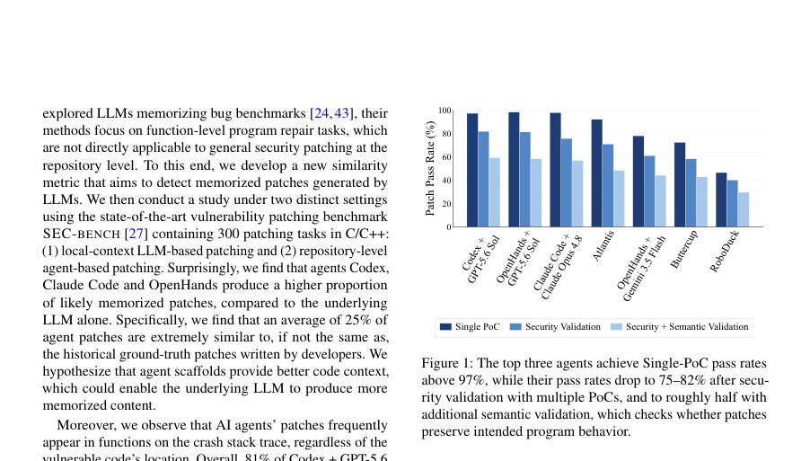
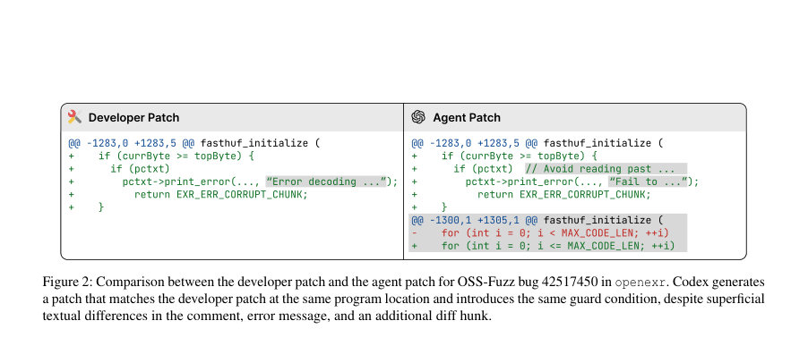
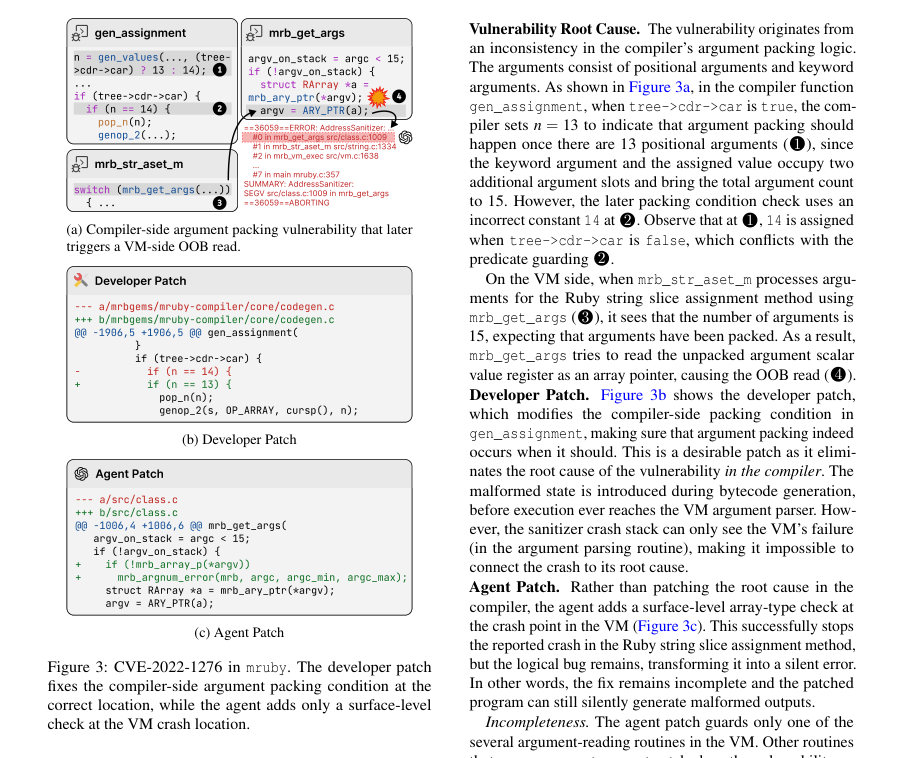

# PatchBench: Evaluating AI Agents for Vulnerability Patching

- **게시일:** 2026-09-06
- **arXiv:** [2609.04075v1](http://arxiv.org/abs/2609.04075v1) · [PDF](https://arxiv.org/pdf/2609.04075v1)
- **저자:** Chihao Shen, Jiacheng Li, Aastha Mahajan, Jeffery Siyuan Tian, Yonghwi Kwon, Yizheng Chen
- **분야:** cs.CR, cs.AI, cs.SE
- **선정 점수:** 4.33
- **선정 이유:** 최근성 0.5, 인용 영향 0.0 (인용 0회), 저자 영향 0.0 (최고 h-index 0), AI 주제 적합성 2.2, 개발자 관심 0.8, 학술 신호 0.9, 오픈 웨이트·주요 연구조직 신호 0.0

[← 2026-09-06 목록으로 돌아가기](../daily/2026-09-06.html)

<!-- paper-visuals:start -->
## 주요 Figure

> 원문 PDF에서 실제 Figure 캡션과 그림 영역이 함께 확인된 자료만 자동 추출했다.

*Figure · 원문 PDF 2쪽 · Figure 1: The top three agents achieve Single-PoC pass rates*

*Figure · 원문 PDF 3쪽 · Figure 2: Comparison between the developer patch and the agent patch for OSS-Fuzz bug 42517450 in openexr. Codex generates*

*Figure · 원문 PDF 4쪽 · Figure 3: CVE-2022-1276 in mruby. The developer patch*

<!-- paper-visuals:end -->

## 한 문장 요약

공개 취약점 기반 평가에서 발생하는 패치 '암기'와 '표면적 수정(증상 가림)' 문제를 분석하고, 이를 완화하기 위해 취약점 이식·코드 변형과 보안+의미론적 검증을 결합한 PATCHBENCH 벤치마크와 DiffBLEU 유사도 지표를 제안한다.

## 해결하려는 문제

기존 자동 취약점 패치 평가들은 보통 PoC(단일 입력)에 대한 크래시 제거 여부로만 패치를 검증한다. 이로 인해 두 가지 주요 문제가 발생한다: (1) 대형언어모델(LLM) 및 에이전트가 역사적 개발자 패치를 암기해 재생산할 수 있어 실제 패치 능력이 과대평가될 수 있고, (2) 에이전트가 크래시 스택(trace) 상의 위치에 표면적 검사(guard)를 넣어 단일 PoC만 억제하는 방식으로 근본 원인을 고치지 않고도 검증을 통과할 수 있다. 논문은 C/C++ 레포지토리 수준의 취약점 패치에 대해 이러한 위협을 정량화하고, 보다 엄격한 평가 프로토콜을 설계하는 것을 연구 질문으로 삼는다.

## 핵심 기여

- 패치 암기(patch memorization)를 감지하기 위한 패치 유사도 지표 DiffBLEU를 제안하고 검증함(문맥-및 diff 인식 토크나이저, AST·데이터플로우 기반 비교 포함).
- 패치 암기와 표면적 수정 문제를 완화하도록 설계된 PATCHBENCH 벤치마크(213개 C/C++ 작업, 32개 프로젝트, 16 CWE)를 제안: 개발자 패치가 크래시 스택 밖에 있는 작업 선정, 취약점 이식(transplant)과 패치-사이트 변형(mutation), 수작업으로 정제한 참조 패치 포함.
- 보안(여러 PoC에 대한 sanitizer 재현 검사)과 의미론적 검증(정상 입력에서의 sanitizer 회귀, 참조-패치된 리포지토리와의 출력 상태 비교, 단위 테스트)을 결합한 상세한 패치 검증 파이프라인을 설계 및 구현.
- SEC-BENCH(300개 작업) 및 PATCHBENCH에서 11개 최첨단 에이전트를 평가해, PoC-only 검증이 평균 1.83×로 성능을 과대평가함을 보여주고(예: 최상위 에이전트가 원래 PoC는 >97% 통과하나 보안+의미 검증에서는 약 절반 수준 해결), 에이전트들의 주요 실패 패턴을 분석함.
- 벤치마크, 코드 및 실험 인프라를 공개하여 재현 가능성을 제공.

## 접근 방법

* 논문은 두 축(암기 탐지, 엄격 검증/벤치마크 설계)으로 접근한다.
* 패치 암기 탐지: DiffBLEU를 제안.
* 개발자 패치 ∆r과 생성 패치 ∆c의 diff-aware 토크나이저 기반 토큰 유사도(BLEU, 가중 BLEU)와, 패치 주변 코드 문맥(Cr, Cc)에 대해 AST-서브트리 매칭(Matchast) 및 데이터플로우 에지 매칭(Matchdf)을 결합한 점수로 정의함.
* 하이퍼파라미터은 α=0.3, β=0.3, γ=0.2, δ=0.2, 유사도 임계값 0.75를 사용(검증 집합에서 거짓양성 0, 거짓누락 1.1%).
* Diff-aware 토크나이저는 추가/삭제 라인을 별도 공간으로 처리하고 리터럴 익명화·주석 제거 등을 수행.
* PATCHBENCH 구성: ARVO의 역사적 취약점에서 출발해(1) 개발자 패치가 수정을 가한 함수들을 식별, (2) PoC 실행 시의 패치-도달(trace)과 sanitizer 크래시 트레이스 간 Jaccard 기반 겹침도 ρ 계산, (3) 개발자 패치 사이트가 크래시 스택 밖이고 ρ ≤ 0.5인 작업만 선택(스택-외부 작업), (4) 취약점을 레포지토리의 최신 적용 가능한 커밋으로 이식(역패치 + bisection 기반), (5) 패치-허브 주변 코드에 대해 NATGEN(5가지 변환)과 CODEMORPH 변형을 적용해 원본 패치를 그대로 재사용할 수 없게 변형, (6) 수동 검토로 참조(reference) 패치 정제, (7) fuzz 및 단위테스트를 통한 검증 가능 작업만 유지.
* 패치 검증: 입력군 생성은 PoC 기반의 directed fuzzing(CONCFUZZ)과 undirected fuzzing(libFuzzer/Honggfuzz/AFL)을 각각 10분씩 실행해 crashing corpus(취약 레포지토리에서 크래시, 참조-패치된 리포지토리에서는 크래시하지 않는 입력들)와 benign corpus(양쪽에서 크래시 없는 입력들)을 생성.
* 보안 조건: crashing corpus의 모든 입력에 대해 에이전트-패치된 리포지토리가 sanitizer 에러를 일으키지 않아야 함.
* 의미론적 조건(참조-패치 리포지토리를 오라클로 삼음): benign corpus에 대해 sanitizer 회귀 없음, 각 입력의 프로그램 출력 상태(파일/반환값 등)가 참조-패치 리포지토리와 동일해야 함(비결정성 제거를 위해 3회 실행으로 플리키한 입력 제외), 그리고 참조-패치에서 통과하는 단위 테스트 모두 통과해야 함.
* 실험 설정: PATCHBENCH(213개 작업), 에이전트 11종(상용/오픈 프레임워크+다양한 LLM 조합, AIxCC 상위 3개 포함), 에이전트당 예산 $5(Atlantis는 병렬 노드로 총 $20), medium reasoning effort로 실행.
* SEC-BENCH(300개)에서 암기 연구를 병행해 로컬-컨텍스트 LLM 패치 생성과 레포지토리-수준 에이전트 생성 결과를 비교했다.

## 주요 결과

- 패치 암기(SEC-BENCH): 로컬-컨텍스트에서 평균 11%였던 높은 유사도(DiffBLEU > 0.75) 비율이 레포지토리-수준 에이전트에서는 평균 25%로 증가(예: GPT-5.6 Sol 8.3% → Codex+GPT-5.6 Sol 22.0%; Claude Opus 10.7% → Claude Code+Opus 27.7%; Gemini 13.0% → OpenHands+Gemini 24.3%). 에이전트 스캐폴딩이 암기를 촉진할 가능성 제시.
- PATCHBENCH 구성 결과: 32개 프로젝트, 213개 패치 작업(참조 패치 수작업 검토 및 정제 포함). 취약점 이식·변형으로 PATCHBENCH에서 DiffBLEU 기반 암기 비율은 거의 0% 수준(예: Codex+GPT-5.6 Sol에서 0.0%, Claude Code+Opus 1.4%, OpenHands+Gemini 0.9%).
- PoC-only 검증 과대평가: 11개 에이전트 평균으로 원래 PoC 통과 비율은 83.1%였으나 보안+의미론적 검증을 모두 통과한 '해결(solved)' 비율은 45.3%로, PoC-only가 성능을 평균 1.83× 과대평가(상위 에이전트 예: Codex+GPT-5.6 Sol 원 PoC 통과 97.2% → 최종 해결 59.2%; OpenHands+GPT-5.6 Sol 98.1% → 58.2%; Claude Code+Opus 97.7% → 56.8%).
- 의미론적 검증이 병목: 의미론적 검증 평균 통과율은 63.4%였고, 세부 항목별 평균 통과율은 sanitizer 회귀 체크 95.7%, 출력 상태 검사 75.5%, 단위 테스트 79.9%로 출력 상태 비교가 가장 취약함(논문 A.5의 표 참조).
- 실험 비용·예산: 11개 에이전트×213 작업의 총 추정 추론 비용은 약 $6,500. 예산 증가 실험에서 per-task 예산을 $5→$25로 늘려도 해결률은 소폭 개선 후 빠르게 포화함(예: Codex+GPT-5.6 Sol 59.2%→61.5%), 따라서 예산 부족이 주된 한계는 아님을 보임. 또한 67/213 작업은 어떤 에이전트로도 해결되지 않았음.

## 한계

- 저자 명시 한계 - 참조 의존성(Reference Dependency): 실제 배포 환경에서는 참조-패치된 리포지토리가 없으므로 논문에서 쓰는 의미론적 검증(참조를 오라클로 사용)은 바로 적용하기 어렵다. 저자들은 취약 리포지토리와 에이전트-패치 리포지토리를 직접 비교하는 약한 형태의 검증(취약→패치 전후 비교)을 제안하지만 이는 의도적 동작 변경을 설명하지 못함.
- 저자 명시 한계 - 검증의 입력 종속성(Validation Gap): fuzzing 기반 입력 생성은 완전 탐색을 보장하지 못해(입력 커버리지의 한계) 일부 과도하게 침습적이거나 근본 원인을 일부만 고치는 패치가 검증을 통과할 수 있음(저자 측 수동 검토 결과 Atlantis 6.8%, Codex 7.1%의 통과 패치가 근본 원인을 부분적으로만 고침).
- 저자 명시 한계 - 벤치마크 오염 위험(Benchmark Contamination): 공개 벤치마크이므로 향후 모델 학습에 사용될 경우 재오염 위험이 있으며, 이를 완화하려면 지속적 이식·변형이 필요함.
- 실험·방법에서 드러나는 제약(분석자 판단): PATCHBENCH의 수작업 참조 패치 정제와 변형 과정에는 수작업 개입이 상당히 포함되어 있어 자동화/대규모 확장에 비용이 듦(논문에 수작업 수리 및 검토 명시). 또한 DiffBLEU 임계값과 가중치는 검증 세트에 맞춰 튜닝되었고 다른 도메인/언어로의 일반화는 추가 검증 필요(논문은 ARVO 샘플 검증을 보고함).

## 개발자 관점

- PoC 한 개로만 패치 유효성을 판단하지 말 것: 단일 PoC 검증은 표면적 수정(크래시 억제)을 허용하므로, directed fuzzing과 undirected fuzzing을 조합해 여러 PoC 변형과 정상 입력을 확보해 검증하라(논문은 CONCFUZZ + libFuzzer/Honggfuzz/AFL 각 10분씩 권장).
- 패치 암기 여부 검사: 공개 취약점·레포지토리 기반 평가에서는 DiffBLEU 같은 문맥·diff 인식 유사도 지표를 도입해 생성 패치가 역사적 패치를 단순 재생산한 것인지 확인하라(논문 하이퍼파라미터와 임계값 제공: α=0.3,β=0.3,γ=0.2,δ=0.2, threshold=0.75).
- 벤치 설계 시 취약점 이식·코드 변형 적용: 역사적 패치를 이식(transplant)하고 NATGEN/CODEMORPH 기반 변형을 적용하면 모델의 암기 기반 성능 부풀림을 줄일 수 있음. 이식은 역패치 후 bisection으로 최신 적용 커밋을 찾는 방식으로 구현됨.
- 의미론적 검증 도구화: 참조-패치된 리포지토리가 있다면 sanitizer 회귀 체크, 출력 상태 비교, 단위 테스트를 포함한 파이프라인을 자동화해 패치가 정상 동작을 보존하는지 확인하라. 출력 상태 비교는 비결정성 제거(여러회 실행)와 출력 정규화(파일 내용/반환값 캡처)를 신경써야 함.
- 실험 재현·비용 고려: 논문 전체 실험은 약 $6.5k 비용(11 에이전트·213작업)과 Docker 기반의 컴파일·하네스·퍼징 인프라가 필요하므로, 조직에서 평가·CI에 통합하려면 예산·컴퓨팅 계획을 수립해야 함. 또한 평가용 입력·참조 패치는 주기적으로 변형해 데이터 오염을 방지하라.

**근거 범위:** 이 분석은 제공된 논문 PDF 본문(본문 및 부록 포함)에 근거해 작성되었다. 본문에 명시된 수치(예: DiffBLEU 하이퍼파라미터, 유사도 임계값 0.75, 암기 비율, PATCHBENCH 작업/프로젝트 수, 검증 통과율, 예산·비용 수치 등)는 PDF에서 직접 추출한 값이다. 다만 구현 세부(예: 에이전트 내부 정책, 일부 프레임워크의 정확한 내부 동작)는 저자가 공개하지 않았거나 실험 환경에 따라 달라질 수 있으므로 본문에 명시된 내용 외의 추가 추정치는 포함하지 않았다.
