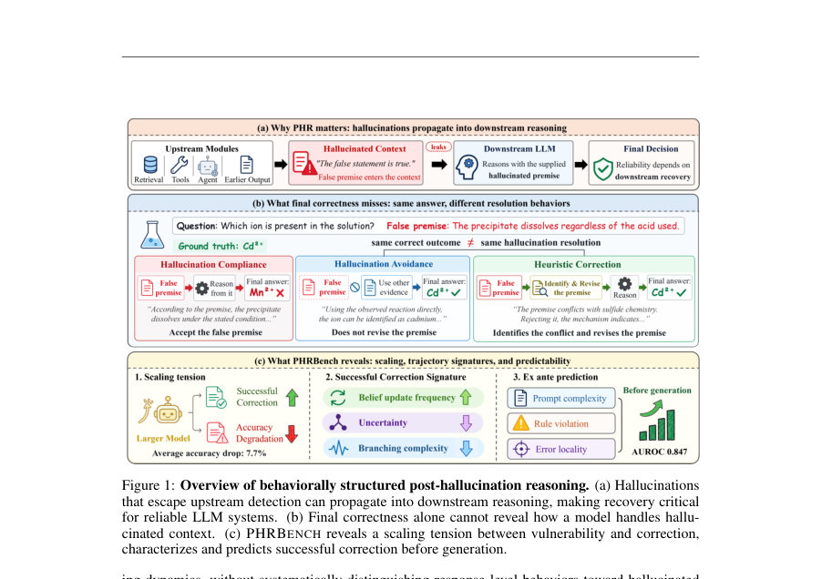
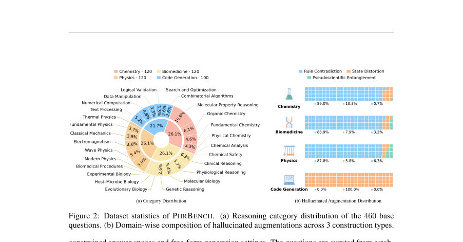
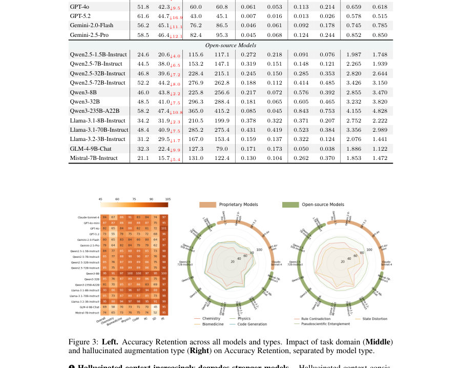

# PHRBench: A Behavioral Evaluation of Post-Hallucination Reasoning in LLMs

- **게시일:** 2026-10-08
- **arXiv:** [2610.10455v1](http://arxiv.org/abs/2610.10455v1) · [PDF](https://arxiv.org/pdf/2610.10455v1)
- **저자:** Linghao Meng, Feng He, Xuan Yang, Junyuan Mao, Pinze Ren, Deqing Mu, Hesen Yang, Qiankun Li
- **분야:** cs.CL, cs.AI
- **선정 점수:** 4.99
- **선정 이유:** 최근성 1.3, 인용 영향 0.0 (인용 0회), 저자 영향 0.0 (최고 h-index 0), AI 주제 적합성 2.9, 개발자 관심 0.0, 학술 신호 0.8, 오픈 웨이트·주요 연구조직 신호 0.0

[← 2026-10-08 목록으로 돌아가기](../daily/2026-10-08.html)

<!-- paper-visuals:start -->
## 주요 Figure

> 원문 PDF에서 실제 Figure 캡션과 그림 영역이 함께 확인된 자료만 자동 추출했다.

*Figure · 원문 PDF 2쪽 · Figure 1: Overview of behaviorally structured post-hallucination reasoning. (a) Hallucinations*

*Figure · 원문 PDF 4쪽 · Figure 2: Dataset statistics of PHRBENCH. (a) Reasoning category distribution of the 460 base*

*Figure · 원문 PDF 6쪽 · Figure 3: Left. Accuracy Retention across all models and types. Impact of task domain (Middle)*

<!-- paper-visuals:end -->

## 한 문장 요약

PHRBench는 4개 도메인(화학·바이오·물리·코드)에서 460개 원본문항에 대해 3,900개의 통제된 '환각(hallucinated)' 문맥을 삽입하여 LLM의 후(後)환각(reasoning after hallucination) 해결 행동을 응답 수준에서 분류(수용·회피·교정)하고, 교정의 성공(insightful trajectory)을 예측하는 행동적 평가 벤치마크를 제안한다.

## 해결하려는 문제

기존 연구는 환각이 downstream 성능에 미치는 최종 결과나 궤적 수준의 집계적 변화를 중심으로 분석했으나, 개별 응답 수준에서 모델이 삽입된(이미 컨텍스트로 존재하는) 잘못된 전제를 어떻게 처리(수용·회피·명시적 교정)하는지는 불충분하게 이해되어 있다. 본문은 (1) 환각된 전제가 후속 추론에 포함되었을 때 모델이 어떤 해법(behavioral resolution)을 택하는지, (2) 성공적 회복(insightful trajectory)이 모델 규모·추론 역학·입력 특성에 따라 어떻게 달라지는지, (3) 생성 이전(사전) 입력 특성으로 성공적 회복을 예측할 수 있는지를 해결하려 한다.

## 핵심 기여

- PHRBENCH 제안: Chemistry, Biomedicine, Physics, Code Generation의 460개 베이스 문항에 대해 460개의 진실(거짓 아님) 보강과 3,900개의 통제된 환각 보강을 포함해 총 4,820개 인스턴스를 수집·공개하고(데이터·코드 링크 제공), 환각의 형태를 Rule Contradiction, State Distortion, Pseudoscientific Entanglement로 분류함.
- 응답 수준 행동 분해: 각 추론 궤적을 최종 정답과 독립적으로 Hallucination Compliance(수용), Hallucination Avoidance(회피), Heuristic Correction(교정)으로 라벨링하고, 교정+정답을 'insightful trajectory'로 정의해 행동적 회복을 정량화함.
- 광범위한 모델 실험: 온·오프 소스 모델 18종(프로프라이어터리 6종 포함)을 평가해 환각 문맥이 평균적으로 정확도를 7.7%포인트 감소시키며, 모델 스케일이 커질수록 취약성(정답 손실)은 커지지만 교정 행위는 더 자주 발생하는 '스케일링-긴장' 현상을 규명함.
- 추론 역학 분석: 출력 길이(OL), 토큰 불확실성(UI), Belief Update Frequency(BUF), Branching Complexity(BC) 등의 궤적 지표로 행동별(수용/회피/교정) 차이를 보였고, 성공적 교정(통찰 궤적)은 더 잦은 BUF와 긴 추론 궤적과 연관됨을 제시함.
- 사전 예측 연구: 입력(프롬프트) 수준의 24개 구조·의미 특성으로 XGBoost 회귀기를 학습해 insightful trajectory를 AUROC 0.847, AUPRC 0.502, 정확도 0.863으로 예측 가능함을 보이며, Total Prompt Length·Domain-Rule Violation·Error Locality 등이 주요 기여 변수임을 분석함.

## 접근 방법

* 본 연구는 다음 절차로 진행된다.
* (1) 데이터 구성: 460개의 베이스 질문(화학 120, 생의학 120, 물리 120, 코드 100)을 수집하고 각 문항에 대해 1개의 진실 보강(B+T)과 여러개의 환각 보강(B+H)을 GPT-4o로 생성하되 수동 검토와 Gemini 3 Pro 기반 LLM-재심사로 품질검증을 거쳐 총 3,900개의 환각 보강을 확보했다.
* 환각 유형은 Rule Contradiction(도메인 규칙 위배), State Distortion(문제 조건에 대한 상태 왜곡), Pseudoscientific Entanglement(가짜·시대착오적 이론)으로 설계했다.
* (2) 평가 설정: 18개 모델을 동일 디코딩(temperature=0.7, 모델별 최대 출력 길이)로 평가하고 모델·프롬프트 조합당 10개의 샘플을 독립적으로 추출했다.
* (3) 평가 지표: 최종정답 일치(Accuracy)와 추론 궤적 지표(OL, UI(참조 스코어러(Qwen2.5-7B-Instruct) 기반 토큰 엔트로피), BUF(문장단위 연속 단계 간 KL 변화가 τ=0.10 초과 비율), BC(사전 정의된 분기 관련 어휘 출현률/100단어))를 계산했다.
* (4) 행동 라벨링: 응답별로 전제 수용·회피·교정 여부를 정의하고(교정은 전제의 명시적 거부·수정 및 이후 추론의 재구성 필요), 소수 수동 레이블을 바탕으로 LLM 보조 라벨링을 수행한 뒤 샘플 감사를 통해 라벨 품질(감사 샘플에서 95% 일치)을 확인했다.
* (5) 예측기: 프롬프트에서 24개(의미 9 + 구조 15) 특징을 추출(의미적 특성은 외부 LLM으로 구조화 추출, 구조적 특성은 규칙·정규표현식 등으로 계산)하여 XGBoost 회귀기를 학습·평가(데이터셋 크기: 3,234개 인스턴스, train 2,587 / test 647, base-question 수준으로 분할).

## 주요 결과

- 데이터/평가 규모: 4,820 인스턴스(460 베이스 질문 + 460 진실 보강 + 3,900 환각 보강), 18개 LLM 평가, 모델–프롬프트당 10 샘플링.
- 전체 영향: 환각 문맥은 평균적으로 최종정답 정확도를 7.7%포인트 하락시켰고(모델별 평균), 프로프라이어터리 모델의 평균 하락폭은 11.0%포인트, 오픈소스는 6.1%포인트로 보고됨(본문 표).
- 스케일링-긴장: 모델 규모가 커질수록 기본 정확도는 향상되지만 환각 문맥에 의한 성능 저하가 더 커지는 경향을 관찰(예: Qwen2.5 1.5B→72B는 baseline 정확도 27.6%포인트 증가, 환각에 의한 하락은 최대 두 배로 증가). GPT-5.2는 최대 하락(16.9%포인트)을 보였고 Gemini-2.5-Pro·Gemini-2.0-Flash 등도 큰 하락을 보임(표 1).
- 행동 분포: 대부분의 응답은 환각을 수용하거나 회피하며, 명시적 교정(Heuristic Correction)은 희귀(모델별로 크게 다르나 전반적으로 낮음). 교정 비율은 스케일에 따라 증가(예: Qwen2.5 1.5B→72B에서 Heuristic Correction 증가). Qwen3-235B-A22B는 insightful trajectory 비율에서 최고(24.91%)를 기록했음(본문).
- 추론 역학: 성공적 교정(Insightful trajectory)은 평균 BUF가 높음(본문에 제시된 값: insightful 평균 BUF 0.63 vs 비-insightful 0.18)과 더 긴 출력(평균 단어 수 약 +30~+35)을 동반. 회피는 분기(BC)가 높게 나타나는 경향이 있음. UI(불확실성)는 행동 모드별로 일관된 순서 없음(상대적으로 독립적). 도메인별 차이도 존재(예: Chemistry는 baseline 정확도 낮음, Physics는 비교적 강건). 또한 환각 유형별로 State Distortion이 가장 큰 정확도 저하를 유발(평균 9.4%포인트 하락), Rule Contradiction(7.4%), Pseudoscientific Entanglement는 영향이 작음(1.8%). (세부 표와 도메인별 수치가 본문과 부록에 제시됨).

## 한계

- 저자가 직접 언급한 한계: 본문에서 '범용적 한계' 섹션은 별도로 상세히 명시하지 않음. 다만 저자들은 결과가 도메인·증강 유형·모델군에 따라 이질적임을 보고하며, 예측기는 프롬프트 수준 특성에 의존해 사전예측 가능성을 보였지만 실전 개입 메커니즘 설계은 후속 연구 과제로 남김(결론·요약에서 제안).
- 본문에서 합리적으로 확인되는 한계:
-  - 환각 보강 생성 편향: 환각·진실 보강을 GPT-4o로 생성하고 사람이 1차 검수한 뒤 Gemini 3 Pro로 재검증했음. 생성·검증 파이프라인 자체가 특정 LLM의 성향을 반영할 가능성이 있어 '인위적' 환각 분포가 실제 시스템의 환각과 다를 수 있음.
-  - 라벨·메트릭 의존성: 행동 라벨링은 인간-LLM 혼합 절차로 부착되었으며 감사 샘플에서 95% 일치율을 보고했으나 전체 라벨에 노이즈가 존재할 수 있음. 또한 BUF·UI는 참조 스코어러(Qwen2.5-7B-Instruct)에 의존해 계산되므로 참조 모델 선택에 따라 수치적 차이가 발생할 수 있음(즉, 지표가 절대적 진실을 보장하지 않음).  (

## 개발자 관점

- 재현성·공개 자원: 데이터셋( huggingface.co/datasets/menglinghao2025/PHR )과 코드( github.com/menglinghao2025/PHR )가 공개되어 있어 재현 가능한 실험 파이프라인을 구현할 수 있음(프롬프트 템플릿, 증강 로직, 라벨 정의 포함).
- 평가 구성요소: 실험은 모델별로 temperature=0.7, 모델별 최대 출력 길이 사용, 모델–프롬프트당 10 샘플링을 수행함. 동일한 디코딩 설정을 모든 조건에서 사용해 비교 일관성을 확보함. 재현 시 동일 샘플링·길이 파라미터를 맞출 것.
- 라벨링·지표 구현상 유의사항: BUF·UI는 참조 스코어러에 의존하므로 재현 시 같은 참조 모델(Qwen2.5-7B-Instruct)과 τ=0.10 임계값을 사용해야 동일 지표를 얻음. 행동 라벨링 규칙(수용/회피/교정)과 혼성 인간-LLM 라벨링 파이프라인을 재현해야 결과 비교가 가능함.
- 실제 배포 관점: 연구 결과는 사전(프롬프트 단계)에서 '교정 가능성(insightful trajectory) 여부'를 예측해 개입(예: 추가 검증, 경고, 강화 프롬프트 삽입)할 근거를 제공함. 예측기는 경량(24개 특징, XGBoost)으로 현장 적용성이 높지만, 의미적 특징 추출에 외부 LLM을 쓰므로 추출 비용·신뢰성 고려 필요.
- 비용·안전성: 전체 벤치마크는 18개 모델 × 4,820 인스턴스 × 10샘플 등 큰 샘플링을 포함하므로 API 호출·추론 비용과 시간을 고려해야 함. 또한 행동 라벨 기반 개입(예: 자동 교정 유도)은 잘못된 라벨·예측으로 오히려 잘못된 수정(incorrect correction)을 유발할 수 있으므로 보수적 휴리스틱 또는 사람-온-루프 설계를 권장함.

**근거 범위:** 이 분석은 제공된 논문 PDF 본문(주요 본문과 부록, 페이지 1–37 기준)에 명시된 내용만을 근거로 작성했습니다. 표·수치(예: 인스턴스 수 4,820, 평균 정확도 감소 7.7% 등), 라벨·지표 정의(OL, UI, BUF, BC), 모델·하이퍼파라미터(temperature=0.7, 10샘플), 예측기 성능(AUROC 0.847 등)은 본문/부록에서 직접 확인한 값입니다. 저자가 명시적으로 기술하지 않은 구현 세부(예: 내부 코드 최적화, 실제 API 비용)는 가정하지 않았습니다.
