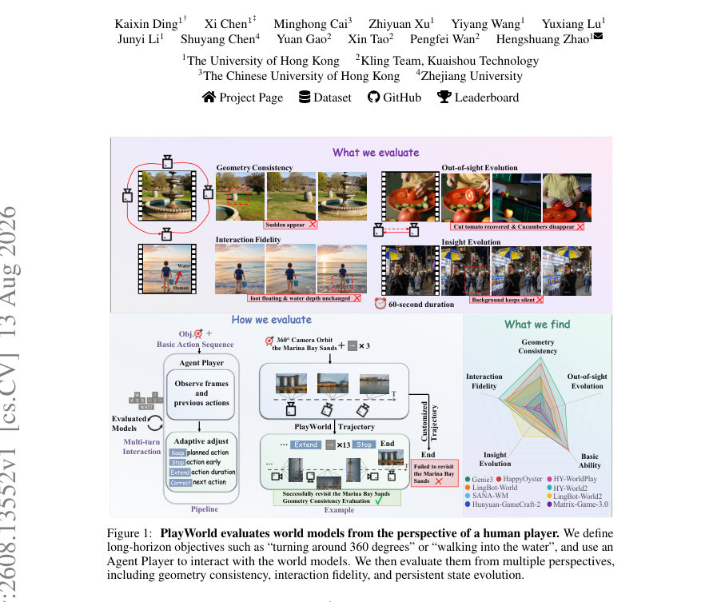
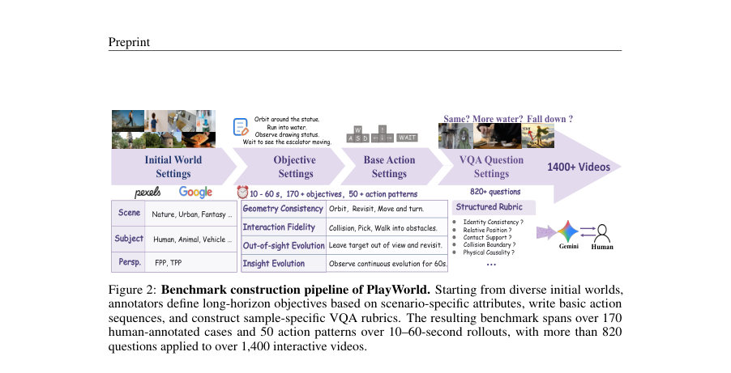
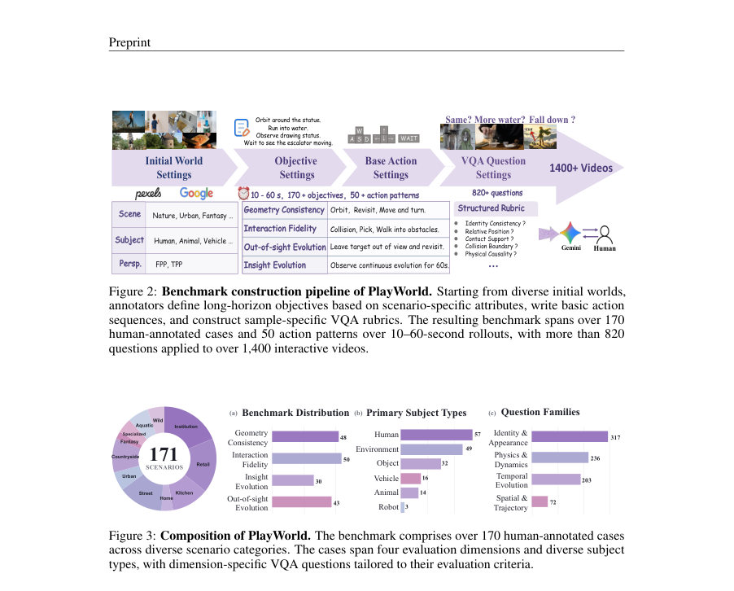

# PlayWorld: Benchmarking World Models with Agent Players over Long-Horizon Objectives

- **게시일:** 2026-08-15
- **arXiv:** [2608.13552v1](http://arxiv.org/abs/2608.13552v1) · [PDF](https://arxiv.org/pdf/2608.13552v1)
- **저자:** Kaixin Ding, Xi Chen, Minghong Cai, Zhiyuan Xu, Yiyang Wang, Yuxiang Lu, Junyi Li, Shuyang Chen, Yuan Gao, Xin Tao, Pengfei Wan, Hengshuang Zhao
- **분야:** cs.CV
- **선정 점수:** 5.38
- **선정 이유:** 최근성 0.5, 인용 영향 0.0 (인용 0회), 저자 영향 1.8 (최고 h-index 27), AI 주제 적합성 1.8, 개발자 관심 0.5, 학술 신호 0.8, 오픈 웨이트·주요 연구조직 신호 0.0

[← 2026-08-15 목록으로 돌아가기](../daily/2026-08-15.html)

<!-- paper-visuals:start -->
## 주요 Figure

> 원문 PDF에서 실제 Figure 캡션과 그림 영역이 함께 확인된 자료만 자동 추출했다.

*Figure · 원문 PDF 1쪽 · Figure 1: PlayWorld evaluates world models from the perspective of a human player. We define*

*Figure · 원문 PDF 5쪽 · Figure 2: Benchmark construction pipeline of PlayWorld. Starting from diverse initial worlds,*

*Figure · 원문 PDF 5쪽 · Figure 3: Composition of PlayWorld. The benchmark comprises over 170 human-annotated cases*

<!-- paper-visuals:end -->

## 한 문장 요약

사람 플레이어처럼 장기 목표를 주고 멀티모달 Agent Player가 다양한 세계 모델과 상호작용하며 기하 일관성·상호작용 충실도·가려진 상태 진화·통찰(관찰) 진화를 VQA 루브릭과 자동 지표로 평가하는 장기 상호작용형 세계모델 벤치마크 PlayWorld를 제시한다.

## 해결하려는 문제

기존 세계모델 평가들은 주로 사전정의된 저수준 동작(고정된 액션 시퀀스 또는 카메라 궤적)에 따라 비교를 수행한다. 그러나 서로 다른 모델은 액션 그레인(동작 크기·지속시간)과 반응 속도가 달라 동일한 제어가 모델간에 상이한 시각적 결과를 만들고, 인간 플레이어가 추구하는 '장기 목표'(예: 360° 회전 후 재방문, 물속으로 들어갔을 때 물리적 반응 관찰)를 공정하게 비교할 수 없다. 또한 웹 기반 폐쇄형 모델들은 수동 인간 평가에 의존해 노동집약적이며 편향에 취약하다.

## 핵심 기여

- 장기 목표(objective)를 중심으로 한 자동화된 평가 패러다임과 에이전트 기반 폐쇄루프 평가 파이프라인(Agent Player)을 제안함.
- PlayWorld 벤치마크 구축: 171개 시나리오, 50+ 액션 패턴, 10–60초 롤아웃, 1,400+ 인터랙티브 비디오, 820+ 샘플별 VQA 질문을 수집·주석화함.
- Agent Player 설계: 인간 주석 기반의 기본 액션 시퀀스를 참조하고 관찰에 따라 Keep/Stop/Extend/Correct/End로 온라인 적응하는 멀티모달 에이전트를 도입해 모델별 액션 그레인 차이를 보정함.
- 샘플별 VQA 루브릭 검증기(기하 일관성·상호작용 충실도·가려진 상태 진화·통찰 진화)와 자동 비디오 품질·컨트롤 가능성(기본 능력) 지표를 통합한 평가 체계 제공.
- 다양한 공개·비공개 최신 세계모델 9종(웹 인터페이스 포함)에 대해 대규모 평가를 수행하고, 현재 모델들이 장기 상호작용에서 특히 공간 일관성 및 지속적 상태 진화에 취약함을 실험적으로 규명함.

## 접근 방법

* 전체 파이프라인: 각 케이스는 초기 이미지(첫 프레임), 장기 목표(완료 조건이 시각적으로 검증 가능하게 작성됨), 인간 주석의 기본 액션 시퀀스로 구성된다.
* Agent Player는 멀티모달 에이전트(논문 실험에서는 Claude Haiku 4.5를 추천·사용)와 에이전트 인터페이스로 구성된다.
* 에이전트 모델은 매 스텝 생성된 프레임, 수행된 액션 이력, 장면 설명, 목표·기본 액션 시퀀스를 입력으로 받아 관찰기반 결정(Keep, Stop, Extend, Correct, End)을 반환한다.
* 에이전트 인터페이스는 이 결정을 대상 세계모델의 네이티브 컨트롤로 변환(웹 모델은 브라우저 자동화)하고, 생성된 프레임을 캡처해 에이전트에 반환하는 폐쇄루프를 최대 40 스텝까지 수행해 약 10–60초 롤아웃을 생성한다.
* VQA 루브릭 검증기: Gemini 3.1 Pro를 이용해 샘플별 Yes/No 루브릭 질문을 답변·가중합해 각 차원(geometry consistency, interaction fidelity, out-of-sight evolution, insight evolution)에서 1–5 점수로 환산한다.
* 차원별로 Trajectory Validity나 Subject Reachability 같은 사전 검증을 두어 무효 롤아웃은 최저점(1)을 부여한다.
* 검증 입력으로는 2개 스트림(10FPS를 5×5 contact-sheet, 0.5FPS를 2×2 detail grid)과 루브릭을 함께 제공한다.
* 기본 능력 평가는 VBench, Omni-WorldBench, MemoBench 등에서 차용한 무참조 비디오 품질 지표 7종(Aesthetic, Imaging, Motion Smoothness, Flickering, Temporal Consistency, Depth Stability, Subject Consistency)과 행동 제어성(Translation/Rotation pass rate, VGGT로 카메라 포즈 추정, translation error<threshold 0.3, rotation error<threshold 45°)을 사용한다.

## 주요 결과

- 벤치마크 구성: 171개 시나리오(Geometry 48 / Interaction 50 / Out-of-sight 43 / Insight 30), 50+ 액션 패턴, 10–60초 롤아웃, 1,400+ 비디오, 820+ VQA 질문(본문 Fig.3, Sec.3.2).
- 루브릭 점수(표 2): Genie 3이 전체에서 최고(Overall 2.12), HappyOyster 다음(1.92). 네 차원별 상위 결과는 전반적으로 낮아 장기 상태 진화(Out-of-sight, Insight)가 특히 낮음(대부분 모델에서 1.0–2.0 범위). (표 2의 수치 그대로 보고)
- Trajectory 검증(표 3): Genie 3의 전반적 Trajectory pass rate 87.1%, HappyOyster 79.6%. 오픈소스 모델은 모델별로 널리 분포(예: Hunyuan-GameCraft-2 overall 61.5%, HY-WorldPlay 41.6%).
- Agent Player 제어 전략 비교(표 4): Preset+Agent가 Preset Only, Agent Only보다 Trajectory Score(Genie 3: 1.08 vs 0.92/0.88)와 인간 선호를 크게 개선(예: Genie 3 Human Preference Preset+Agent 65.6% vs Preset Only 39.6%)함. Agent-modified Action Ratio은 12–15% 수준으로 소수 변경으로 효과 달성.
- Agent 모델 비교(표 5): Claude Haiku(권장)는 Trajectory Score 1.08, Human Preference 57.8%, Decision Latency 3.83 s/call(측정값이며 인프라·네트워크에 따라 변동). Claude Sonnet는 Trajectory Score 1.24이나 지연은 더 큼(6.21 s/call). 저자 선정 기준은 품질-지연 균형임(본문 Sec.4.2).","기본 능력(표 6): 비디오 품질 지표는 대체로 높음(예: Motion Smoothness 대부분 97–99%), 반면 행동 컨트롤(Translation/Rotation pass rates)은 모델별로 차이 큼(예: Genie translation 64.1%, rotation 50.6%; HappyOyster translation 58.0%, rotation 48.5%). Basic Ability Score(9개 지표 평균 순위 환산)는 HappyOyster 76.4% 최고, Genie 72.2% 등으로 보고됨. ","검증 안정성·인간 정합성: VQA 단일 스코어링 패스 간 모델별 평균 샘플 분산은 0.0112로 낮음(본문 B). 인간 평가와의 순위 상관관계는 Spearman ρ=0.933(Overall), geometry 0.983, interaction 0.933, out-of-sight 0.812, insight 0.745로 긍정적 상관을 보였음(본문 Sec.4.4, Appendix D). 인터레이터 합의는 대체로 높음(Fleiss' κ overall 0.434, 다수결 합의 95.8%) 표7 참조.

## 한계

- 저자가 명시한 한계:
- - VQA 검증기가 Gemini 3.1 Pro의 호출 불확실성에 영향을 받음(본문 B: 반복 호출시 일부 변동). 저자들은 단일 스코어 패스를 사용했고 평균 샘플 분산 0.0112를 보고하며, 예산이 허용되면 다중 패스 평균을 권장함.
- - 웹 기반 폐쇄형 모델 평가는 브라우저 자동화에 의존하므로 인터페이스·인증·렌더링 지연 등 외부 요인에 민감함(본문 Sec.3.1, App C).
- - 특정 모델별 제약으로 일부 케이스가 제외되거나 평가 불가함(HY-World2가 특정 입력 요구 때문에 일부 케이스 제외, Hunyuan-GameCraft-2는 빈 액션을 허용하지 않아 insight 케이스 평가 제한; App A).

## 개발자 관점

- 공정한 장기 목표 평가는 '기본 액션 시퀀스 + 관찰 기반 온라인 적응(Preset + Agent)' 전략이 효과적임 — Agent는 Keep/Stop/Extend/Correct/End 결정을 내림(본문 Sec.3.1 및 Tab.4).
- 에이전트 구성요소: 멀티모달 에이전트(예: Claude Haiku), 에이전트 인터페이스(웹 자동화 또는 모델 어댑터), VQA 검증기(Gemini 3.1 Pro) 조합 필요. 웹모델은 브라우저 자동화로 컨트롤·프레임 캡처를 해야 함(App C, Fig.7).
- 구현 실무: 40-스텝 상호작용 예산, 10–60초 롤아웃, contact-sheet 기반 두 스트림(10FPS→5×5, 0.5FPS→2×2) 입력으로 VQA를 수행하는 설계는 실용적이다(App A·B).
- 재현을 위해 필요한 자동화·비용 고려: VQA(유료 LLM)와 에이전트 호출(의사결정 지연 평균 3–6s/call)로 인한 비용·지연이 발생함(표5 Decision Latency 참조). 대규모 벤치마크에서는 LLM 호출 수·비용을 예산에 포함시켜야 함.
- 모델-독립성·평가 안정성: VQA 검증기는 단일 호출 변동성이 있으므로 가능하면 다중 독립 호출 평균을 권장(본문 권고). 카메라 포즈 추정(VGGT)과 통과 임계값(translation error<0.3, rotation error<45°) 등 자동 지표의 한계(예: 카메라 포즈 추정 실패 시 해당 롤아웃 제외)를 고려해 보완적 인간 평가를 유지할 것(App A).

**근거 범위:** 이 분석은 제공된 논문 PDF 본문(주요 본문과 부록/표/그림)을 기반으로 작성되었다. 구현 세부 파라미터의 일부(예: 보충 자료의 상세 설정, 모델별 내부 하이퍼파라미터)는 보충자료에 추가로 기재되어 있을 수 있으며 본문에 명시된 정보만을 근거로 기술하였다. VQA/에이전트 관련 일부 실험적 환경(네트워크·인프라)에 따른 지연 값은 본문 표에 보고된 범위로 제시했으며, 배포 환경에 따라 변동할 수 있다.
