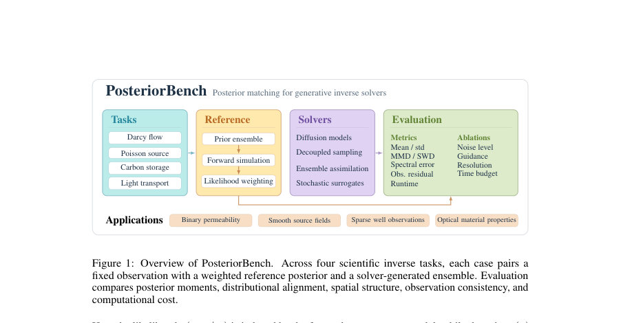
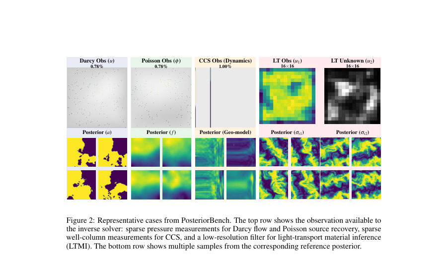
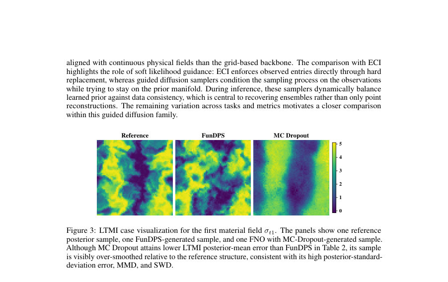

# PosteriorBench: From Point Estimates to Posterior Matching in Evaluating Generative Inverse Solvers

- **게시일:** 2026-09-19
- **arXiv:** [2609.20794v1](http://arxiv.org/abs/2609.20794v1) · [PDF](https://arxiv.org/pdf/2609.20794v1)
- **저자:** Jiachen Yao, Zi-Siang Hsu, Xi Deng, Aditi Gupta, Xin Ju, Sally M Benson, Gege Wen, Anima Anandkumar
- **분야:** cs.LG, cs.CE
- **선정 점수:** 6.45
- **선정 이유:** 최근성 0.8, 인용 영향 0.0 (인용 0회), 저자 영향 1.8 (최고 h-index 24), AI 주제 적합성 2.9, 개발자 관심 0.2, 학술 신호 0.8, 오픈 웨이트·주요 연구조직 신호 0.0

[← 2026-09-19 목록으로 돌아가기](../daily/2026-09-19.html)

<!-- paper-visuals:start -->
## 주요 Figure

> 원문 PDF에서 실제 Figure 캡션과 그림 영역이 함께 확인된 자료만 자동 추출했다.

*Figure · 원문 PDF 2쪽 · Figure 1: Overview of PosteriorBench. Across four scientific inverse tasks, each case pairs a*

*Figure · 원문 PDF 4쪽 · Figure 2: Representative cases from PosteriorBench. The top row shows the observation available to*

*Figure · 원문 PDF 9쪽 · Figure 3: LTMI case visualization for the first material field σt1. The panels show one reference*

<!-- paper-visuals:end -->

## 한 문장 요약

과학적 역문제에서 생성적 샘플러가 단일 재구성 대신 관측조건부 후방분포를 재현하는지 평가하기 위해, 고정 관측에 대해 계산 비용이 큰 참조 후방분포(거부표본·MCMC 등)와 다섯 가지 분포 중심 지표를 결합한 벤치마크 PosteriorBench를 제안한다.

## 해결하려는 문제

기존 평가 관행은 주로 단일 그라운드트루스 재구성(point estimate) 중심으로 이루어져 있어 역문제의 내재적 비식별성(동일 관측에 대해 여러 가능한 해)이 있는 과학적 사례에서 샘플러가 진정한 후방분포의 전역 구조(다중 모드, 분산, 공간 통계)를 재현하는지를 판별하지 못한다. 본 논문은 이 한계를 해결하여 '후방분포 매칭(posterior matching)'을 평가하는 체계적 프로토콜을 제시한다.

## 핵심 기여

- PosteriorBench라는 분포 중심의 평가 프로토콜을 제안하고, 각 케이스에 대해 고신뢰도 참조 후방분포(거부표본·중요도 가중치·MCMC 등) 생성을 포함하도록 체계화했다.
- 네 가지 물리 기반 역문제(다르시 유동, 포아송 소스 복원, 탄소 저장(CCS), 광전달 물질 추정)를 포함하는 벤치마크와, 분포 재현을 평가하기 위한 다섯 가지 지표(후방 평균 오차, 후방 표준편차 오차, MMD, Sliced Wasserstein, 반경 평균 전력스펙트럼 오차)를 제공한다.
- 참조 후방분포와 생성된 샘플 군을 직접 비교하는 통합화된 파이프라인을 공개(code 제공)하여 분포 정합성, 관측 일관성, 공간 스펙트럼 보전성, 계산 비용 등을 동시에 평가할 수 있도록 했다.
- 다양한 기존 및 최신 솔버(예: FunDPS, Fun-DDPS, DDIS, DiffusionPDE, ES-MDA, FunDiff, ECI, FNO+MC Dropout)를 동일한 평가 체계에서 비교·분석하고, guidance 강도·생성 노이즈·해상도 등 설계 요인의 영향에 대한 실험적 통찰을 제공했다.

## 접근 방법

* 벤치마크 구성: 네 가지 역문제 각각에 대해 물리 시뮬레이터 또는 검증된 뉴럴-오퍼레이터 대리모델을 사용해 대규모 사전(prior) 후보 풀을 생성한 뒤, 목표 관측 y_obs에 대한 관측 불일치(RMSE)에 기반한 거부표본(rejection sampling) 또는 중요도 가중치(가우시안 우도)로 참조 후방표본 집합을 구성한다.
* 참조군은 관측-불일치 임계값 ϵ(논문 예: ϵ=3σ)을 적용해 최대 100개의 표본을 보존하고 가중치를 정규화하여 Pref={(x_i,w_i)}로 표현한다.
* 평가 지표: 생성된 무가중 샘플 P_gen과 가중 참조 Pref를 비교하기 위해 (1) 후방 평균·후방 표준편차의 상대 L2 오차(점추정과 불확실성 동시검증), (2) MMD(다중 스케일 RBF 커널), (3) Sliced Wasserstein(필드별 z-정규화 후 GRF 기반 프로젝션), (4) 반경 평균 전력스펙트럼(RAPS) 기반 스펙트럼 상대 오차를 사용한다.
* 솔버 범위: 함수공간 기반 확률적 디퓨전 샘플러(FunDPS, Fun-DDPS, DDIS 등), 그리드 기반 디퓨전(DiffusionPDE), 엔섬블 데이터 동화(ES-MDA), Flow/score/flow-matching 계열(ECI), 오토인코더+조건부 흐름(FunDiff), FNO 역연산에 MC Dropout을 적용한 불확실성 추정 등 총 8종을 동일 조건에서 훈련·평가한다.
* 추가 진단: 참조군 수렴성 검증(서로 독립적 두 참조군으로 지표 비율 rm 계산), 관측 노이즈-가이던스(weight) 스윕, 해상도 일반화 실험, OOD(사전 분포 범위) 실험 등으로 설계요인 영향을 분석한다.

## 주요 결과

- 벤치마크 전반에서 함수공간 기반 가이드 디퓨전 샘플러(FunDPS, Fun-DDPS, DDIS)가 여러 과학적 역문제에서 강한 후방 매칭 성능을 보였으나, 과제별·지표별로 성능 차이가 존재한다(예: Darcy의 후방 평균 오류에서 DDIS=0.0620, Fun-DDPS=0.0767, FunDPS=0.0804; CCS의 평균 오류에서 FunDPS=0.1419로 우수).
- 평균(후방 평균 오차)만으로는 분포 재현 평가가 불충분함을 보였다: 예컨대 LTMI에서 FNO+MC Dropout은 낮은 평균 오류(표에서 0.1990보다 낮은 사례가 있음을 언급)에도 불구하고 후방 표준편차 오류·MMD·SWD가 크고 샘플이 과다평활(over-smoothing)되는 현상을 보였다.
- 점대점(pointwise) 재구성 지표와 분포 중심 지표 간에는 V자형 관계가 관찰되어, 점오차를 낮추는 방향(단일 참조에 과도 적합)은 분포적 특성(분산·다중모드·공간 통계)을 훼손할 수 있음을 실증했다(Figure 4).
- 관측 노이즈 변화에 대해 이론적 스케일인 σ_y^{-2}에 따라 최적 guidance 가중치가 증가하는 경향을 보였으나, 단일 스칼라 가중치로는 평균과 분산(uncertainty)을 동시에 잘 보정할 수 없어 트레이드오프가 존재함을 확인했다(가중치 최적값이 지표별로 상이).
- 해상도 일반화 실험에서 함수공간 학습(예: FunDPS)이 그리드 기반 백본(DiffusionPDE)보다 다중 해상도에서 견고함을 보였고(예: Darcy 128×128 평가에서 FunDPS가 전반적 지표에서 우수), CCS 참조군은 대규모 후보풀(2M) + 신경-오퍼레이터 대리모델로 생성하여 약 26k 수용 표본을 얻는 방식으로 현실적 대규모 후방 근사 실현에 성공했다.

## 한계

- 저자가 명시한 한계: 고신뢰 참조 후방분포를 얻기 위해 계산 비용이 큰 절차(거부표본, MCMC, 대규모 후보풀, 산업용 시뮬레이터 또는 대체 서로게이트)가 필요하여 확장성과 케이스 수가 실질적으로 제약된다. 또한 현재 평가는 논문에 포함된 소수의 솔버와 네 가지 작업에 한정되어 있어 범용성은 커뮤니티 확장에 의존한다.
- 논문 본문에서 확인 가능한 추가 제약: CCS 태스크의 참조 후방구성은 신경-오퍼레이터(LNO) 대리모델에 의존하여(원시 ECLIPSE 시뮬레이터 대신) 참조 분포의 정확도가 대리모델 품질에 민감하다. 거부표본 절차는 임계값 ϵ, 후보풀 크기, 대칭성(회전) 확대와 같은 구현 선택에 민감하며, 참조가 유한 샘플 기반 가중 경험 분포라는 점에서 표본 잡음이 남는다(논문은 두 독립 참조군 간 지표 비율 rm로 일관성 확인).

## 개발자 관점

- 참조 후방분포 생성은 비용이 매우 높으므로 재현 가능한 벤치마크 구축 시 대규모 오프라인 후보풀·검증된 서로게이트(특히 복잡 물리모델의 경우)·참조수렴 체크(rm 지표)가 필수적이다.
- 디퓨전 기반 후방 샘플러를 실제 배포·튜닝할 때는 guidance(우도 강조) 가중치와 생성 노이즈 수준을 지표별(평균·분산·분포거리)에 대해 별도로 탐색해야 한다. 단일 가중치는 평균과 불확실성 동시보정에 실패할 수 있다.
- 함수공간(function-space)으로의 사전 학습과 스펙트럴 연산자(예: FunDPS 계열)는 해상도 변화에 강건하므로, 멀티해상도 적용이나 해상도 일반화가 필요한 물리응용에 유리하다.
- 참조-생성 비교를 자동화하려면: (i) 동일한 표본수/정규화 규칙으로 가중치 처리, (ii) MMD·SWD·RAPS 같이 서로 보완하는 지표 풀, (iii) 참조-참조 일관성 검사 도구를 통합해야 하며, 논문이 제공한 코드베이스(깃허브)를 활용하면 초기 구현 비용을 줄일 수 있다.
- 운영·배포 관점에서 계산 비용·실행시간(runtime)이 실무 제약이므로(예: Table 2에서 DiffusionPDE의 일부 작업은 수십 분대, FunDPS는 수분대), 실시간성 요구가 있는 응용에는 경량화된 서로게이트·엔섬블 크기 축소·사전 생성 캐시 전략 등이 필요하다.

**근거 범위:** 본 분석은 제공된 논문 PDF 본문(초록은 보조로 사용) 전체 텍스트를 근거로 정리하였다. 표와 수치(예: Table 2, Table 3, 표준편차 표 등)는 본문에 제시된 값을 직접 인용했으며, 참조 후방구성의 구현 상세(예: 후보풀 크기, 임계값 ϵ 설정, 일부 하이퍼파라미터)는 본문에 명시된 내용만을 사용하였다. PDF 추출 과정에서 표기나 배치 관련 세부가 누락되었을 가능성은 있으나, 핵심 주장·지표·실험설계·제약은 본문 근거로 확인되었다.
