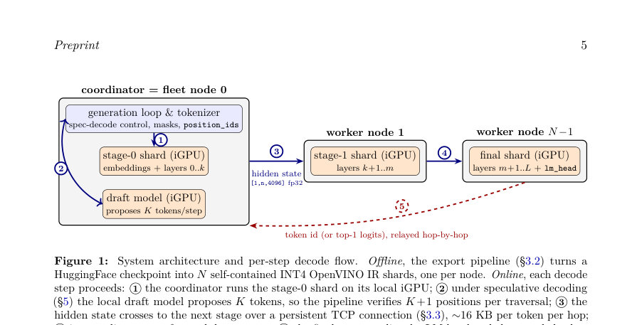
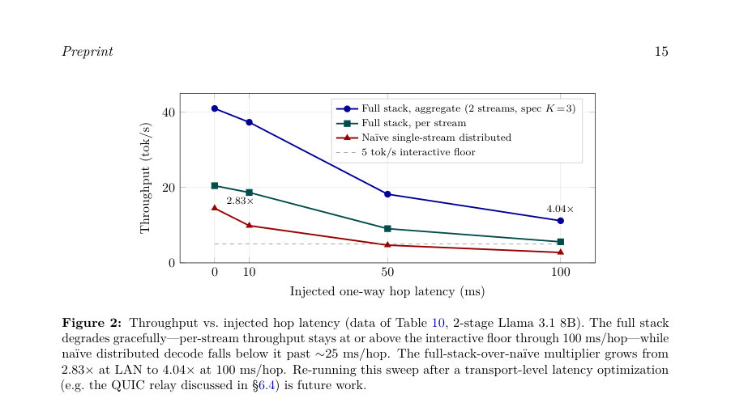

# Pre-Compiled Pipeline Shards for Distributed LLM Inference on Intel AI PC Fleets

- **게시일:** 2026-08-20
- **arXiv:** [2608.19147v1](http://arxiv.org/abs/2608.19147v1) · [PDF](https://arxiv.org/pdf/2608.19147v1)
- **저자:** Tate Berenbaum, Muthaiah Venkatachalam
- **분야:** cs.DC, cs.AI, cs.SE
- **선정 점수:** 6.63
- **선정 이유:** 최근성 0.8, 인용 영향 0.0 (인용 0회), 저자 영향 0.0 (최고 h-index 0), AI 주제 적합성 2.8, 개발자 관심 1.3, 학술 신호 0.6, 오픈 웨이트·주요 연구조직 신호 1.2

[← 2026-08-20 목록으로 돌아가기](../daily/2026-08-20.html)

<!-- paper-visuals:start -->
## 주요 Figure

> 원문 PDF에서 실제 Figure 캡션과 그림 영역이 함께 확인된 자료만 자동 추출했다.

*Figure · 원문 PDF 5쪽 · Figure 1: System architecture and per-step decode flow.*

*Figure · 원문 PDF 15쪽 · Figure 2: Throughput vs. injected hop latency (data of Table 10, 2-stage Llama 3.1 8B). The full stack*

![Figure 3: One packed plan, drawn as the [1, 1, S, T] mask the host writes each step (4 slots, S =4; column](../assets/papers/pre-compiled-pipeline-shards-for-distributed-llm-inference-on-intel-ai-pc-fleets/figure-3.jpg)

*Figure · 원문 PDF 28쪽 · Figure 3: One packed plan, drawn as the [1, 1, S, T] mask the host writes each step (4 slots, S =4; column*

<!-- paper-visuals:end -->

## 한 문장 요약

여러 대의 Intel AI PC를 파이프라인 병렬로 연결해 모델을 레이어별로 미리 컴파일한 OpenVINO INT4 샤드로 배포하고(beam_idx 그래프 주입), 마스크 기반 KV-cache 되감기와 마이크로배칭을 결합해 분산·추론 성능을 단일 노드 모놀리식 기준보다 높이고 70B급 모델까지 확장 가능함을 보인다.

## 해결하려는 문제

현대 Intel AI PC의 통합 iGPU/NPU와 통합 메모리는 단일 노드에서 70B급 LLM을 담기에는 부족하지만, 여러 대를 협업시키면 모델을 호스팅할 수 있다. 기존의 모델 익스포트 도구는 RoPE와 동적 KV-cache 관리 때문에 레이어 경계로 깔끔히 분할되지 않으며, OpenVINO 상태ful 모델은 paged-attention이나 rewind API가 없어 표준 추측(혹은 speculative) 디코딩 구현과 맞지 않는다. 또한 단순 파이프라인 병렬은 네트워크 왕복비용 때문에 실효성 부족 문제가 있다.

## 핵심 기여

- Per-stage export 파이프라인과 post-export beam_idx Gather 주입으로 OpenVINO GPU 플러그인의 IndirectKVCache 퓨전을 트리거하여 per-stage 샤드가 모놀리식 성능과 근접하게 동작하도록 함(본문 §3.2, §4).
- OpenVINO 상태ful 모델에서의 speculative decoding을 위해, 물리적 KV-trim 대신 attention_mask를 이용해 거부된 초안 토큰을 마스킹함으로써 bit-exact 동일성 유지와 매우 낮은 비용으로 rewind 구현(본문 §5).
- 각 InferRequest가 독립적인 KV 상태를 갖도록 하여 요청들을 스테이지 전반에 인터리브하는 마이크로배칭(스트림당 별도 compile_model)으로 다중 사용자 처리량을 실용적으로 향상시킴(본문 §7).
- 구현·평가: TCP 기반 활성화 릴레이와 coordinator-as-node 아키텍처, INT4 NNCF 압축, torch.jit.trace 기반 export, 그리고 LAN/WAN(시뮬레이션·실환경 Tailscale DERP)에서 종합 벤치마크 제공(본문 §3, §6).
- 코드·재현성: 논문에서 사용한 export 스크립트, 코디네이터/워커, 벤치마크 스크립트와 원시 로그·VTune 리포트 등을 공개 저장소에 수록하여 재현 가능하게 함(본문 §9).

## 접근 방법

* 아키텍처: 모델을 연속 레이어 범위별로 N개 샤드로 나누어 각 샤드를 INT4 OpenVINO IR(XML+BIN)로 미리 컴파일한다.
* 각 샤드는 ReadValue/Assign로 구현된 상태ful KV-cache를 포함한다.
* 온라인에서는 coordinator(노드0)가 stage-0을 로컬에서 수행하고, 각 토큰 스텝마다 계산된 히든 스테이트(≈[1,1,4096] fp32, 16 KB)를 TCP로 다음 스테이지로 전달하는 정적 데이지체인(각 인접 스테이지 간 지속적 TCP 연결)을 사용한다(본문 §3.1, §3.3).
* 핵심 구현 요소: (1) torch.jit.trace로 동적 제어흐름 문제를 피하고 RoPE를 외부에서 미리 계산해 입력으로 전달하는 attention 리라이트(§3.2), (2) export 후 그래프 수술로 모든 KV ReadValue 출력에 beam_idx Parameter를 통해 Gather를 삽입하여 OpenVINO GPU의 IndirectKVCache 퓨전 활성화(§4), (3) speculative decoding에서 물리적 KV-trim 대신 attention_mask로 마스킹하는 mask-based rewind(§5), (4) 마이크로배칭은 각 스트림마다 별도 compile_model과 InferRequest(독립 KV)를 만들어 스테이지 유휴시간을 인터리브로 채움(§7).
* NPU 지원: NPU는 동적형·상태ful을 못 받아들이므로 정적·무상태(입력으로 past KV/present KV 포트)로 별도 익스포트 경로를 제공하고 호스트가 링 버퍼·마스크를 관리(§8.5).

## 주요 결과

- Llama 3.1 8B INT4 단일-노드 모놀리식(openvino_genai) 기준 A = 24.54 tok/s (Table 2).
- post-export beam_idx 주입(v5_beam) 1-stage 샤드: 24.45 tok/s로 모놀리식과 거의 동등(−0.4% 세션; Table 2). beam_idx 미삽입 사전버전은 21.26 tok/s로 ~13–23% 느림(Table 2).
- 같은 노드에서 v5_beam 기준 샤드 분할 비용: 2-stage(16+16) 20.56 tok/s(≈15% 오버헤드 vs Aspec=24.28), 3-stage(11+11+10) 21.56 tok/s(§4.2, Table 3).
- mask-based rewind으로 speculative decoding(K=3) 단일 노드 평균 속도 22.66→29.98 tok/s, 평균 1.33× 속도향상(8 프롬프트 평균, Table 5). 특정 프롬프트에서는 1.11×(creative)에서 1.50×(code)까지 변동(§5.3, Table 5).
- 분산 파이프라인(2-node alpha+charlie, v5_beam 2-stage) 단일 스트림: 16.33 tok/s; 2-stream 마이크로배칭으로 aggregate 29.34 tok/s(1.80× single-stream dist.); 여기에 mask-based spec decode K=3 추가하면 aggregate 43.97 tok/s, 이는 같은 하드웨어의 단일-사용자 모놀리식 기준(24.54) 대비 1.79×(Table 7). 분해: per-token 평균 61 ms = stage0 20 ms + stage1 22 ms + TCP RTT 6 ms + Python activation passing 13 ms(§6.3, Table 8). (→16.33 tok/s).

## 한계

- 저자 명시 한계: 시스템은 신뢰된 사내 네트워크를 가정하며 장애 허용성, 인증, 암호화가 없음(본문 §8.7). 모든 노드는 동일한 소프트웨어 스택(OpenVINO 버전 등)을 필요로 함(§8.7). 실험 대부분이 통합 GPU 대상이며 NPU는 정적·무상태 익스포트·제약 경로가 필요하고 단일 스트림에서 iGPU보다 느림(대략 4×, §8.5, §8.6). 전력·쓰로틀 측정은 수행하지 않음(§8.7). 70B에 대해서는 동일 위상(topology) 타깃-온리 경로와의 byte-exact 검증은 있으나 monolithic 70B INT4 단일-그래프 외부 레퍼런스는 메모리 부족으로 생성 실패(≥133 GB RAM 기기에서 OOM)하여 부재(§6.11, §8.7).

## 개발자 관점

- 재현성: 논문에서 사용한 export 스크립트·코디네이터·워커·벤치마크·원시 로그·VTune 리포트가 공개 저장소 reproduction/에 포함되어 있으므로 동일 OpenVINO·Python 환경에서 재현 가능(본문 §9).
- beam_idx Gather 주입은 필수 최적화(모놀리식 성능 회복). export 후 그래프 수술로 각 KV ReadValue 출력에 beam_idx Gather(beam_idx=[0]로 상수 전달)를 삽입해 IndirectKVCache 퓨전을 유도해야 함(구현 세부 §4).
- speculative decoding 구현: OpenVINO 상태ful 모델에서 물리적 query_state()/set_state() 기반 트림은 호출당 ≈46–50 ms 비용(테스트값), 이를 회피하려면 attention_mask[j]=0 방식으로 마스킹해 bit-exact 동일성을 보장하면서 비용을 거의 0으로 줄일 것(본문 §5, Table 4).
- 마이크로배칭·메모리: 스트림당 별도 compile_model을 사용하면 스트림 격리와 성능 향상 가능하지만 스트림당 iGPU 메모리 약 ∼6 GB 소비(16 GB 기기 기준)로 동시 스트림 수는 메모리·스테이지 수에 의해 제한됨(본문 §7, §6.6).
- WAN 배포: WAN(특히 중계(relay) 경로)은 패킷/세그먼트 큐잉이 비용을 좌우하므로 최종 단계에서의 logits 페이로드(예: 전체 FP32 logits ≈501 KB)는 실사용 불가 수준의 비용을 만들 수 있음. top-1 압축(토큰ID+확률 ≈8바이트)은 DERP-relay 환경에서 큰 개선(예: 2.80→22.88 tok/s, 8.17×)을 가져옴(본문 §6.7, Table 14–15). 또한 K 선택은 레이턴시 환경에 따라 달라짐(예: LAN K≈5–7, WAN(≥50 ms/hop) K≈10 권장, §6.5, Table 12).

**근거 범위:** 논문 PDF 본문(제공된 페이지 1–34) 텍스트를 근거로 분석함. 모든 정량값, 구현 세부와 한계는 본문에 명시된 표·문단에서 직접 인용하거나 본문으로부터 합리적으로 도출한 내용만 포함함. 전력·열(thermal) 영향, 일부 장치별 장기 안정성(화재·드라이버 크래시) 등은 저자가 측정하지 않았으므로 본문 외 추가 측정값은 포함하지 않았음.
