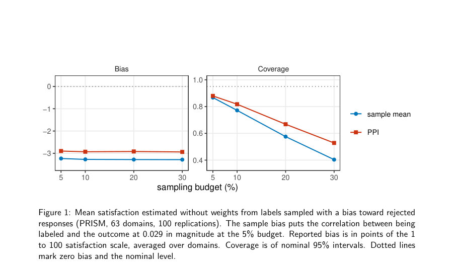
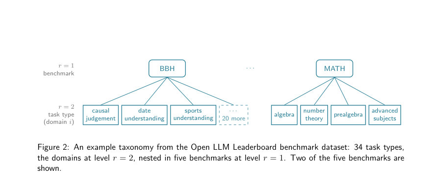
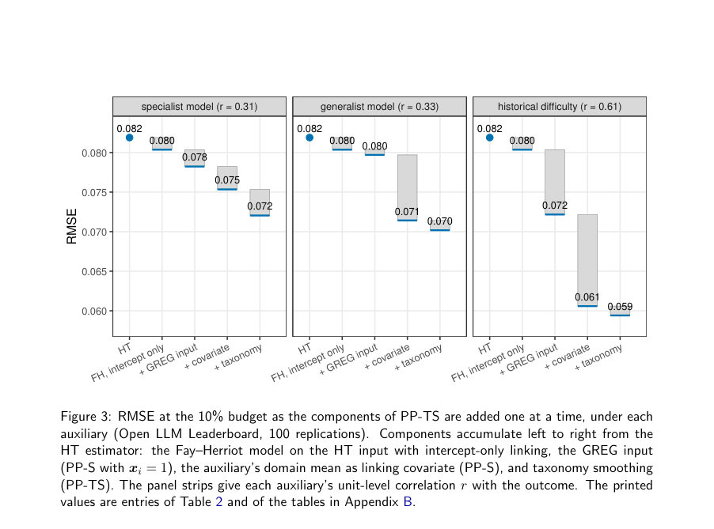

# Prediction-Powered Smoothing and Validation for Disaggregated AI Evaluation

- **게시일:** 2026-09-20
- **arXiv:** [2609.20758v1](http://arxiv.org/abs/2609.20758v1) · [PDF](https://arxiv.org/pdf/2609.20758v1)
- **저자:** Sho Kawano, Zehang Richard Li, Paul A. Parker
- **분야:** stat.ML, cs.AI, cs.LG, stat.AP, stat.ME
- **선정 점수:** 4.43
- **선정 이유:** 최근성 0.5, 인용 영향 0.0 (인용 0회), 저자 영향 0.0 (최고 h-index 0), AI 주제 적합성 2.7, 개발자 관심 0.5, 학술 신호 0.8, 오픈 웨이트·주요 연구조직 신호 0.0

[← 2026-09-20 목록으로 돌아가기](../daily/2026-09-20.html)

<!-- paper-visuals:start -->
## 주요 Figure

> 원문 PDF에서 실제 Figure 캡션과 그림 영역이 함께 확인된 자료만 자동 추출했다.

*Figure · 원문 PDF 4쪽 · Figure 1: Mean satisfaction estimated without weights from labels sampled with a bias toward rejected*

*Figure · 원문 PDF 7쪽 · Figure 2: An example taxonomy from the Open LLM Leaderboard benchmark dataset: 34 task types,*

*Figure · 원문 PDF 12쪽 · Figure 3: RMSE at the 10% budget as the components of PP-TS are added one at a time, under each*

<!-- paper-visuals:end -->

## 한 문장 요약

확률표본 기반의 불균등(도메인별) AI 성능 평가에서, GREG(PPI) 직접추정치를 입력으로 하는 베이지안 Fay–Herriot 계층모형( Prediction-Powered Smoothing, PP-S)과 계층적 분류군( taxonomy)을 활용한 확장(PP-TS)을 제안하고, 단일 표본에서 모델 비교와 오차보고를 위해 편향 보정된 설계기반 교차검증(DB-CV) 점수를 도입하여 점추정·구간추정 성능과 모델선택을 개선한다.

## 해결하려는 문제

AI 시스템의 성능은 도메인(작업유형·대화유형 등)에 따라 크게 달라지며, 모든 단위를 전수평가하기엔 비용이 크기 때문에 확률표본에서 각 도메인 평균(유한모집단 관점)을 정확한 점추정·구간추정으로 얻어야 한다. 기존의 직접추정법(예: HT, PPI/PPI++/GREG)은 각 도메인 자신의 표본에만 의존하므로 레이블이 적은 소도메인에서 불정밀하고 분산이 크다. 또한 모델기반 평활(즉, 수축)은 유용하지만, 어느 정도의 수축을 적용할지·어떤 링크 구조(분류군)를 쓸지 등의 검증·선택 문제와 단일표본 내에서의 오차 보고가 미해결이다.

## 핵심 기여

- Prediction-Powered Smoothing (PP-S): GREG(또는 PPI)로 얻은 도메인별 직접추정치와 분산을 입력으로 하는 베이지안 Fay–Herriot(영역수준) 모델을 제안하여 도메인 간 수축(shrinkage)을 수행함.
- Prediction-Powered Taxonomy Smoothing (PP-TS): 도메인들이 속한 다층 분류군(taxonomy) 구조를 링크 모형에 도입하여 계층적 랜덤효과를 합산함으로써 ‘가까운’ 도메인끼리 힘을 빌려오는 확장 제시.
- Design-based debiased cross-validation (DB-CV): K-겹 설계 기반 교차검증 점수의 폴드 수준 편향을 제거하고(기존 Dong & Li 보정), 표본 수준 편향을 근사 제거하는 새로운 편향보정 점수(Sdeb)를 유도하여 단일 표본에서 직접·모형 기반 추정기를 비교·선택하고 선택된 모형의 오차를 신뢰성 있게 보고하도록 함.
- 종합 실험적 검증: 전수 결과(oracle)가 알려진 두 실제 사례—(1) Open LLM Leaderboard(검증 가능 태스크)와 (2) PRISM(배포 트래픽, 인간평가)—에서 PP-S/PP-TS가 직접추정치(PPI/GREG)보다 점·구간추정에서 일관되게 개선되고, DB-CV가 동일 예산에서 데이터분할 방식(독립 검증표본)과 동등한 선택성능을 보이며 오차 보고는 더 정확함을 보임.
- 실무화된 워크플로우 제안: 확률표본 설계 권고, 보조변수(LLM judge·도메인 평균·콘텐츠) 사용 위치(단위수준과 도메인수준), 베이지안 적합·구간 생성, 그리고 단일표본에서의 검증 절차 통합을 제안함.

## 접근 방법

* 문제설정: 전체 평가대상 모집단 U를 유한모집단으로 보고 보고차원(도메인)별 평균 θi를 목표로 함.
* 단위별 보조정보 fij(예: LLM judge 점수, 역사적 정답 등)를 알고 있으며, 확률표본(도메인 단위 층화 SRS)에서 표본을 뽑아 ni 레이블을 얻음.
* 직접추정기: Horvitz–Thompson(HT), Prediction-Powered Inference(PPI, 차이/보정형) 및 GREG(보정기울기 λ을 데이터 기반으로 튜닝한 형태)을 사용.
* PP-S: GREG로 얻은 도메인별 직접추정치 zi=ˆθ_GREG,i와 그 분산 di를 입력으로 하는 영역수준(Fay–Herriot) 베이지안 모델을 적용(z_i \| θ_i ~ N(θ_i, d_i), θ_i = x_i^T β + v_i, v_i ~ N(0,σ^2)).
* PP-TS: 분류군 레벨 r=1..R에 대해 θ_i = x_i^T β + Σ_r v^{(r)}_{a_r(i)} (각 레벨별 iid N(0,σ_r^2))로 링크모형을 확장하여 세부 도메인 간 구조적 수축을 허용.
* 추정·추론: FH/PP-S는 β,σ^2에 대해 평탄/약한 사전을 주고 MCMC(논문은 Gibbs·단일체인, 1000 번 burn-in 후 2000 샘플 유지 등)를 통해 사후평균을 점추정치로, 사후 분위수로 95% 구간을 생성.
* 검증(DB-CV): 표본 내 K-겹(논문에서 K=5)으로 층별 무작위 분할.
* 후보추정기 M에 대해 각 폴드의 훈련-검증 반복으로 얻는 naive CV 점수의 편향을 수학적으로 전개하여(폴드-수준 편향 + 표본-수준 편향) 폴드 편향을 Sadj로 제거하고, 표본 편향을 근사적으로 제거하는 보정항(ˆd 및 Cov(ˆθ_HT,ˆθ_M) 항을 포함)으로 최종 Sdeb를 제시.
* 이때 Cov 항은 HT, PPI/GREG, 그리고 스무더에 대해 본문에서 닫힌형 근사나 후방분산 비율을 이용해 계산함(수식과 구현 세부는 Appendix A에 제시).

## 주요 결과

- 데이터셋: (1) Open LLM Leaderboard(검증가능 태스크, m=34 task types, N=9,324), 보조변수로 이전 모델의 정답들(특화 모델·일반 모델) 및 역사적 난이도 사용. (2) PRISM 트래픽(오픈엔디드, m=63 도메인, N=68,371), gpt-5-nano judge 점수(단위수준 상관 0.40, 도메인평균 상관 0.93) 및 콘텐츠 공변량 사용.
- 주요 비교기준: 도메인가중 RMSE(도메인당 동일가중 또는 트래픽 비중가중), 95% 구간의 평균 Interval Score(IS) 및 경험적 커버리지.
- 주요 정량결과(요약): Open LLM Leaderboard(표본예산 10%, 100 반복)에서 PP-TS가 모든 보조변수 조건에서 최저 RMSE·IS를 기록. 예: 세 보조변수(특화모델·일반모델·역사적난이도)에서 PP-TS RMSE는 각각 0.072, 0.070, 0.059, IS는 각각 0.350, 0.351, 0.295로 보고(해당 값은 Table 2). 모든 추정기의 95% 구간 커버리지는 대략 0.93–0.95로 명목 0.95에 근접.
- PRISM(트래픽) 워크플로우 예제(예산 10%): 단일 표본에서 DB-CV는 PP-S(judge+content)를 선택함(표본 기반 DB-CV 점수 순위는 오라클 RMSE 순위와 일치). 표본당 후보의 오라클 RMSE 예: HT 2.505, GREG(judge+content) 2.148, PP-S(judge+content) 1.527(표는 Table 3).
- 검증절차 비교(동일 총표본예산에서): DB-CV는 선택성능(오라클 RMSE 기준)에서 두 독립표본(데이터분할) 방식과 동등하거나 우수하면서, 선택된 추정기의 보고 오차 비율(reported / oracle RMSE)은 DB-CV 1.07×인 반면, naive CV은 4.00×, 50/50 split은 2.59×, 80/20 split은 3.54×로 과대추정 경향이 큼(Table 4). DB-CV는 단일표본에서 오차를 훨씬 더 정확하게 보고함(즉, 실무적 신뢰도 향상).

## 한계

- (저자 명시) 확률표본 가정 필요성: 논문 전반이 확률표본(모든 단위의 선택확률이 알려짐)을 전제로 하며, 비확률표본(실제 운영에서 흔한 불균형 선별)에 대해선 편향 보정이 표본 내 레이블만으로는 확인 불가능하므로 본 접근법의 설계기반 보장이 깨짐(Section 2, PRISM 시뮬레이션으로 예시).
- (저자 명시) 영역수준 모형의 가정: Fay–Herriot의 샘플링 모델(정규 근사)은 소도메인에서 약해지고, 링크모형(랜덤효과·선형회귀)은 잘못명시될 경우 작은 도메인에서 손실을 초래하므로 링크 구조(분류군·공변량)를 검증해야 함(Section 3.2·결론).
- (저자 명시·제안) 제약된 실험범위: 두 데이터셋(검증가능 벤치마크 및 PRISM 트래픽)에서 전수결과가 있어 오라클 비교가 가능했지만, 실제 운영에서는 전수 관측이 없어 오라클 검증이 불가능함. 제시된 방법은 '제로-샷(레이블 전혀 없는 도메인)' 추정으로 확장 가능한 가능성은 있으나 신뢰성 판단은 여전히 개방문제임(Conclusion).
- (본문에서 합리적으로 확인되는 제약) DB-CV의 표본 수준 편향 제거는 근사(식 (11))에 의존: 각 훈련-폴드의 조건부 기댓값이 전체-표본 적합치로 중심화된다는 가정이 필요하며 이 근사는 이론적 조건이나 대규모·복잡 모델에서 위배될 수 있음(부록 A). 또한, 스무더의 공분산 근사(후방분산·Var[zi] 비율)도 분산 파라미터 불확실성에 대한 1차 근사에 의존함(부록 A.4).

## 개발자 관점

- 항상 확률표본 설계를 사용하라: 비확률 표본은 편향과 낮은 신뢰구간 보장을 야기하므로 가능하면 층화 SRS 등 확률표본을 설계하라(논문 전반 권고).
- 보조정보의 사용 위치를 구분하라: 단위수준 보조변수는 GREG(PPI) 입력으로 분산 감축에 기여하고, 도메인수준 요약(도메인 평균)은 Fay–Herriot 링크의 예측변수로 작용하여 소도메인에서 더 큰 이득을 줄 수 있음—따라서 둘을 모두 고려하라(실험 결과, 도메인수준 정보 중요).
- 모형평활 도입 시 계층적 분류군(taxonomy)을 활용하라: 도메인 간 계층구조가 있다면 PP-TS처럼 각 레벨별 랜덤효과를 도입해 가까운 도메인 간 정보공유를 활용하라(실험에서 PP-TS가 일관되게 우수).
- 단일표본에서 모델선택·오차보고를 할 때는 DB-CV 사용 권장: K-겹(논문은 K=5) 설계기반 교차검증에 폴드·표본 수준 편향 보정 항(ˆd 및 Cov(ˆθ_HT,ˆθ_M))을 포함하면 동일 예산에서 데이터분할 방식보다 오차 보고가 훨씬 정확하다(구현상 Cov는 본문에 닫힌형 또는 후방분산 기반 근사로 계산 가능).
- 재현성과 비용: 구현 코드는 공개되어 있고(저자 GitHub), 베이지안 적합은 MCMC(저자: Gibbs, burn-in 1000, 2000 후방 샘플)로 수행되므로 실무 배포 시 계산비용과 수렴진단 필요. 또한 트래픽 데이터의 LLM judge 비용은 저자 실험에서 약 6달러(전체 PRISM)로 작았으나, 대규모 쿼리·인적 채점 비용은 별도 고려 필요(본문에서 HELM 평가 쿼리 비용 예시 $9,337 인용).

**근거 범위:** 본 분석은 제공된 논문 PDF 본문(주본문 및 부록)을 직접 근거로 작성되었음. 실험설정(예: 표본배분·보조변수 정의), 수치(표 2–4, 부록 표)와 MCMC·사전(prior) 상세(부록 B, C)를 본문/부록에서 확인하여 인용했음. 논문 외부의 미공개 구현 세부(예: MCMC 수렴진단의 추가 파라미터, 실환경 배포 시의 비용추정 등)는 본문에서 명시적 근거가 없으므로 언급하지 않았음.
