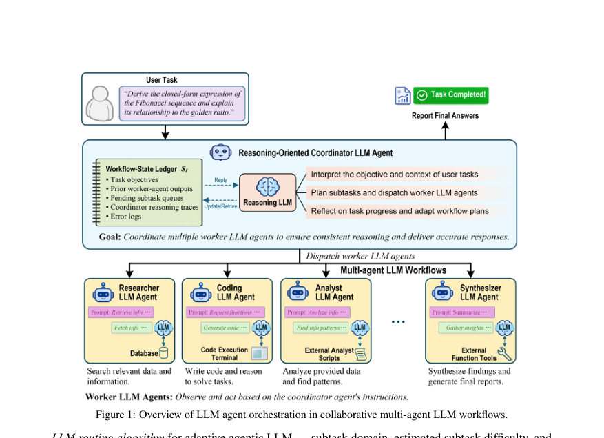
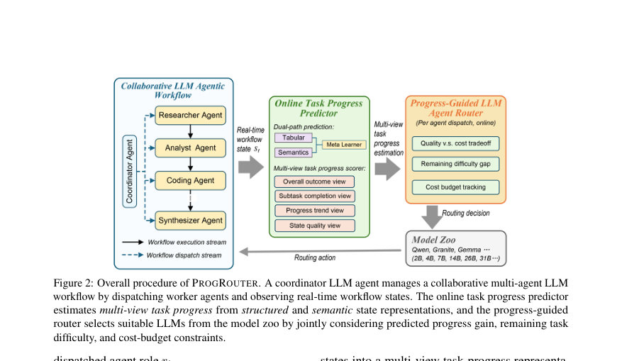
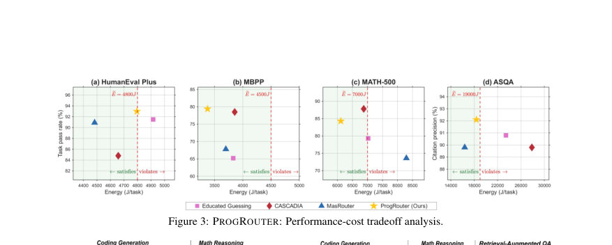

# ProgRouter: Online Progress-Guided Orchestration for Multi-Agent LLM Workflows under Quality-Cost Tradeoffs

- **게시일:** 2026-08-27
- **arXiv:** [2608.25992v1](http://arxiv.org/abs/2608.25992v1) · [PDF](https://arxiv.org/pdf/2608.25992v1)
- **저자:** Somgyuan Li, Ahmed M. Abdelmoniem, Shiqiang Wang
- **분야:** cs.AI, cs.MA
- **선정 점수:** 5.82
- **선정 이유:** 최근성 1.2, 인용 영향 0.0 (인용 0회), 저자 영향 0.0 (최고 h-index 0), AI 주제 적합성 3.0, 개발자 관심 0.5, 학술 신호 0.3, 오픈 웨이트·주요 연구조직 신호 0.8

[← 2026-08-27 목록으로 돌아가기](../daily/2026-08-27.html)

<!-- paper-visuals:start -->
## 주요 Figure

> 원문 PDF에서 실제 Figure 캡션과 그림 영역이 함께 확인된 자료만 자동 추출했다.

*Figure · 원문 PDF 3쪽 · Figure 1: Overview of LLM agent orchestration in collaborative multi-agent LLM workflows.*

*Figure · 원문 PDF 4쪽 · Figure 2: Overall procedure of PROGROUTER. A coordinator LLM agent manages a collaborative multi-agent LLM*

*Figure · 원문 PDF 8쪽 · Figure 3: PROGROUTER: Performance-cost tradeoff analysis.*

<!-- paper-visuals:end -->

## 한 문장 요약

진행도 기반의 온라인 라우팅으로 각 단계에서 LLM 에이전트를 동적으로 선택해 작업 품질을 유지하면서 운영 에너지·시간 예산을 만족하도록 하는 PROGROUTER 프레임워크를 제안한다.

## 해결하려는 문제

다단계(에이전틱) LLM 워크플로우는 여러 단계에 걸쳐 서로 다른 역할을 수행하는 LLM 호출이 반복되어 높은 토큰·연산·지연 비용을 유발한다. 기존의 캐스케이드·원샷 라우팅 방법은 쿼리 단일 결정에 의존하여 워크플로우 실행 중 변화하는 상태(부분 해, 남은 난이도, 예산 소진 등)에 적응하지 못하며, 이는 강력한 모델을 과도하게 쓰거나 약한 모델을 과도하게 사용해 품질 저하 또는 예산 소진으로 이어진다. 연구 질문은 각 단계에서 실시간으로 어떤 LLM을 호출해야 품질을 보전하면서 시간·운영비용(에너지) 제약을 만족시키는가 이다.

## 핵심 기여

- 멀티-뷰(task) 진행도 스코어러 설계: 전체 결과(4개 regime) + 서브태스크 완료도 + 진행 추세 + 상태 품질의 계층적 결합으로 단계별 촘촘한 진행도 신호 g(s_t)를 제시함.
- 듀얼-패스(progress) 예측기와 메타-게이팅: 구조화된(탭형 피처→트리 회귀) 경로와 의미적(코디네이터 요약→문장 임베딩→트리 회귀) 경로를 결합하는 메타 학습기로 후보 모델의 예상 진행도 이득을 추정함.
- 품질–비용 균형의 온라인 라우팅 알고리즘: Lyapunov 기반의 가상 비용 큐(Q)와 진행 격차 보상(V·(1−g(s_t))·ŷ) 및 예산 민감 비용 페널티(c_Γ, c_E)를 결합한 단계별 점수(score)를 도입해 즉시성(irreversible) 라우팅 결정을 수행함.
- 온라인 탐색·학습 절차: ε-그리디로 실제 라우팅 샘플을 수집해 단계별 실측 진행도(Δ_t = g(s_{t+1})−g(s_t))로 예측기를 온라인으로 주기적 갱신, ε 감소로 탐색→활용 전환을 수행함.
- 광범위한 실험 검증: 코드 생성(HumanEval Plus, MBPP), 수학 문제(MATH-500), 검색증강 장문 QA(ASQA)에서 운영 에너지 제약을 만족하면서 경쟁력 있는 성능을 보임.

## 접근 방법

* 아키텍처 개요: 코디네이터 LLM C가 워크플로우 원장(ledger) s_t를 유지·갱신하며 다음에 실행할 worker 역할 r_t를 결정한다.
* PROGROUTER는 이 시점에서 후보 모델군 M_{r_t}에서 실제 호출할 LLM m_t를 결정한다.
* 멀티-뷰 진행도 스코어러: 상태 s_t를 네 관점으로 평가하여 0~1 정규화 진행도 g(s_t)를 산출한다.
* 전체 결과 뷰는 규칙(결과 regime c_t ∈ {invalid,recoverable,partial success,complete})에 대응하는 기준점 b(c_t)를 제공하고, 서브태스크 완료도 r_t, 진행 추세 d_t(최근 델타 평균), 상태 품질 e_t(임베딩 유사도·구조적 변화 지표)를 보조 점수로 계산한다.
* 합성식: g(s_t)=b(c_t)+α_{c_t} r_t + β_{c_t} d_t + γ_{c_t} e_t.
* 듀얼-패스 진행도 예측기 P_Θ: 후보 모델 m_t에 대해 예측 ŷ_t = P_Θ(s_t,m_t)를 반환한다.
* 구조화 경로는 탭형 특징 x^{str}_t=ϕ_{str}(s_t,m_t)와 트리 계열 회귀기(P_{str})로 ˆy^{str}_t를, 의미 경로는 코디네이터가 만든 자연어 요약을 문장 임베딩(예: MiniLM)으로 변환한 x^{sem}_t와 트리 회귀기(P_{sem})로 ˆy^{sem}_t를 산출하고, 메타-게이터(P_{meta}, 역시 트리 기반)로 두 출력을 결합해 최종 ŷ_t를 얻는다.
* 온라인 의사결정과 목표함수: 장기 평균 운영비용 초과를 추적하는 가상 큐 Q 업데이트(Q_{w+1}=max(0,Q_w+Σ_t E(m_t) - eE)).
* 목표는 각 작업의 성공확률을 최대화하면서 Lyapunov 드리프트-페널티 형태로 V·P(w) − Q_w(Σ_t E(m_t) − eE)을 최대화하는 것(제약: 작업별 시간 Γ_w·Σ Γ(m_t) 및 비용 Σ E(m_t) 한계).
* 단계별 라우팅 점수: eP(m_t,s_t)=V·(1−g(s_t))·ŷ_t(m_t)로 진행 격차 가치를 계산하고, 시간·비용 누적에 민감한 페널티 c_Γ_t = exp((Γ(m_t)+Σ_{i<t}Γ(m_i))/Γ_w) 및 c_E_t 유사식과 Q_w·(E(m_t)−eE)를 결합한 score(m_t)=eP − Q_w·(E(m_t)−eE) − c_Γ_t·Γ(m_t) − c_E_t·E(m_t)을 최대화하는 모델을 선택한다.
* 온라인 학습 절차: ε-그리디로 탐색 샘플 수집, 실행 후 실제 진행도 이득 Δ_t=g(s_{t+1})−g(s_t)를 버퍼에 저장해 주기적으로 트리 모델들을 재학습하며 ε 감소로 정책을 수렴시킨다.
* 실험·측정 세부: 에너지 측정은 NVML로 GPU 전력(100 ms 샘플링) 적분으로 수행하고, 각 모델별 호출 비용을 모델 로드·프리필·토큰 생성 요소로 분해해 추정(Eestimated = I_load E_load + E_prefill + e_decode N_gen).
* 평가 프로토콜은 랜덤 셔플된 작업 스트림으로 온라인 적응을 평가하며 안정화 이후의 steady-state 성능을 보고함.

## 주요 결과

- 벤치마크: HumanEval Plus(164 tasks), MBPP(200 샘플), MATH-500(200 샘플), ASQA(100 샘플). 장기 평균 에너지 예산 eE는 각각 4800J, 4500J, 7000J, 19000J로 설정됨.
- 주요 성능(논문 본문 표에서 발췌, PROGROUTER): HumanEval Plus — Pass 93.0%, Energy 4796 J, Time 13.7 s (eE=4800J, 예산 내). MBPP — Pass 79.4%, Energy 3376 J, Time 10.3 s (eE=4500J). MATH-500 — Pass 84.3%, Energy 6112 J, Time 19.0 s (eE=7000J). ASQA — Citation precision 92.1%, Energy 18373 J, Time 61.6 s (eE=19000J).
- 비교 우위: HumanEval Plus에서 PROGROUTER는 MasRouter 대비 +2.1%p, CASCADIA 대비 +8.2%p 높은 pass율을 보고함(본문 명시). ASQA에서 precision은 PROGROUTER 92.1%로 MasRouter·CASCADIA(각 89.8%)보다 +2.3%p 향상.
- 에너지·시간 절감: MBPP에서 PROGROUTER는 가장 낮은 에너지(3376 J) 및 최단 시간(10.3 s)을 달성. MATH-500에서도 eE 만족군 중 최소 에너지(6112 J) 및 최단 시간(19.0 s)를 달성함(본문 표).
- 라우팅 행태: PROGROUTER는 대부분의 단계에서 효율적인 소형 모델을 주로 사용하되(예: HumanEval Plus에서 Qwen2.5-Coder 0.5B에 84.3% 할당, MATH-500에서 Granite 4.1 3B에 91.0% 할당) 진행도 예측이 큰 경우에만 선택적으로 대형 모델을 호출해 품질·비용 균형을 달성함.

## 한계

- (저자 명시) 검증 영역 제한: 실험은 코드 생성, 수학 추론, 검색증강 장문 QA의 네 벤치마크에 한정되어 있으며, 웹 네비게이션·툴 보조 QA 등 다른 에이전틱 환경으로의 일반화는 추가 실험이 필요하다고 명시함.
- (저자 명시) 진행도 스코어러의 도메인 적응 필요성: 멀티-뷰 스코어러는 각 도메인에 맞는 관찰 가능한 마일스톤·coarse outcome regime 정의가 필요하며, 이를 완전한 end-to-end로 자동 학습하지는 않았음.
- (본문 기반 확인) 에너지 측정 경계: 에너지 측정은 GPU 전력만 포함하고 CPU·호스트 메모리·스토리지·네트워크 에너지는 무시한다고 명시되어 있어 전체 비용 추정에는 한계가 있음.
- (본문 기반 확인) 코디네이터 비용·인프라 부담: 실험에서 코디네이터 LLM은 Qwen3-Coder-Next 80B-A3B(80B)로 설정되어 있어 실제 배포에서 코디네이터의 고비용·지연이 추가 비용·복잡도로 작용할 가능성이 있음(본문 Appendix D.1). 이는 논문이 성능·에너지 수치를 보고할 때 고려해야 할 제약임. 또한 실험은 특정 GPU(NVIDIA RTX PRO 6000 Blackwell) 환경에서 수행되어 재현을 위해 유사 하드웨어가 필요함.

## 개발자 관점

- 필수 구성요소: (1) 코디네이터용 강력한 LLM(논문은 Qwen3-Coder-Next 80B 사용), (2) 모델 줌(도메인별 소·중·대 모델들), (3) 멀티-뷰 진행도 스코어러(도메인별 마일스톤·규칙 정의), (4) 듀얼-패스 예측기(탭형·문장 임베딩→트리 회귀) 및 메타 게이터, (5) 온라인 ε-그리디 수집·버퍼·주기적 재학습 파이프라인, (6) 가상 큐·예산 추적 로직.
- 재현 팁: GPU 전력(NVML) 프로파일 기반 에너지 측정을 재현하려면 100 ms 샘플링으로 GPU 보드 전력 적분을 구현하고, 모델 로드(콜드·웜)·프리필·토큰 생성 비용을 분해해 per-call 추정식을 사용해야 함(Appendix D.2의 방법론 참조).
- 성능·비용 조정: V(진행도 가중치), ε 탐색 스케줄, 예산 민감 파라미터(식(10),(11)의 분모인 Γ_w·E_w) 등은 배포 환경과 작업 유형에 맞게 튜닝 필요. 논문은 이 파라미터들의 구체적 값(예: V, α_{c_t} 등)은 명시하지 않으므로 현장 튜닝 요구.
- 안정성·검증: 라우팅 패턴을 모니터링해 특정 모델에 편향적으로 의존하거나 예상 외 에너지 초과가 발생하는지 관찰해야 함. 검색증강·인용 작업에서는 인용 검증·사후 검토가 필요함(논문 윤리 고지).
- 운영 리스크: 코디네이터(80B)와의 통신·권한·원장(ledger)에 사용자 데이터가 저장될 수 있으므로 접근 제어·데이터 보존 정책을 반드시 적용할 것.

**근거 범위:** 본 분석은 제공된 논문 PDF 본문(서론, 방법, 실험, 한계, 부록 등 전체 페이지, 페이지 1–16)에 근거해 작성되었다. 표와 본문에서 제시된 수치(예: 각 벤치마크의 pass/precision, 에너지, 시간, routing 비율) 및 알고리즘 식(식 번호 포함)은 PDF에 명시된 값을 그대로 인용했다. 논문은 V, α_{c_t}, β_{c_t}, γ_{c_t}, ε 스케줄 등 일부 하이퍼파라미터의 구체적 수치와 내부 구현(예: 트리 회귀기 구체적 파라미터, 재학습 주기)은 명시적으로 제공하지 않아 해당 항목은 재현 시 튜닝이 필요함.
