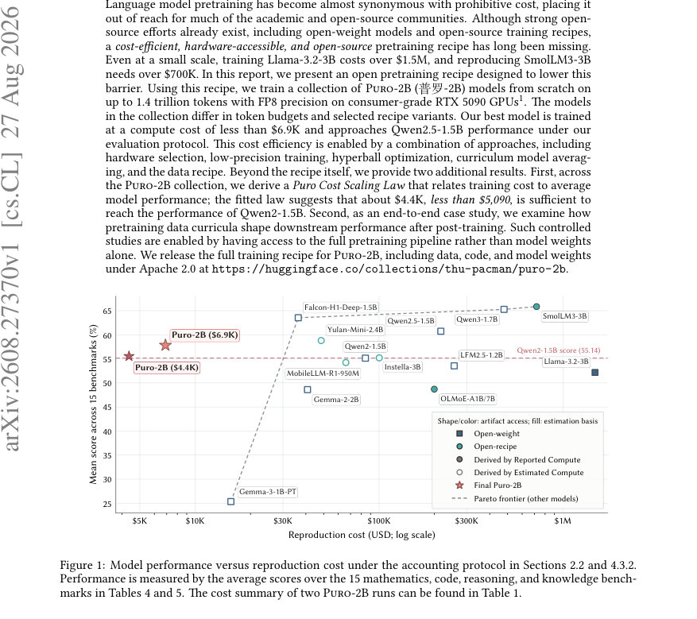
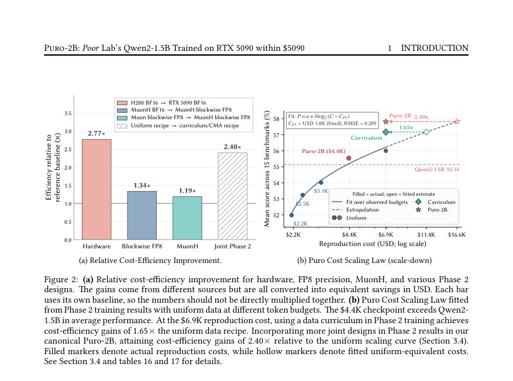
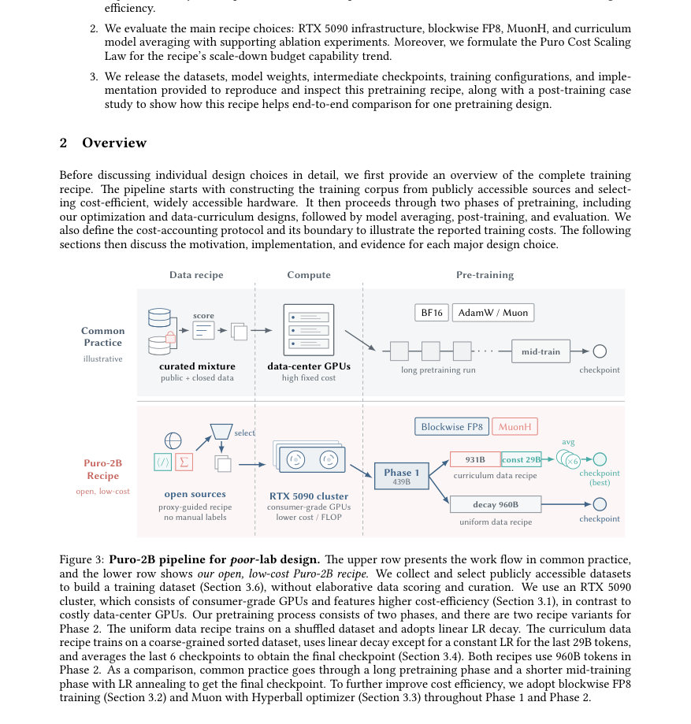

# Puro-2B: Poor Lab's Qwen2-1.5B Trained on RTX 5090 within $5090

- **게시일:** 2026-08-28
- **arXiv:** [2608.27370v1](http://arxiv.org/abs/2608.27370v1) · [PDF](https://arxiv.org/pdf/2608.27370v1)
- **저자:** Kairong Luo, Jiarui Cui, Yaorui Yin, Shengqi Chen, Yiming Yang, Linxiang Gao, Yanmohan Wang, Mingzhe Zhang, Kaiyue Wen, Kaifeng Lyu, Wenguang Chen
- **분야:** cs.CL, cs.LG
- **선정 점수:** 7.75
- **선정 이유:** 최근성 1.2, 인용 영향 0.0 (인용 0회), 저자 영향 0.0 (최고 h-index 0), AI 주제 적합성 1.5, 개발자 관심 0.9, 학술 신호 0.5, 오픈 웨이트·주요 연구조직 신호 3.7

[← 2026-08-28 목록으로 돌아가기](../daily/2026-08-28.html)

<!-- paper-visuals:start -->
## 주요 Figure

> 원문 PDF에서 실제 Figure 캡션과 그림 영역이 함께 확인된 자료만 자동 추출했다.

*Figure · 원문 PDF 1쪽 · Figure 1: Model performance versus reproduction cost under the accounting protocol in Sections 2.2 and 4.3.2.*

*Figure · 원문 PDF 5쪽 · Figure 2: (a) Relative cost-efficiency improvement for hardware, FP8 precision, MuonH, and various Phase 2*

*Figure · 원문 PDF 6쪽 · Figure 3: Puro-2B pipeline for poor-lab design. The upper row presents the work flow in common practice,*

<!-- paper-visuals:end -->

## 한 문장 요약

RTX 5090과 블록단위 FP8, MuonH(하이퍼볼) 최적화 및 Curriculum Model Averaging을 조합한 저비용(수천 USD) 오픈형 2B규모 사전학습 레시피를 제시하고, 이를 통해 최대 1.4T 토큰으로 훈련한 PuRo-2B 컬렉션을 공개·평가하여 비용대성능 곡선과 레시피별 이득을 분석했다.

## 해결하려는 문제

대형 언어 모델 사전학습은 높은 비용 때문에 많은 학계·오픈소스 연구실에서 재현·연구가 불가능하다. 기존 오픈-레시피/오픈-웨이트 노력들이 존재하지만 재현 가능한 전(全)파이프라인을 저비용·범용 하드웨어로 돌릴 수 있는 실용적 레시피가 부족하다. 본 논문은 소비자급 GPU 환경(주로 RTX 5090)에서 비용을 수천 달러 수준으로 낮추면서도 Qwen2-1.5B 수준의 성능에 근접하는 재현 가능한 사전학습 파이프라인을 제시하는 것을 목표로 한다.

## 핵심 기여

- 소비자급 RTX 5090 클러스터와 블록단위 FP8, MuonH(하이퍼볼 제약을 갖는 Muon 확장), Curriculum Model Averaging(CMA), 프록시 기반 데이터 선택 등을 통합한 저비용(수천 USD) 전(全)파이프라인 레시피를 공개하고 PuRo-2B 모델 컬렉션(최대 1.4T 토큰 훈련)을 제작·배포함.
- 레시피 수준의 비용–성능 관계인 'Puro Cost Scaling Law'를 도입·적합하여 주어진 (저)예산에서 달성 가능한 평균 성능을 추정하고, 이 법으로 약 $4.4K로 Qwen2-1.5B 성능을 넘을 수 있음을 제시함.
- 하드웨어 선택(RTX 5090), 블록단위 FP8, MuonH 옵티마이저, 데이터 커리큘럼·체크포인트 평균화 등 주요 요소들의 역할과 비용절감 기여를 실험적·회계적으로 분석함(부분적 어블레이션 및 비용-효율 비교).
- 사전학습부터 포스트트레이닝(SFT)까지의 엔드투엔드 실험 사례를 통해 Phase 2 데이터 커리큘럼이 포스트트레이닝 이후 downstream 성능에 미치는 영향을 비교함.
- 데이터 매니페스트, 전처리 코드(Kaiyuan-SpaRK), 훈련 코드(Puro-Megatron), 10개 변종 체크포인트 및 모델 가중치를 Apache-2.0으로 공개하여 재현 가능하도록 제공함.

## 접근 방법

* 본문에 따른 접근 방식 요약: (1) 모델·아키텍처: Qwen3-1.7B 구성(입력 임베딩과 LM 헤드를 언타이(untie)함)으로 약 2B 파라미터의 디코더-전용 트랜스포머를 사용, 시퀀스 길이 4096, 글로벌 배치 사이즈 1536.
* (2) 훈련 분할: Phase 1(438.84B 토큰, 24 GPU, 10.43일)로 기초 훈련 후 Phase 2(960B 토큰 canonical / 480B 균일 대안, 96 GPU, canonical 7.16일 또는 균일 3.58일)로 확장.
* 총 예정 토큰 최대 1.4T.
* (3) 하드웨어·시스템: 소비자급 RTX 5090 클러스터 채택, PCIe P2P 활성화 및 GPUDirect RDMA 관련 사용자 레벨 드라이버 수정(세부는 공개 불가)로 노드·노드간 통신 병목 완화.
* Megatron Core v0.16.0과 Transformer Engine 기반으로 구현.
* 통신 비용을 줄이기 위해 Pipeline Parallelism + Data Parallelism(텐서 병렬 미사용) 구성 채택.
* 메모리-민감성 고려한 마이크로배치 크기 선정 및 메모리 인지적 파라미터 배치 사용.
* (4) 수치·정밀도: Transformer의 주요 선형 연산은 블록단위 FP8(E4M3, 블록 스케일: 활성화 1D 그룹 길이 128, 가중치 128×128 블록)로, 민감한 상태(마스터 웨이트·옵티마이저 상태)는 BF16/FP32 유지.
* (5) 옵티마이저·스케줄: MuonH(퓨전된 Muon + Hyperball 제약) 사용 — 특정 scale-invariant 행렬을 업데이트한 후 초기 Frobenius 반지름으로 프로젝션.
* MuonH 그룹은 기본 LR의 10×를 사용.
* Phase 1은 power 스케줄, Phase 2는 이어온 값에서 선형감쇠, CMA 전환 시 후기 단계는 base LR 고정(체크포인트 평균화 전 고정).
* (6) 데이터·커리큘럼: 공개 가능한 대규모 데이터 풀에서 소스별 프록시 연속실험(0.6B Qwen3 프록시 모델로 continuation 약 8.4B 토큰)을 통해 소스·점수구간별 성능 프로파일을 얻고, Phase 2에서는 각 소스 내 순위(quality label 기반)를 이용해 '저→고' 순으로 배치하는 coarse-grained curriculum을 구성.
* 후기 학습에서는 마지막 29B 토큰 구간에서 일정 LR로 유지하고 마지막 6개 체크포인트(구체적 스텝: 222,100~222,569) 평균(등가 가중)을 최종 모델로 사용(평균 창 약 469 옵티마이저 스텝 ≈ 2.95B 토큰).
* (7) 평가: 15개 수학·코드·추론·지식 벤치마크의 평균 점수를 주요 비교 지표로 사용하여 Qwen 계열·Gemma·SmolLM 등 공개 모델과 비교.

## 주요 결과

- 훈련 예산·시간·활성 GPU시간: canonical run (Phase1 438.84B + Phase2 959.99B) 합계 1.39883T 토큰, 활성 GPU시간 22,514 GPU-h, 보고된 재현 비용 약 $6.89K(24GPU로 Phase1, 96GPU로 Phase2), 경량 균일 Phase2 대안은 480B Phase2로 활성 GPU-h 14,262, 비용 약 $4.37K.
- 성능 대비 비용: 15개 벤치마크 평균에서 PuRo-2B 컬렉션의 최적체크포인트는 Qwen2-1.5B(평균 55.14)를 넘거나 근접하는 성능을 보이며, 보고된 Puro Cost Scaling Law 적합 결과로는 약 $4.4K에서 Qwen2-1.5B 성능을 교차한다고 제시됨(스케일-다운 전용 적합; 적합식 P = a + b log2(C − CP1), CP1 = $1.8K, RMSE = 0.209).
- 비용-효율 기여(보고값): RTX 5090 선택으로 H200 BF16 대비 약 2.77× 상대 효율 개선(각 바는 자체 기준선 대비); MuonH BF16→MuonH FP8 전환으로 추가 1.34×; Muon→MuonH로 1.19×; Uniform recipe → curriculum/CMA 설계로 2.40×(다만 저자 경고: 각 바는 서로 다른 기준선을 사용하므로 단순 곱셈 불가).
- 시스템 성능: Phase 1 구성(24 GPU, 배치 1536)에서 GPU당 중앙값 238 TFLOP/s(정의된 precision-weighted peak 대비 약 73% MFU). Phase 2(96 GPU)에서는 GPU당 중앙값 192 TFLOP/s 달성.
- 수치·안정성: 블록단위 FP8(활성화 그룹 128, 가중치 블록 128×128)로 훈련했으며, 논문은 이 방식이 BF16과 비교해 유사한 품질을 유지하면서 실행시간을 줄였다고 보고함(세부 품질 지표의 수치적 차이는 본문에 부분적으로 제시).

## 한계

- 저자가 명시한 회계 경계: 논문이 제시하는 '재현 비용'은 최종 Phase 1/Phase 2 생산 훈련의 가속기(=GPU) 마진 비용만 포함하며, 데이터 수집·전처리, 프록시 실험, 실패·탐색적 러닝, 포스트트레이닝, 평가, 연구 인건비, CPU/스토리지/네트워크 등은 제외됨 — 따라서 진짜 전체 개발 비용은 훨씬 큼.
- 하드웨어 및 소프트웨어 제약: RTX 5090은 메모리 용량이 작고 NVLink 부재로 노드 내부 대역폭 제약이 있으며, 보고된 P2P·GDR 성능 개선은 드라이버/커널 수준의 수정(오픈소스 드라이버 수정, CUDA 유저스페이스 바이너리 변경 등)에 의존함. 이러한 수정은 공급사 미지원·EULA 제약·안정성 리스크가 있음(저자도 세부 공개 불가라고 명시).
- 데이터 라이선스 제약: 일부 고효율 데이터 구성요소(예: Nemotron-CC, Nemotron-Pretraining-Code 등)는 NVIDIA의 데이터 동의서 등 배포 제한이 있는 자료를 포함하며, 모든 구성요소가 재배포 가능한 것은 아님(논문은 일부 성분은 재구성 식별자와 회계만 공개).
- 원인 귀속의 한계: 커리큘럼·상수-LR 연속(continuation)·체크포인트 평균화 간의 상호작용으로 인해 가용한 실험들이 완전한 요인 실험을 이루지 못해(완전한 팩토리얼 없음) 각 요소의 순수 기여를 개별적으로 분리·정량화할 수 없음(본문 H.4). 따라서 일부 이득은 합성적 해석에 기반함(개별 요소 분리 불가).

## 개발자 관점

- 재현성: 저자들이 코드(Megatron 기반), 데이터 매니페스트, 전처리 파이프라인(Kaiyuan-SpaRK) 및 여러 체크포인트를 공개했으므로 동일한 레시피를 재현하려면 공개 아티팩트와 논문에 명시된 phase별 셋업(토큰 예산, GPU 수, 배치/PP/DP 구성 등)을 그대로 따르라.
- 하드웨어 선택과 위험성: 소비자급 RTX 5090은 단가 대비 FLOP 효율이 높아 저비용 실험에 매력적이나 NVLink 부재·메모리 제약을 감안해야 함. 드라이버·커널 수정(PCIe P2P·GDR 활성화)은 성능을 크게 향상시키지만 공급사 미지원·EULA·안정성 리스크가 있으니 생산 환경에서 적용 시 법적·운영적 검토가 필요함.
- 수치정밀도 적용법: 블록 단위 FP8(활성화 group=128, 가중치 128×128)로 주요 GEMM을 실행하고, 마스터 파라미터·옵티마이저 상태는 BF16/FP32에 보존하는 하이브리드 접근을 권장. FP8 그룹화·스케일링 설계는 DeepSeek-V3 식 접근을 따름.
- 병렬화·메모리: 통신 대역폭이 제한된 환경에서는 Tensor Parallelism을 피하고 Pipeline+Data Parallelism 조합을 사용하되, 파이프라인 단계 균형(예: LM head 포함 스테이지에 적은 레이어 할당)과 메모리-인지적 파라미터 배치(그리디·빈패킹식)를 통해 메모리·성능 균형을 맞춰야 함.
- 훈련 스케줄·옵티마이저: MuonH(하이퍼볼 제약)와 다단계 LR 스케줄(power→linear→constant for CMA)을 함께 쓰는 것이 후기 커리큘럼의 영향 보존에 유리함. CMA는 마지막 n개 체크포인트 평균(저자: 6개, 등중 평균)을 사용했으며 평균 창과 체크포인트 간격은 제품화 시 실험적으로 조정해야 함(논문은 마지막 6개 체크포인트의 스텝값과 창 크기 제공).

**근거 범위:** 이 분석은 제공된 논문 PDF 본문(주요 본문 및 부록 일부 포함)으로부터 직접 추출·요약한 내용에 기반함. 본문에 명시된 수치(토큰 수, GPU 수, GPU-h, 비용, 체크포인트 스텝 등)와 방법적 세부사항을 우선적으로 사용했으며, 저자가 비공개로 처리한 드라이버 수정의 구체적 구현 세부사항이나 부록의 일부 세부 실험결과가 PDF 추출에 일부 누락되어 있을 가능성을 명시함. 불확실하거나 본문에서 직접 확인되지 않은 구현·성능 수치는 생성하지 않았음.
