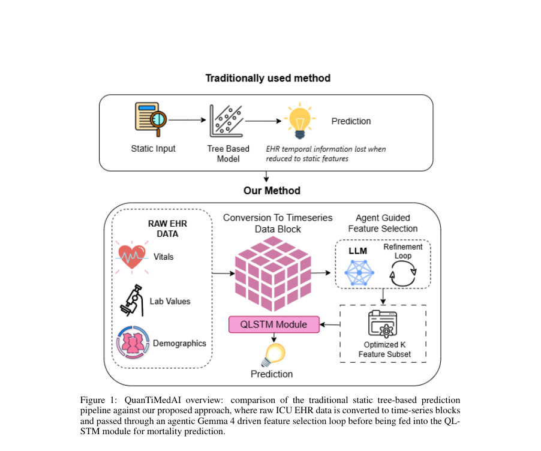
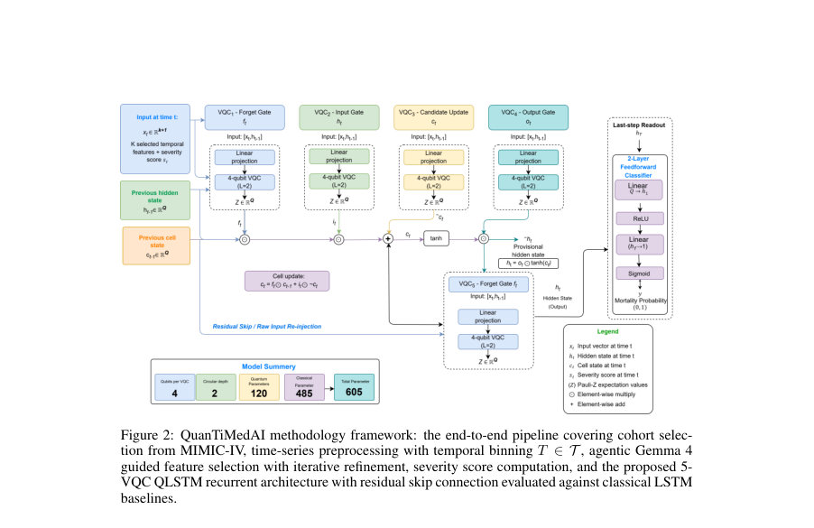
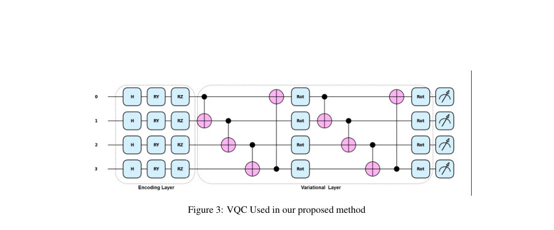

# QuanTiMedAI: Quantum-Enhanced Time-Series Model guided by Agentic AI for Cardiac Arrest Mortality Prediction

- **게시일:** 2026-08-08
- **arXiv:** [2608.06294v1](http://arxiv.org/abs/2608.06294v1) · [PDF](https://arxiv.org/pdf/2608.06294v1)
- **저자:** Mutasim Fuad Sarker, Adiba Rahman Namira, Wafa Binte Alam, Md Adnan Arefeen, Mahzabeen Emu, Sumaiya Tabassum Nimi
- **분야:** cs.AI, cs.ET
- **선정 점수:** 4.59
- **선정 이유:** 최근성 0.7, 인용 영향 0.0 (인용 0회), 저자 영향 0.0 (최고 h-index 0), AI 주제 적합성 3.0, 개발자 관심 0.0, 학술 신호 0.9, 오픈 웨이트·주요 연구조직 신호 0.0

[← 2026-08-08 목록으로 돌아가기](../daily/2026-08-08.html)

<!-- paper-visuals:start -->
## 주요 Figure

> 원문 PDF에서 실제 Figure 캡션과 그림 영역이 함께 확인된 자료만 자동 추출했다.

*Figure · 원문 PDF 2쪽 · Figure 1: QuanTiMedAI overview: comparison of the traditional static tree-based prediction*

*Figure · 원문 PDF 7쪽 · Figure 2: QuanTiMedAI methodology framework: the end-to-end pipeline covering cohort selec-*

*Figure · 원문 PDF 9쪽 · Figure 3: VQC Used in our proposed method*

<!-- paper-visuals:end -->

## 한 문장 요약

MIMIC‑IV 심근경색(심정지) ICU 환자 24시간 시계열 데이터를 대상으로, 에이전트형 LLM(Gemma‑4)로 임상적 중요 변수를 반복 선택하고(심각도 스코어 채널 생성) 저매개변수 하이브리드 QLSTM(5‑VQC, 입력 재주입)을 사용해 입원중 사망을 예측하는 프레임워크를 제안하고 평가했다.

## 해결하려는 문제

기존 심정지 환자 사망 예측 연구는 대체로 입원 초기(첫 24시간) 정적 요약만 사용해 시간에 따른 생리학적 변화(시계열 정보)를 버렸고, 특징 선택도 주로 통계적 방법(LASSO, 상관필터 등)에 의존해 임상 지식을 체계적으로 반영하지 못했다. 동시에 순환 모델(LSTM)은 많은 파라미터가 필요하고 긴 시퀀스의 비선형 의존성을 포착하는 데 한계가 있다. 본문은 (i) 에이전트형 LLM 기반의 임상적 지식 통합 특징 선택이 무작위 또는 통계적 선택보다 예측 성능을 개선하는지, (ii) 양자 강화된 QLSTM이 동일한 실험 조건에서 고전적 LSTM 대비 우수하거나 더 파라미터 효율적인 성능을 내는지를 검증하려 했다.

## 핵심 기여

- 에이전트형 LLM(Gemma‑4 via Ollama)으로 반복적 성능 피드백을 받아 임상적으로 정당화된 특징과 가중치를 반환하는 특징 선택 파이프라인(심각도 스코어 채널 포함)을 제안했다.
- 입력 재주입(skip connection)을 가진 5‑VQC QLSTM 변형 아키텍처를 제안해 파라미터 수를 크게 줄이면서 시계열 사망 예측 성능을 향상시켰다.
- MIMIC‑IV 심정지 ICU 코호트(2,307명)를 대상으로 광범위한 (K, T) 그리드 탐색과 엄격한 교차검증 기반 에이전트 반복 고정을 통해 제안모델을 고전적 LSTM 및 무작위 특징 선택 기반 LSTM과 비교 평가했다.
- 구조적 절제(ablation) 실험(6개 아키텍처 변형)을 통해 VQC 수(5 vs 6), 입력 재주입 유무, 읽기 방식(last vs mean) 등 설계 선택이 성능에 미치는 영향을 정량화했다.
- 파라미터 대비 성능 우위(605 파라미터로 AUROC 0.852)와 에이전트 기반 특징 가중치의 임상적 해석 가능성(예: lactate, anion gap 등 높은 가중치)을 제시했다.

## 접근 방법

* 데이터: MIMIC‑IV에서 ICD‑9 코드 427.5 및 ICD‑10 I46*로 식별한 성인(≥18세) ICU 심정지 환자 코호트(총 N=2,307, 사망 1,296명, 관찰 윈도 τ=24시간).
* 전처리: 시간형 변수는 T ∈ {2,4,6,8,12,24}로 구간화(각 구간 내 평균 또는 합/이진 인코딩), 누락률 기준(ρ) 이상인 변수 제거, 중요한 변수는 누락률 무시 보존, 전달은 훈련셋 기준 z‑정규화.
* 에이전트 특징 선택: Gemma‑4(E4B)를 로컬 Ollama로 구동한 에이전트가 각 (K,T) 설정에서 훈련셋 요약(사망별 평균±SD, 상관, 시간적 추세, 누락률)을 입력으로 받아 정확히 K개 특징과 가중치(wi)·바이어스(b)를 반환.
* 반환된 가중치로 각 시점 t에서 sigmoid(Σ wi xi(t) + b) 형태의 '심각도 점수' 채널을 생성해 입력 텐서에 추가(입력 차원 Kin = K+1).
* 에이전트는 최대 R=5회 반복 정제(각 라운드에서 최소 α·K 교체; α=0.10), 내부 10‑fold 교차검증 성능(폴드 평균 AUROC, AUPRC, 손실, 퍼뮤테이션 중요도)을 근거로 수정 제안 허용.
* 모델 아키텍처: 입력 → 단일 순환 인코더(QLSTM 또는 고전 LSTM) → 마지막 시점 hT 읽기 → 2층 FFN 분류기 → sigmoid 출력.
* QLSTM 구성: 고전 LSTM의 게이트들을 각각 선형사영 + Variational Quantum Circuit(VQC)로 대체해 총 M=5개의 VQC(포겟, 입력, 후보, 출력, hidden‑refinement)를 사용(종래 6‑VQC에서 출력‑스테이지 VQC 제거).
* 각 VQC는 Q=4 qubit, 회로 깊이(variational 층) 2, 데이터 인코딩: 각 qubit에 H, RY(arctan(xq)), RZ(arctan(xq^2)); 변분층: cyclic CNOT 연결 + 각 큐빗별 Rot(ϕ1,ϕ2,ϕ3) 파라미터; 측정은 Pauli‑Z 기대값.
* hidden‑refinement VQC에는 원본 입력 xt를 재주입하는 잔차 경로를 추가.
* 구현·학습: VQC는 PennyLane의 default.qubit(statevector) 무노이즈 시뮬레이터에서 구현(따라서 결과는 이상적 시뮬레이션 기준).
* 옵티마이저 Adam, 초기 lr=1e‑3을 100 epoch에 걸쳐 코사인 감쇠로 1e‑5까지 anneal, weight decay=1e‑4, gradient clipping=1.0, 배치 64, early stopping(검증 AUROC, patience 20), 클래스 가중치 BCE, 실험은 3개 시드 평균으로 보고.
* 레퍼런스 LSTM은 2층 스택 LSTM(대형: 281,729 파라미터; 파라미터 매칭 소형: ≈655 파라미터)으로 비교.

## 주요 결과

- 코호트: N=2,307명(사망 1,296명, 56.2%).(본문 표·설명 근거)
- 헤드라인 성능: QuanTiMedAI(K=18, T=2) AUROC = 0.852, AUPRC = 0.882, 총 학습가능 파라미터 605(양자 파라미터 120, 고전 헤드 485).
- 고전 LSTM(풀 용량, 동일 K=18,T=2) AUROC = 0.828, 파라미터 281,729; 파라미터 매칭 고전 LSTM(≈655 파라미터) AUROC = 0.835. QuanTiMedAI는 유사 파라미터 예산 대비 AUROC 0.017(절대) 향상(≈2% 상대) 보임.
- 문헌 대비 개선: 최근 MIMIC‑IV 심정지 연구 중 Jia et al. 보고 AUROC 0.828에 비해 약 2.9% 향상(0.828 → 0.852)이라고 보고함(본문 표·서술).
- 그리드 전체 평균: QuanTiMedAI 평균 AUROC = 0.815, LSTM 평균 AUROC = 0.810, LSTM 랜덤 특징 선택 평균 AUROC = 0.775. 평균 AUPRC는 각각 0.856, 0.853, 0.819로 보고됨(본문 Table 5). 최고/최저 구성값(본문 표): QuanTiMedAI 최고 0.852(K=18,T=2), 최저 0.734(K=2,T=2). LSTM 최고 0.846(K=15,T=24). 랜덤 선택 최고 0.833(K=15,T=8). (본문 표 근거).  

아블레이션: 제안 아키텍처(5‑VQC + 입력 재주입)가 AUROC 0.852로 최고. 동일 5‑VQC에서 입력 재주입을 제거하면 AUROC 0.839(차이 ≈0.013, 본문은 약 1.5% 기여라고 명시). 6‑VQC+skip은 0.848, 원본 Chen et al. 6‑VQC(no skip) 0.838 등으로 보고됨(Table 7). 

통계: 파라미터 매칭 고전 LSTM과의 AUROC 차이는 Bonferroni 보정된 p = 0.0178로 유의미하다고 보고됨(Table 8). 

시뮬레이션 조건: 모든 양자 회로는 PennyLane default.qubit의 이상적 상태벡터 시뮬레이터에서 실행되어 잡음(게이트오류, 디코히런스, 측정잡음)을 반영하지 않음(저자 명시).

## 한계

- 저자 명시 한계(문헌에서 직접 언급됨): 결과는 무노이즈 상태벡터 시뮬레이터(default.qubit)에서 얻은 이상적 성능이며 실제 양자 하드웨어의 게이트 오류·디코히런스·읽기 잡음에서의 거동을 반영하지 않아 현실 하드웨어(특히 NISQ 장치)에서의 내성은 검증되지 않았다.
- 저자 제시 실험적 제약: 연구는 단일 공개 레지스트리(MIMIC‑IV) 기반 단일센터 성격의 코호트와 첫 24시간 관찰 윈도(τ=24h)에 한정되어 있어 외부 코호트 검증·일반화 가능성은 확보되지 않았다(저자도 외부 검증 필요성 언급).
- 논문 본문에서 합리적으로 확인되는 제약: 에이전트형 특징 선택은 Gemma‑4 특정 구성(로컬 Ollama, 온도·재시도 정책 등)에 강하게 의존하므로 동일 결과 재현은 동일 LLM 접근성(라이선스/모델 버전)에 달려 있다. 또한 테스트 세트 크기(예: 아블레이션에서 N=462)는 일부 통계 검정에서 검정력 제한을 초래했다고 저자가 언급했다.
- 모델·평가 한계: 양자 회로 설계(큐빗 수, 층수 등)는 시뮬레이션에서 튜닝되었고, 현실 하드웨어에서의 계산 비용·지연·에러 완화 전략(예: 에러 보정)은 다루지 않았다.

## 개발자 관점

- 재현에 필요한 핵심 구성요소: MIMIC‑IV 접근 권한(PhysioNet 인증), Ollama 로컬 호스팅의 Gemma‑4(E4B) 모델(시스템/프롬프트·온도 설정과 JSON 응답 스키마 엄수), PennyLane(default.qubit) 환경. 논문은 프롬프트, 온도(초기 0.30, 정제 0.70), 재시도·라운드(R=5), 최소 교체율(α=0.10), 내부 10‑fold CV 피드백 절차 등을 세부적으로 명시해 재현 가능성을 높임.
- 학습·하이퍼파라미터: Adam (lr 1e‑3 → cosine → 1e‑5 over 100 epochs), weight decay=1e‑4, grad‑clip=1.0, batch=64, early stopping(patience=20, monitor AUROC), 클래스 가중치 BCE, 시드 3회 반복으로 평균 보고 등은 그대로 재사용 가능.
- 실행·배포 관점: 파라미터 수(605)로 모델은 경량이지만, 현재 결과는 시뮬레이터 기반으로 양자 회로를 에뮬레이트해야 하므로 실제 CPU/GPU 기반 시뮬레이션 비용(특히 배치·타임스텝 반복)은 무시할 수 없다. 실제 양자 하드웨어로 이전하려면 노이즈 모델링, 에러완화, 런타임/큐대기시간, 하드웨어 접근 비용을 고려해야 한다.
- 안전성·규제: 임상 적용 전 외부 검증·교정(calibration), 임상적 유효성 및 위험평가가 필요하다. 에이전트(LLM) 기반 특징 선택은 모델 설명성 측면에서 유리하지만, LLM의 출력이 변하면 입력 파이프라인이 달라지므로 프로덕션에서 LLM 버전·프롬프트·온도·시드 고정이 필요하다.
- 대안 전략: 현실적 제약(양자 하드웨어 미구비, 시뮬레이션 비용)을 고려해 파라미터 매칭 고전적 소형 LSTM(논문에서 ≈655 파라미터로 AUROC 0.835)을 플랜B로 삼고, 양자 회로의 이득을 노이즈 시뮬레이터나 하드웨어에서 재검증할 것을 권장한다.

**근거 범위:** 이 분석은 제출된 논문 PDF 본문(제공된 전 페이지 텍스트)을 근거로 작성되었다. 수치는 본문 표와 본문 서술에서 직접 인용한 값만 사용했으며, 양자 회로의 실제 하드웨어 성능·실행 비용 등 본문에 명시되지 않은 항목은 추정하지 않았다. 논문은 양자 회로를 PennyLane default.qubit의 무노이즈 시뮬레이터에서 실행했다고 명시하므로 실제 하드웨어 결과는 본 분석에 포함되지 않는다.
