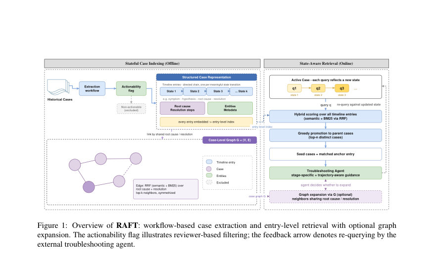
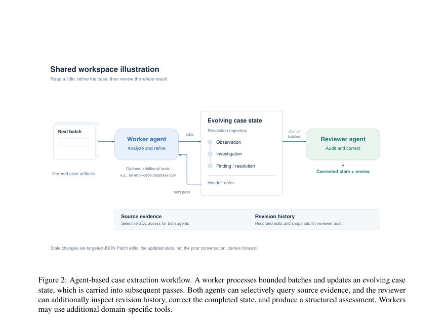

# RAFT: A Stateful Retrieval-Augmented Framework for Troubleshooting Agents

- **게시일:** 2026-09-20
- **arXiv:** [2609.20754v1](http://arxiv.org/abs/2609.20754v1) · [PDF](https://arxiv.org/pdf/2609.20754v1)
- **저자:** Mingxuan Zhang, Xiaowen Wang, Anupma Sharan, Zhengyi Chen, Chenyu Diana Zhang, Shanshan Yang, Chittibabu Pacharu
- **분야:** cs.AI
- **선정 점수:** 4.63
- **선정 이유:** 최근성 0.5, 인용 영향 0.0 (인용 0회), 저자 영향 0.0 (최고 h-index 0), AI 주제 적합성 2.6, 개발자 관심 0.6, 학술 신호 1.0, 오픈 웨이트·주요 연구조직 신호 0.0

[← 2026-09-20 목록으로 돌아가기](../daily/2026-09-20.html)

<!-- paper-visuals:start -->
## 주요 Figure

> 원문 PDF에서 실제 Figure 캡션과 그림 영역이 함께 확인된 자료만 자동 추출했다.

*Figure · 원문 PDF 4쪽 · Figure 1: Overview of RAFT: workflow-based case extraction and entry-level retrieval with optional graph*

*Figure · 원문 PDF 12쪽 · Figure 2: Agent-based case extraction workflow. A worker processes bounded batches and updates an evolving case*

<!-- paper-visuals:end -->

## 한 문장 요약

RAFT는 닫힌 고객지원 케이스를 '타임라인 엔트리' 체인으로 추상화하고 엔트리 수준에서 임베딩·검색해 현재 조사 상태와 일치하는 과거 케이스의 궤적을 반환하는 상태기반 Retrieval-Augmented Framework이다.

## 해결하려는 문제

기업용 트러블슈팅 에이전트는 유사한 과거 케이스에서 실행 가능한 지침을 찾아야 하나, 기존 RAG/GraphRAG는 케이스를 정적 문서로 취급하고 조사의 다단계(stateful) 진행을 반영하지 못해(1) 노이즈가 많은 원자료에서 진단 신호를 찾아내기 어렵고, (2) 검색된 청크들이 조합되어 일관된 케이스 궤적을 제공하지 못하며, (3) 종결된 모든 티켓이 실무적으로 유용한 증거를 담고 있지 않고, (4) 개인정보·민감정보 노출 위험을 적절히 제어하기 어렵다는 한계를 가진다. RAFT는 이 문제를 해결해 각 조사 단계에 맞는 사례를 단계별로 찾아주고 해당 단계에서의 전체 케이스 궤적을 함께 제공하는지를 검증한다.

## 핵심 기여

- 닫힌 히스토리컬 케이스를 '선형 타임라인 엔트리' 체인으로 추상화하고 엔트리 수준 임베딩·검색을 수행하는 상태기반 RAG 아키텍처 제안.
- 검색 시 매칭된 엔트리를 앵커로 삼아 그 부모 케이스의 전체 궤적(trajectory)을 반환하는 '엔트리→케이스 프로모션' 절차(Algorithm 1) 설계.
- 선택적 케이스 수준 그래프(G)를 제공하여 루트 원인·해결 텍스트 등 구성 가능한 속성으로 케이스를 연결하고 필요 시 그래프 기반 확장을 허용.
- 합성 벤치마크(Windows Server 문서 기반, 826 케이스)와 공개된 Apache Jira 중복 라벨을 이용한 전이 평가를 구축·공개하고, 검색 계층을 독립적으로 평가하는 재현 가능한 프로토콜 제공.
- 여러 RAG·GraphRAG 기반 강력한 베이스라인(Plain RAG, HippoRAG2, Fast-GraphRAG) 대비 엔트리 수준 검색의 유의미한 Case Hit 향상을 실험적으로 입증.

## 접근 방법

* RAFT는 두 수준으로 케이스를 구조화한다.
* (1) 오프라인 인덱싱: 각 닫힌 케이스 hi를 메타데이터 mi·타임순 원문 턴(x1..xTi)을 받아 리뷰어 평가 ρi, 타임라인 엔트리 집합 {ϕ(i)k}k=1..Ki, root-cause ri, resolution ai, 엔티티 ei 등으로 추출(작업자-검토자 워크플로, 배치 기반 처리·JSON Patch로 상태 누적).
* 타임라인 엔트리는 '의미있는 상태 전환'마다 세그먼트화하여 Ki ≪ Ti가 되도록 압축한다.
* 인덱싱 시 각 엔트리를 임베딩(text-embedding-3-large)하고 필요시 필터(예: actionability, 오류코드, 기간) 적용.
* (2) 검색(온라인): 쿼리 q에 대해 선택적 케이스 필터 적용 후 엔트리별 하이브리드 점수(시맨틱 임베딩 유사도 + BM25, Reciprocal Rank Fusion 사용)로 정렬하고, 상위 엔트리를 부모 케이스 단위로 그리디 프로모션(Algorithm 1)하여 최대 n개의 서로 다른 케이스를 컨텍스트 예산 B(실험에서는 토큰 캡 6000) 내에서 선택한다.
* 반환값은 (parent-case, matched-entry index) 쌍이며, 이로써 에이전트는 어떤 조사 단계에서 매칭되었는지 알 수 있다.
* 추가적으로 케이스 수준 그래프 G는 루트 원인+해결 텍스트를 결합해 k-최근접 이웃(하이브리드 점수)으로 연결·대칭화하고 SNN 가중치를 부여해 필요시 그래프 확장을 통해 추가 관련 케이스를 반환한다.
* 색인·추출에 사용한 모델은 인덱싱 시 gpt-5.2(기본), 평가·판정에는 gpt-5.4를 사용했으며, 추출 모델 축소 실험에는 gpt-5.4-mini/nano를 사용해 민감도를 분석했다.

## 주요 결과

- 합성 벤치마크(Windows Server 기반, 826 케이스, 평균 케이스 토큰 2767)에서 RAFT는 모든 진행 단계(0%, 30%, 60%)에서 가장 높은 성능을 보임. Case Hit: RAFT 0% 0.842, 30% 0.871, 60% 0.888; Vanilla RAG(강력한 베이스라인) 0% 0.673, 30% 0.719, 60% 0.769(표 2).
- 부모-그룹 클러스터화한 부트스트랩을 통해 RAFT와 Vanilla RAG의 Case Hit 차이는 통계적으로 유의함(표 5): 0% +16.79 pp [95% CI +13.91, +19.78], 30% +14.79 pp [+12.02, +17.73], 60% +12.19 pp [+9.75, +14.68].
- Root Cause Coverage와 Resolution Steps Coverage에서도 전반적으로 RAFT가 우세했으며(예: 0% Root Cause Coverage 차이 +5.69 pp [95% CI +3.35, +8.07]), 다만 후기(60%)의 일부 커버리지 증가는 신뢰구간이 0을 포함해 유의하지 않음(표 5).
- 구체적 베이스라인 비교에서 HippoRAG2는 Vanilla RAG과 유사하거나 낮은 성능을 보였고, Fast-GraphRAG는 모든 진행 단계에서 Vanilla RAG보다 낮게 나타났음(표 2).
- 엔트리 매칭의 위치는 쿼리 진행도에 따라 깊어짐: 0%일 때 평균 depth 9.1%(케이스 초반 엔트리), 60%일 때 54.0%(표 3), 즉 엔트리 수준 검색이 단계별 정합성을 제공함을 보임.  

Apache Jira(실제 데이터) 전이평가: 30개 인간감수된 duplicate 그룹과 570 distractor(총 600 케이스)에서 RAFT는 Case Hit에서 방향성 개선을 보임(표 4). Vanilla RAG 대비 Case Hit: 0% +16.6 pp(0.667→0.833), 30% +17.3 pp(0.667→0.840), 60% +10.6 pp(0.789→0.895)로 보고되었으며, 논문은 이를 'directional evidence'로 해석(표 4, 섹션 5.5).

## 한계

- [저자언급] 주된 평가는 합성 데이터셋(규모 중간 수준) 위주로 수행되어 생산 환경의 훨씬 더 큰 코퍼스와 장대한 케이스 토큰 길이에 대한 직접적 증거가 부족하다(논문 섹션 'Limitations').
- [저자언급] Apache Jira 전이평가는 30개 audited 그룹 규모이며 신뢰구간을 제공하지 않아 포괄적 실세계 성능 증거로 보기에는 한계가 있다(논문 본문과 부록 D 설명).
- [저자언급] 본 연구는 검색 계층에만 초점을 맞추어 최종 진단·해결 성공률이나 엔지니어 생산성 같은 종단간 결과는 평가하지 않았다(논문 섹션 3, 8).
- [확인가능] 인덱싱은 LLM 기반의 오프라인 추출(예: gpt-5.2 사용)을 필요로 하므로 대규모 배포 시 오프라인 비용과 운영 복잡성이 증가할 수 있으며, 논문 본문과 'Deployment Considerations'에서 비용-토큰 절감의 트레이드오프로 명시되어 있음(섹션 C.7).

## 개발자 관점

- 재현성: 저자들은 합성 벤치마크, Apache Jira 평가셋, 구현을 공개했으므로(리포지토리 URL 본문에 있음) 연구·엔지니어링 재현이 가능하다.
- 인덱싱 워크플로: 케이스별 독립 처리(worker→reviewer), 배치 기반의 상태 누적(JSON Patch) 설계는 긴 케이스를 모델 컨텍스트 제약 내에서 처리하고 케이스 단위로 증분 업데이트가 가능하도록 해 유지·배포 측면에서 유리하다(섹션 4·B.2·C.7).
- 비용·성능 트레이드오프: 오프라인 추출에 LLM 비용이 들지만, 인덱싱 후에는 각 케이스를 압축된 궤적으로 재사용해 응답 시 토큰·추론 비용을 절감할 수 있음. 인덱싱 모델을 gpt-5.4-mini 수준으로 낮추면 성능 저하가 크지 않아 실무적 비용절감 경로가 존재함(Table 8).
- 운영 파라미터: 실험 환경은 검색 컨텍스트 토큰 캡 6000과 최대 5개 서로 다른 케이스 반환을 사용했고(실제 Apache Jira는 5000 토큰 캡), 그래프 확장 k=3이 기본 설정으로 민감도 분석에서 결과에 큰 영향을 주지 않음(섹션 C.2·C.5·C.7).
- 안전·프라이버시: 논문은 인덱싱 전 필터·추상화(예: actionability 및 엔티티 기반 필터링)로 민감정보 노출을 방지할 것을 강조하므로(섹션 4.1·3) 실제 배포 시 개인정보·민감정보 정책을 인덱싱 파이프라인에 명시적으로 포함해야 함(예: 자동 레드랙션 또는 추상화 단계).

**근거 범위:** 이 분석은 제공된 논문 PDF 본문(본문, 표, 부록 포함)을 근거로 작성되었음. 실험 설정(예: 사용된 정확한 하이퍼파라미터 값, 내부 프롬프트 텍스트)과 런타임 비용·인프라 세부사항 등 PDF에 명시되지 않은 항목은 생성하지 않았다. Apache Jira 평가의 통계적 신뢰성(신뢰구간)은 논문이 제공하지 않아 방향성 근거로만 보고함.
