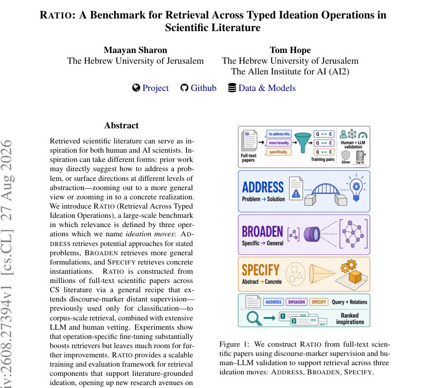
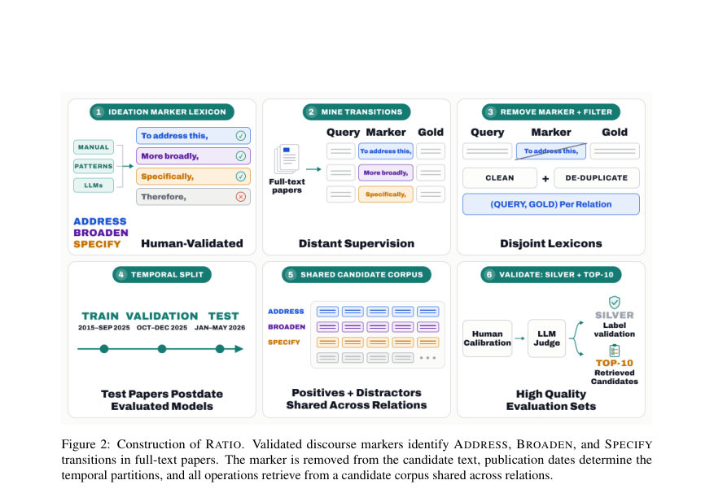
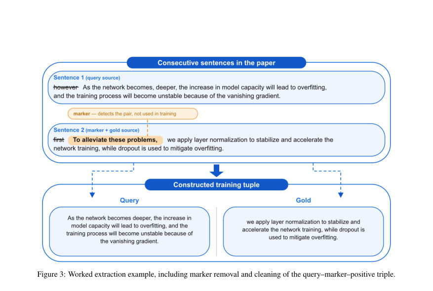

# RATIO: A Benchmark for Retrieval Across Typed Ideation Operations in Scientific Literature

- **게시일:** 2026-08-30
- **arXiv:** [2608.27394v1](http://arxiv.org/abs/2608.27394v1) · [PDF](https://arxiv.org/pdf/2608.27394v1)
- **저자:** Maayan Sharon, Tom Hope
- **분야:** cs.CL, cs.IR
- **선정 점수:** 3.53
- **선정 이유:** 최근성 0.5, 인용 영향 0.0 (인용 0회), 저자 영향 0.0 (최고 h-index 0), AI 주제 적합성 2.3, 개발자 관심 0.0, 학술 신호 0.8, 오픈 웨이트·주요 연구조직 신호 0.0

[← 2026-08-30 목록으로 돌아가기](../daily/2026-08-30.html)

<!-- paper-visuals:start -->
## 주요 Figure

> 원문 PDF에서 실제 Figure 캡션과 그림 영역이 함께 확인된 자료만 자동 추출했다.

*Figure · 원문 PDF 1쪽 · Figure 1: We construct RATIO from full-text scien-*

*Figure · 원문 PDF 3쪽 · Figure 2: Construction of RATIO. Validated discourse markers identify ADDRESS, BROADEN, and SPECIFY*

*Figure · 원문 PDF 15쪽 · Figure 3: Worked extraction example, including marker removal and cleaning of the query–marker–positive triple.*

<!-- paper-visuals:end -->

## 한 문장 요약

과학 문헌에서 ‘문제에 대한 해결 제안(ADDRESS)’, ‘더 일반화된 서술(BROADEN)’, ‘구체적 사례 제시(SPECIFY)’의 세 가지 발상(ideation) 연산에 따른 관련성 판단을 목표로, 문장초기 담화표지(disourse markers)를 이용한 대규모 원격 지도학습 파이프라인과 LLM·인간 검증을 결합해 RATIO 벤치마크와 평가 절차를 제시한다.

## 해결하려는 문제

기존 학술 검색/검색성 평가 벤치마크는 주로 주제적·정보적 관련성(문서가 질의에 답하는지)을 다루며, '문헌이 발상(inspiration)으로 어떤 역할을 하는가(문제를 직접 해결하는 제안인지, 더 일반화된 관점인지, 구체적 사례인지)' 같은 역할별(relation-conditioned) 관련성은 다루지 못한다. 이로 인해 문헌기반 연구 보조 시스템이 제공해야 할 다양한 ‘아이디어 이동(ideation moves)’을 포착하는 검색 구성요소를 학습·평가할 수 없고, 대규모·정확한 감독(supervision)을 얻는 방법과 평가 절차도 부재하다.

## 핵심 기여

- 세 가지 명시적 ideation 연산(ADDRESS, BROADEN, SPECIFY)을 정의하고, 이들에 따라 문헌 문장 수준에서 관련성을 규정하는 새로운 문제 설정을 제시했다.
- 문장초기 담화표지(discourse markers)를 이용한 대규모 원격(distant) 감독 파이프라인을 제안하여, 기존의 마커기반 약지도(supervision)를 문장쌍 분류에서 코퍼스 규모의 관계조건화(relation-conditioned) 검색으로 확장했다.
- 수백만 편의 전체 텍스트 논문에서 마커 기반으로 자동 수집하고 LLM·인간 검증을 결합해 RATIO 데이터셋을 구축(총 3,017,476 쌍: SPECIFY 2,779,177, ADDRESS 222,707, BROADEN 15,592)하고, 시간적 분할과 휴먼-교정된 ‘실버’ 테스트셋(17,579 쿼리)을 제공했다.
- 운영자(operation)별(각 연산 전용) 대조적 학습(contrastive fine-tuning)이 범용 사전학습 임베딩·BM25 대비 유의미한 성능 향상을 가져오나 절대 성능은 제한적임을 실험적으로 보였고, Top-K 수준에서 LLM·인간 판정으로 추가적인 유효한(발상으로서의) 후보들이 발견됨을 보였다.

## 접근 방법

* 데이터 구축: Semantic Scholar 기반 전체 텍스트 말뭉치를 문장으로 분절하고 인접 문장 쌍(si, si+1)을 검사해 두 번째 문장이 '마커 ℓ + 본문 g' 형태일 때 (q=si, g=si+1 with marker removed)로 추출한다.
* 세 관계별 마커 사전 Lr는 수작업 빈도 분석(상위 400개 선별 후 전문가 검사), LLM(Claude/Gemini/GPT-5.4)으로 생성·라벨링(strong-true만 유지), Hearst영감을 받은 템플릿 기반 패턴 확장, 임베딩 기반 이웃 확장 단계를 거쳐 생성하고(최종 총 마커 후보 4,252개, 이 중 코퍼스에서 실제로 발화된 마커 809개), 마커별로 관계를 고유하게 할당해 고정밀 원격지도 라벨을 얻는다.
* 필터링 후 약 3M 쌍을 획득하고 중복 제거 및 시간적 분할(학습: 2015–2025-09-30, 검증: 2025-10-01~12-31, 테스트: 2026-01-01~2026-05-05)을 적용했다.
* 후보 풀은 각 분할마다 관계공유(candidate pool)로 구성(학습 후보 13,787,834, 검증 361,172, 테스트 404,371).
* 실버 평가세트 구축: 표본(10k SPECIFY 균형표집 + 모든 ADDRESS/BROADEN 테스트 쌍)을 LLM 판정 프롬프트 4–6개 중 인간과 일치율이 높은 2개로 보정해 2단계 LLM 필터링과 휴먼 캘리브레이션으로 최종 17,579 쿼리 확보.모델·학습: 각 연산별 전용(retriever sr) dense retriever를 학습(ALL-MPNET-BASE-V2, MODERNBERT-EMBED-LARGE, STELLA-EN-1.5B-V5 및 BM25 비교)하고, Multiple Negatives Ranking Loss(라이브러리 기본 scale s=20, τ=0.05)로 인-batch negative를 이용한 관계별 대조학습을 수행했다.
* 훈련시 하드 네거티브로 비표적(distractor) 마커에서 추출한 문장들을 후보 풀에 포함시켜 쉬운 음성 샘플을 제거한다.
* 검증·평가: 자동 단일-정답 지표(Recall@k, MRR@k)와 함께 Top-10 후보를 LLM(및 인간 캘리브레이션된 프롬프트)으로 판단해 false-negative 문제를 측정하고, 순위목록 쌍(A/B)을 LLM이 참조 없이 비교하는 영감(inspiration potential) 평가도 수행했다.훈련·자원: BROADEN은 단일 GPU, ADDRESS·SPECIFY는 4 GPU로 총 약 1,800 GPU시간(본문 명시) 소요.

## 주요 결과

- 데이터셋 규모 및 구성: 전체적으로 3,017,476 (q,g) 쌍(학습·검증·테스트 분할 포함), 세 관계별 분포는 SPECIFY 2,779,177, ADDRESS 222,707, BROADEN 15,592이며 학습 후보 풀은 13,787,834 문장이다.
- 운영자별 미세조정 효과: ModernBERT-embed-large 추천 접두어(recommended) 기준, 실버 테스트에서 대조학습 전후 MRR@10 변화(일부 수치): SPECIFY MRR@10 26.7 → 46.7 (약 1.75×), ADDRESS 10.2 → 24.5 (약 2.4×), BROADEN 17.3 → 27.3 (약 1.58×). Recall@10(튜닝 후)은 SPECIFY 65.5%, ADDRESS 40.0%, BROADEN 41.4% 등으로 보고되었다(표참조, Table 3).
- Top-K 후보의 인간/LLM 판정: ModernBERT-embed-large(추천 접두어)로 Top-10 후보를 LLM 판단(하드 합의: 두 프롬프트가 모두 수용)한 결과, 튜닝 후 Hit-Rate@10은 SPECIFY 89.0%, ADDRESS 76.5%, BROADEN 29.0%였고(정밀도와 MAP 등 상세값 Table 4), 튜닝 모델은 오프더쉘프 대비 더 많은 수의 accepted 후보를 상위에 올렸다.
- 대체 유효 후보 발견: 튜닝된 ADDRESS 모델의 경우 쿼리의 채굴된 정답(gold)이 Top-10에 없더라도 상위 10개 내에 LLM 판정상 수용되는(유효한) 대체 후보가 존재한 비율이 41.2%였고(시험집합 샘플 결과), 대다수(≈88–90%)의 수용 후보는 쿼리와 다른 논문에서 온 교차-논문(cross-paper) 결과였다. 이는 모델이 단순한 문장연속 복원 대신 질의-조건화된 호환성(match)을 학습했음을 시사한다.

## 한계

- 저자가 명시한 한계: 현재 RATIO는 (1) 인접 문장(pairwise adjacent)으로만 관계를 추출해 '비인접(장거리) 관계'를 포함하지 않음, (2) 컴퓨터과학(CS) 전체 텍스트에 초점을 맞추어 도메인·언어 확장 필요성, (3) 보다 광범위한(비용이 큰) 인간 주석 수집과 엔드-투-엔드 시스템 통합은 향후 과제임을 명시한다.
- 본문에서 합리적으로 확인되는 추가 한계: (a) 라벨 불균형 — SPECIFY가 전체의 대부분(약 2.78M 대 BROADEN 15.6k)으로 데이터 불균형이 크고 BROADEN은 훈련 데이터가 매우 적어 성능·일반화 여지가 제한된다. (b) 원격지도(마커 기반) 소음성 — 마커를 제거한 후에도 표면 형태에 의존한 신호·장르 편향(예: ADDRESS는 명시적 대명사(anaphor) 의존 비중이 높음)이 존재하며 LLM을 이용한 마커 확장·검증이 LLM 문체 편향을 도입할 수 있다. (c) 후보 풀 제약 — 후보 풀은 원문 전체 문장의 완전한 포괄이 아니며(구성 방식상 일부 마커·영역에 편중), 오로지 문장단위 인접추출 방식은 문장 외 맥락·표·수식 등 추가 정보에 의존하는 사례를 놓칠 수 있다. (d) 평가 한계 — 실버 테스트·Top-K 판정은 LLM 판정에 크게 의존하며(비록 인간 캘리브레이션을 거침), 완전한 인간 대규모 주석으로 검증된 골드표준은 아니므로 잔여 오차 가능성이 있다.

## 개발자 관점

- 재현 및 데이터 구축: 전체 텍스트 말뭉치에서 문장단위 분절 후 '문장2 = 마커 + 본문' 형태의 인접 쌍을 추출하라. 마커 사전은 수작업 빈도검사 → LLM 확장(여러 모델) → 템플릿 기반 확장 → 전문가·LLM 필터의 다단계로 구성하라. 마커는 문장초기 콤마로 구분되는 선두 스팬(≤7단어)을 기준으로 수집하면 실용적이다.
- 학습 설계: 관계별(hard routing) 전용 retriever를 학습시키고 in-batch negatives(동일 연산에서 다른 쿼리의 positives)를 활용한 contrastive loss를 사용하면 연산 특이 신호를 잡아내는 데 유리하다.
- 후보 풀·음성샘플링: '비표적' 담화마커로부터 나온 문장들을 후보 풀의 하드 네거티브로 포함해 쉬운 음성 부하를 줄이면 실제 검색 상황에 가까운 학습·평가가 가능하다.
- 평가·검증: 원격지도 데이터의 노이즈를 보완하기 위해 LLM 프롬프트를 인간 판정자와 캘리브레이션하고, Top-K 수준에서 LLM·인간 판정을 도입해 false-negative(발견되지 않은 타당한 후보)를 측정해야 한다.
- 운영·비용·성능: 대규모 전이학습된 임베딩 백본을 운용하면 성능 향상 여지가 있으나 튜닝에 상당한 연산비용(본문: 총 약 1,800 GPU시간)이 드는 점을 고려해야 하며, 데이터 불균형(BROADEN의 소량 학습 데이터)·LLM 기반의 검증의 잠재적 편향에 대비한 추가 인간 주석·도메인 확장이 필요하다.

**근거 범위:** 이 분석은 제공된 논문 PDF 본문(본문 및 부록 텍스트)을 근거로 작성했다. 수치(데이터셋 크기, 평가 지표, 모델·하이퍼파라미터 요약 등)는 본문 표와 설명에서 직접 인용하였다. PDF의 일부 구현 세부(예: 내부 코드·정밀 하드웨어 로그)는 본문에 명시되지 않아 기술하지 않았으며, 추가 세부는 논문의 부록·공개 저장소를 참조해야 한다.
