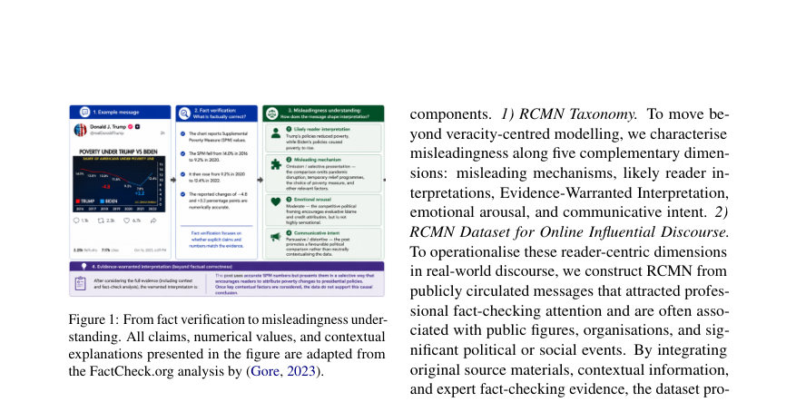
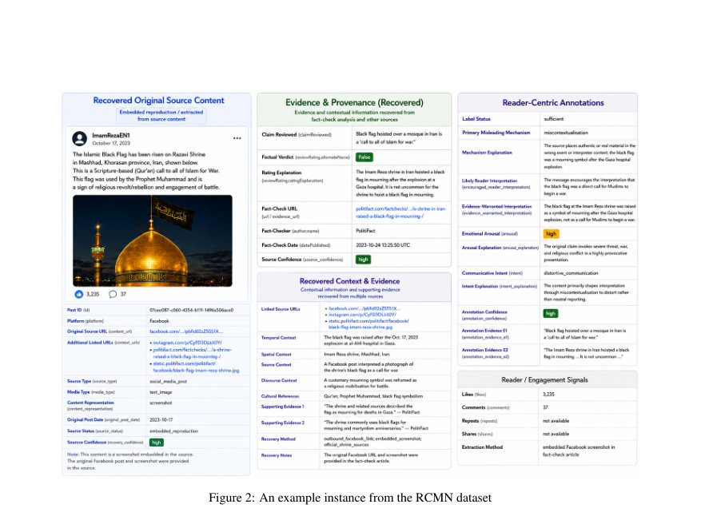
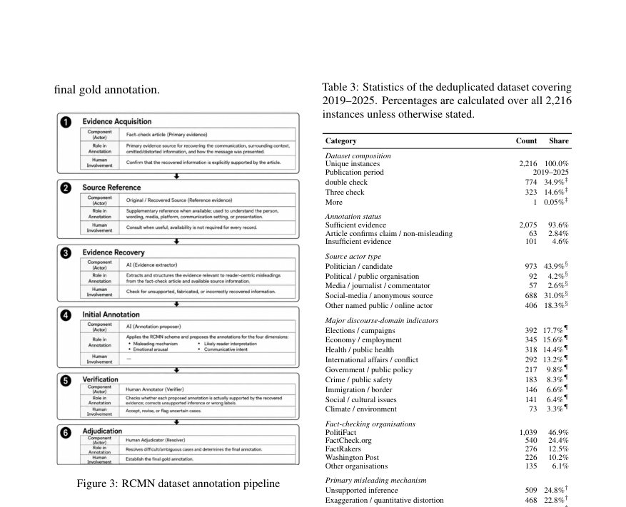

# RCMN: Understanding Misleadingness in Influential Public Discourse

- **게시일:** 2026-08-29
- **arXiv:** [2608.27358v1](http://arxiv.org/abs/2608.27358v1) · [PDF](https://arxiv.org/pdf/2608.27358v1)
- **저자:** Peiling Yi
- **분야:** cs.CL, cs.AI
- **선정 점수:** 4.26
- **선정 이유:** 최근성 0.7, 인용 영향 0.0 (인용 0회), 저자 영향 0.0 (최고 h-index 0), AI 주제 적합성 2.6, 개발자 관심 0.2, 학술 신호 0.7, 오픈 웨이트·주요 연구조직 신호 0.0

[← 2026-08-29 목록으로 돌아가기](../daily/2026-08-29.html)

<!-- paper-visuals:start -->
## 주요 Figure

> 원문 PDF에서 실제 Figure 캡션과 그림 영역이 함께 확인된 자료만 자동 추출했다.

*Figure · 원문 PDF 2쪽 · Figure 1: From fact verification to misleadingness under-*

*Figure · 원문 PDF 6쪽 · Figure 2: An example instance from the RCMN dataset*

*Figure · 원문 PDF 8쪽 · Figure 3: RCMN dataset annotation pipeline*

<!-- paper-visuals:end -->

## 한 문장 요약

RCMN은 독자의 관점에서 허용되는 해석과 증거로 정당화되는 해석의 차이를 기준으로 오해 유발(misleadingness)을 다섯 차원으로 정형화하고, 이를 근거로 영향력 있는 공적 담론을 복원·주석화한 데이터셋과 경량화된 claim+context 표현에서 오해 단서를 회복할 수 있는지 검증한 벤치마크를 제시한다.

## 해결하려는 문제

기존 연구는 주로 개별 주장 수준의 사실성(verification)에 집중해 담론이 어떻게 프레이밍·생략·재맥락화되어 독자의 해석을 왜곡하는지를 포착하지 못한다. 또한 독자 중심의 오해 유발을 operationalise하려면 왜곡 메커니즘, 독자에게 유발되는 해석, 증거로 정당화되는 해석, 감정 각성, 전달 의도 등 복합적이고 맥락 의존적인 차원을 필요로 하며, 이를 평가하려면 광범위한 증거 검색과 다중모달 추론이 필요해 비용과 확장성에서 한계가 있다. 본 논문은 (1) 어떻게 오해가 생성되는지(메커니즘), (2) 메시지가 독자로 하여금 어떤 해석을 하게 만드는지, (3) 제한된(경량화된) claim+context 표현으로도 독자 수준의 오해 단서를 회복할 수 있는지를 묻는다.

## 핵심 기여

- RCMN Taxonomy: 오해 유발을 '유도 메커니즘(7개+비오해)', '독자가 받을 가능성 있는 해석', '증거로 정당화되는 해석', '감정 각성(저·중·고)', '전달 의도(정보·설득·왜곡)'의 5개 차원으로 체계화한 분류 체계.
- RCMN Dataset: Fact-Check Insights를 출발점으로 사실검증 기사와 원본 출처를 복원해 2019–2025 기간의 2,216개 사례를 증거 기반으로 주석화(증거가 충분한 인스턴스 2,075개, 93.6%).
- Annotation pipeline: GPT-5.6 Sol을 활용한 증거 추출 보조와 인간 검증·중재(S1–S6)를 결합해 증거 근거의 주석을 생성·검증하는 감사가능한 파이프라인을 제시.
- Benchmark 및 실험: 경량화된 입력 X_limited(claim, person, location, time, event, source setting, context)만을 제공하는 조건에서 5개 대형 생성/멀티모달 모델(Qwen3-VL-8B, DeepSeek-V4-Flash, Gemma-4-12B, GPT-5.6 Sol, Claude Fable 5)을 동일 프로토콜로 평가해 어떤 차원이 회복 가능한지 분석.
- 실증적 발견: 오해는 조작적 허위(fabrication)보다 '근거 없는 추론(unsupported inference)', '과장', '생략' 등 다양한 메커니즘에 의해 자주 발생하며, 감정 각성과 '왜곡적 의도(distortive intent)'가 오해와 강하게 연관됨을 실증.

## 접근 방법

* 방법은 세 부분으로 구성된다.
* (1) RCMN 분류체계: 본문에서 제시한 5차원(메커니즘, likely reader interpretation, evidence-warranted interpretation, emotional arousal, communicative intent)을 정의하고 각 카테고리의 세부 레이블을 규정했다.
* 메커니즘은 fabrication/alteration, miscontextualisation, omission/selective presentation, misattribution, exaggeration/quantitative distortion, unsupported inference, not misleading로 구성된다.
* (2) 데이터 구축 및 주석화: Fact-Check Insights의 개별 레코드를 출발점으로 대응 fact-check 기사와 아웃바운드 링크를 따라 원본 게시물·이미지·비디오를 복원(recovery)하고, S1~S6 단계를 통해 증거수집(S1), 원본 참조(S2), AI 보조 증거 추출(GPT-5.6 Sol)(S3), 초기 주석(S4), 인간 검증(S5), 그리고 중재(S6)를 수행해 최종 골드라벨을 생성했다.
* 주석은 증거 근거를 필수로 기록하며 사실성(veracity) 판정과는 분리해 '독자 수준의 해석 차이(interpretive divergence)'를 목표로 한다.
* (3) 벤치마크 설정: X_full(원본 멀티모달 콘텐츠·fact-check 기사·구체적 증거)을 이용해 골드 Y를 만들고, 추론 시 모델에는 저비용 표현 X_limited(표본 예시: claim 텍스트, 화자, 시간·장소·사건, 소스 설정, 요약된 맥락)만 제공한다.
* 분류(메커니즘, arousal, intent)는 Macro-F1을 사용하고, likely reader interpretation 생성은 ROUGE-L(lexical)과 의미수준 평가(fully/partial/non-equivalent)로 평가한다.
* 평가 모델 설정: 오픈 모델은 4-bit NF4 양자화, greedy decoding, max 350 tokens; API 모델은 각사 권장 중간 reasoning 세팅을 사용.
* 동일 2,216 인스턴스를 0-shot으로 평가했다.

## 주요 결과

- 데이터셋: 총 2,216개 유니크 인스턴스(2019–2025). 증거가 충분하다고 판단된 인스턴스 2,075개(93.6%). 원본-증거가 양측으로 존재하는 경우 2,117개(95.5%).
- 도메인·출처: 발신자 유형에서 정치인/후보자가 973건(43.9%), 소셜미디어/익명 출처 688건(31.0%). 주요 주제: 선거/캠페인 392건(17.7%), 경제/고용 345건(15.6%), 공중보건 318건(14.4%).
- 주요 오해 메커니즘(메커니즘이 할당된 2,052건 기준): unsupported inference 509건(24.8%), exaggeration/quantitative distortion 468건(22.8%), omission/selective presentation 361건(17.6%), fabrication/alteration 330건(16.1%), miscontextualisation 230건(11.2%), misattribution 154건(7.5%).
- 감정 각성·전달 의도: high arousal 1,228건(55.4%). 전달 의도에서 distortive 1,406건(63.4%), persuasive 699건(31.5%), informative 55건(2.5%). 저자 분석에서 오해 사례는 높은 각성 및 왜곡적 의도와 강하게 연관됨(χ2(2)=51.80, p<0.001, Cramér’s V=0.157).
- 벤치마크(5개 모델, 2,216 인스턴스): 메커니즘 분류는 전반적으로 어려워 Macro-F1 성능이 낮음. 메커니즘 Macro-F1: Claude Fable 5 = 0.520(최고), GPT-5.6 Sol = 0.383, DeepSeek-V4-Flash = 0.333, Gemma-4-12B = 0.206, Qwen3-VL-8B = 0.170. 감정 각성 Macro-F1: GPT-5.6 Sol = 0.643(최고), Claude Fable 5 = 0.586 등. 전달 의도 Macro-F1: GPT-5.6 Sol = 0.607(최고). 전체 차원 평균 Macro-F1: GPT-5.6 Sol 0.544, Claude Fable 5 0.505, DeepSeek 0.429, Qwen 0.331, Gemma 0.319(표 5의 'Mean Macro-F1 across dimensions').

## 한계

- 저자 명시 한계: 데이터셋이 팩트체크 대상으로 선택된 사례에 편향되어 비오해(non-misleading) 사례가 적음(비오해 사례 비율 작음). 이로 인해 'not misleading' 클래스 평가가 어렵고 경량 표현에서 비오해-오해 구별 능력 측정이 제한된다.
- 저자 명시 한계: 주석은 AI 보조와 인간 검증을 결합했으나 likely interpretation, arousal, intent 등은 해석적(subjective) 요소가 있어 완전한 독자 반응을 대변하지 못함. 라벨은 '증거 기반의 참조 주석'으로 해석해야 한다.
- 저자 명시 한계: 원본 멀티모달 자료가 항상 복원되지는 않으며, 일부 인스턴스는 fact-check 기사에서 재구성된 내용에 의존함(완전한 원본 보존 아님).
- 실험적 제약(본문에서 확인되는 한계): 벤치마크는 의도적으로 X_limited만 제공해 멀티모달 입력(이미지 등)을 포함하지 않았음. 따라서 멀티모달 단서에 의존하는 메커니즘(예: miscontextualisation, 이미지 오용)은 과소평가될 수 있다. 또한 증거 추출 단계에 GPT-5.6 Sol을 활용했으므로 초기 증거 회복 품질이 모델과 파이프라인에 의존함.

## 개발자 관점

- 데이터·주석 재현성: Fact-Check Insights 레코드를 출발점으로 원문·fact-check 기사·아웃바운드 링크를 체계적으로 복원해야 하며, 각 회복 단계(복원 수준, 신뢰도, 출처의 provenance)를 메타데이터로 보관해야 재현 가능성이 확보된다.
- 주석 파이프라인: AI 보조 추출(GPT-5.6 Sol) + 인간 검증(S5) + 중재(S6) 조합은 확장성과 감사가능성을 제공하나, AI 보조 단계 결과를 반드시 원문 근거와 대조해 'AI가 추가한 근거'를 제거하는 검증 절차가 필요하다.
- 모델·인프라 설정: 오픈모델 평가 시 4-bit NF4 양자화와 greedy decoding, max token 제한(350) 같은 세부 설정이 결과에 영향. 구현 시 동일 설정을 맞추지 않으면 비교가 어려우므로 실험 스크립트와 환경을 기록해야 한다.
- 실무적 적용: 경량화된 claim+context 표현은 '사전 분류·우선순위화(저비용 탐지)' 용도로 유용하나, 메커니즘(특히 생략·재배치·증거 외부 의존 사례)을 정확히 판단하려면 추가적 증거 검색 및 멀티모달 분석을 트리거하는 보완적 파이프라인이 필요하다.
- 윤리·안전: 데이터가 정치·민감 주제를 다루므로 연구·배포 시 악용 방지, 민감도 라벨링, 사용자 안내문(용도 제한)을 포함해야 하며 개인 속성 추론 등의 추가 판정은 피해야 한다.

**근거 범위:** 본 분석은 제공된 논문 PDF 본문(본문 텍스트, 표 1–6, 그림 및 주석 파이프라인 설명)을 기준으로 작성했다. 데이터셋 통계(2,216 인스턴스 등), 표 기반 성능 수치(표 5·6)와 본문에 명시된 주석 파이프라인(S1–S6) 및 제한점은 PDF 본문에서 직접 추출했다. PDF 텍스트 추출 과정에서의 OCR/포맷팅 미세 오류 가능성은 있으나 주요 수치와 절차는 본문에서 확인 가능한 범위 내에서 기술되었다.
