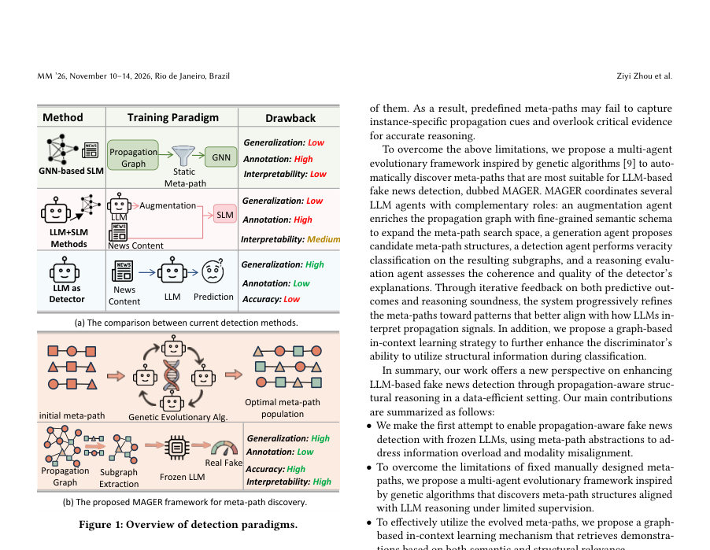
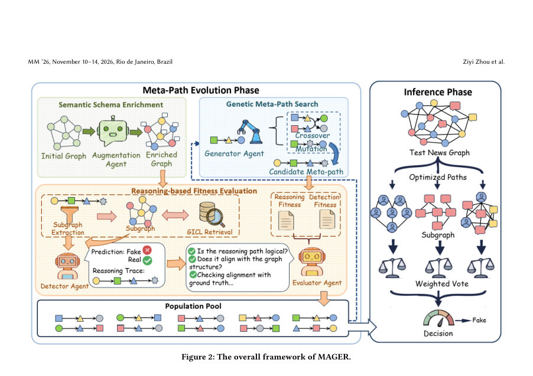
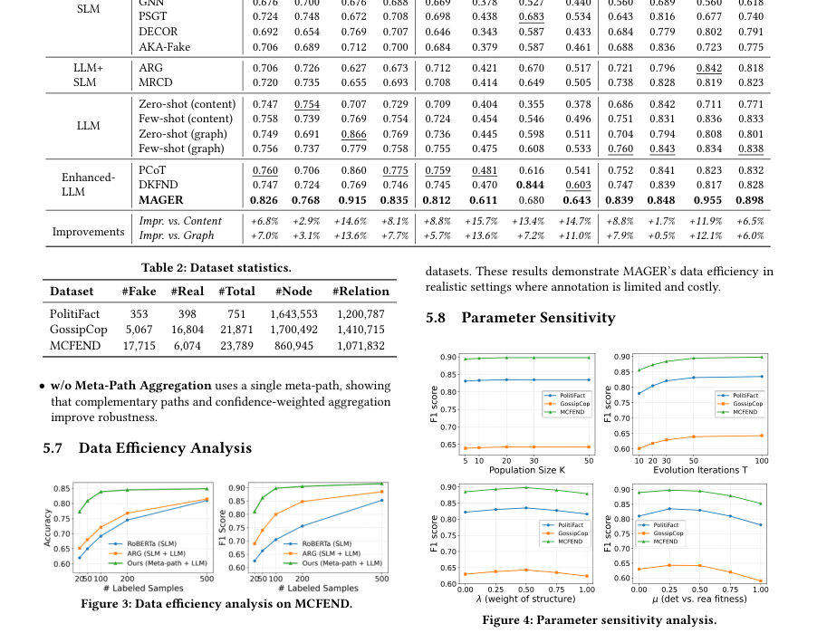

# Reasoning through Evolution: Automatic Meta-path Discovery for LLM-based Fake News Detection

- **게시일:** 2026-09-17
- **arXiv:** [2609.18597v1](http://arxiv.org/abs/2609.18597v1) · [PDF](https://arxiv.org/pdf/2609.18597v1)
- **저자:** Ziyi Zhou, Xiaoming Zhang, Hui Pang, Yuting Zhang, Tiesunlong Shen, Bingyu Yan, Erik Cambria, Litian Zhang
- **분야:** cs.AI, cs.LG
- **선정 점수:** 6.05
- **선정 이유:** 최근성 1.2, 인용 영향 0.0 (인용 0회), 저자 영향 0.0 (최고 h-index 0), AI 주제 적합성 3.0, 개발자 관심 0.8, 학술 신호 0.3, 오픈 웨이트·주요 연구조직 신호 0.8

[← 2026-09-17 목록으로 돌아가기](../daily/2026-09-17.html)

<!-- paper-visuals:start -->
## 주요 Figure

> 원문 PDF에서 실제 Figure 캡션과 그림 영역이 함께 확인된 자료만 자동 추출했다.

*Figure · 원문 PDF 2쪽 · Figure 1: Overview of detection paradigms.*

*Figure · 원문 PDF 4쪽 · Figure 2: The overall framework of MAGER.*

*Figure · 원문 PDF 7쪽 · Figure 3: Data efficiency analysis on MCFEND.*

<!-- paper-visuals:end -->

## 한 문장 요약

복잡한 전파(프로퍼게이션) 그래프를 멀티에이전트 유전진화로 자동 탐색한 메타-패스로 압축해 frozen LLM이 구조 정보를 이용한 가짜뉴스 판별을 수행하도록 하는 MAGER 프레임워크를 제안한다.

## 해결하려는 문제

기존 가짜뉴스 탐지 접근법은 주로 감독 학습 기반의 GNN에 의존하여 많은 라벨 데이터와 제한된 일반화 능력을 요구한다. 반면 LLM은 추론 능력이 우수하지만 원시 전파 그래프를 그대로 입력하면 모달리티 불일치와 정보 과부하가 발생하여 제로샷·저샷 환경에서 구조 인식 추론이 신뢰할 수 없다는 문제를 제기한다. 연구 질문은 복잡한 전파 구조를 LLM 친화적으로 압축·표현하여 라벨이 적은 환경에서 frozen LLM만으로도 구조 기반의 진위 판단이 가능한가이다.

## 핵심 기여

- MAGER: 메타-패스를 자동으로 탐색하는 멀티에이전트 유전진화(multi-agent genetic evolution) 프레임워크를 제안하여 전파 그래프를 LLM 친화적 서브그래프로 압축함.
- 유전진화로 얻은 메타-패스가 정보 과부하와 모달리티 불일치를 완화해 사전 학습된(frozen) LLM이 구조 정보를 이용해 추론하도록 가능하게 함.
- 그래프 인컨텍스트 러닝(graph in-context learning) 전략을 도입해 의미적·구조적으로 유사한 데모스트레이션을 검색·제공함으로써 분류 및 추론 성능을 강화함.
- 데이터 효율적 설정(제로샷/저샷)에서 frozen LLM 단독으로 가짜뉴스 탐지 성능을 실질적으로 향상시킨다고 보고함.
- 프레임워크와 코드(저자 제공 링크)를 공개하여 재현성과 적용 가능성을 제고함.

## 접근 방법

* 논문 본문(초록 기반) 기술을 기준으로 한 접근은 다음과 같다.
* 입력으로 복잡한 전파 그래프를 받고, 멀티에이전트 유전진화 알고리즘을 통해 그래프에서 유익한 '메타-패스'(meta-path)를 자동 탐색한다.
* 이 메타-패스는 원래 그래프를 의미·구조적으로 압축한 서브그래프를 생성하는 데 쓰이며, 이렇게 압축된 표현은 LLM에 투입했을 때 발생하는 모달리티 불일치와 정보 과부하를 줄인다.
* 진화 과정은 메타-패스의 집합을 개체로 다루고, 여러 에이전트가 협력·경쟁하면서 교배·돌연변이 등을 통해 LLM 추론에 최적화된 메타-패스를 찾는다(구체적 적합도 함수·하이퍼파라미터는 본문에서 확인 불가).
* 추론 시에는 압축된 서브그래프를 LLM에 입력하고, 추가로 그래프 인컨텍스트 러닝 모듈이 의미적·구조적으로 유사한 시범(데모)을 검색해 함께 제공하여 LLM의 분류·추론을 강화한다.
* 전체적으로 학습(혹은 탐색) 단계에서는 유전진화로 메타-패스를 최적화하고, 추론 단계에서는 발견된 메타-패스와 인컨텍스트 시범을 이용해 frozen LLM으로 판별을 수행한다.

## 주요 결과

- 저자 주장: 광범위한(Extensive) 실험에서 MAGER가 데이터 효율적 설정에서 frozen LLM 단독 가짜뉴스 탐지 성능을 실질적으로 향상시켰음.
- 논문 초록/본문에서 구체적 데이터셋, 비교 대상 모델(예: 어떤 GNN 또는 다른 baselines), 평가 지표(정확도, F1 등) 및 정량적 수치는 제공되지 않아 확인 불가.

## 한계

- 저자(본문/초록) 명시 한계: 본문(초록)에는 저자가 직접 명시한 한계가 포함되어 있지 않음.
- 본문에서 합리적으로 확인되는 한계: (1) 메타-패스 탐색에 유전진화를 사용하는 만큼 탐색 비용(계산량·LLM 호출 비용)이 클 가능성이 있으며 대규모 그래프·실시간 환경에서의 실용성은 불명확하다. (2) 요약된 서브그래프가 원래 전파 구조의 모든 판별 신호를 보존하는지, 그리고 잘못된/편향된 서브그래프 선택이 판별 성능에 미치는 영향이 어떻게 되는지는 본문에서 상세 수치로 확인되지 않음. (3) 그래프 인컨텍스트 러닝은 유사한 데모 검색 품질에 크게 의존하므로, 적절한 데모 구축·검색이 어려운 도메인에서는 성능 저하가 발생할 수 있다. (4) 실험적 증거(데이터셋 범위, 일반화성, 정량적 개선 폭)가 초록 수준에서만 보고되어 있어 일반화 가능성 및 재현성 측면에서 불확실성이 존재함.

## 개발자 관점

- 재현: 저자가 코드 리포지터리(링크 제공)를 공개했으므로, 우선 리포지터리 기반으로 실험 환경·데이터 전처리·실험 스크립트를 확인해 재현을 시도하라. 본문이 아닌 초록만으로는 적합도 함수·유전 연산자·하이퍼파라미터가 확인되지 않으므로 코드 검토가 필수적이다.
- 구현: 핵심 구현 요소는 (1) 전파 그래프로부터 메타-패스 후보를 생성·표현하는 모듈, (2) 멀티에이전트 유전진화 알고리즘(개체 인코딩, 적합도 평가, 교배·돌연변이), (3) 서브그래프를 자연어/구조화된 프롬프트로 변환해 LLM에 전달하는 인터페이스, (4) 의미·구조 유사도 기반 데모 검색 엔진이다. LLM 호출 비용을 줄이기 위해 로컬 소형 모델로의 프로토타이핑이나 배치화, 캐싱 전략을 권장한다.
- 배포·운영: 추론 시 frozen LLM을 사용하므로 미세조정 비용은 없지만 LLM 호출(특히 유전진화 동안 다수의 후보를 평가)에 따른 비용과 지연이 발생한다. 실시간 요구가 있는 서비스는 메타-패스 탐색을 오프라인에서 완료하고 발견된 메타-패스만을 배포하면 지연을 줄일 수 있다.
- 비용: 유전진화 탐색 과정에서 다수의 LLM 평가가 필요하면 API 기반 LLM 사용 시 비용이 급증할 수 있다. 비용·속도 절감을 위해 평가용으로 경량 평가 모델을 두거나, LLM 호출을 표준화된 적합도 대리 지표로 대체하는 방안을 고려하라.
- 안전성·신뢰성: LLM의 환각(hallucination)과 편향 문제에 유의해야 한다. 메타-패스 기반 압축은 해석 가능성을 일부 제공할 수 있으나, 최종 판별 근거를 로그·추론 텍스트와 함께 저장해 감사 가능하도록 설계하라.

**근거 범위:** 이 분석은 제공된 논문 PDF 본문 추출에 실패하여(HTTPError) 초록(본문 복사본) 내용에 기반해 작성되었다. 따라서 아키텍처의 상세 구현(적합도 함수, 하이퍼파라미터, 유전연산 세부절차), 실험 데이터셋·비교 대상·평가지표·정량적 성과 수치 등 본문에만 기술되어 있을 가능성이 높은 세부사항은 확인할 수 없었다. 주요 주장과 방법론은 초록에서 직접 인용·요약했으며, 정량적 결과와 일부 한계·실험적 범위는 본문 확인이 필요하다.
