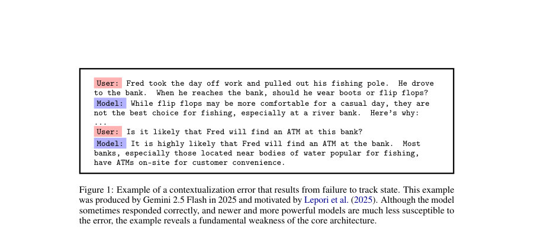
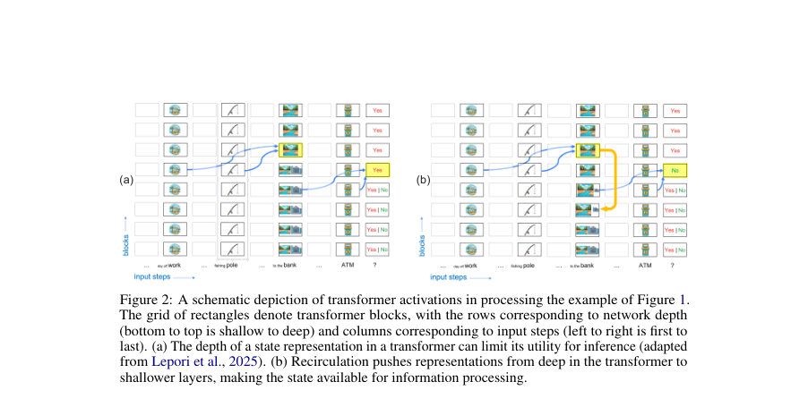
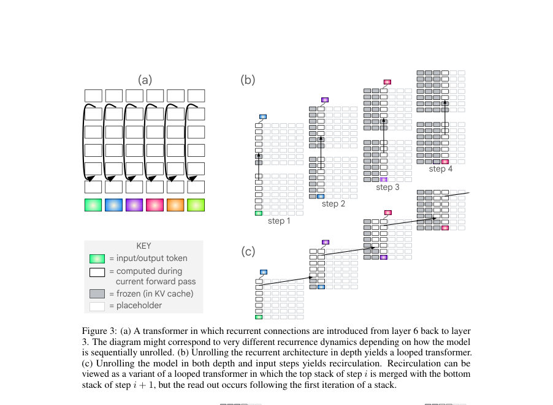

# Recirculation

- **게시일:** 2026-08-19
- **arXiv:** [2608.17981v1](http://arxiv.org/abs/2608.17981v1) · [PDF](https://arxiv.org/pdf/2608.17981v1)
- **저자:** Michael C. Mozer, Shoaib Ahmed Siddiqui, Danny Sawyer, Sunny Sanyal, Rosanne Liu
- **분야:** cs.LG
- **선정 점수:** 7.12
- **선정 이유:** 최근성 0.8, 인용 영향 0.0 (인용 0회), 저자 영향 1.7 (최고 h-index 17), AI 주제 적합성 2.5, 개발자 관심 0.6, 학술 신호 0.6, 오픈 웨이트·주요 연구조직 신호 1.1

[← 2026-08-19 목록으로 돌아가기](../daily/2026-08-19.html)

<!-- paper-visuals:start -->
## 주요 Figure

> 원문 PDF에서 실제 Figure 캡션과 그림 영역이 함께 확인된 자료만 자동 추출했다.

*Figure · 원문 PDF 2쪽 · Figure 1: Example of a contextualization error that results from failure to track state. This example*

*Figure · 원문 PDF 3쪽 · Figure 2: A schematic depiction of transformer activations in processing the example of Figure 1.*

*Figure · 원문 PDF 5쪽 · Figure 3: (a) A transformer in which recurrent connections are introduced from layer 6 back to layer*

<!-- paper-visuals:end -->

## 한 문장 요약

사전학습된 트랜스포머에 추론 시 recurrent 연결을 주입해(깊은 층의 활성화를 얕은 층으로 일부 누출) 상태 추적 능력을 향상시키는 'recirculation' 기법을 제안하고, 학습 없이도 perplexity와 여러 다운스트림 정확도를 크게 개선할 수 있음을 실험으로 보였다.

## 해결하려는 문제

표준 피드포워드 트랜스포머는 층(depth)에 의해 직렬(state-update) 용량이 제한되어 있어 문맥적 의미의 지연된 정착(delayed contextualization)이나 상태 추적 실패(예: 다의어 'bank'의 의미 반전 무시)가 발생한다. 이로 인해 장문 문맥, 다중 턴 대화, 추론/작업들에서 일관성·추론 성능 저하가 생긴다. 기존의 해결책(사전학습된 recurrent transformer로 재학습, chain-of-thought 등)은 비용이 크거나 목적(복잡한 추론)과 혼동될 수 있으며, 추론 시점(inference-time)에 적용 가능한, 학습비용이 낮은 아키텍처적 개선이 필요하다.

## 핵심 기여

- 추론 시점에서 동작하는 아키텍처 수정법 'recirculation'을 제안: 각 입력 토큰 처리 후 깊은 층의 활성화 일부를 얕은 층으로 누출하여 반복적(stateful) 업데이트 효과를 달성함.
- recirculation의 수학적 정식화(혼합식 z_{t+1}=α f(source) + β destination 및 소스 재정규화)를 제시하고, looped transformer(깊이-순환)와의 차이(깊이/시간 양쪽으로의 재귀성)를 명확히 구분함.
- 학습 없이 off-the-shelf 모델에 적용해 Gemma3 계열 등에서 언어모델링 perplexity와 생성/추론 과제 정확도를 크게 향상시킨 정량적 결과를 보고함(예: 기본 recirculation과 적응형(adaptive) 버전 비교).
- α, β를 토큰 조건부 벡터로 생성하는 소형 MLP만을 학습하는 'adaptive recirculation'을 제안해 원본 모델 가중치는 고정한 채 더 큰 이득(학습-불요 방식 대비)을 달성함.
- recirculation의 동작 특성(어떤 층 조합이 좋은지, 토큰 위치·품사별 효과, 온도 조정·looping과의 차이, 정규화·ramp 필요성 등)을 광범위한 실험으로 분석함.

## 접근 방법

* Recirculation은 각 입력 스텝마다(논문에서 주로 한 추가 반복, 즉 한 번 더 스택을 돌리는 변형을 사용) 소스층(s)의 활성화 일부를 대상층(d)에 혼합하는 추론-시점 연산이다.
* 공식적으로 z_{t+1,t,d} = α f(z_{t,t,s}\|d,t) + β z_{t,t,d} (β = 1 − α를 기본으로 사용)이며, f는 소스 벡터를 대상 벡터의 L2 노름에 맞춰 재정규화하는 함수다.
* 구현상 주요 요소는 (1) 소스·대상 층 인덱스 탐색(grid search)으로 적절한 {s,d} 선택, (2) 혼합계수 α(때로는 β≠1−α가 필요함) 및 재정규화(norm-ratio) 또는 다른 정규화 스킴, (3) 초기 토큰에 대해 α를 선형 ramp로 올리는 처리(특히 Gemma3 1B에서 유해성을 막기 위함), (4) 한 추가 반복(r=1) 변형을 기본으로 실험을 진행.
* Recirculation은 looped transformer와 달리 시간(step)과 깊이(depth) 쪽 모두에 상태가 투사되며(따라서 동일 층에 z(t)와 z(t+1)을 보관 가능), 전체 문서(prefill) 단계에서는 순차적(병렬 불가) 처리가 필요해 prefill 비용이 증가한다.
* Adaptive recirculation은 소형 MLP를 학습해 각 토큰에 대해 α, β를 벡터값으로 예측하도록 하며(입력: 소스와 대상 임베딩 연결), 원본 LLM 가중치는 고정한 채 BPTT로 MLP만 학습한다.
* 실험 대부분은 one-iteration recirculation을 사용했고, α·{s,d}는 데이터셋 기반 튜닝을 통해 선택되었다.

## 주요 결과

- 기본 recirculation(Gemma3 1B PT, 고정 α=0.15 등 설정)은 언어모델링 데이터셋 10종에서 대부분의 데이터셋에 대해 perplexity를 감소시켰고(Table 1), 예: arXiv에서 1B 모델 baseline ppl 19.10 → recirc 16.54 (13.99% 감소). 모델 스케일과 데이터셋에 따라 1B·4B에서 최대 약 16% 수준, 12B에서 일부 데이터셋에 대해 최대 35%의 감소를 보임.
- 기본 recirculation의 평균 이득은 Gemma3 1B PT에서 약 8.5% perplexity 감소였으나, adaptive recirculation(토큰-조건부 벡터 α,β MLP 학습)은 동일 실험군에서 평균 23.0% perplexity 감소로 개선됨(논문 Figure 13).
- recirculation은 softmax 온도 조정과는 다른 효과를 보였음: Gemma3 1B에서 온도만 조정(1.2) 시 perplexity 8.48% 감소, recirculation 단독 14.21% 감소, 둘 결합 시 약 19.55% 감소로 거의 가법적 효과를 보임(따라서 단순 샤프닝으로 환원 불가).
- 다운스트림 생성/추론 성능 향상: Gemma3 4B PT에서 GSM8k(제로샷 chain-of-thought) pass@1 정확도가 baseline 29.3% → recirculation 30.6% → adaptive 35.5%로 증가(absolute +6.2pp, 상대 약 +21%). 논문은 adaptive가 GSM8k에서 pass@1·pass@128 각각에서 에러율을 8.8%·20.9% 감소시켰다고 보고함.
- 간단한 instruction-following 태스크에서 recirculation은 Gemma3 4B IT의 오류율을 약 25% 감소시키고 12B IT에서는 약 75% 감소시키는 등(하이퍼파라미터 튜닝시 더 큰 향상) 성능 개선을 보였음(Section 4.5.1). 여러 싱글-토큰 벤치마크(ARC, MMLU 등)에서는 약간의 이득 또는 무해한 변화가 다수였음(Table 2).

## 한계

- 저자가 명시한 한계: (1) 최적 {source,destination,α,β} 하이퍼파라미터는 데이터셋·태스크에 따라 달라져 자동화·일반화가 필요함; (2) 모델 계열 의존성—Gemma 계열(Peri-LN, 학습 절차)이 특히 친화적일 가능성이 있으며 다른 가족은 추가 튜닝이 필요함; (3) 정규화(소스 재스케일링 등)가 중요하며 최적 스킴은 모델마다 다름; (4) prefill 단계에서 토큰별 순차 처리가 필요해 대규모 컨텍스트에서 계산 비용이 커짐(블록 단위 recirculation으로 완화 가능); (5) 본문에서 실험한 것은 대부분 r=1(한 번의 추가 반복)이며, 여러 반복·다중 경로 등은 미검증.
- 본문에서 확인되는 추가 제약(저자가 직접 언급하지는 않음): (1) Gemma3 1B에서는 초기(초반) 토큰에 대해 recirculation이 해를 줄 수 있어 ramping을 적용해야 함—즉 적용 범위·정책 설계가 필요함; (2) 일부 데이터셋(예: Lambada)에서는 recirculation이 성능을 악화시키거나 차이를 보이지 않음; (3) looped transformer나 단순 온도 조정과는 다른 작동 원리이나, 다른 아키텍처·스케일에서의 일관된 이득 보장은 불확실함; (4) adaptive recirculation은 학습 데이터 선택에 민감하여(예: MMLU로 학습시 넓게 일반화되지만 다른 소규모 데이터셋으로 학습하면 성능 하락) 실용적 적용에는 주의가 필요함.

## 개발자 관점

- 재현·하이퍼파라미터: 먼저 소스·대상 층(s,d) 그리드 탐색과 α 스윕을 수행해 지역적으로 좋은 조합을 찾을 것. 논문에서 Gemma3의 최적 예시는 1B:{11→4}, 4B:{18→9}, 12B:{35→16}임(튜닝셋 기반).
- 정규화·ramp: 소스 벡터를 대상 벡터 L2 노름으로 재스케일하는 norm-ratio 방식이 안정적 결과를 제공함. 작은 모델(예: Gemma3 1B)은 초반 토큰에 대해 α를 단계적으로 올려(ramp)야 해를 줄일 수 있음.
- 성능·비용 트레이드오프: 생성 단계(autoregressive decoding)에서는 추가 지연이 거의 없지만(병렬 하드웨어에서 두 스택 병렬화), prefill(문맥 처리) 단계는 토큰별 순차 처리를 요구하므로 대규모 컨텍스트에선 비용이 커짐. 실서비스 적용 시 prefill 비용을 고려해 블록 단위 recirculation(K 토큰 단위 병렬화) 도입 검토가 필요함.
- 적응형 옵션: 전체 LLM을 미세조정하는 대신 소형 MLP로 토큰-조건부 벡터 α,β만 학습하는 adaptive recirculation은 효율적이며 과적합 위험이 낮음. 구현 시 MLP 입력으로 소스·대상 임베딩을 concat하고 sigmoid 출력으로 [0,1] 범위 α·β를 생성, 초기값을 α≈0.1·β≈0.9로 설정해 소량(수백 문서) 데이터로도 빠르게 학습 가능(논문은 100 steps, batch 32 등 사용).
- 안정성·모니터링: recirculation은 내부 표현을 '누출'하므로 표현을 OOD로 밀어낼 위험이 있음. 적용 시 early-token 해악, 특정 품사·위치·태스크에서의 효과 편향(예: adverb/adjective/verb에서 더 큼)을 모니터링하고, 필요 시 β를 1로 두는 비대칭 혼합 등 안전장치를 고려할 것.

**근거 범위:** 이 분석은 제공된 논문 PDF 본문(본문 및 부록)을 근거로 작성되었다. 표와 수치(예: Table 1, Figure 12, Figure 13, Section 4.6)의 값과 저자의 한계·방법 기술은 PDF 본문에서 직접 인용·요약하였다. PDF 텍스트는 전반적으로 완전했으나 도식·세부 코드·추가 실험 로그 등은 본문에 없는 경우가 있어 구현 세부(예: 블록 단위 K 값의 최적화, 하드웨어별 연산비용 정량 등)는 본문에 근거해 재구성하지 않았다.
