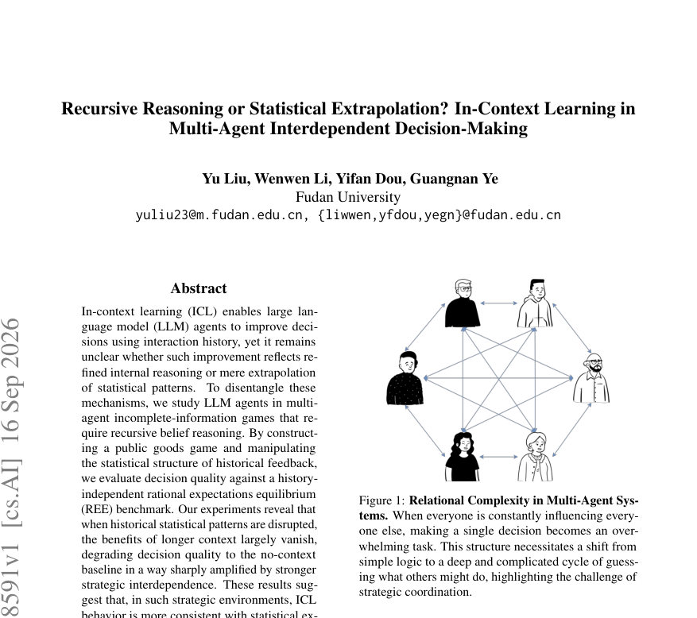
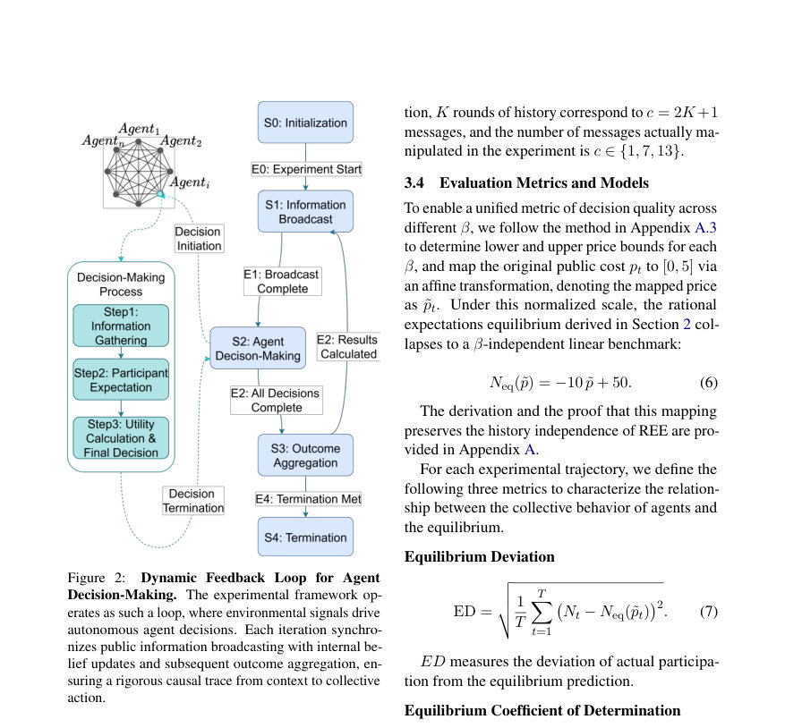
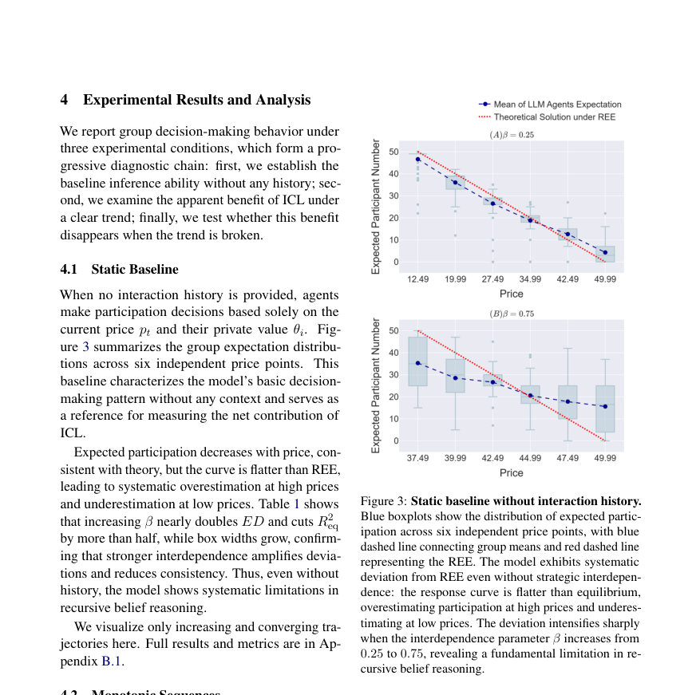

# Recursive Reasoning or Statistical Extrapolation? In-Context Learning in Multi-Agent Interdependent Decision-Making

- **게시일:** 2026-09-17
- **arXiv:** [2609.18591v1](http://arxiv.org/abs/2609.18591v1) · [PDF](https://arxiv.org/pdf/2609.18591v1)
- **저자:** Yu Liu, Wenwen Li, Yifan Dou, Guangnan Ye
- **분야:** cs.AI, econ.GN
- **선정 점수:** 5.45
- **선정 이유:** 최근성 1.2, 인용 영향 0.0 (인용 0회), 저자 영향 0.0 (최고 h-index 0), AI 주제 적합성 3.0, 개발자 관심 0.2, 학술 신호 1.0, 오픈 웨이트·주요 연구조직 신호 0.0

[← 2026-09-17 목록으로 돌아가기](../daily/2026-09-17.html)

<!-- paper-visuals:start -->
## 주요 Figure

> 원문 PDF에서 실제 Figure 캡션과 그림 영역이 함께 확인된 자료만 자동 추출했다.

*Figure · 원문 PDF 1쪽 · Figure 1: Relational Complexity in Multi-Agent Sys-*

*Figure · 원문 PDF 4쪽 · Figure 2: Dynamic Feedback Loop for Agent*

*Figure · 원문 PDF 5쪽 · Figure 3: Static baseline without interaction history.*

<!-- paper-visuals:end -->

## 한 문장 요약

ICL이 LLM 에이전트의 의사결정 개선이 재귀적 신념 추론인지 통계적 외삽인지 구분하기 위해 공개재(public goods) 게임에서 역사적 피드백의 통계구조를 조작하고, 역사독립적 합리적 기대균형(Rational Expectations Equilibrium, REE)과 비교해 결정품질을 평가한다.

## 해결하려는 문제

기존 연구들은 LLM의 In-Context Learning(ICL)으로 인한 성능 향상이 모델 내부의 개선된 추론 능력(예: 재귀적 신념 추론)을 반영하는지, 아니면 단순히 문맥에 존재하는 통계적 패턴을 외삽한 결과인지 명확히 구분하지 못했다. 특히 다중 에이전트의 불완전정보 게임처럼 상대의 신념과 행동을 반복적으로 고려해야 하는 전략적 환경에서 ICL의 개선 원인은 불명확하며, 이에 따라 ICL의 기계적 메커니즘을 전략적 상호의존성 상황으로 확장해 진단할 필요가 있다.

## 핵심 기여

- ICL 메커니즘 분석을 단일-에이전트·비전략적 과제에서 전략적 다중-에이전트 불완전정보 게임으로 확장함.
- 역사독립적 합리적 기대균형(Rational Expectations Equilibrium, REE)을 ICL이 재귀적 신념추론을 수행했는지 여부를 판별하는 진단 도구로 도입함.
- 공개재(public goods) 게임을 설계하고, 역사적 피드백의 통계적 구조를 조작하는 재사용 가능한 실험 프레임워크를 제안함.
- 실험 결과로서, 역사적 데이터의 통계적 패턴을 교란하면 더 긴 문맥의 ICL 이점이 거의 사라지고, 결정품질이 문맥 없는 베이스라인 수준으로 악화되며, 이러한 효과는 전략적 상호의존성이 강할수록 증폭된다는 경험적 관찰을 보고함.
- 전략적 환경에서 ICL 행동이 재귀적 추론보다는 통계적 외삽에 더 일치한다는 해석을 제시함.

## 접근 방법

* 본문(제공된 텍스트)에 따라 고수준 절차는 다음과 같다.
* 다중 에이전트 불완전정보 공개재 게임을 구성하고, LLM 기반 에이전트들이 과거 상호작용(히스토리)을 문맥으로 받아 의사결정을 수행하도록 설정한다.
* 실험적으로 히스토리의 통계적 구조(예: 행동-보상 관계에 대한 패턴)를 조작하여 '정상적(패턴 보존)' 조건과 '교란(패턴 파괴)' 조건을 만든다.
* 결정의 품질은 역사에 독립적인 합리적 기대균형(REE) 기준과 비교해 평가하며, 문맥 길이(예: 무문맥 대비 장문맥)를 달리해 ICL의 문맥 의존성을 분석한다.
* (모델 아키텍처, 구체적 프롬프트, 모델 크기·하이퍼파라미터, 샘플 수 등 구현 세부사항은 제공된 본문에서 확인되지 않음.)

## 주요 결과

- 히스토리의 통계적 패턴을 교란하면 긴 문맥을 사용한 ICL의 이점이 대부분 사라졌음(문맥 없는(no-context) 베이스라인과 유사한 수준으로 결정품질이 저하됨).
- 문맥 길이에 따른 ICL의 성능 이득 손실은 전략적 상호의존성이 강할수록 더 크게 증폭됨.
- 실험은 공개재 게임을 데이터·무대(환경)로 사용하여 위 효과를 반복적으로 관찰했고, 이를 통해 ICL이 전략적 환경에서는 통계적 외삽에 더 가깝다는 결론을 도출함.

## 한계

- 저자가 명시적으로 밝힌 한계: 제공된 본문(초록만 접근 가능)에는 저자가 직접 기술한 상세 한계가 포함되어 있지 않음(원문 본문 확인 필요).
- 본 논문 실험은 공개재 게임이라는 단일 유형의 전략적 환경에 초점을 맞추므로 다른 종류의 다중-에이전트 게임(예: 경매, 협상, 반복형 게임)에 대한 일반화 가능성은 본문에서 확인되지 않음.
- 실험·재현 관련 구체적 구현(사용한 LLM의 종류·크기, 프롬프트·템플릿, 문맥 길이 정확값, 샘플 수 등)이 제공된 텍스트에 없어 정량적 결과(수치)나 재현 절차를 본문에서 직접 확인할 수 없음.
- 히스토리 통계구조 교란의 구체적 방식과 강도, 그리고 그에 대한 민감도 분석이 본문에서 확인되지 않아 결과의 민감도·강건성에 대한 판단이 제한적임.

## 개발자 관점

- 재현을 위해 반드시 확보해야 할 항목: 사용된 LLM(모델명·버전), 정확한 프롬프트·체인오브생각 유무, 문맥(히스토리) 구성 방식과 길이들, 통계적 패턴 교란의 구체적 절차(데이터 생성·변형 방법), 실험 반복 횟수 및 평가 지표(REE와의 거리 측정 방법).
- 구현·비용: 전략적 다중-에이전트 시뮬레이션에서 문맥 길이를 늘리고 반복 실험을 수행하면 추론 호출수와 토큰 비용이 크게 증가하므로 비용 산정과 샘플 효율성 고려가 필요함.
- 배포·안전성: LLM 에이전트를 전략적 환경에 배치할 때는 문맥에 기반한 통계적 편향을 학습·증폭할 수 있으므로 의도치 않은 전략·사회적 해악(예: 협력 파괴, 조작 가능성)에 대한 안전장치가 필요함.
- 평가 설계: REE 같은 이론적 균형 기준을 도입하면 ICL의 '추론 vs 외삽' 문제를 진단하는 데 유용하지만, 구현 세부사항에 따라 결론이 달라질 수 있으므로 다양한 환경·교란 강도로 민감도 실험을 포함해야 함.
- 연구 확장 제안: 다른 유형의 게임, 다양한 모델 크기/아키텍처, 인간-에이전트 하이브리드 설정에서의 검증을 통해 외삽 대 추론 판별의 외부 타당성을 평가하라.

**근거 범위:** 논문 PDF 본문 기반 분석: 제공된 입력에서 PDF 추출에 실패했으며 분석은 주로 초록과 제공된 본문 텍스트에 근거함. 따라서 모델·프롬프트·정량적 수치 등 세부 구현·정량 결과는 본문에서 확인되지 않아 포함하지 않았음. 원문 PDF 전체를 확보하면 정량 수치, 실험 설계의 정확한 파라미터, 저자가 명시한 한계 등을 더 정밀하게 검증할 수 있음.
