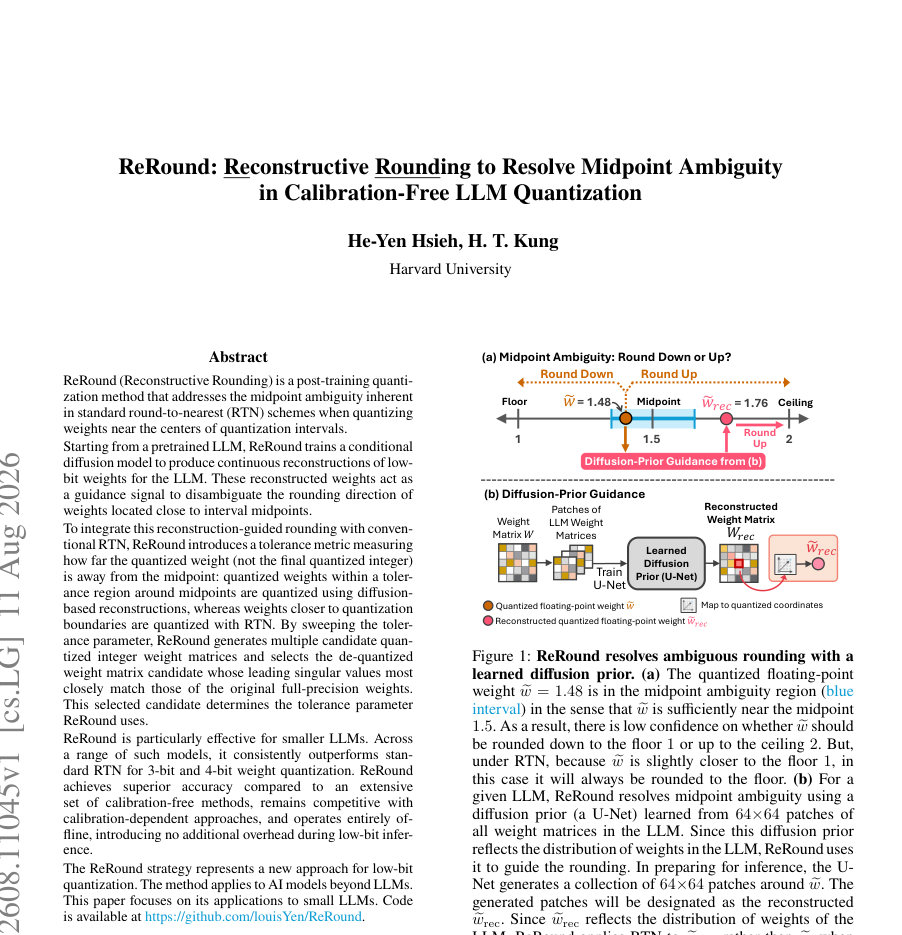
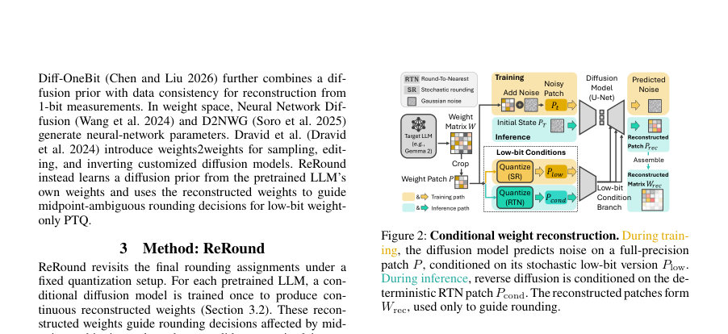
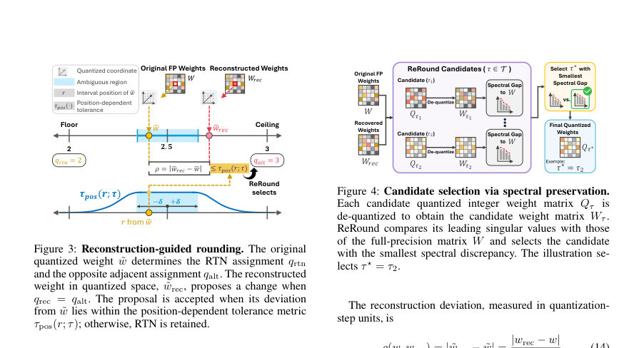

# ReRound: Reconstructive Rounding to Resolve Midpoint Ambiguity in Calibration-Free LLM Quantization

- **게시일:** 2026-08-13
- **arXiv:** [2608.11045v1](http://arxiv.org/abs/2608.11045v1) · [PDF](https://arxiv.org/pdf/2608.11045v1)
- **저자:** He-Yen Hsieh, H. T. Kung
- **분야:** cs.LG, cs.CL
- **선정 점수:** 4.09
- **선정 이유:** 최근성 0.7, 인용 영향 0.0 (인용 0회), 저자 영향 0.0 (최고 h-index 0), AI 주제 적합성 2.8, 개발자 관심 0.2, 학술 신호 0.3, 오픈 웨이트·주요 연구조직 신호 0.0

[← 2026-08-13 목록으로 돌아가기](../daily/2026-08-13.html)

<!-- paper-visuals:start -->
## 주요 Figure

> 원문 PDF에서 실제 Figure 캡션과 그림 영역이 함께 확인된 자료만 자동 추출했다.

*Figure · 원문 PDF 1쪽 · Figure 1: ReRound resolves ambiguous rounding with a*

*Figure · 원문 PDF 3쪽 · Figure 2: Conditional weight reconstruction. During train-*

*Figure · 원문 PDF 4쪽 · Figure 3: Reconstruction-guided rounding. The original*

<!-- paper-visuals:end -->

## 한 문장 요약

사전학습된 LLM의 가중치 근처 중간점(midpoint)에서 발생하는 RTN(round-to-nearest) 모호성을, 같은 모델의 가중치 분포로 학습한 조건부 확산(diffusion) 복원치를 이용해 재라운딩(reconstructive rounding)하고 스펙트럼 보존 기준으로 후보를 선택하는 캘리브레이션-프리 후처리 양자화 기법을 제안한다.

## 해결하려는 문제

저자들은 표준 RTN이 각 양자화 구간의 중앙 근처에 위치한 'quantized floating-point weight'에 대해 내리는 하향/상향 라운딩 결정이 매우 작은 거리 차이에 의존해 불안정하며, 개별 원소의 작은 결정 변화가 행렬 수준의 선형 변환 패턴을 크게 바꿔 최종 모델 정확도에 영향을 줄 수 있음을 지적한다. 기존 PTQ 방법들은 스케일이나 텐서 변환 등 양자화 설정을 개선했지만, RTN이 중간점 근처에서 어떤 대체 라운딩을 선택해야 하는지는 알려주지 못한다. 또한, 많은 고성능 라운딩 최적화 기법들은 활성화·텍스트 캘리브레이션 데이터를 필요로 한다는 한계가 있다.

## 핵심 기여

- ReRound라는 캘리브레이션-프리 프레임워크를 제안하여, 동일한 사전학습 LLM의 로컬 가중치 패치로 학습한 조건부 확산 모델을 통해 연속적 복원 가중치를 생성하고 이를 중간점 모호성(mpidpoint ambiguity)에 대한 라운딩 지도 신호로 사용한다.
- 양자화 구간 내 위치(r)에 따라 복원 기반 제안을 허용할지 결정하는 위치 의존 허용(tolerance) τpos(r; τ) 함수를 도입해, 중간점 근처에서는 복원치의 영향력을 크게 하고 경계 쪽에서는 RTN을 보존하도록 제어한다.
- 허용 파라미터 τ를 스윕하여 여러 후보 정수화 행렬 Qτ를 생성한 뒤, 각 후보를 역양자화한 행렬 Wτ의 선도 특이값(leading singular values)이 원본 행렬 W의 선도 특이값과 가장 가깝게 보존되는 후보를 선택하는 가중치-전용(weight-only) 스펙트럼 보존 기준을 제안한다.
- 복원 및 후보 선택은 활성화나 텍스트 캘리브레이션 없이 오프라인에서 수행되며, 최종 모델은 스케일·제로포인트·그룹 크기·레이어 적용 범위를 유지해 추론 시 추가 오버헤드가 없다.
- 다양한 소형 LLM(Gemma, Qwen, OLMo, SmolLM2 등)에서 3비트·4비트 가중치 양자화 상황에서 그룹-기반 RTN 대비 일관된 성능 개선을 보이고, 일부 경우 캘리브레이션 기반 기법과 경쟁하거나 능가함을 실험적으로 보였다.

## 접근 방법

* ReRound의 주요 구성은 (1) 조건부 확산 기반 가중치 복원, (2) 복원치 기반 라운딩 제안과 위치-의존 허용 규칙, (3) 후보 행렬의 스펙트럼 보존 기준 선택이다.
* 구현 및 절차는 다음과 같다.
* 조건부 복원: 각 LLM의 2차원 가중치 행렬들을 64×64 패치로 분할하고, 학습 시에는 각 패치의 2비트 저해상도 조건을 그룹별 확률적(stochastic) 라운딩(SR)으로 생성하여 이를 조건으로 DeepFloyd IF-II 기반 U-Net(사전학습 가중치 사용)에 ControlNet을 추가한 구조를 학습한다.
* 학습 중에는 U-Net 본체와 일부 레이어를 고정하고 ControlNet만 AdamW(learning rate 2e-5)로 5에폭, 에폭당 1,000,000 샘플 패치 등으로 최적화한다(두 개의 RTX 4090 사용).
* 복원 추론: 추론 시에는 결정적 2비트 RTN 조건을 사용해 DDPM 역과정을 수행(논문에서는 super27 타임스텝 리스페이싱, 총 27 단계)해 패치별 복원치를 얻고 이를 원래 위치에 재조립하여 Wrec를 만든다.
* 이 Wrec는 최종 파라미터로 배포되지 않고 라운딩 지도 신호로만 사용되며 W3 및 W4 실험에서 재사용된다.
* 복원 기반 라운딩 제안: 목표 양자화 파라미터(스케일 Δ, 제로포인트 z)가 고정된 상태에서 원본 가중치 w와 복원치 wrec를 같은 양자화 실수 좌표(˜w, ˜wrec)로 매핑한다.
* RTN이 선택한 qrtn과 반대 인접 정수 qalt, 그리고 qrec(˜wrec에 대한 반올림)를 계산한다.
* qrec가 qalt일 때만 변경 제안을 만들며, 제안 수락 조건은 복원치와 원본의 편차 ρ = \|˜wrec − ˜w\|가 위치-의존 허용 τpos(r; τ) 이하일 때이다.
* τpos(r; τ)는 중앙 구간 \|r−0.5\| ≤ δ(논문은 δ=0.1 사용)에서는 τ, 구간 밖에서는 β에 의해 감소하는 형태(식 (13)/(44))로 정의되어 중간점 근처에서만 변경을 많이 허용한다.
* 후보 생성 및 선택: 허용 파라미터 τ의 집합 T을 스윕해 각 τ에 대해 원소별 규칙을 적용해 후보 정수화 행렬 Qτ를 얻고 역양자화해 Wτ를 만든다.
* k = min{m, 128, max(32, floor(m/16))} (m = min(dout, din))로 정의한 선도 k개의 특이값 σ1:k(Wτ)와 원본 σ1:k(W) 간의 상대적 L2 차이 Dspec(τ)를 계산해 최소인 τ⋆를 선택한다.
* τ = 0은 RTN 유지 후보로 포함되며, 각 행렬에서 변경 비율을 최대 약 1%로 제한한다.

## 주요 결과

- 주요 정량적 결과: 다섯 소형 LLM(Gemma 2 2B, Gemma 3 1B, Qwen3 1.7B, OLMo 2 1B, SmolLM2 1.7B)에서 ReRound는 동일 그룹-기반 RTN(G=128)에 대해 3비트와 4비트 양자화 모두에서 일관되게 개선을 보였다. 논문 본문에서 보고한 전체 범위는 3비트에서 0.1–0.9 포인트, 4비트에서 0.2–1.3 포인트(평균 task 정확도 기준)이다.
- 예시 수치(본문 표 참조): Gemma 2 2B의 W4A16에서 그룹-기반 RTN(67.7) 대비 ReRound(68.7)로 평균 정확도 1.0 포인트 상승; Gemma 2 2B W3A16에서는 RTN 63.2 → ReRound 63.8 등 표에 제시된 모델별 개선을 포함한다.
- 캘리브레이션 기반 기법과의 비교: Gemma 2 2B 및 Gemma 3 1B의 W4A16 비교에서 ReRound는 SignRound 등 캘리브레이션 기반 방법과 경쟁력 있는 성능을 보였고(예: Gemma2에서 ReRound 67.4 vs SignRound 67.0, Gemma3에서 ReRound 59.3 vs SignRound 59.1), 캘리브레이션 데이터 없이도 일부 경우 더 나은 평균 정확도를 달성했다.
- 구성요소 분리(ablation): OLMo 2 1B 실험에서 복원 가이드, 위치-의존 허용, 스펙트럼 선택 중 어느 하나를 제거하면 성능이 하락했다(Table 4). 단순 무작위 같은 수의 라운딩 변경을 적용해도 성능 향상이 없었음.
- 다른 양자화 파라미터와의 호환성: SINQ에서 산출한 스케일/제로포인트를 사용하는 경우에도 ReRound는 동일 스케일에서 RTN 대비 W4와 W3 모두에서 정확도와 언어모델 perplexity를 소폭 개선함(예: Qwen3 1.7B에서 W4 Acc Avg 62.1→62.6, PPL Avg 18.53→18.46).

## 한계

- 저자가 명시한 한계: ReRound는 스케일과 제로포인트 등 양자화 파라미터가 고정된 상태에서 RTN의 일부 할당만 수정하므로 후보 집합은 기존 양자화 파라미터에 의해 제약받아 양자화 파라미터와의 공동 최적화가 필요할 수 있다. 또한 모델별로 별도의 확산 모델을 학습해야 해 오프라인 비용이 발생하며(모델당 2 GPU 학습, 논문 환경), 스펙트럼 선택은 오직 가중치 공간에서 작동하므로 모든 다운스트림 작업에 최적의 후보를 보장하지 않으며, 패치 기반 복원이 장거리 또는 층 간 의존성을 놓칠 수 있다. 평가 대상이 소형 LLM에 국한되어 있다.
- 논문 본문으로부터 확인되는 추가 제약: 확산 복원은 64×64 패치 단위이고 조건은 2비트로 학습되어 중간점 판정의 효과는 이 패치 크기·조건 비트에 의존한다. 오프라인 비용(학습/추론 시간)이 모델별로 수시간에서 수십시간(예: diffusion inference는 표에서 모델별로 3.65–9.55시간 범위)이고 ReRound PTQ 자체는 행렬 당 수십~수백초(표에 42–124초) 소요된다. 또한 제안은 각 행렬에서 RTN 할당의 최대 약 1%만 수정하도록 설계되어 있어 보다 공격적인 수정이 필요한 경우 한계가 있을 수 있다.

## 개발자 관점

- 재현·구현: 논문은 구현 세부사항(사용한 체크포인트 목록, 64×64 패치, ControlNet을 붙인 IF-II-M-v1.0 기반 U-Net, 학습 시 2비트 SR 조건, inference 시 결정적 RTN 조건, DDPM super27(27 step) 사용 등)을 부록에 구체적으로 기록하고 있어 재현 가능성이 높다. 학습 환경은 두 개의 NVIDIA RTX 4090으로, 배치 크기 64(32 per GPU), 5 에폭, 에폭당 1,000,000 패치, AdamW lr=2e-5, 시드=1로 명시되어 있다.
- 오프라인 비용과 통합: 각 LLM마다 별도 확산 모델 학습이 필요하나, 동일한 Wrec는 W3/W4 두 정밀도에서 재사용 가능해 비용을 절감할 수 있다. ReRound는 스케일·제로포인트·그룹 사이즈·레이어 적용 범위를 변경하지 않으므로 기존 PTQ 파이프라인(GPTQ, SINQ 등)에서 라운딩 단계만 교체해 통합하기 쉽다.
- 실행 시(배포) 제약: 최종 quantized 모델은 동일한 low-bit 표현과 동일한 추론 절차를 사용하므로 런타임 오버헤드는 없다. 단, 오프라인 단계(확산 학습·추론 및 후보 평가)에서 GPU 자원이 필요하다(논문 표: ReRound PTQ 평균 42–124초, diffusion inference 수시간).
- 하이퍼파라미터 및 규칙: 중앙 영역 폭 δ=0.1(r∈[0.4,0.6])를 사용하고 τ 후보 세트는 모델·레이어별로 지정(부록 Table 8), β는 위치-의존 허용의 감소 속도 제어, 특이값 비교를 위한 k은 행렬 크기에 따라 k = min{m,128,max(32,⌊m/16⌋)}으로 설계되어 있다. 또한 변경 비율 상한(논문 전반에서 약 1%)을 두어 과도한 수정 방지 가능.
- 개선·확장 제안: 저자가 제시한 것처럼 양자화 파라미터(스케일/제로포인트)와 복원-기반 라운딩을 공동 최적화하거나, 패치 크기·조건 비트·전이학습을 통해 확산모델을 여러 모델에 전이(transfer)하는 방향이 실무적으로 유망하다.

**근거 범위:** 분석은 제공된 논문 PDF 본문(주본문 및 부록 전체 페이지)을 기반으로 작성되었으며, 표와 부록의 하이퍼파라미터·런타임·학습 설정을 직접 인용해 정리했다. 코드·실험 재현성을 위해서는 저장소의 구현 세부(예: 정확한 후보 τ 집합, 소스 코드의 구현 차이)가 추가로 필요할 수 있다. 본문에 제시되지 않은 외부 수치나 가정은 생성하지 않았다.
