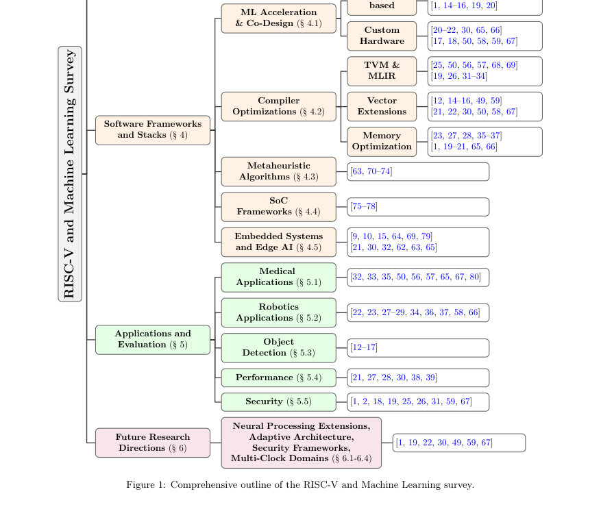

# RISC-V and machine learning: a survey

- **게시일:** 2026-09-20
- **arXiv:** [2609.20677v1](http://arxiv.org/abs/2609.20677v1) · [PDF](https://arxiv.org/pdf/2609.20677v1)
- **저자:** Shriman Keshri, Apparna Singh, Chinmaya Kumar Palo, Shreya Adya, Subhankar Mishra
- **분야:** cs.LG, cs.AR
- **선정 점수:** 3.73
- **선정 이유:** 최근성 0.5, 인용 영향 0.0 (인용 0회), 저자 영향 0.0 (최고 h-index 0), AI 주제 적합성 1.8, 개발자 관심 0.9, 학술 신호 0.5, 오픈 웨이트·주요 연구조직 신호 0.0

[← 2026-09-20 목록으로 돌아가기](../daily/2026-09-20.html)

<!-- paper-visuals:start -->
## 주요 Figure

> 원문 PDF에서 실제 Figure 캡션과 그림 영역이 함께 확인된 자료만 자동 추출했다.

*Figure · 원문 PDF 3쪽 · Figure 1: Comprehensive outline of the RISC-V and Machine Learning survey.*

<!-- paper-visuals:end -->

## 한 문장 요약

RISC-V 기반의 머신러닝 적용 현황을 문헌 조사로 정리하고 ISA 확장, 코어 구현, 소프트웨어 툴체인 및 응용 사례를 교차 분석하여 성능·설계상의 절충과 향후 연구 방향을 제안한다.

## 해결하려는 문제

기존 조사들은 RISC-V와 머신러닝 적용을 하드웨어·ISA·소프트웨어 스택의 교차 관점에서 체계적으로 연결하지 못했고, 특히 2020년 이후 빠르게 발전한 표준·커스텀 ISA 확장, 상용·학술 코어 구현, 컴파일러/툴체인 통합 및 엣지 응용의 정량적 비교가 부족하다. 또한 RISC-V 생태계는 표준화·검증 복잡성·라이선스·툴호환성 문제와 생태계 단편화로 인해 ML 채택에 실질적 장벽이 존재한다.

## 핵심 기여

- ISA 확장부터 프로세서 구현, 소프트웨어 프레임워크, 응용 수준 성과까지 교차 스택(cross-stack) 관점으로 연결한 종합적 분석을 제시한다.
- 학술·상업용 RISC-V 코어를 일관된 아키텍처 지표(지원 ISA, 파이프라인 깊이, 실행 모델, 클럭, DMIPS/MHz 등)로 정규화한 비교 표로 정리했다.
- RISC-V와 통합되는 ML 소프트웨어 프레임워크의 분류법(taxonomy)을 제안하고, TVM·MLIR 등 컴파일러 툴체인과의 통합 접근을 비교 분석했다.
- 문헌에서 보고된 정량적 결과를 종합하여 확장·가속기 설계 패턴과 성능·에너지·면적 절충을 도출했다.
- 문헌 기반으로 네 가지 향후 연구 방향(Neural Processing Extensions, Adaptive/Modular Architectures, Security Frameworks, Energy-efficient Multi-domain Architectures)을 제시했다.

## 접근 방법

* Google Scholar, DBLP, IEEE Xplore, ACM Digital Library, arXiv, Springer를 사용해 주로 2020년 이후 문헌을 대상 검색어 집합으로 체계적 문헌조사를 수행했다.
* 포함 기준은 RISC-V 기반으로 ML 성능·효율 개선을 입증하거나 RISC-V에서 ML 워크로드를 구현·평가한 연구로 한정했으며, 제외 기준으로는 주변 언급만 있는 논문, 구현 검증이 없는 이론적 연구 등을 뒀다.
* 수집 논문들을 ISA(표준·커스텀 확장), 코어/SoC 구현(학술·상업), FPGA/ASIC 구현, 컴파일러·툴체인(TVM·MLIR 등), 응용 도메인(의료·로보틱스·객체검출 등) 별로 분류하고 문헌에서 보고한 정량치와 아키텍처 특성을 정규화하여 비교·종합했다.
* 본문에서 제시된 결과는 저자들의 기존 실험을 재분석·종합한 것이며 본 논문 자체의 원 실험은 포함하지 않는다.

## 주요 결과

- MARVEL 자동화 확장 생성 프레임워크는 경량 AI 애플리케이션에서 약 2× 속도 향상 및 2× 에너지 절감을 보고한 문헌을 인용했다.
- Transformer 가속을 목표로 한 VEXP ISA 확장은 softmax 등에 대해 문헌상 최대 162.7× 지연(latency) 감소와 74.3× 에너지 효율 향상을 보고하며, 면적 오버헤드는 약 1%(28nm 공정에서 2,847 게이트 추가)로 제시되었다.
- Flexible/bendable RISC-V 구현은 SVM 분류에서 실행 시간과 에너지 효율이 문헌상 21× 향상된 사례를 보고했다.
- 초저전력 NN 확장 사례는 CIFAR-10에서 97.62% 분류 정확도를 보고했고, 동일 비교에서 전력 소모는 논문상 ARM Cortex-M4 대비 13% 수준(측정치: 4.2 mW vs 32.1 mW)으로 제시되었다.
- 문헌에 정리된 학술 코어 성능 예시: VRoom 11.3 DMIPS/MHz (FPGA Xilinx UltraScale+), BOOM 3.93 DMIPS/MHz (TSMC 28nm ASIC), SERV 0.718 DMIPS/MHz(최저 성능 사례). 또한 XiangShan은 RV64GCBK를 지원하고 2.2 GHz(ASIC) 등을 보고했다(각 수치들은 각 출처별 보고치임).

## 한계

- 저자 명시 한계: 이 조사 논문은 문헌 합성(synthesis) 연구로서 자체적인 원본 실험을 수행하지 않았으며 '문헌에서 보고된 수치들'을 종합·해석한 결과를 제시한다(본문 기재).
- 저자가 지적한 한계(생태계·표준화): RISC-V 생태계의 단편화, 라이선스 이질성, 소프트웨어·OS 지원의 불균형, 검증·표준화 관련 복잡성이 ML 채택의 제약으로 남아있음을 명시했다.
- 추가 관찰된 제약: 설계별 성능·전력 수치들은 다양한 구현 플랫폼(FPGA vs ASIC), 공정 노드, 동작 주파수, 측정 조건에 따라 크게 달라지며 본 논문은 출처별 보고치를 정규화·비교하였으나 완전한 동일 조건 비교 실험이 없으므로 직접적인 우열 판정에는 한계가 있다.
- 문헌 기반의 정량 종합은 원자료의 측정 방법·워크로드·조건에 의존하므로, 특정 수치(예: 162.7×, 21× 등)는 원문 실험 세팅 맥락을 고려해 해석해야 한다.

## 개발자 관점

- 재현성·구현 관점: 이 논문은 구현별 소스·참고를 표로 정리하므로 실제 재현 시에는 각 인용 원문(코드·리포지토리·벤치마크)으로 이동해 FPGA/ASIC 구현 세부 설정과 측정 방법을 확인해야 한다.
- 툴체인·컴파일러: TVM 및 MLIR 계열 툴이 RISC-V 타깃 최적화에 핵심적이며, 커스텀 ISA 확장을 사용할 경우 컴파일러(LLVM 백엔드 등)와의 연계 및 자동화(예: MARVEL 같은 확장 생성 툴)를 고려해야 한다.
- 하드웨어 선택: 프로토타입·연구·검증 단계에서는 FPGA가 유리하며, 상용화 시에는 ASIC이 성능·전력·면적 측면에서 유리하다. 논문은 FPGA/ASIC 구현의 트레이드오프를 여러 사례로 제시한다.
- 운영체제·배포: Linux를 완전하게 구동하려면 RV64GC(예: IMAFDC + Zicsr + Zifencei 등)와 MMU, PLIC, U/S 모드, Sv32/39/48 같은 가상메모리 지원이 필요하므로 엣지·마이크로컨트롤러급 디바이스와는 설계 요구가 다름을 명심해야 한다.
- 라이선스·생태계 비용: 학술 구현은 주로 Apache/BSD/MIT 라이선스를 사용해 상용 재사용이 용이한 반면 상용 IP는 별도 라이선스·제약이 있으므로 설계·배포 전략 수립 시 라이선스 검토가 필수적이다(비용·법적 리스크 고려).

**근거 범위:** 이 분석은 제공된 논문 PDF 본문(본문, 표, 인용된 결과 수치)을 기반으로 작성되었다. 일부 표와 내용이 중복·분절되어 제공되었으나 본문에 직접 명시된 수치와 문장만을 사용해 정리했다. 원본 인용문헌의 측정 조건(FPGA/ASIC, 공정 노드, 벤치마크 세부설정 등)은 본문에 의존하므로 특정 수치의 일반화에는 주의가 필요하다.
