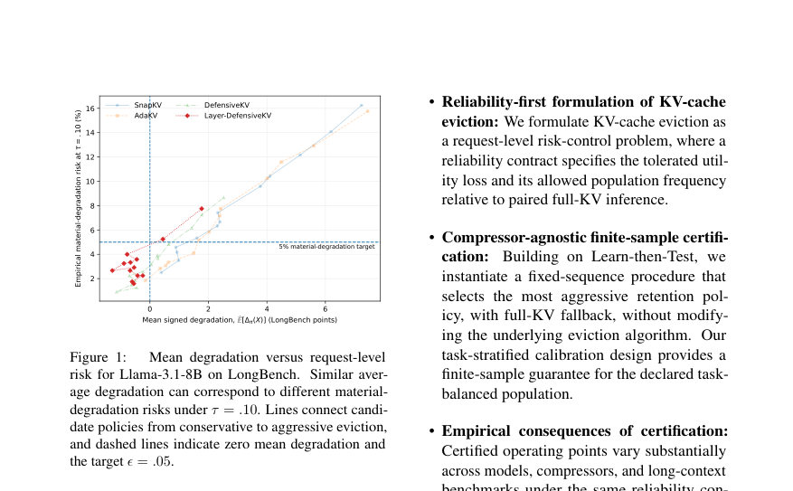
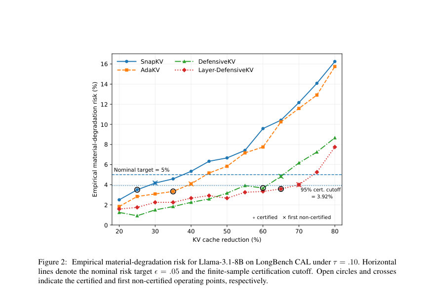

# Risk-Controlled KV-Cache Eviction: From Memory Budgets to Risk Targets

- **게시일:** 2026-09-24
- **arXiv:** [2609.27981v1](http://arxiv.org/abs/2609.27981v1) · [PDF](https://arxiv.org/pdf/2609.27981v1)
- **저자:** Beomgu Kang, SoJin Yun, Hojoon Kim, Hyunseok Seo
- **분야:** cs.CL, cs.LG
- **선정 점수:** 6.62
- **선정 이유:** 최근성 1.2, 인용 영향 0.0 (인용 0회), 저자 영향 0.0 (최고 h-index 0), AI 주제 적합성 2.0, 개발자 관심 0.8, 학술 신호 0.3, 오픈 웨이트·주요 연구조직 신호 2.4

[← 2026-09-24 목록으로 돌아가기](../daily/2026-09-24.html)

<!-- paper-visuals:start -->
## 주요 Figure

> 원문 PDF에서 실제 Figure 캡션과 그림 영역이 함께 확인된 자료만 자동 추출했다.

*Figure · 원문 PDF 2쪽 · Figure 1: Mean degradation versus request-level*

*Figure · 원문 PDF 8쪽 · Figure 2: Empirical material-degradation risk for Llama-3.1-8B on LongBench CAL under τ = .10. Horizontal*

<!-- paper-visuals:end -->

## 한 문장 요약

KV-cache 폐기(eviction)를 배포 수준의 리스크 제어 문제로 재정의하고, Learn-then-Test 기반의 사후 검증(고정-순서 테스트)을 이용해 유한표본(finite-sample) 보증 하에서 보존 비율(retention) 정책을 선택해 필요시 full-KV로 폴백하는 절차를 제안한다.

## 해결하려는 문제

기존 KV-cache 폐기 연구는 주로 평균 품질-메모리 트레이드오프를 보고하지만 평균 손실이 작아도 일부 요청에서 실질적(재현 가능한) 성능 저하가 자주 발생할 수 있다. 배포자 관점에서는 '전체-KV와 같은 요청에서 허용 가능한 최대 손실 τ를 넘는 요청이 집단에서 얼마나 자주 발생하는가(리스크 ϵ)'를 직접 제어하는 것이 중요하다. 따라서 (1) 요청 수준의 물질적(material) 열화를 정의하고, (2) 주어진 신뢰 계약(τ,ϵ,δ)에 대해 유한표본 보증을 주는 정책 선택 절차가 필요하다. 기존 방법들은 정책별 평균 열화(E[Δπ])만 보고하며, 이는 P[Δπ(X)>τ]≤ϵ를 보장하지 못한다.

## 핵심 기여

- KV-cache 폐기를 배포-레벨의 리스크 제어 문제로 공식화하고 물질적 열화(Δπ(X)>τ)와 집단 리스크 Rτ(π)=P[Δπ(X)>τ]를 목적 제약으로 제시함.
- 압축기(Compressor) 비종속적(post-hoc)인 유한표본 인증 절차를 Learn-then-Test(LTT) 고정-순서(fixed-sequence) 테스트로 구체화하여, 캘리브레이션 데이터로부터 보존 정책을 선택하고 인증 실패 시 full-KV로 폴백하도록 설계함.
- 작업-계층(task-stratified) 캘리브레이션 디자인과 이항(Binomial) 비교 기반의 보수적 p-값을 사용해 선언된 작업-균형 모집단(task-uniform mixture)에 대해 확률적(1−δ) 유한표본 보증을 제공함.
- 여러 폐기 방법(SnapKV, AdaKV, DefensiveKV, Layer-DefensiveKV, ReFreeKV), 모델(Llama-3.1-8B, Mistral-7B) 및 벤치마크(LongBench, RULER-32K)에 대해 인증 결과 및 실증적 영향(인증된 운영점이 방법·모델·벤치마크마다 크게 다름, 경험적 기준(empirical thresholding)과 인증의 차이 등)을 체계적으로 분석함.

## 접근 방법

* 핵심 절차는 다음이다.
* (1) 배포자가 물질적 열화 허용치 τ, 허용 빈도 ϵ, 캘리브레이션 신뢰 δ를 사전 고정한다(예: (τ,ϵ,δ)=(0.10,0.05,0.05)).
* (2) 평가할 정책들(고정-예산 방식의 보존 비율 b∈{0.80,0.75,...,0.20} 또는 요청 적응형 임계값 Ti의 순서)을 보수적→공격적으로 사전 정렬한 고정 후보열로 준비한다.
* (3) 각 캘리브레이션 요청에 대해 같은 모델·입력·생성 설정으로 full-KV와 각 후보 정책의 정량적 유틸리티 Ufull(X), Uπ(X)를 계산해 Δπ(X)=Ufull−Uπ 및 위반 지표 Vτ=1{Δπ>τ}를 얻는다.
* (4) 후보별 위반 합 Kj와 이항 누적분포를 이용한 보수적 p-값 penv_j(식 14)를 구성(호프딩 비교정리로 유효성 보장).
* (5) 고정-순서 테스트로 보수적→공격적 순서대로 p값을 검정하며 처음 불합격 시 멈추고 직전까지 인증된 마지막 후보를 반환; 첫 후보 불합격이면 FULLKV로 폴백한다.
* (6) 캘리브레이션은 작업 균형 혼합 P = (1/H) Σ Ph로 정의하고 각 작업에서 n/H 샘플을 독립적으로 수집한다고 가정한다.
* 보증은 이 선언된 모집단에 대해 Pr_Cal{Rτ(selected) > ϵ} ≤ δ를 제공한다.

## 주요 결과

- 실험 설정: LongBench의 12개 작업을 각 작업당 200예제(캘리브레이션 CAL 100, TEST 100)로 구성해 CAL n=1200, RULER-32K는 작업당 100예제로 n=1300 사용. 주 계약은 (τ,ϵ,δ)=(0.10,0.05,0.05).
- Llama-3.1-8B on LongBench: 캘리브레이션으로 선택된 운영점(표 1) — SnapKV retention=0.75 (CAL risk 3.50%, TEST 2.50%), AdaKV 0.65 (3.33% CAL, 3.08% TEST), DefensiveKV 0.40 (3.67% CAL, 4.08% TEST), Layer-DefensiveKV 0.35 (3.58% CAL, 4.00% TEST). (각 모델·압축기 시퀀스별로 별도 캘리브레이션)
- 유한표본 효과: LongBench n=1200, ϵ=0.05, δ=0.05일 때 인증 가능한 최대 위반 수 Kmax=47에 해당하는 경험적 위험은 47/1200=3.92%로, 단순 plug-in 규칙(관측된 CAL 사건 ≤60 → 5.0%)보다 더 보수적이다. 이 때문에 경험적 임계로는 허용되는 후보들이 유한표본 인증에서는 모두 불합격해 인증이 보다 보수적(retention을 5–10pt 더 높게 선택)인 결과를 초래함.
- RULER-32K: SnapKV의 첫 압축 후보(0.80)가 캘리브레이션에서 135/1300(10.38%) 위반으로 불합격하여 FULLKV 폴백; AdaKV, DefensiveKV, Layer-DefensiveKV는 각각 다른 보존비를 인증(예: Layer-DefensiveKV 보존=0.35, CAL 3.92%, TEST 3.54%). 즉 동일한 계약이 벤치마크·압축기·모델에 따라 크게 다른 허용 압축을 허용함.
- 요청-적응형 예(ReFreeKV, Llama LongBench 8K 프로토콜): 선택된 임계 T=0.0005 (CAL 39/1200=3.25%), 평균 보존률 CAL 87.48%, TEST 평균 보존 87.36%, TEST 위반 42/1200=3.50%; 다음 임계 T=0.001은 경험적 CAL 리스크 4.42%임에도 불구하고 인증 실패함.

## 한계

- 저자 명시 한계: (1) 인증은 선언한 벤치마크 모집단(task-uniform mixture)과 캘리브레이션 독립 샘플 가정에 특화되며, 작업별 보증이나 분포 이동에 대한 강건성을 제공하지 않음. (2) 두 개의 7–8B급 모델 계열과 제한된 폐기 방법·이산 후보 그리드만 실험하였으므로 결과의 일반화(더 큰 모델, 다른 아키텍처, 서비스 스택)는 불확실함. (3) 계약(τ,ϵ)·후보 시퀀스·순서는 캘리브레이션 전에 고정되어야 하며, 사후 선택은 추가 보정 또는 새로운 캘리브레이션 데이터가 필요함. (4) 본 연구는 보존률·유틸리티 리스크를 인증하지만 시스템 레이턴시·스루풋과 같은 엔드투엔드 효율성은 직접적으로 평가하지 않음.
- 추가로 본문에서 확인되는 제약(실험적 제약): (A) 집계된(task-balanced) 인증에도 불구하고 일부 개별 작업에서 실제 위험이 ϵ를 초과하는 경우가 관찰됨(예: RULER common-word extraction에서 Layer-DefensiveKV TEST 29/100 → 하한 동시 신뢰구간으로도 >5%). (B) 경험적 임계값으로 선택된 후보들이 유한표본 인증을 통과하지 못하는 사례가 반복되어, 실무 배포에서는 폴백(full-KV) 발생 가능성이 있음(예: SnapKV on RULER). (C) 캘리브레이션 샘플 수(n)에 따라 인증 가능한 경험적 위험 컷오프가 달라짐(예: n=1200에서 컷오프는 3.92%).

## 개발자 관점

- 배포자는 계약(τ,ϵ,δ)과 후보 시퀀스를 캘리브레이션 전에 고정해야 하며, 이를 위한 별도 캘리브레이션 데이터(논문 예: LongBench 캘리브레이션 n=1200)를 준비해야 한다.
- 정책 선택을 위해 각 캘리브레이션 샘플에 대해 full-KV와 모든 후보 정책의 쌍대(pairwise) 평가가 필요하므로 오프라인 비용이 크다(논문은 paired full-KV·candidate 평가를 명시). 후보 그리드 해상도를 높이면 더 세밀한 운영점을 찾을 수 있으나 계산 비용이 증가한다.
- 고정-순서 LTT 절차는 압축기 변경 없이 '사후'에 적용 가능하므로 기존 폐기 알고리즘을 수정할 필요는 없으나, 인증 실패 시 안전하게 full-KV로 폴백하는 구현이 필요하다.
- 작업 불균형·작업별 위험 편차가 크므로(논문에서 작업별 위험이 aggregate와 상이함) 실제 서비스에서는 작업 가중치나 작업별 캘리브레이션을 고려해 별도 계약 또는 보수적 혼합 분포를 사용해야 한다.
- 유한표본 인증은 집단 수준의 확률적 보증(Pr_Cal{Rτ(selected)>ϵ}≤δ)을 제공하지만 개별 요청에 대한 보증은 아니므로 안전 민감한 서비스에서는 추가 모니터링·실시간 폴백 규칙을 병행해야 한다.

**근거 범위:** 논문 PDF 본문(제공된 페이지 1–14)을 근거로 정리함. 표·수식·수치는 본문에 명시된 값만 사용했으며(예: (τ,ϵ,δ)=(0.10,0.05,0.05), n=1200, Kmax=47→3.92% 컷오프, 표 1·2·4의 수치), 구현 세부비용(실행시간·메모리 수치) 등 본문에 명시되지 않은 항목은 생성하지 않았음. 일부 실험(예: ReFreeKV는 별도 8K 프로토콜)은 본문에서 평가 프로토콜 차이를 명시하고 있어 그 점을 반영함.
