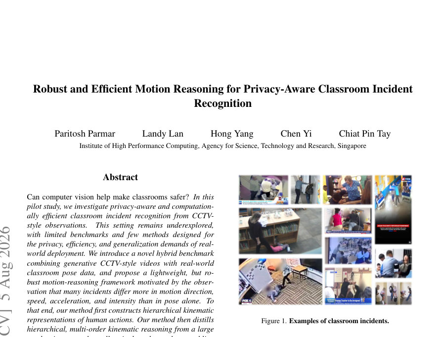
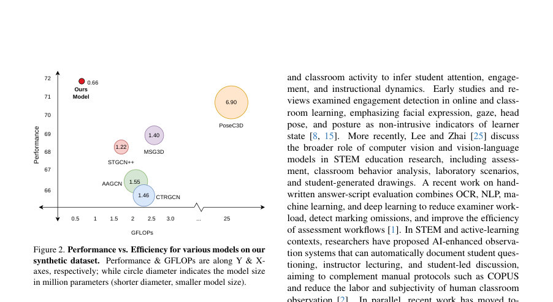
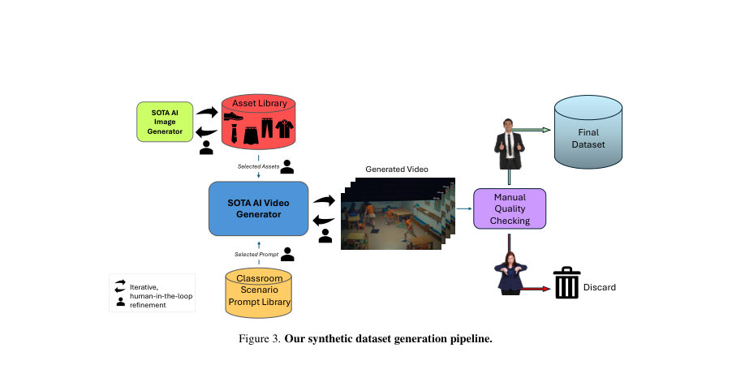

# Robust and Efficient Motion Reasoning for Privacy-Aware Classroom Incident Recognition

- **게시일:** 2026-08-06
- **arXiv:** [2608.05115v1](http://arxiv.org/abs/2608.05115v1) · [PDF](https://arxiv.org/pdf/2608.05115v1)
- **저자:** Paritosh Parmar, Landy Lan, Hong Yang, Chen Yi, Chiat Pin Tay
- **분야:** cs.CV, cs.AI, cs.ET, cs.HC, cs.LG
- **선정 점수:** 10.75
- **선정 이유:** 최근성 1.5, 핵심어: reasoning, 핵심어: inference, 핵심어: benchmark, 핵심어: efficient

[← 2026-08-06 목록으로 돌아가기](../daily/2026-08-06.md)

<!-- paper-visuals:start -->
## 주요 Figure

> 원문 PDF에서 실제 Figure 캡션과 그림 영역이 함께 확인된 자료만 자동 추출했다.

*Figure · 원문 PDF 1쪽 · Figure 1. Examples of classroom incidents.*

*Figure · 원문 PDF 2쪽 · Figure 2. Performance vs. Efficiency for various models on our*

*Figure · 원문 PDF 3쪽 · Figure 3. Our synthetic dataset generation pipeline.*

<!-- paper-visuals:end -->

## 한 문장 요약

CCTV형 교실 영상에서 개인 식별 정보를 사용하지 않는 골격(포즈)만으로 위치·속도·가속도의 계층적 운동(kinematic) 표현을 학습한 대형 다중차수(teacher) 모델을 소형 단일차수(student) 모델로 지식증류해, 적은 연산비용으로 교실 안전사건(넘어짐, 펀치 등)을 효율적·강건하게 인식하는 방법과 합성+실제 하이브리드 벤치마크를 제안한다.

## 해결하려는 문제

교실 사건 인식은 CCTV 관찰 특유의 천장 시점, 어린이·교사 혼재, 드문·위험한 사건 클래스, 개인정보(특히 아동) 보호 요구, 배포 시 제한된 계산자원 등으로 인해 기존 일반적 행동 인식 데이터셋·방법으로 바로 적용하기 어렵다. 또한 관련 현실 데이터는 희소하며 윤리·안전 문제로 수집이 어렵고, 합성 데이터와 실제 데이터 간 도메인 갭이 존재한다. 기존 골격(스켈레톤) 기반 방법들은 주로 위치 정보에 의존하거나 단일 표현만 사용해 속도·가속도 등 운동 신호를 충분히 활용하지 못하고, 실시간·경량 배포에 적합하도록 설계된 방법이 부족하다.

## 핵심 기여

- CCTV 시점의 교실 안전사건을 다루는 하이브리드 벤치마크(합성 비디오 1296개 샘플 + 실세계 포즈 데이터 574개 샘플)와 합성 데이터 생성·검증 파이프라인을 제시하고, 교사(도메인전문가) 및 보육교사의 품질검증 절차를 포함하여 데이터의 타당성을 확보함.
- 포즈(골격) 기반의 개인정보보호형 사건 인식 프레임워크를 제안: 위치(joint position), 속도(velocity), 가속(acceleration)으로 구성된 계층적(다중차수) 운동 표현을 만들고 각 차수별 백본을 결합한 다중차수 교사 모델을 설계함.
- 다중차수 교사→단일차수(0차: 위치) 소형 student로의 다목적 지식증류(Multi-objective KD)를 통해 추론시 1차 스트림만 사용하면서도 다중차수 운동추론 성능을 보존하여 계산·메모리 비용을 크게 낮춤.
- 합성으로 학습한 모델의 제로샷 합성→실세계 전이 실험을 제시하고, 제안 모델이 비교적 더 우수한 도메인 일반화 성능과 더 낮은 연산비용으로 기존 여러 골격 기반 최첨단(AA-GCN, STGCN++, CTRGCN, MSG3D, PoseC3D 등)를 능가함을 보임.

## 접근 방법

전체 파이프라인 개요: 입력은 RGB가 아닌 사람별 포즈(골격) 시퀀스이며, 배포 시에는 기관이 원본 영상에서 포즈를 추출한 뒤 모델에 포즈만 제공한다고 가정한다. 전처리: 결측치는 선형 보간으로 채우고, 프레임간 지터·노이즈 완화를 위해 Savitzky–Golay 필터로 시간적 평활화한 뒤 유도(차분)로 속도·가속도 계산(시간 간격 δ 사용). 계층적 운동 표현: zeroth-order(위치 jt_a), 1st-order(속도 vt_a = (jt_a - j_{t-δ}_a)/δ), 2nd-order(가속 at_a = (vt_a - v_{t-δ}_a)/δ) 등을 재귀적으로 구성하여 각 차수별 입력을 만든다. 차수별 백본: 각 차수에 대해 동일 아키텍처(논문 구현은 STGCN++ 사용)를 독립 파라미터로 학습시켜 차수별 표현 ϕ_m을 얻고 고정(freeze)한다. 다중차수 융합(teacher): 차수별 표현을 공통 차원으로 투영 후 가중평균으로 융합(ϕ_multi-order = sum_m w_m ϕ_m / sum_m w_m), 논문 구현의 가중치는 {w0,w1,w2} = {1.0,0.8,0.2}. 교사-학생 증류: 다중차수 융합 teacher의 소프트 타깃과 정답 라벨을 함께 사용하는 다목적 손실 L_MTL = λ_KD L_KD + λ_Cls L_Cls로 소형 학생을 학습. L_KD는 온도 τ로 스케일된 KL 발산(논문 τ=4 사용), L_Cls는 교차엔트로피(λ_KD=0.3, λ_Cls=1.0 사용). 학생 모델은 추론시 오직 zeroth-order(위치) 스트림만 입력으로 받고, 논문 구현에서는 STGCN++ 베이스 채널을 teacher 64 → student 32로 축소해 파라미터·연산을 절감. 학습 세팅: PyTorch·PySKL 사용, 포즈 추출은 YOLO pose, NTURGBD로 사전학습 후 합성 데이터(80%) 학습·(20%) 테스트로 평가.

## 주요 결과

- 데이터셋: 합성 샘플 1296개(수동 품질검사·교사 검증), 실세계 포즈 샘플 574개(익명화된 골격 키포인트와 검증 라벨).
- 합성 테스트(학습: 합성 80% / 테스트: 합성 20%): 정확도(%) — AAGCN 66.39, STGCN++ 68.05, CTRGCN 65.56, MSG3D 68.88, PoseC3D 70.54, 제안 기법 71.78 (제안 기법이 최고 성능).
- 제로샷 합성→실세계 전이(학습:합성 전용, 평가:실세계): 정확도(%) — AAGCN 54.70, STGCN++ 57.32, CTRGCN 53.83, MSG3D 59.23, PoseC3D 54.36, 제안 기법 63.41 (제안 기법이 가장 높음).
- 효율성 주장: 본문에서 제안 모델이 PoseC3D보다 파라미터가 1/10 수준인 환경에서 더 나은 성능을 냈다고 보고함(문맥상 학생 소형화로 추론 비용·FLOPs 감소; 논문은 구현 세부 GFLOPs·정확한 파라미터 수치는 표로 직접 제공하지 않음).
- 전이·강건성 해석: 합성 정확도 71.78% → 실세계 63.41%로 도메인 갭 존재하나, 제안 방법은 비교기법 대비 갭 이후에도 우수한 실세계 성능을 보였음.

## 한계

- 저자 명시 한계: 합성 비디오의 현실성·편향·저작권·오용 위험(본문에서 생성 AI의 한계와 주의 필요성을 명시), 합성→실세계 도메인 갭(합성 정확도 71.78% 대비 실세계 63.41%로 성능 하락) 및 교실 사건 인식 태스크가 아직 해결되지 않았음(추가 연구 필요).
- 저자가 본문에 제시한 제약: 데이터는 본 연구의 파일럿 규모로 제한됨(합성 1296, 실세계 574 샘플)이며, 행동 클래스는 7개(plus background)로 한정되어 있음 — 이는 사건 종류·다양성의 제약을 의미함.
- 본문에서 합리적으로 확인되는 제약(추정 아님): 정확도·지표는 전체적인 평균(accuracy) 중심으로 보고되어 있으며 클래스별 정밀도·재현율·혼동 행렬의 상세 수치는 본문에 전부 제공되지 않음(부록에 일부 언급). 또한 구현 관련 수치(정확한 파라미터 수, FLOPs 수치)는 일부 주장이 있으나 문서 내에 일관된 정밀 수치가 부족해 특정 배포 환경에서의 실제 연산·메모리 요구량을 바로 재현하기 어렵다.

## 개발자 관점

- 데이터·도구 공개 예정: 저자는 합성 데이터셋, 주석 도구, 코드베이스를 공개할 계획이므로 재현성 확보를 위해 공개물 확인 권장.
- 포즈 추출·프라이버시 설계: 배포시 원본 영상은 기관에서 사전 처리(포즈 추출)하고 익명화된 골격만 모델에 제공하도록 설계함으로써 저장·전송 단계에서 식별정보 유출 위험을 낮출 수 있음. 구현 시 YOLO pose 등 견고한 포즈 추출기와 IRB·윤리 절차를 사전에 준비해야 함.
- 경량화 및 지연 요구 대응: 실시간·엣지 배포를 목표로 할 경우 제안처럼 학습 시 복합 정보를 활용하되 추론은 소형 zeroth-order student만 사용해 메모리·연산을 줄이는 전략이 유용함. 논문 구현은 teacher 채널 64 → student 채널 32로 축소함(학습 시 NTURGBD로 프리트레인 권장).
- 증류·하이퍼파라미터: 재현을 위해 주요 하이퍼파라미터를 주의해 설정할 것 — 융합 가중치 {w0,w1,w2}={1.0,0.8,0.2}, 증류 온도 τ=4, 손실 가중치 λ_KD=0.3, λ_Cls=1.0. 또한 사전에 포즈 시계열을 Savitzky–Golay 필터로 평활화하는 전처리를 반드시 적용해야 고차 미분에서 노이즈 증폭을 억제할 수 있음.
- 안전·윤리적 배포 권고: 합성 데이터 생성 과정에서 교사·도메인 전문가의 검토를 포함했으나, 실제 배포 전에는 지역 규제·학부모 동의·데이터 보관 정책을 충족해야 하며, 합성 데이터의 편향·비현실적 행동 가능성을 추가 검증할 것.

**근거 범위:** 본 분석은 제공된 논문 PDF 본문(페이지 1–13)에 근거해 작성되었음. 표와 본문에서 직접 제시된 수치(데이터셋 샘플 수, 표의 정확도 값, 하이퍼파라미터 등)를 사용했고, 저자가 명시적으로 적지 않은 정확한 파라미터 수치나 GFLOPs 값은 본문에 일관되게 제시되지 않아 일반적 기술적 진술(예: “1/10 수준의 파라미터”)은 원문 서술을 인용하여 기술함. 본문 내 구현 세부(예: teacher와 student의 정확한 파라미터 수)가 상이하게 서술된 부분(예: 구현에서는 student 채널을 절반으로 줄였다고 기술됨과 별개로 본문 중에는 ‘one sixth’로 서술된 구절)이 있어 해당 불일치는 원문 그대로 보고하였으며 추가 확인은 저자 제공 코드·릴리스 문서에서 권장함.
