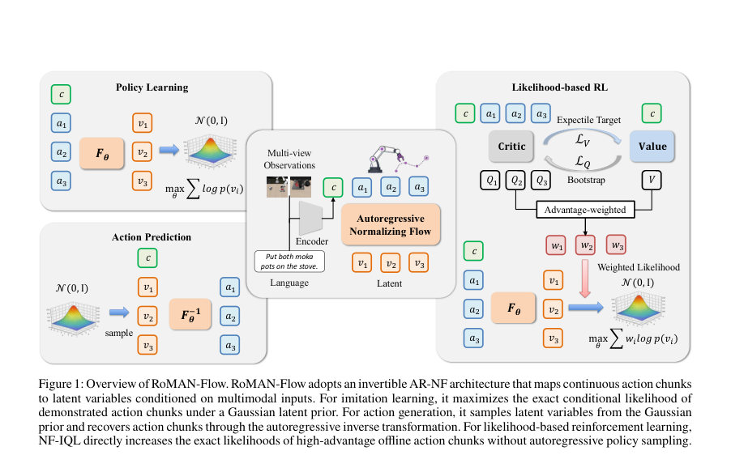
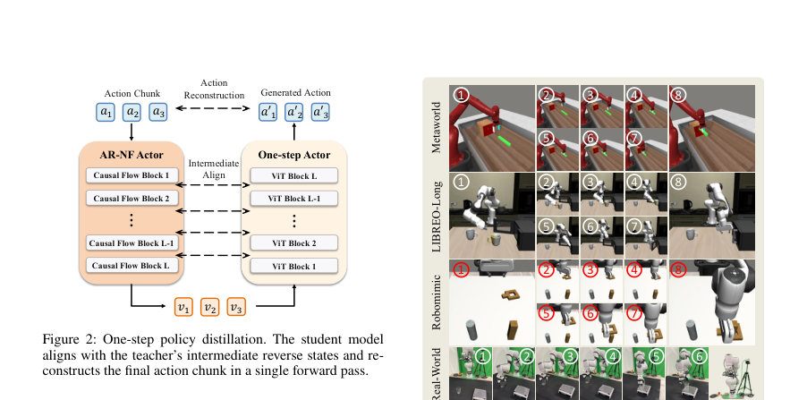
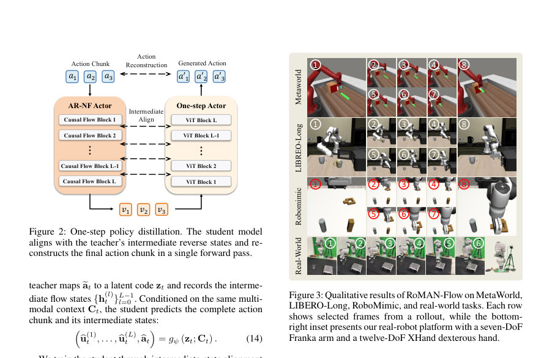

# RoMAN-Flow: Taming Autoregressive Normalizing Flows for Offline Reinforcement Learning in Robotic Manipulation

- **게시일:** 2026-08-22
- **arXiv:** [2608.20208v1](http://arxiv.org/abs/2608.20208v1) · [PDF](https://arxiv.org/pdf/2608.20208v1)
- **저자:** Shaoxuan Wang, Guangting Zheng, Rui Huang, Zhipeng Tang, Sha Zhang, Jiajun Deng, Yanyong Zhang
- **분야:** cs.CV
- **선정 점수:** 5.51
- **선정 이유:** 최근성 0.5, 인용 영향 0.0 (인용 0회), 저자 영향 1.4 (최고 h-index 8), AI 주제 적합성 1.6, 개발자 관심 1.4, 학술 신호 0.7, 오픈 웨이트·주요 연구조직 신호 0.0

[← 2026-08-22 목록으로 돌아가기](../daily/2026-08-22.html)

<!-- paper-visuals:start -->
## 주요 Figure

> 원문 PDF에서 실제 Figure 캡션과 그림 영역이 함께 확인된 자료만 자동 추출했다.

*Figure · 원문 PDF 3쪽 · Figure 1: Overview of RoMAN-Flow. RoMAN-Flow adopts an invertible AR-NF architecture that maps continuous action chunks*

*Figure · 원문 PDF 5쪽 · Figure 2: One-step policy distillation. The student model*

*Figure · 원문 PDF 5쪽 · Figure 3: Qualitative results of RoMAN-Flow on MetaWorld,*

<!-- paper-visuals:end -->

## 한 문장 요약

자기회귀(normalizing) 흐름(AR-NF)을 정책 표현으로 사용하되, 학습 시 샘플링을 피하는 이점-가중 우도 최적화(NF-IQL)와 추론 시 순차적 역변환을 제거하는 일단계(distillation)로 현실적 오프라인 로봇 조작 강화학습을 실현한 RoMAN-Flow 프레임워크.

## 해결하려는 문제

기존의 확산(diffusion) 및 flow-matching 정책은 고성능 생성 능력을 보이지만 학습·사후 최적화에서 '저비용의 정확한 조건부 우도(likelihood)'를 제공하지 못해 우도 기반 오프라인 RL에 직접 활용하기 어렵다. 반면 AR-NF는 정확한 우도를 제공하지만 역변환(inverse)·샘플링이 자기회귀적으로 순차 생성되므로 정책 최적화(actor 업데이트)와 배포(추론)에서 큰 샘플링·지연 비용을 초래한다. 연구 질문은 'AR-NF의 정확한 우도 이점을 유지하면서 오프라인 RL의 정책 최적화 단계와 실제 배포 단계의 샘플링 병목을 어떻게 해소할 것인가'이다.

## 핵심 기여

- AR-NF를 연속적 행동 청크(action chunk) 정책으로 도입한 오프라인 RL 프레임워크 RoMAN-Flow를 제안하여 표현력과 정확한 우도 평가를 동시에 활용할 수 있게 함.
- 샘플링-프리(sampling-free)인 NF-IQL(advantage-weighted likelihood) 절차를 설계하여 오프라인 데이터에 포함된 행동 청크의 우도를 직접 증가시키는 방식으로 자기회귀정책의 역샘플링 비용 없이 actor를 개선함.
- 모델 배포를 위해 NF-IQL로 사후학습된 AR-NF 교사(policy)를 일단계(one-step) 학생으로 증류하여 순차적 역변환을 병렬화하고 추론 지연을 대폭 감소시킴.
- 다양한 시뮬레이션( MetaWorld-MT50, LIBERO, RoboMimic ) 및 실제 로봇(Franka+XHand)에서 NF-IQL과 일단계 증류가 정책 성능을 유지하면서 추론 레이턴시를 대폭 줄이는 것을 실험적으로 검증함.
- AR-NF 정책에 맞춘 세부 학습 파이프라인(청크 기반 구성, 접두사(prefix)-레벨 critic, 기대치 회귀(expectile) 기반 V 학습, 궤적 수준 보상 재라벨링 등)과 하이퍼파라미터/아키텍처 설정을 제시함.

## 접근 방법

* 아키텍처: 입력 컨텍스트(ct)는 SmolVLM(또는 RoboMimic 비교 실험에서는 ResNet-18)으로 인코딩되어 멀티모달 컨텍스트 토큰 Ct를 생성한다.
* 정책은 SimFlow 계열의 Transformer 기반 자기회귀 정규화 흐름(AR-NF) F_theta로, 행동 청크 a_t(길이 H)를 L개의 조건부 가역 흐름 블록을 통해 가우시안 잠재 z_t로 순방향 변환한다.
* 각 블록은 접두사-인과적(prefix-causal) 마스크가 있는 Transformer로, 위치 j에서 이전 위치와 컨텍스트에 기반한 affine 파라미터 μ^(l)_{t,j}, s^(l)_{t,j}를 예측하여 병렬로 정확한 조건부 로그우도 log π_θ(a_t\|c_t)를 계산한다.
* 역변환 F_θ^{-1}은 잠재 z∼N(0,I)에서 행동을 복원하는데 자기회귀적으로(순차적) 동작한다.
* 학습·절차: (1) 모방학습: 최대우도 L_IL = −E[log π_θ(a\|c)]로 초기화.
* (2) NF-IQL 포스트트레이닝: 접두사 수준(prefix-level) Q 비평자(ensemble M개)와 상태값 V_φ를 학습(타깃 critic은 Polyak 평균), 타깃 critic 추정치를 평균하여 청크 값 Q를 얻고 expectile 회귀로 V를 학습한다.
* 이로부터 이점 A_t = Q(ct, a_t) − V_φ(ct)을 계산하고 w_t = exp(β A_t)로 가중치를 만든 뒤 actor를 샘플링 없이 데이터에 포함된 행동 청크의 정확한 우도에 대해 L_π = −E[sg(w_t) log π_θ(a_t\|c_t)]로 최적화한다(샘플링-프리).
* (3) 일단계 증류: 사후학습된 AR-NF 교사를 고정하고 bidirectional Transformer 학생 g_ψ를 학습.
* 데이터 유도(distillation on data): 교사에 의해 계산된 교사의 중간 흐름 상태 {h^{(l)}_t}와 잠재 z_t를 사용해 학생의 중간상태 bh^{(r)}과 재구성된 행동을 일대일로 정렬(L_data = λ_s Σ \|\|bhu(r) − h_{L−r}\|\|^2 + λ_a \|\| a − a\|\|^2).
* 사전 샘플(prior) 분기도 추가해 교사가 prior에서 생성한 궤적도 학습(L_prior).
* 전체 L_distill = L_data + λ_p L_prior.
* 파이프라인: (I) IL (II) NF-IQL: critic warm-up(교사 고정) 후 actor 언프리즈 및 advantage-weighted likelihood 업데이트 (III) 일단계 증류.

## 주요 결과

- MetaWorld-MT50(평균 성공률 그룹별 평균): RoMAN-Flow (IL) 평균 72.8%, RoMAN-Flow (NF-IQL) 81.1%, RoMAN-Flow (One-Step) 78.5%. 비교: π0+Flow-SDE 78.1% 평균; RoMAN-Flow (NF-IQL)는 π0+Flow-SDE 대비 +3.0%p 우수(표 1).
- LIBERO 4개 태스크군(Spatial, Object, Goal, Long) 평균: RoMAN-Flow (IL) 93.5%, RoMAN-Flow (NF-IQL) 95.3%, RoMAN-Flow (One-Step) 93.7%. 특히 LIBERO-Long에서 NF-IQL은 IL의 85.6%→92.2%로 +6.6%p 개선(표 2).
- RoboMimic MH (Lift, Can, Square): RoMAN-Flow (IL) 평균 여러 태스크에서 SERNF(IL)보다 우수. RoMAN-Flow (NF-IQL) 성공률: Lift 100%, Can 96%, Square 85% (표 4). SERNF(TD3+BC)는 Lift 91%, Can 96%, Square 68%.
- 실로봇 4개 과제(Pick_beaker, Pick_cylinder, Place_beaker, Balance): RoMAN-Flow (IL) 평균 57.3% → RoMAN-Flow (NF-IQL) 81.5% (절대 +24.2%p). 자세히: Pick_beaker 36%→100%, Pick_cylinder 20%→33%, Place_beaker 100%→100%, Balance 73%→93% (표 3).
- 추론 지연 및 파라미터: 사후학습된 AR-NF 교사(대부분 실험에서) 약 1.45B 파라미터, 일단계 학생 약 0.56B(ResNet 기반 RoboMimic 학생은 78.2M). LIBERO-Long에서 행동 청크 생성 지연은 교사 약 697 ms → 학생 81.5 ms로 8.55× 속도 개선(본문). 학생은 성능을 대부분 보존(예: LIBERO-Long 92.2%→93.0%로 소폭 향상)함.

## 한계

- 저자가 명시한 한계: AR-NF의 역변환은 자기회귀적(순차적)이라서 행동 생성 시 높은 샘플링·추론 지연을 초래하며, 이를 해결하기 위해 일단계 증류가 필요하다고 본문에서 명시함.
- 저자가 실험에서 확인한 제약(본문 근거): 모델 용량 민감도 — 작은/중간 규모(33.8M–466.2M)에서는 성능 향상이 거의 없었고, 685.5M(XL)로 확장했을 때 Square-MH에서 성능(77→85%) 향상을 보였으므로 일부 정밀 작업에서는 대규모 actor 용량이 요구됨(표 5).
- 합리적으로 확인되는 한계(본문 근거에 기초한 추론): (1) 일단계 학생은 대부분의 경우 성능을 보존하지만 무조건 무손실이 아니며(예: MetaWorld 평균 81.1%→78.5% 감소), 파라미터 축소로 인한 일반화 저하 가능성 존재. (2) 학습 비용(대형 모델, 다단계 학습 및 증류 과정)은 본문에 정량적 계산 자원·시간은 명시되지 않았으나 상당할 것으로 추정된다. (3) 실제 로봇 평가는 네 개 과제로 제한되어 있으며(통계적 범위 제한), OOD 초기화는 일부만 다룸—따라서 광범위한 실제 배포 일반화는 추가 검증 필요. (4) NF-IQL은 오프라인 데이터에 있는 행동 청크만을 대상으로 actor를 개선하므로 데이터 품질·보상 레이블의 편향이나 Q/V 추정 오류에 민감할 가능성이 있음.

## 개발자 관점

- 재현을 위해 주요 구성요소를 그대로 구현해야 함: SimFlow 기반 AR-NF(접두사-인과 Transformer 블록), 멀티모달 인코더(SmolVLM-500M-Instruct) 또는 ResNet-18(비교 실험), 청크 길이 H 기반 데이터 구성(본문에서 실험별 H 명시됨).
- NF-IQL 구현 핵심: (1) 접두사-레벨 prefix Q critics(Transformer)와 V의 expectile 회귀(ρ_τ)를 구현, (2) 타깃 critic을 Polyak 평균으로 관리, (3) A_t = Q − V, w_t = exp(β A_t)로 가중치 계산 후 actor를 sg[w_t]로 고정해 우도 항을 최소화(L_π = −E[sg(w_t) log π_θ(a|c)]) — 중요한 점은 actor 업데이트에 현재 정책으로부터의 샘플링을 전혀 사용하지 않는다는 것.
- 일단계 증류 구현: 교사가 생성한 중간 흐름 상태(h^{(l)})와 잠재 z를 보관한 뒤 학생이 이를 예측하도록 중간 상태 정렬(λ_s) 및 행동 재구성(λ_a) 손실을 결합하고, 추가로 prior-sampled teacher궤적으로 범위 확장(L_prior, λ_p)해야 학생이 prior 분포로부터의 latents도 처리할 수 있음.
- 하이퍼파라미터·아키텍처 참조: 본문 Table 6에 실험별 은닉 차원(예: 1152), 블록 수(6 flow/ViT blocks), 학습 스텝 및 LR, expectile τ(예: 0.75–0.80), β(예: 10–45) 등이 정리되어 있어 재현에 유용함. 또한 actor/학생 파라미터 수(1.45B/0.56B 등)와 배치/스텝 설정을 따를 것.
- 배포 관점: 추론 지연을 줄이려면 일단계 학생을 필수로 포함하는 것이 실무적(본문에서 8.55× 속도 개선 보고). 실시간 제어가 필요한 로봇에서는 학생을 GPU 서버나 경량화된 추론 경로에 배치해 80~100 ms 수준의 응답을 목표로 할 것(실험: 81.5 ms). 또한 정책이 오프라인 데이터에 민감하므로 데이터 품질·보상 재라벨링(HUBL 방식)을 신경써야 함.

**근거 범위:** 논문 PDF 본문(제공된 페이지 1–15)을 근거로 분석함. 본 분석의 수치(성능 표, 모델 크기, 레이턴시, 하이퍼파라미터 등)는 본문 표·본문 문장에 명시된 값을 그대로 사용했음. 추가적인 구현 세부사항(예: 정확한 GPU 시간·플로팅 연산량, 학습에 사용된 정확한 하드웨어 비용)은 본문에 명시되어 있지 않아 포함하지 않았음.
