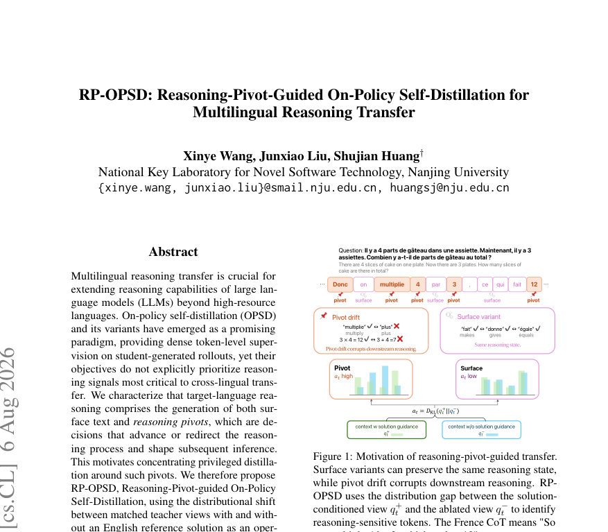
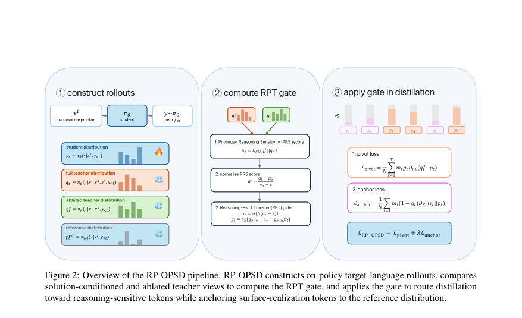
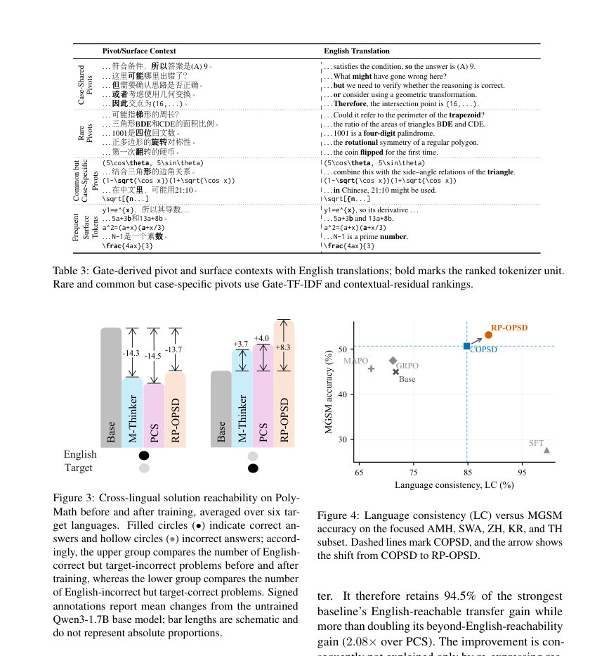

# RP-OPSD: Reasoning-Pivot-Guided On-Policy Self-Distillation for Multilingual Reasoning Transfer

- **게시일:** 2026-08-09
- **arXiv:** [2608.06347v1](http://arxiv.org/abs/2608.06347v1) · [PDF](https://arxiv.org/pdf/2608.06347v1)
- **저자:** Xinye Wang, Junxiao Liu, Shujian Huang
- **분야:** cs.CL
- **선정 점수:** 3.89
- **선정 이유:** 최근성 0.5, 인용 영향 0.0 (인용 0회), 저자 영향 0.0 (최고 h-index 0), AI 주제 적합성 2.6, 개발자 관심 0.5, 학술 신호 0.3, 오픈 웨이트·주요 연구조직 신호 0.0

[← 2026-08-09 목록으로 돌아가기](../daily/2026-08-09.html)

<!-- paper-visuals:start -->
## 주요 Figure

> 원문 PDF에서 실제 Figure 캡션과 그림 영역이 함께 확인된 자료만 자동 추출했다.

*Figure · 원문 PDF 1쪽 · Figure 1: Motivation of reasoning-pivot-guided transfer.*

*Figure · 원문 PDF 4쪽 · Figure 2: Overview of the RP-OPSD pipeline. RP-OPSD constructs on-policy target-language rollouts, compares*

*Figure · 원문 PDF 7쪽 · Figure 3: Cross-lingual solution reachability on Poly-*

<!-- paper-visuals:end -->

## 한 문장 요약

영어 참조 해답의 유무로 구분되는 교사 분포의 토큰별 분포 차이를 DKL로 측정해 'Reasoning-Pivot Transfer(RPT)' 게이트를 만들고, 이 게이트로 온-폴리시 자기증류를 이유 결정 위치(피벗) 중심으로 라우팅하여 다국어 수학적 추론 성능을 향상시키는 RP-OPSD 방법을 제안한다.

## 해결하려는 문제

대규모 언어모델의 연쇄추론(Chain-of-Thought) 능력은 영어 등 고자원 언어에서 잘 발현되지만 저자원 언어로의 전이는 불균형하다. 기존 방법들(SFT 번역 라벨링, RL 기반 보상, OPSD의 균일 토큰 가중치 등)은 타겟 언어의 표면적 실현(surface text)과 실질적 추론 결정을 구분하지 못해 전이 가능한 핵심 추론 신호(pivots)를 우선적·선택적으로 감독하지 못한다. 본문은 어떤 토큰에 더 강한 특권(privileged) 증류를 적용해야 하는지를 식별하는 문제(어디를 전송할 것인가)를 다룬다.

## 핵심 기여

- 영어 참조 해답(solution) 가용 여부로 구분되는 두 가지 매치된 교사 뷰(solution-conditioned q+ 및 ablated q-)의 분포 차이(DKL)를 'Privileged Reasoning Sensitivity(PRS)'로 정의하여 토큰별로 추론-민감도를 정량화함.
- PRS를 정규화해 sigmoid로 변환한 'Reasoning-Pivot Transfer(RPT) 게이트'를 제안하고, 이 게이트로 토큰 단위 감독(signal)을 전이(privileged distillation)와 참조 앵커링(reference anchoring)으로 라우팅하는 RP-OPSD 학습 목표(Lpivot + λLanchor)를 설계함.
- 온-폴리시 자기증류(teacher는 동일 모델의 stop-gradient 평가) 관점에서 특권 컨텍스트를 추론-중요 토큰에 집중적으로 적용하고, 표면적 실현은 frozen reference 정책으로 앵커링해 언어 표현을 보존하는 이분화된 학습 프레임워크를 제안함.
- 17개 언어(주로 12개 아프리카어 포함)와 두 개의 수학적 추론 벤치마크(AfriMGSM, PolyMath)에서 Qwen3-1.7B/4B 기반 실험을 통해 COPSD 및 여러 SOTA 방법 대비 일관된 성능 향상을 보이고, 다양한 분석(게이트-기능 대응, 게이트 기반 절단 실험, thought-anchor 정렬 등)을 통해 게이트가 실질적 추론 피벗을 포착함을 실증함.
- 게이트 가시성·해석성 분석을 통해 고-게이트 토큰이 'reasoning-control transition' 혹은 'problem-conditioned state-update'에 해당하고 저-게이트 토큰은 주로 표면·기호적 실현임을 보이며, matched teacher view가 teacher–student 잔차 기반 대안보다 더 적합함을 증명함.

## 접근 방법

* 기본 설정: 훈련 인스턴트는 저자원 언어 문제 x_ℓ, 영어 번역 x_h, 그리고 영어 참조 추론 s_h(English trace)을 갖는다.
* 학생(policy) π_θ는 저자원 입력 x_ℓ로부터 온-폴리시 롤아웃 y_{1:T} ~ π_θ(·\|x_ℓ)을 생성하고 학생의 다음-토큰 분포 p_t = π_θ(·\|x_ℓ, y_{<t})에만 그래디언트를 준다.
* 교사 분포는 같은 모델의 stop-gradient 평가로 얻는다.
* 두 교사 뷰: (1) solution-conditioned q^+_t = sg[π_θ(·\|x_ℓ, x_h, s_h, y_{<t})], (2) ablated q^-_t = sg[π_θ(·\|x_ℓ, x_h, y_{<t})].
* PRS: a_t = D_KL(q^+_t \|\| q^-_t)로 정의해 '참조 해답이 동일 접두사에서 다음-토큰 선호를 얼마나 바꾸는가'를 측정한다.
* a_t는 실행 중 평균·분산(EMA 기반)으로 정규화하고 ˜a_t를 얻는다.
* RPT 게이트는 g_t = sg[g_min + (1 - g_min) σ(β(˜a_t - τ))]로 계산(σ는 sigmoid)되어 토큰별 라우팅 계수로 작동한다.
* 라우팅된 학습 항은 두 개의 전체 어휘 forward-KL이다: 피벗 전송(L_pivot) = (1/N) Σ_t m_t g_t D_KL(q^+_t \|\| p_t)로 특권-교사 분포에 학생을 정렬하고, 언어 앵커(L_anchor) = (1/N) Σ_t m_t (1 - g_t) D_KL(r_t \|\| p_t)로 frozen reference 정책 r_t(π_ref의 stop-gradient 다음-토큰 분포)에 학생을 정렬한다.
* 전체 목적은 L = L_pivot + λ L_anchor(λ은 앵커링 강도).
* 구현·훈련: Qwen3-1.7B/4B에서 LoRA로 적응, OpenThoughts에서 각 언어별 500 예제로 학습, 평가는 AfriMGSM(pass@12)와 PolyMath(DW-ACC).
* 게이트 정규화·워밍업(EMA z-score, gate warmup 5%+5%)과 하이퍼파라미터(β=2, τ=0, g_min=0.05, λ=0.2 등)는 본문/부록에 명시됨.

## 주요 결과

- 주요 비교(표 1): AfriMGSM(12 아프리카 언어)에서 Qwen3-1.7B 기준 RP-OPSD 평균 pass@12 = 19.07, COPSD = 16.70로 COPSD 대비 +2.37점, Qwen3-4B에서는 RP-OPSD 평균 = 26.83, COPSD = 21.63으로 +5.20점 향상.
- PolyMath(다섯 중·고자원 언어 + Swahili) DW-ACC: Qwen3-1.7B에서 RP-OPSD 평균 = 17.97 vs COPSD 15.99 (+1.98); Qwen3-4B에서 RP-OPSD = 31.87 vs COPSD 29.94 (+1.93). 본문은 또한 RP-OPSD가 EGRSD, M-Thinker, MAPO 등 여러 기준선보다 우수하다고 보고함.
- 게이트 기능 검증(표 2): Qwen3-1.7B SWA에서 상위 20% 토큰만 특권 증류(TG)일 때 pass@12=26.0, 무작위(RG)=20.8, 하위(BG)=15.6으로 TG>RG>BG 순을 보이며, 전체 RP-OPSD(연속 게이트+앵커링)는 29.6으로 가장 우수. FRA(중자원)에서는 TG 74.8, RG 74.0, BG 73.2, RP-OPSD 76.8로 유사한 순서이나 차이가 작음. '참조 앵커링' 제거(λ=0)는 성능 저하를 초래(예: FRA 76.8→73.6).
- 게이트-생성 정밀도(Thought-anchor 정렬, 그림 6): 문장 수준 receiver-defined thought-anchor와의 정렬에서 RPT는 macro nDCG(상위 10/20/30% 컷오프)에서 0.699/0.672/0.684로 다른 지표(entropy, surprisal, KD loss 등)보다 우수하고, macro AUPRC는 RPT=0.463(다른 방법들 0.413, 0.393, 0.387, 0.334).
- 게이트-스코어 설계 검증(표 4): matched teacher-view(PR S = D_KL(q^+||q^-))를 사용한 경우가 teacher–student 대안 D_KL(q^+||p)보다 성능이 높음(예: ZHO PolyMath DW-ACC 25.49 vs 23.46, SWA pass@12 29.6% vs 27.2%). 이는 ablated teacher(q^-)가 문맥을 통제하는 중요성의 근거임을 시사함.

## 한계

- 저자 명시/근거 기반 제한: (1) 훈련은 각 타깃 언어별로 개별 적응 모델을 학습하는 방식이며(공유 모델이 아님), 본 연구에서는 언어별로 별도 모델을 학습했음. (본문 3.1)
- 저자 언급: PolyMath(난이도 가중 지표)에서의 개선 폭은 AfriMGSM보다 작으며(어려운 문제에 대해서는 개선이 더 어려움), 이는 난이도 높은 사례에서 추가 향상이 힘들다는 점을 본문에서 지적함.
- 실험 범위에서 확인되는 제약(분석적 관찰): (1) 방법은 영어 참조 해답(s_h)의 이용을 전제로 하므로 영어 해답을 확보해야 적용 가능함(영어 참조가 없는 태스크에는 직접 적용 불가). (2) 훈련 중 두 개의 교사 뷰(q^+, q^-)와 추가로 frozen reference 분포 r_t를 평가해야 하므로 학습 시 추가 전방 계산이 필요함(본문 구조상 명시되나 정확한 비용 수치는 제공되지 않음).
- 재현성 관련 제약: 논문은 하이퍼파라미터와 LoRA 설정 등 상세값을 제공하나(부록), 무작위성(시드), 전체 학습 비용·GPU 시간 등의 완전한 재현 정보는 본문에 제시되지 않음.

## 개발자 관점

- 필요 조건: RP-OPSD는 각 훈련 예에 영어 참조 추론(s_h)과 영어 번역(x_h)을 요구하므로 영어 참조 수집 파이프라인이 필요하다. (본문 2.2, 3.1)
- 게이트 설계·하이퍼파라미터: PRS는 D_KL(q^+||q^-)로 계산하고 EMA z-score로 정규화(EMA decay 0.99), 게이트 파라미터는 β=2, τ=0, g_min=0.05, 앵커링 계수 λ 기본값 0.2(민감도 실험에서 λ=0.2가 최적화된 설정으로 보고). gate warmup(5% uniform + 5% interpolation) 사용 권장(부록 I).
- 훈련 실무: 저자들은 COPSD의 설정을 계승하며 LoRA(r=64, α=128), batch size 32, LR 5e-6, max completion length 2048 등을 사용함(부록 I). 동일 모델을 교사로 stop-gradient로 평가하므로 별도 거대한 교사 네트워크가 필요하지 않음.
- 게이트 검증: 게이트의 실효성을 확인하려면 표면적 보존 지표(language consistency, LC)와 문제별 thought-anchor 정렬을 함께 모니터링하라. RP-OPSD는 LC를 유지하면서 정확도를 올리는 것이 목표이므로 LC 악화가 있으면 λ 또는 g_min 조정 필요(본문 4.4).
- 설계상의 주의: PRS를 D_KL(q^+||p)와 같이 학생 잔차에 기반해 계산하면 표면적 불일치나 교사-학생 보정 문제를 과대 강조할 수 있으므로, matched ablated teacher(q^-)를 포함한 대조가 중요함(본문 4.2, 표 4).

**근거 범위:** 이 분석은 제공된 논문 PDF 본문(메인 텍스트 및 부록 포함)을 기반으로 작성했다. 표와 그림의 수치(예: 표 1, 표 2, 표 4, 표 8, 그림 6)는 본문·부록에서 직접 인용했으며, 논문에 명시되지 않은 임의의 실험 시드·학습 시간·정확한 GPU 비용 등은 추정하지 않았다. 구현 세부(예: 전체 학습 클럭 타임)는 본문에 나타나지 않아 평가에 포함되지 않았다.
