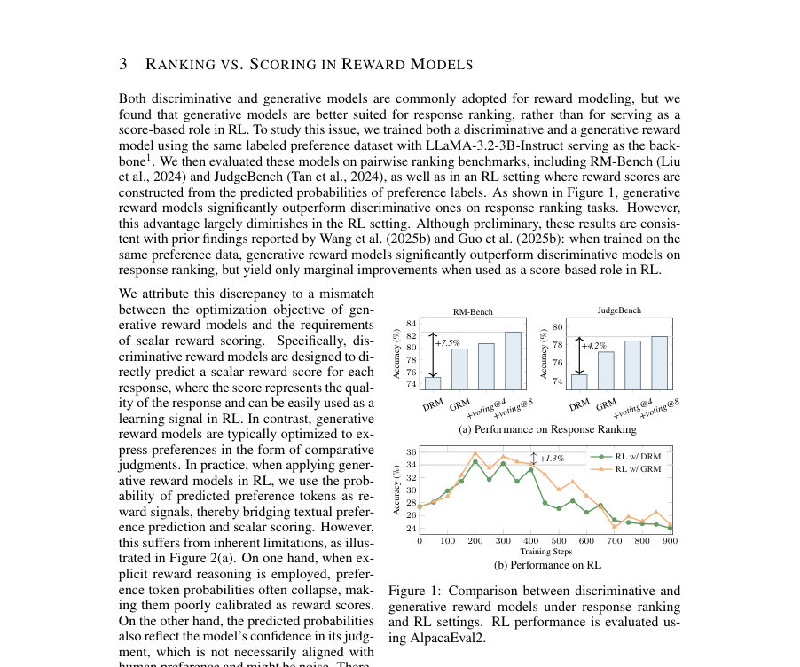
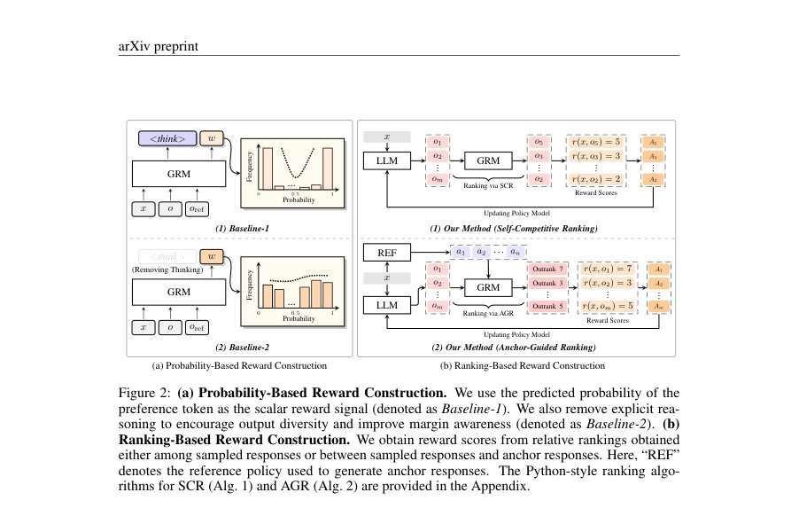
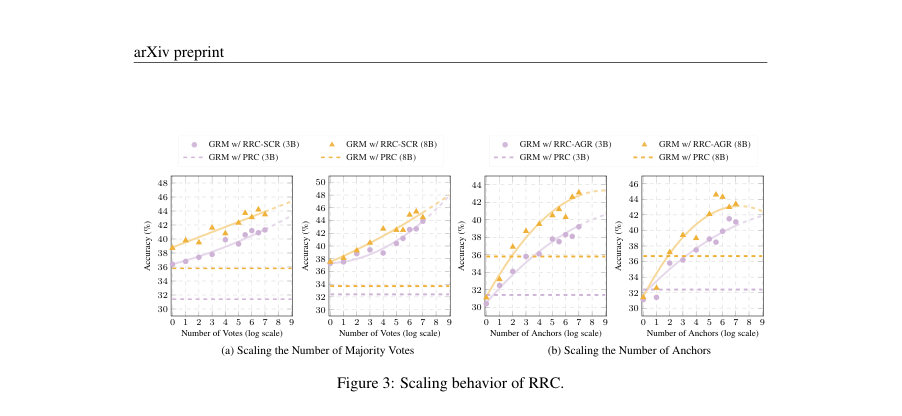

# RRC: Unlocking Generative Reward Models in LLM Reinforcement Learning via Ranking-Based Reward Construction

- **게시일:** 2026-08-08
- **arXiv:** [2608.06310v1](http://arxiv.org/abs/2608.06310v1) · [PDF](https://arxiv.org/pdf/2608.06310v1)
- **저자:** Chenglong Wang, Ziming Zhu, Yifu Huo, Bei Li, Qiaozhi He, Yan Ding, Xiaoyang Hao, Yuxin Gao, Tianhua Zhou, Xiaojia Chang, Tongran Liu, Jingbo Zhu
- **분야:** cs.LG, cs.CL
- **선정 점수:** 3.94
- **선정 이유:** 최근성 0.5, 인용 영향 0.0 (인용 0회), 저자 영향 0.0 (최고 h-index 0), AI 주제 적합성 2.9, 개발자 관심 0.2, 학술 신호 0.3, 오픈 웨이트·주요 연구조직 신호 0.0

[← 2026-08-08 목록으로 돌아가기](../daily/2026-08-08.html)

<!-- paper-visuals:start -->
## 주요 Figure

> 원문 PDF에서 실제 Figure 캡션과 그림 영역이 함께 확인된 자료만 자동 추출했다.

*Figure · 원문 PDF 4쪽 · Figure 1: Comparison between discriminative and*

*Figure · 원문 PDF 5쪽 · Figure 2: (a) Probability-Based Reward Construction. We use the predicted probability of the*

*Figure · 원문 PDF 9쪽 · Figure 3: Scaling behavior of RRC.*

<!-- paper-visuals:end -->

## 한 문장 요약

생성형(Generative) 보상 모델의 비교(순위) 능력을 RL에 활용하기 위해, 응답들 간의 상대적 순위를 바탕으로 스칼라 보상을 구성하는 Ranking-based Reward Construction(RRC)을 제안하여 RL 학습 신호를 개선한다.

## 해결하려는 문제

기존 RL 파이프라인은 보상 모델에 대해 각 응답에 대한 스칼라 점수를 요구한다. 반면 최근의 생성형 보상 모델은 비교(우선순위·판단) 형태로 학습·추론하도록 설계되어 응답 순위 판단에는 강하지만, 그 확률(선호 토큰 확률)을 그대로 스칼라 보상으로 사용하는 기존 방식은 CoT(Chain-of-Thought) 등의 추론을 사용할 때 확률 붕괴(probability collapse)나 신뢰도(모델 확신)가 보상과 일치하지 않는 문제로 인해 RL 성능으로 잘 전이되지 않는다. 따라서 '비교적' 출력을 내는 생성형 보상 모델의 본질과 RL이 요구하는 '스칼라 보상' 패러다임 사이의 불일치가 핵심 문제이다.

## 핵심 기여

- 생성형 보상 모델의 비교적 성격을 보전하면서 RL에 적용할 수 있도록, 응답들 간의 상대적 순위로부터 스칼라 보상을 구성하는 Ranking-based Reward Construction(RRC)를 제안함.
- RRC의 두 구현 전략 제안: 1) Self-Competitive Ranking(SCR) — 같은 입력에서 샘플된 응답들 간의 쌍별 비교로 토너먼트(순위)를 구성해 승수 기반 보상을 부여, 2) Anchor-Guided Ranking(AGR) — 소수의 기준 응답(anchor)과의 비교만으로 O(m·n) 쿼리로 보상 구성하여 확장성 개선.
- 쌍별 비교의 불확실성 완화를 위한 majority voting(다중 추론 병합)과, 쌍별 비교의 순환·모순을 해결하는 Kemeny-rule 기반의 Conflict-Aware Ranking Adjustment(CARA)를 도입함.
- 이론적 분석(부록)으로 margin-awareness(보상 차이가 응답 품질 차이를 반영해야 함)의 중요성 및 기준(참조) 정책으로부터 생성된 anchor를 사용하여 보상 안정성을 확보하는 근거 제시.
- 개방형 챗·추론 벤치마크들(AlpacaEval2, ArenaHardV2, WildBench, MMLU-Redux, MATH-500 등)에서 RRC(SCR/AGR)가 기존의 확률기반 보상(PRC)과 차별화된 성능 향상을 일관되게 달성함을 실험으로 검증하고, 투입 추론 예산(투표 수·anchor 수)에 따른 확장성(성능 스케일링) 경향을 제시함.

## 접근 방법

* 전체 접근 요약: 생성형 보상 모델(GRM)을 쌍별 선호 판정기로 사용하고, GRM의 비교(우월/열위) 예측들로부터 순위를 유도한 뒤 그 순위로부터 스칼라 보상값을 계산하여 기존 RL 알고리즘(GRPO 등)에 투입한다.
* 주요 구성요소:
* Self-Competitive Ranking (SCR): 동일 입력 x에 대해 정책에서 m개의 응답 {o1,...,om}을 샘플링하고, 모든 서로 다른 쌍(oi,oj)에 대해 GRM으로 쿼리해 oi ≻ oj 혹은 반대를 예측한다.
* 다중 쿼리 시 majority voting을 통해 각 쌍의 우위 방향을 결정하고, 모든 쌍별 승리 수(또는 가중치 합)를 이용해 각 응답의 보상을 계산한다: r(x,oi)=α * sum_{j≠i} 1[oi ≻ oj].
* 쌍별 예측의 순환·모순은 가중 Kemeny-rule 기반 집계(부록의 greedy heuristic)를 사용해 전역적 일관 순위로 정리한다.
* (논문에서 SCR의 쿼리 복잡도를 O(m·log m)으로 기술)
* Anchor-Guided Ranking (AGR): 샘플 응답 수 m이 클 때 쌍별 전부 비교는 비용이 크므로, 고정된 소수의 anchor {a1,...,an}를 참조(논문은 reference policy로 생성된 anchor 사용을 권장)로 삼아 각 oi에 대해 n회 비교만 수행한다.
* 보상은 r(x,oi)=α * sum_{k=1..n} 1[oi ≻ ak]로 정의된다.
* AGR는 쿼리 복잡도가 O(m·n)이며, anchor는 사전생성(프리컴퓨트)하여 학습 중 안정적인 기준으로 사용한다.
* 다중추론(majority voting): GRM의 쿼리는 확률적이므로 각 쌍·anchor 비교를 V번 반복하여 투표 집계로 강건하게 만든다.
* 투표 수(V)를 늘리면 성능이 향상되나 수익 체감이 존재한다.
* Conflict-Aware Ranking Adjustment (CARA): SCR에서 발생하는 비전이적 순환을 줄이기 위해 쌍별 선호를 가중 그래프로 구성하고, 가중치 차가 큰 쌍부터 우선 확정하고 전이폐쇄(transitive closure)를 적용해 사이클을 제거하는 탐욕적 해법을 사용한다.
* 통합·학습 절차:
* 1) GRM(생성형 보상 모델)을 HelpSteer3 등 선호 데이터로 학습(생성적 CoT 포함 가능).
* 2) RL(정책 πθ)은 GRPO 기반 훈련으로, 각 배치에서 m개 응답을 샘플링하고 RRC(SCR 또는 AGR)로 r(x,o)를 계산.
* 3) GRPO에서 그룹 정규화 이점을 사용해 advantage를 At = (r(x,ot) - μ)/σ 로 계산해 정책 업데이트에 사용한다.
* 4) AGR의 anchor는 reference policy로 사전 생성해 고정하여 보상-목표의 이동을 방지한다.
* 부수적 구현 세부사항(논문에 명시된 것): 보상 스케일링 인자 α 사용(논문 기본 α=0.1), 응답-레이블 슬롯의 위치 편향을 줄이기 위해 Response A/B 무작위 배정, vLLM 병렬 호스팅으로 GRM 병렬 쿼리, 비동기 보상 쿼리로 정책 최적화와 겹침 처리.

## 주요 결과

- 주요 벤치마크: AlpacaEval2(805 prompts, head-to-head), ArenaHardV2(500 hard queries), WildBench, MMLU-Redux, MATH-500 등에서 평가.
- 핵심 정량 성과(논문에서 제시된 대표 수치): AlpacaEval2 성능이 기존 확률기반 보상(PRC)에서 35.8% → RRC-AGR+voting@8로 41.3%로 개선(논문 초록 및 표에 제시). ArenaHardV2는 8.0% → 11.2% 개선 사례가 보고되었고, MMLU-Redux는 52.9% → 57.3%로 개선되었다(본문/초록 수치).
- 세부표(Table 1): 8B-scale 보상 모델, reasoning(Thinking) 설정에서 GRM w/ PRC: AlpacaEval2 = 35.8; RRC-SCR+voting@8 = 40.0; RRC-AGR+voting@8 = 41.3 (동일 조건). 3B-scale 보상 모델에서도 RRC-SCR(36.4) 및 RRC-AGR(35.8)가 PRC(31.4)보다 높은 성능을 보였고, voting@8로 추가 향상됨(예: SCR 36.4→37.8).
- 계산 비용/효율성 분석: 표 4에 따르면 (8B·Thinking) 기준으로 베이스라인(GRM w/ PRC) 교육 시간 10.5h 대비 RRC-SCR 13.2h(AlpacaEval2 +2.9 절대포인트), RRC-AGR 10.6h(+3.6 절대포인트), RRC-AGR+voting@8 11.8h에 최고 성능(41.3)을 달성하여 AGR가 실용적 효율성 측면에서 우수함을 보임.
- 확장성·스케일링: 투표 수(V)와 anchor 수(n)를 증가시키면 일관되게 성능 향상이 관찰되며(논문 Figure 3), 다만 수익 체감(diminishing returns)이 존재함. 또한 anchor 수가 매우 커지면(예: 256) 성능 포화 또는 약간 저하되는 현상(중복·저정보성 비교 때문)이 보고됨(본문).

## 한계

- 저자가 명시한 한계: SCR의 쌍별 비교는 쿼리 비용이 크며(논문은 O(m·log m)로 기술; 부록에서는 NSCR = m(m−1)/2로 표기), 대규모 샘플링에서 계산 비용이 실용적 제약이 있음. 이를 완화하기 위해 AGR(anchors)를 제안했음.
- 저자가 명시한 한계: 다중 투표·anchor 수 확장에는 성능 향상 대비 계산비용 트레이드오프가 존재하고, anchor 수가 매우 클 경우(예: 256) 오히려 성능 포화 혹은 약간의 저하가 발생할 수 있음을 관찰했다고 보고함.
- 저자가 명시한 한계: 생성형 보상 모델을 토큰 확률로 점수화하면 CoT 사용 시 확률 붕괴(확률이 극단값으로 몰림)가 발생하여 스칼라 보상으로서 해상도가 낮아진다는 점(본문 및 표 6의 확률 분포로 제시).
- 논문 본문으로부터 합리적으로 확인되는 한계(추론): 방법의 성능은 생성형 보상 모델의 품질(추론 능력·일관성)에 크게 의존하며, GRM의 대규모 추론·다중 쿼리 비용과 평가 시 자동 평가자(GPT-4o/GPT-5)에 의존하는 점이 현실 적용 시 비용·평가 편향의 리스크를 초래할 수 있음.

## 개발자 관점

- 생성형 보상 모델을 RL에 적용할 때는 직접적 확률(선호 토큰 확률)을 보상으로 쓰지 말고, 응답 간의 비교(순위)로부터 보상을 구성하는 것이 실험적으로 더 효과적임.
- 실무적으로는 AGR(소수의 reference anchor 사용)를 기본 선택지로 고려할 것 — 샘플링 예산이 큰 경우 SCR보다 쿼리·시간 효율성이 우수하고 성능도 경쟁적임.
- GRM 쿼리는 병렬화(vLLM 등)와 비동기화로 겹침(overlap)을 구현해 학습 효율을 높여야 하며, anchor는 사전 생성하여(논문은 16 GPU에서 약 1시간 소요로 언급) 학습 중 재사용하면 비용 절감에 도움이 됨.
- 다중 추론(majority voting)은 노이즈 완화에 실질적 이득이 있으므로 투표 수 V를 하드웨어·시간 제약에 맞춰 늘려보되, 성능은 수익 체감함을 고려해 적절한 V(논문에서는 8 등)를 선택할 것.
- Conflict-Aware Ranking Adjustment(CARA) 같은 순위 충돌 해소 절차를 도입해 일관된 전역 순위를 확보하라(제거되지 않은 순환은 학습 신호 왜곡을 초래함). CARA는 실험에서 유의미한 성능 향상을 보였음(예: AE2에서 0.6–1.9% 개선 보고).

실험·검증 관행: 검증 체크포인트 선정 시 자동 judge(GPT-4o/GPT-5)를 사용한 검증을 논문이 사용하므로, 실제 배포 전에는 인간 평가 및 다중 평가자 기반의 검증도 병행할 것(평가 편향 대비).

**근거 범위:** 이 분석은 제공된 논문 PDF 본문(주요 본문, 표, 부록 및 캡션 포함)을 근거로 작성되었음. 본문에서 제시된 수치(예: 성능, 학습시간, 확률 분포)와 알고리즘·복잡도 표기는 원문에 따라 인용하였음. 다만 논문 내부에 'SCR 쿼리 복잡도' 표기(본문에서 O(m·log m))와 부록의 정확한 조합(부록에서 NSCR = m(m−1)/2)이 일관되지 않는 표기가 있어, 복잡도 표기는 원문 기술을 그대로 인용했음을 밝힘. 또한 평가에는 자동 평가자(GPT-4o, GPT-5)가 사용되었으므로 평가 편향 가능성은 본문에서 확인되는 제약임.
