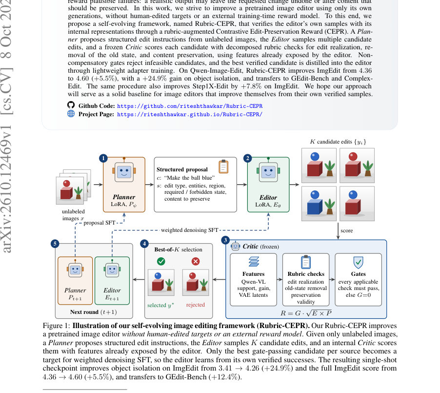
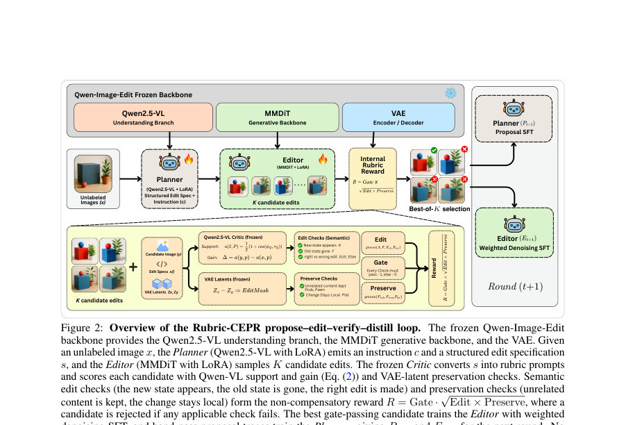
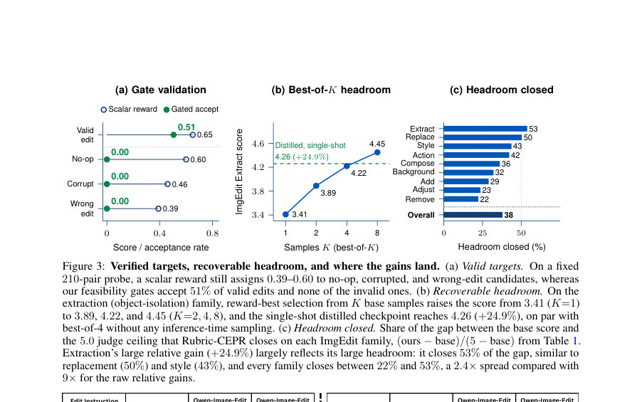

# Rubric-CEPR: Self-Evolving Image Editing via Reward-Verified Self-Distillation

- **게시일:** 2026-10-10
- **arXiv:** [2610.12469v1](http://arxiv.org/abs/2610.12469v1) · [PDF](https://arxiv.org/pdf/2610.12469v1)
- **저자:** Ritesh Thawkar, Shubham Patle, Shravan Venkatraman, Rao Muhammad Anwer
- **분야:** cs.CV
- **선정 점수:** 6.12
- **선정 이유:** 최근성 0.7, 인용 영향 0.0 (인용 0회), 저자 영향 2.0 (최고 h-index 39), AI 주제 적합성 1.1, 개발자 관심 0.2, 학술 신호 0.6, 오픈 웨이트·주요 연구조직 신호 1.5

[← 2026-10-10 목록으로 돌아가기](../daily/2026-10-10.html)

<!-- paper-visuals:start -->
## 주요 Figure

> 원문 PDF에서 실제 Figure 캡션과 그림 영역이 함께 확인된 자료만 자동 추출했다.

*Figure · 원문 PDF 1쪽 · Figure 1: Illustration of our self-evolving image editing framework (Rubric-CEPR). Our Rubric-CEPR improves*

*Figure · 원문 PDF 4쪽 · Figure 2: Overview of the Rubric-CEPR propose–edit–verify–distill loop. The frozen Qwen-Image-Edit*

*Figure · 원문 PDF 9쪽 · Figure 3: Verified targets, recoverable headroom, and where the gains land. (a) Valid targets. On a fixed*

<!-- paper-visuals:end -->

## 한 문장 요약

사전학습된 이미지 편집기를 외부 보상이나 사람이 편집한 정답 없이 자체 생성물로 검증·증류하여 성능을 향상시키는 Rubric-CEPR이라는 제안-편집-검증-증류 루프를 제시한다.

## 해결하려는 문제

강력한 instruction-기반 이미지 편집기라도 요청된 변경을 실제로 구현하지 못하거나(예: 객체 고립 실패) 보존해야 할 내용을 변경하는 등 '편집 계약(edit contract)'을 위반하는 사례가 남아 있다. 기존의 성능 개선은 (i) 사람이 만든 소스-타깃 쌍이나 (ii) 별도로 학습된 보상/평가 모델에 의존하는데, 둘 다 비용이 크고 스칼라 보상은 변화가 없는 출력이나 부분적·그럴듯한 실패를 보상할 위험이 있다. 본문은 외부 보상 모델이나 인간 타깃 없이, 오직 편집기 자신이 생성한 샘플과 편집기 내부 표현만으로 편집기를 개선할 수 있는가라는 질문을 다룬다.

## 핵심 기여

- Rubric-CEPR: 제안(Planner)–편집(Editor)–고정 Critic(검증자)–증류(LoRA SFT) 루프를 통해 인간 편집 타깃이나 외부 학습 보상 없이 사전학습 편집기를 자체 생성물로 개선하는 프레임워크를 제시한다.
- Contrastive Edit-Preservation Reward(CEPR)과 '룰브릭(rubric)'을 결합해 편집 실현(new-state 등장), 과거 상태 제거(old-state 제거), 보존(preservation) 등 구성요소를 분해 검증하고, 비보상적(Non-compensatory) 게이트로 불가능한 후보를 배제하여 그럴듯한 실패가 훈련표준이 되는 것을 방지한다.
- 편집기의 노출된 내부 멀티모달 표현(Qwen-VL 특징, VAE 잠재 등)만을 사용해 후보 편집을 점수화하고, 게이트 통과 최상위 후보를 편집기 쪽의 가벼운 LoRA 어댑터(denoising SFT)로 증류해 단일 샷(checkpoint)으로 성능을 개선한다.
- 제안된 절차가 Qwen-Image-Edit-2509와 Step1X-Edit에 적용 가능함을 보이고, ImgEdit, GEdit-Bench, Complex-Edit에서 전이성과 일관된 성능 상승을 실험적으로 검증한다.

## 접근 방법

* 목표는 인간 편집 타깃이나 외부 보상 모델 없이 X(무라벨 소스 이미지)와 사전학습 편집기 E0로부터 자체 검증된 샘플로 편집기를 개선하는 것이다.
* 구성요소와 절차는 다음과 같다.
* (1) Planner Pψ: 입력 이미지 x에 대해 자연어 지시문 c와 구조화된 편집 명세 s(편집 유형, 소스/타깃 엔터티, 목표 영역, 요구/금지 후상태, 보존 항목 등)를 생성한다.
* (2) Editor Eθ: 명령 c에 대해 K개의 후보 편집 y_i를 샘플링한다(주 실험에서는 K=4).
* Editor와 Planner는 가벼운 LoRA 어댑터로 적응한다.
* (3) Critic C(고정): 편집기 노출 내부 표현(평균풀링된 Qwen-VL 이미지·텍스트 최종층 특징 ϕQ, τQ와 VAE 잠재 zx, zy, 이미지 통계 등)을 사용해 구성된 룰브릭 프롬프트 집합에 대해 지지도 a(I,p)와 이득 d_p(y,x)=a(y,p)-a(x,p) 등을 계산한다.
* CEPR은 요청된 편집에 대한 지지 대비(대안(카운터팩추얼) 지시문과의 대비)와 보존(semantic·latent 보존의 기하평균)으로 구성된다.
* 룰브릭은 S(소스 접지), A(요구 후상태), F(금지 후상태), Prub(명시적 보존)과 추가적 비교항(Ectr, Etax)을 포함하며 집계는 기하평균 gmean를 사용한다.
* (4) 비보상적 게이트: 유효성(각 적용 가능한 검증 항목이 임계값 τ_u 이상)을 만족하지 못하면 후보는 훈련표준에서 배제된다.
* 보상 스칼라 R = G * sqrt(E * P)로 계산되며 G는 게이트(0/1).
* 유효성 V는 VAE 잠재 차이로 만든 지역 변화 마스크 M을 사용해 지역성·드리프트를 검사한다(구현 임계값은 Appendix F/A6에 기술).
* (5) 선택·증류: 게이트를 통과한 후보들 중 R이 최대인 y*만을 D+에 기록하고, 선택된 (x,c,y*,R*)로 편집기 어댑터를 weighted denoising SFT(원논문 기준 flow-matching denoising loss ℓ_native_FM)로 학습한다.
* Editor LoRA는 attention-only rank=16, α=16, 400 SFT steps, lr=1e-4(주실험).
* Planner는 reward-weighted token SFT로 학습(LoRA rank=16, α=32, 16 steps, lr=1e-5)하며 band-pass(모든 후보 실패/모두 통과 제외) 제약을 둔다.
* Critic과 참조 특징 인터페이스는 고정되어 훈련 중 기준이 표류하지 않도록 한다.
* 평가 시 단일 샘플(한 번의 생성) 규칙을 유지한다.

## 주요 결과

- ImgEdit (Qwen-Image-Edit-2509 기준): 전체 점수 4.36 → 4.60 (+5.5%, 증가량 +0.24 ± 0.02 SD over 3 seeds). 객체 고립(extraction) 항목: 3.41 → 4.26 (+24.9%). 다른 편집군들도 2.8%–4.3%의 개선을 보였으며, 가족별로 5.0 천장 대비 22%–53%의 잔여 격차를 메움(표와 Figure 3c).
- 전이 성능: 같은 체크포인트가 GEdit-Bench 전체 7.39 → 8.31 (+12.4%) 및 Complex-Edit 전체 8.77 → 8.97 (+2.3%)로 향상. 모든 보고된 하위 지표(예: Complex-Edit의 지각적 품질 +4.9%, 동일성 보존 +1.8%)도 개선.
- 다른 편집기 적용: Step1X-Edit에 동일 절차 적용 시 GEdit-Bench 6.69 → 7.24 (+8.2%, +0.55 ± 0.05 SD over 3 seeds) 및 ImgEdit 3.86 → 4.16 (+7.8%, +0.30 ± 0.06 s.e.)로 개선되어 내부 검증 방식이 특정 백본에 한정되지 않음을 보임.
- 검증·선택 품질: 210-페어 프로브에서 본 논문의 CEPR 기반 보상은 후보 편집 쌍에서 우수 편집을 선택하는 정확도가 pooled 84.8%였고(무작위 대비 크게 우수), 단순 보존·편집 곱 같은 'naive composite'는 36.7%에 머뎠음(Table 4). 고정된 verifier-bank은 유효 편집의 50.5%를 수용하면서(no-op/손상/잘못된 편집의 수용은 0%) 잘못된 후보를 배제함(표 A7).
- Best-of-K(샘플링 헤드룸): extraction 계열에서 reward-best 선택으로 K=1:3.41 → K=2:3.89 → K=4:4.22 → K=8:4.45로 개선되며, 단일 라운드의 증류된 체크포인트는 K=4 best-of의 성능에 근접한 4.26을 단일 생성으로 달성함(Fig 3b). 또한 Planner 학습은 gate-passing 가능한 소스 비율을 12.5% → 20.3%로 (+62.4% 상대증가) 올려 downstream 편집기 향상에 기여함.

## 한계

- (저자 명시) 본 방법은 편집기의 샘플링 분포에 '성공적 행동'의 비제로 확률(p>0)이 존재할 때만 증대 효과를 낸다(독립추출 가정 하에 K 후보로 타깃을 찾을 확률은 1-(1-p)^K). 즉 p=0인 편집은 K 증가로도 회수 불가하다.
- (저자 명시) 개선은 내부적으로 체크 가능한 성공 기준이 있는 편집군에 집중된다(예: 객체 고립에서 큰 이득, adjustment 계열은 내부 신호로는 작은 회복률).
- (저자 명시) 구현상 편집기의 멀티모달 내부 특징과 VAE 잠재에 접근해야 하므로 내부 접근을 제공하지 않는 폐쇄형(black-box) 상용 모델에는 적용하기 어렵다.
- (저자 명시) 평가가 자동화된 판정자(GPT-4o, VIEScore 등)에 의존하며, 본 결과는 해당 평가 프로토콜 내에서 해석되어야 한다. 또한 본 실험은 주로 단일 적응 패스(한 소스 풀에 대한 한 번의 증류)이며, 인간 평가·다중 라운드 학습 곡선·동일 예산에서의 비교(랜덤/스칼라/학습보상) 등이 추가로 필요하다.  
(본문 관찰) 편집 종류별 자가검증 가능성 차이가 크다: 'adjust' 계열은 내부 신호로 오라클 헤드룸의 작은 부분만 회수(예: Table A2에서 최대 30%)되어 편집군에 따라 기대효과가 달라진다.

## 개발자 관점

- 재현/요구조건: 에디터 내부의 멀티모달 특징(예: Qwen-VL의 ϕQ, τQ)과 VAE 잠재(zx, zy)에 접근할 수 있어야 하며, 편집기·이해 분기(understanding branch)가 고정된 상태로 노출되어야 한다. 논문은 Qwen-Image-Edit-2509와 Step1X-Edit에서 구현을 보였음.
- 핵심 하이퍼·구현 포인트: 후보 수 K=4(주 실험), Editor LoRA: attention-only rank=16, α=16, 400 denoising SFT steps, lr=1e-4; Planner LoRA: rank=16, α=32, 16 steps, lr=1e-5. 검증 임계값은 부문별로 Table A6에 제공됨(예: edit/preservation/validity/reward 임계값 0.40/0.20/0.50/0.30 등).
- 로버스트성: '비보상적 게이트' 설계(모든 적용가능 검증항목 통과 필요)는 그럴듯한 실패가 훈련 표준으로 유입되는 것을 막는 핵심 메커니즘이다. 실용적으로는 게이트 구성(예: editor-side VLM 체크 포함 여부)을 엄격히 설정해 잘못된 수용을 피해야 한다(ablations 참조, Table A7).
- 평가·모니터링: 훈련 매니페스트에 각 소스별 후보, 게이트 판정, 선택된 타깃과 거부된 후보를 로그하여 어떤 편집군에서 타깃이 생성되는지(accepted/rejected 비율)를 관찰해야 한다(논문은 rejected > accepted인 naive-loop 실패 사례를 제시).
- 적용·배포 고려사항: 방법은 외부 라벨링 비용을 크게 줄이지만, 내부 특징 접근과 후보 생성(각 소스당 K회 디퓨전 생성) 비용·계산량이 발생한다. 또한 선정된 내부 기준에 편향이 있으면 특정 실패 양상이 증폭될 수 있으므로(안전성) 인간 평가나 다중 라운드 검증을 권장한다. 마지막으로, 다른 편집기에도 적용 가능함을 논문이 보였으므로(예: Step1X-Edit) 사내 편집 파이프라인에 통합할 때는 해당 편집기의 특징·VAE 인터페이스를 먼저 점검해야 한다.

**근거 범위:** 이 분석은 제공된 논문 PDF 본문(주요 본문과 부록)의 내용만을 근거로 작성되었다. 본문과 부록에 명시된 수치(예: ImgEdit/GEdit-Bench/Complex-Edit 점수, LoRA 설정, K=4 등)와 표·그림을 직접 인용·요약했으며, 본문에서 확인되지 않은 구현 세부사항이나 추가 실험 결과는 임의로 생성하지 않았다. 일부 임계값·세부 구현은 Appendix A–F의 표/문단에 기술되어 있어 해당 부분을 참조하면 재현에 도움이 된다.
