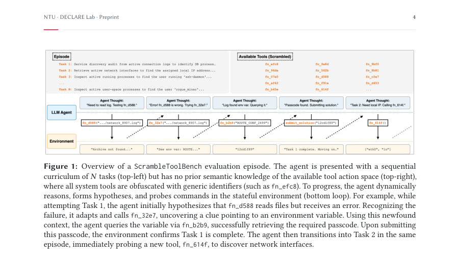
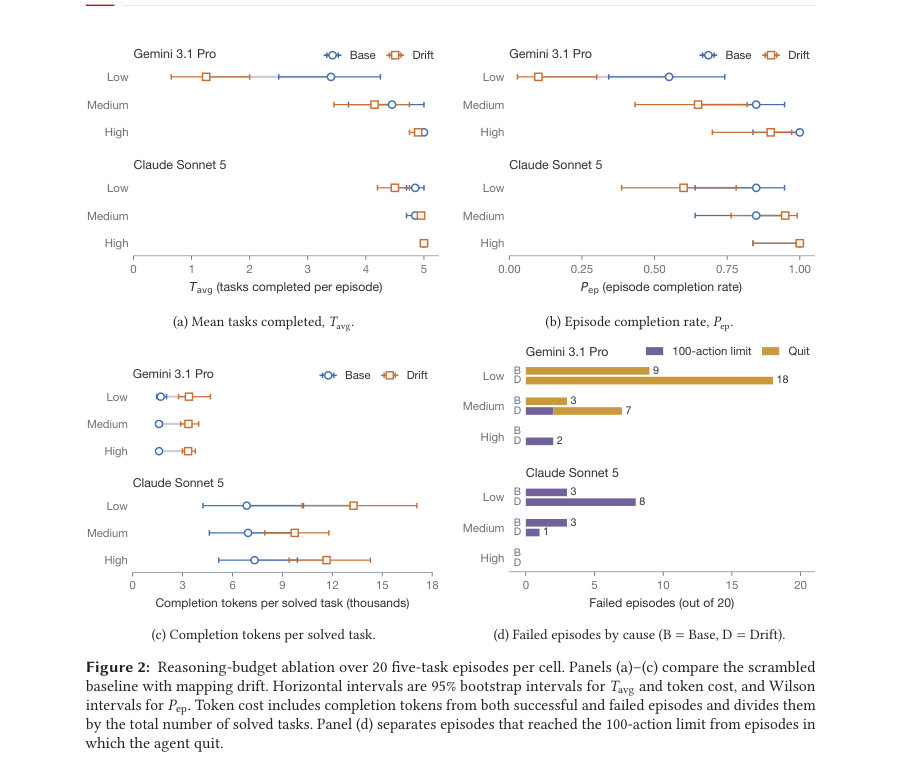

# ScrambleToolBench: Agents Search Exhaustively Even When Their Own Map Points to the Next Step

- **arXiv:** [2608.02358v1](http://arxiv.org/abs/2608.02358v1) · [PDF](https://arxiv.org/pdf/2608.02358v1)
- **저자:** Vernon Toh, Navonil Majumder, Zhengyuan Liu, Nancy F. Chen, Soujanya Poria
- **분야:** cs.CL
- **선정 점수:** 9.73
- **선정 이유:** 최근성 1.2, 핵심어: agent, 핵심어: reasoning, 핵심어: benchmark, 분야 가중치 2.0

### 한 문장 요약

ScrambleToolBench는 의미적 단서를 제거한 상호작용 터미널 벤치마크를 제시하고, 매핑 드 drift, 확률적 실패, 시간 창 등의 동적 환경에서 에이전트의 행동적 추론과 적응 능력을 검증한다.

### 해결하려는 문제

기존 도구 사용 벤치마크가 표준 API 명칭과 기능에 의존하는 의미적 선입견에 의해 에이전트의 추론이 잘 일반화되지 않으며, 환경이 비정상적으로 변화할 때도 에이전트가 자신의 내부 모델을 유연하게 수정하는지 평가하기 어렵다. 따라서 에이전트가 문서 없이 상호작용만으로 도구의 작동 원리를 추론하고, 매핑 변화나 일시적 실패 같은 비정상적 조건에서도 적응적으로 동작하는지 평가할 필요가 있다.

### 핵심 기여

- ScrambleToolBench를 제안/구현하여 도구 식별자, 매개변수, 출력 등을 의미적으로 은폐한 채 상호작용적으로 도구의 동작을 추론하도록 한다.
- 연속적 과제 커리큘럼과 3가지 동적 환경(매핑 드 drift, 확률적 실행 실패, 시간 실행 윈도우)을 도입해 환경 변화에 대한 추정 및 재설정을 평가한다.
- 동적 환경에서도 선도 모델이 초기 발견은 수행하더라도 매핑 드 drift 등 변화에 적응하지 못해 합성 성공률이 크게 하락하는 것을 실험으로 확인하며, All 조건에서 집계 완성률이 0.03까지 떨어진다(비교군 대비 큰 감소).
- 드 drift에 대한 저비용 회복 전략인 Cycle Tracing을 제시하고, 이의 예상 비용을 수식으로 모델화(E[Δ] ≈ 4.25 추가 호출)하며, 실제 모델들이 이를 일관되게 활용하지 못함을 분석한다.
- 메모리 기반 Baseline(+Memory)를 도입해 성능 회복력을 향상시키고, 메모리 프레이밍이 재학습 없이도 드리프트 및 윈도우에 대한 회복력을 높이며, 일정 수준의 기억 pruning이 필요하다고 제시한다.

### 접근 방법

에이전트 연구를 위한 터미널 기반 시뮬레이터를 활용한다. 핵심 API는 28개 도구(core API)와 4개의 메타 명령(submit_solution, skip_task, end_episode, memory_update)이며, 목표 도구의 스키마는 네 가지 차원에서 은폐(함수 식별자, 매개변수 키, 출력 필드, 실행 상태 토큰)된다. 학습은 비 semantic 프리미아를 제거하기 위한 obfuscation Φ를 이용해 각 에피소드 시작 시 도구 매핑을 부분적으로 무작위 순열로 재배치하고, 에피소드는 N개의 Task(T1..TN)로 구성된 순차 커리큘럼 속에서 진행된다. Task는 G_i(goal)과 누적 예산 B_actions를 부여받고, 솔루션 제출은 고정된 문자열 일치로 평가된다. 도구 세트는 20개 템플릿의 프로시저 형태(Task Templates) 위에 얹혀 있으며 Ground-truth 솔루션은 시뮬레이터가 계산한다. 매 실험은 고정된 난수 시드로 20에피소드, 각 에피소드 당 5개의 Task, Task별 최대 100 inferencing 스텝으로 수행된다. Drift는 ρ_drift ∈ [0,1]로 비선형 매핑을 재배치하고, p_fail ∈ [0,1]로 실행 실패를 확률적으로 발생시키며, 윈도우는 k=10으로 고정한다. 기억 기반 베이스라인은 Task Recipes와 Tool Knowledge라는 두 데이터베이스를 유지해 추론과 실행 상태를 분리하고 prompt에 직렬화해 주입한다. Cycle Tracing은 drift 이벤트에서 6회의 추가 호출로 매핑을 추적해 회복하는 저비용 전략으로 제시되며, 전체 비용은 48 액션의 완전 발견(reference) 비용 대비 평가된다.

### 주요 결과

- 비정상적 환경(scrambled Base)에서 대부분의 모델이 완성률 0에 수렴하는 반면, frontier 모델(Gemini 3.1 Pro, Gemini 3.5 Flash, Claude Sonnet 5)은 1.0의 완성률을 유지하거나 유의미하게 높은 성능을 보였다.
- All 조건(+ All)에서 완성률은 대폭 하락해 Claude Sonnet 5는 0.00으로 추락하고, Gemini 3.1 Pro는 0.20, Gemini 3.5 Flash는 0.25 수준으로 생존 모델만 남았다.
- ScrambleToolBench의 시작 단계에서 semantic priors에 의존하던 모델은 Base 모드에서 0.93/4.88의 Aggregate Completion Rate를 보였으나, All 조건에서 0.03/0.84로 급감했고, memory 도입 시 +0.09의 완성률 및 +0.59개의 해결 과제가 회복되었다(모델에 따라 차이가 있음).
- Action Efficiency(A_avg)은 scrambled Base에서 3~5배 증가하는 경향을 보였고, Drift는 추가적으로 증가시키며, Window는 특정 작업에 따라 감소 또는 증가를 보였다. 기억(memory) 도입은 Window 하의 효율성을 일부 향상시키나, Cycle Tracing의 활용 여부를 일정하게 보장하지 못했다.
- Cycle Tracing의 비용 모델은 E[Δ] = 4.25로 제시되며, Drift 이후 Task 2부터 회복에 필요한 추가 호출 수를 설명한다. 하지만 대부분의 모델은 이 cheaper recovery 경로를 일관되게 활용하지 못했고, Cycle Tracing의 follow-rate는 7%대 수준으로 저조했다(랜덤 선택 대비 소폭 우위에 불과).

### 한계

- 저자들이 명시적으로 한계 섹션을 따로 두지 않았으므로 한계는 주로 실험 설계의 제약에서 도출된다(다음 항목 참조).
- 시뮬레이션 기반의 터미널 환경으로, 실제 Docker 기반의 운영체제/API 환경이나 현실 세계의 API/도구 세팅과의 일반화가 제한될 수 있다.
- 에피소드 수(20)와 각 에피소드의 Task 수(5), 인퍼런스 예산(100) 등 평가 구성이 고정되어 있어, 더 큰 예산이나 다른 난이도에서의 일반화 가능성은 확인되지 않았다.
- 매개변수 드리프트는 ρ_drift=0.25, p_fail=0.15, 윈도우 k=10 등 고정된 설정에 국한되어 있어 다양한 비선형 매핑 드리프트 상황에서의 동적 적응성은 제한적으로만 평가된다. 또한 매핑 드리프트는 순환(permutation) 구조로 정의되어 있어, 다른 형태의 드ift에 대한 회복 전략의 일반성은 검증되지 않았다.

### 개발자 관점

- 재현성 확보를 위해 공개 코드와 동일한 설정(20 에피소드, 5 Tasks/에피소드, 100 단계 예산, ρ_drift, p_fail, k 등)을 사용하고 고정된 시드로 실험을 재현한다.
- 메모리 기반 Baseline 도입 시 Task Recipes와 Tool Knowledge의 JSON 포맷 예시를 Prompts에 주입하고, memory_update 필드를 통해 도구 매핑과 파라미터를 업데이트하도록 설계한다.
- 드 drift에 대한 저비용 회복 전략인 Cycle Tracing을 구현할 때는 7개 아이디의 사이클 구조를 가정하되, 사이클 길이가 알려지지 않은 경우에도 작동하도록 보강한다. 또한 9개 무인자 함수 호출(인자 있는 함수 19개 + 9개 무인자 함수)으로 전체 발견 비용을 구성하는 참조 비용(=48)과의 차이를 명확히 기록한다.
- 환경 dynamics의 독립성(Drift, Failure, Window)을 분리하여 각 요인이 성능에 미치는 영향을 정량화하는 실험 설계를 유지하되, 통합(All) 상황에서의 상호작용 효과를 주의깊게 분석한다.
- 특정 모델의 Stale Call, Retry Persistence 등의 실패 모드를 분석하고, Memory가 이들 모드에 어떤 영향을 주는지 표본별로 확인한다. Memory prune 정책의 중요성도 함께 평가한다.

## 주요 Figure

> 원문 PDF에서 실제 Figure 캡션과 그림 영역이 함께 확인된 자료만 자동 추출했다.

*Figure · 원문 PDF 4쪽 · Figure 1: Overview of a ScrambleToolBench evaluation episode. The agent is presented with a sequential*

*Figure · 원문 PDF 15쪽 · Figure 2: Reasoning-budget ablation over 20 five-task episodes per cell. Panels (a)–(c) compare the scrambled*

<!-- paper-visuals:end -->

**근거 범위:** 논문 PDF 본문 기반 분석. 제시된 수치와 실험 설정은 주어진 PDF 본문에서 직접 수집·정리하였다. 다만 표의 일부 구간은 요약해 기술되었고, 재현 시 표와 수치의 세부 값은 본문 표를 참고해야 한다. 또한 본 분석은 페이지 1–23의 내용에 의존하며, 부록 B/C의 상세 목록 및 코드의 실제 구현 세부는 링크된 코드베이스를 확인해야 한다.

---

- **소개 날짜:** 2026-08-04
- [← 2026-08-04 논문 목록으로 돌아가기](../daily/2026-08-04.md)
- [일별 아카이브 보기](../daily/index.md)

