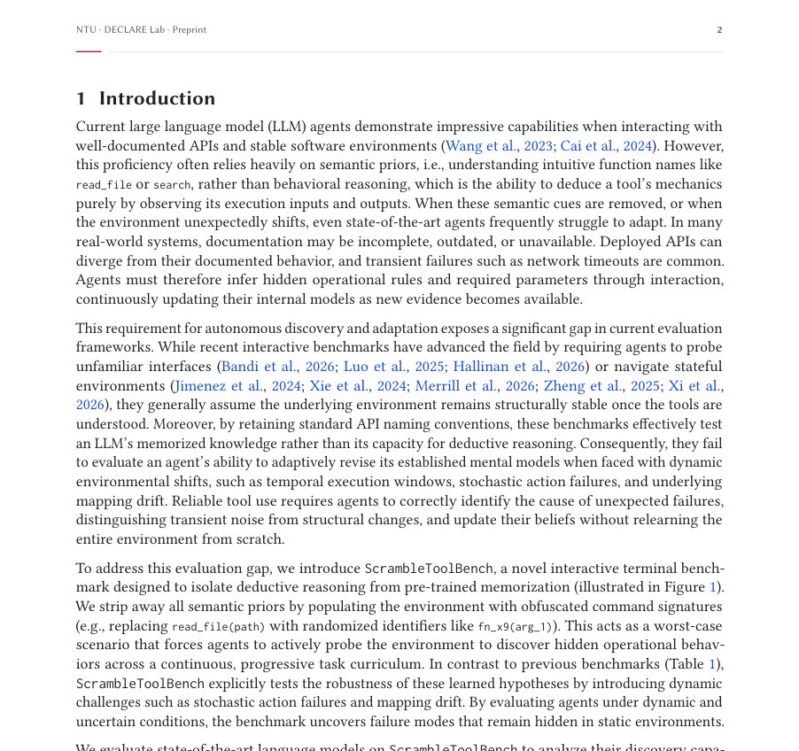
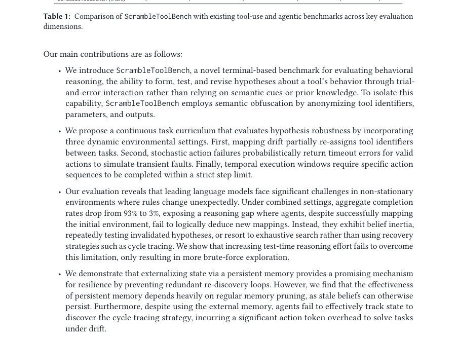
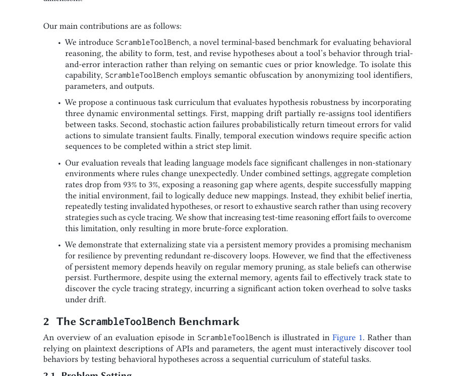

# ScrambleToolBench: Agents Search Exhaustively Even When Their Own Map Points to the Next Step

- **arXiv:** [2608.02358v1](http://arxiv.org/abs/2608.02358v1) · [PDF](https://arxiv.org/pdf/2608.02358v1)
- **저자:** Vernon Toh, Navonil Majumder, Zhengyuan Liu, Nancy F. Chen, Soujanya Poria
- **분야:** cs.CL
- **선정 점수:** 9.73
- **선정 이유:** 최근성 1.2, 핵심어: agent, 핵심어: reasoning, 핵심어: benchmark, 분야 가중치 2.0

### 한 문장 요약

ScrambleToolBench라는 상호작용 터미널 벤치마크를 도입하여 도구 행동의 의미적 단서를 제거하고 연속적·동적 과제를 통해 에이전트의 행동적 추론과 적응 능력을 평가했다.

### 해결하려는 문제

기존 도구 사용 벤치마크는 정적 환경과 의미적 도구 스키마를 노출하여 에이전트가 문서나 선행 지식을 통해 해결하게 만들며, 이로 인해 에이전트가 상호작용만으로 미지 시스템의 행동을 자율적으로 탐구·추론하는 능력을 제대로 평가하기 어렵다.

### 핵심 기여

- ScrambleToolBench라는 상호작용 터미널 벤치마크를 제안하여 도구의 의미적 단서를 제거함으로써 순수한 행동적 추론(behavioral reasoning)을 고립시켜 평가할 수 있게 함.
- 연속적 과제 커리큘럼을 강제하여 에이전트가 시행착오(trial-and-error)를 통해 숨겨진 도구 동작을 단계적으로 발견하도록 설계함.
- 맵핑 드리프트(mapping drift), 확률적(확률적) 액션 실패, 시간적 실행 창(temporal execution windows) 등 동적 변화를 도입하여 에이전트가 가설을 수정하고 적응하는 능력을 평가하도록 함.
- 최신 대형언어모델(abstract 기준으로 구체 모델명 미기재)을 평가하여 초기 발견 성공이 구조적 변화(예: 맵핑 드리프트)에 대한 견고한 적응으로 이어지지 않음을 보였음.
- 에이전트들이 연쇄 추적(cycle tracing) 같은 연역적 전략을 제대로 사용하지 못하고, 신념 관성(belief inertia)이나 광범위한 전수 조사(exhaustive search)에 의존하는 경향을 보였음을 보고함.

### 접근 방법

초록에 따르면 연구진은 의미적 단서가 제거된 터미널 형태의 상호작용 환경을 만들고, 연속적 과제와 시간·확률적 변화를 추가하여 에이전트가 오로지 상호작용을 통해 도구 행위를 발견하도록 설계했다. 그 후 최신 언어모델 기반 에이전트들을 해당 벤치에서 평가하여 초기 발견 능력, 변화 감지·적응 능력, 추론 전략(전수 조사 vs 연역적 회복) 등을 분석했다. 초록만으로는 구체적인 환경 구현 세부사항, 평가 지표, 사용한 모델 아키텍처·하이퍼파라미터는 확인하기 어렵다.

### 주요 결과

- 초기 시행착오를 통해 도구 동작을 발견하는 데 성공한 경우가 있더라도, 구조적 변화(예: 맵핑 드리프트) 발생 시 이를 효율적으로 재추론하지 못함.
- 에이전트들은 연역적 전략(예: 사이클 추적)을 활용하기보다 신념 관성 또는 비용이 큰 전수 조사에 의존하는 경향이 관찰됨.
- 테스트 시 추론(또는 시도)을 늘리는 접근은 전반적인 회복을 돕지 못하고 오히려 비용이 큰 브루트포스 탐색을 증폭시킴.
- 지속 기억(persistent memory)을 부여하면 오류 누적(compounding errors)은 완화되지만, 구조적 변화(맵핑 변화 등)를 효율적으로 추론·회복하는 능력은 여전히 부족함.

### 한계

- 초록만으로는 벤치마크의 구체적 환경 구성(명령어 집합, 상태 관찰 형태, 난이도 스케일 등)을 확인하기 어렵다.
- 초록만으로는 평가에 사용된 정확한 모델들(모델명·크기·사전학습 여부), 비교 대상 베이스라인, 학습·추론의 하이퍼파라미터와 정량적 성능 지표(정확도·성능 수치 등)를 확인하기 어렵다.
- 초록만으로는 벤치마크의 코드·릴리즈 여부, 재현성(reproducibility) 관련 세부(랜덤시드, 실험수 등)를 확인하기 어렵다.
- 초록만으로는 실제 로봇·물리적 시스템으로의 전이 가능성 또는 실환경 적용 사례가 있는지 확인하기 어렵다.

### 개발자 관점

- 벤치마크 설계: 에이전트가 의미적 스키마에 의존하지 못하도록 의도적으로 메타데이터와 레이블을 숨기고, 연속적 과제 커리큘럼과 동적 변화를 포함시켜 행동적 추론을 평가하라.
- 변화 감지와 가설 관리: 맵핑 드리프트 같은 구조 변화에 빠르게 대응하려면 변화점 탐지(change-point detection)와 가설(모델) 관리를 명시적으로 구현하라. 단순한 성공률 기반 기억이 아니라 상태·행동 간 관계의 구조적 표현을 유지하라.
- 연역적 복구 전략 구현: 에이전트에 사이클 추적(cycle tracing), 그래프 기반 역추론(graph-based inference), 제약 만족(constraint satisfaction)과 같은 연역적 회복 알고리즘을 통합해 광범위한 전수 조사를 줄여라.
- 실험 설계 관점: 탐색 비용을 줄이는 능력(정보 이득 기준의 실험/행동 선택)을 평가 지표에 포함시키고, 단순히 더 긴 체인오브쏘트(추론)를 허용하는 것이 항상 개선으로 이어지지 않음을 고려하라.
- 메모리 설계: 지속 메모리가 오류 누적을 줄이긴 하나 구조 변화 추론에는 불충분하므로, 에피소드별 요약·추상화와 메타데이터(성공 확률, 실패 패턴)를 함께 저장하는 방식으로 설계하라.</developer_takeaways>,

**근거 범위:** 이 분석은 논문 제목과 초록에 기반한 요약 및 해석이다. 초록에 명시되지 않은 구체적 수치, 구현 세부사항, 사용된 모델명·하이퍼파라미터·정량적 결과 등은 초록만으로 확인하기 어렵다.

---

- **소개 날짜:** 2026-08-04
- [← 2026-08-04 논문 목록으로 돌아가기](../daily/2026-08-04.md)
- [일별 아카이브 보기](../daily/index.md)

<!-- paper-visuals:start -->
## 주요 그림·그래프·표

> 원문 PDF에서 자동 추출한 자료다. 정확한 해석은 원문 캡션과 본문을 함께 확인해야 한다.

*그림·그래프 · 원문 PDF 2쪽 · Figure 1).*

*표 · 원문 PDF 3쪽 · Table 1: Comparison of ScrambleToolBench with existing tool-use and agentic benchmarks across key evaluation*

*그림·그래프 · 원문 PDF 3쪽 · Figure 1. Rather than*

<!-- paper-visuals:end -->
