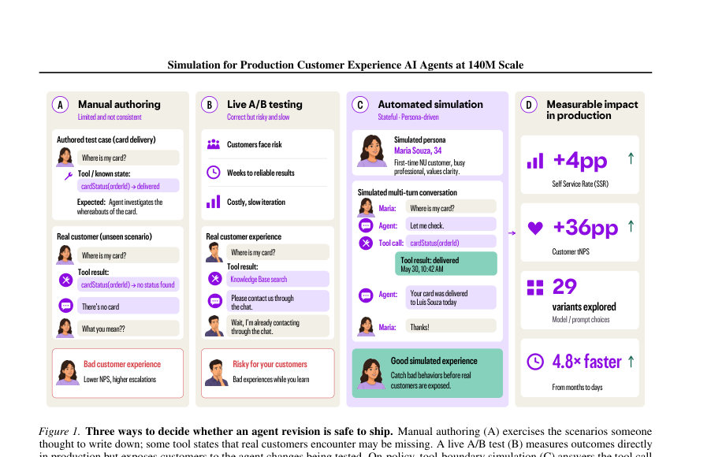
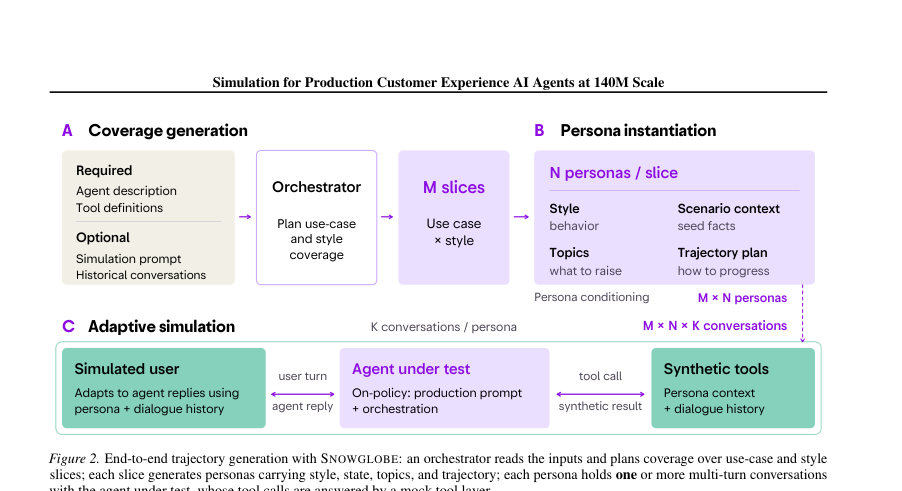
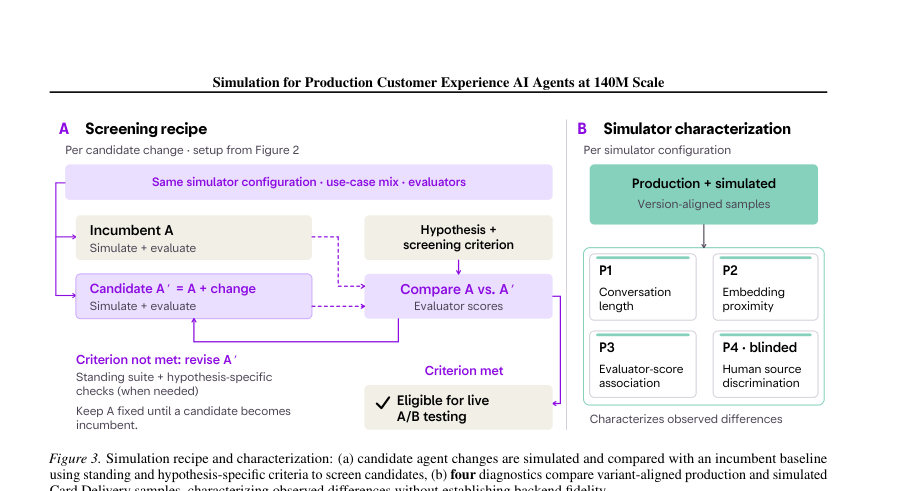

# Screen Before You Serve: Simulation for Production Customer Experience AI Agents at 140M Scale

- **게시일:** 2026-09-26
- **arXiv:** [2609.30137v1](http://arxiv.org/abs/2609.30137v1) · [PDF](https://arxiv.org/pdf/2609.30137v1)
- **저자:** Edesio Alcoba, Kevin Rossell, Aman Gupta, Shao Tang, Jiwoo Hong, Pabel Carrillo-Mendoza, Wanderson Conceição Ferreira, Alvaro Tedeschi, Zayd Simjee, Shreya Rajpal, Bruno Finardi Hime, Christian Sousa, Luis Moneda, Herbert Fei, Daniel Silva, Rohan Ramanath
- **분야:** cs.AI, cs.CL
- **선정 점수:** 7.49
- **선정 이유:** 최근성 0.7, 인용 영향 0.0 (인용 0회), 저자 영향 1.5 (최고 h-index 11), AI 주제 적합성 2.8, 개발자 관심 0.6, 학술 신호 0.3, 오픈 웨이트·주요 연구조직 신호 1.6

[← 2026-09-26 목록으로 돌아가기](../daily/2026-09-26.html)

<!-- paper-visuals:start -->
## 주요 Figure

> 원문 PDF에서 실제 Figure 캡션과 그림 영역이 함께 확인된 자료만 자동 추출했다.

*Figure · 원문 PDF 2쪽 · Figure 1. Three ways to decide whether an agent revision is safe to ship. Manual authoring (A) exercises the scenarios someone*

*Figure · 원문 PDF 3쪽 · Figure 2. End-to-end trajectory generation with SNOWGLOBE: an orchestrator reads the inputs and plans coverage over use-case and style*

*Figure · 원문 PDF 5쪽 · Figure 3. Simulation recipe and characterization: (a) candidate agent changes are simulated and compared with an incumbent baseline*

<!-- paper-visuals:end -->

## 한 문장 요약

Nubank은 SNOWGLOBE 기반의 도구 경계(tool-boundary) 사용자 시뮬레이션을 개발·활용해 고객 경험(CX) 상담 에이전트를 배포 전 대규모로 스크리닝하고, 시뮬레이션-가이드 반복을 통해 실서비스 지표(SSR, tNPS 등)를 실험적으로 개선했다.

## 해결하려는 문제

실제 고객을 노출하는 라이브 실험은 실패 시 고객 신뢰를 훼손하고 느리며, 수동으로 작성한 테스트는 범위가 제한적이다. CX 에이전트는 의도 감지, 복잡한 운영 정책 준수, 도구(툴) 사용의 신뢰성 등 다차원 요구사항을 만족해야 하므로, 배포 전 후보 정책을 안전하고 효율적으로 선별할 방법이 필요했다.

## 핵심 기여

- 도구 경계(tool-boundary)에서 온-정책(on-policy)으로 에이전트를 실행하는 SNOWGLOBE 기반의 가설-중심 시뮬레이션 스크리닝 레시피 제안(개발→시뮬레이션→검증→라이브 A/B 흐름 연결).
- 시뮬레이션과 실제 대화의 유사성 진단(P1–P4)을 도입해 시뮬레이터 특성을 정량적으로 검증하고, 버전 수준의 평가자 점수에서 높은 상관관계(Pearson r=0.74, Kendall τ=0.67)를 보고.
- 개발-배포 사이클을 가속화: 시뮬레이션 레이어 도입으로 버전당 평균 소요일이 21.2→4.4일로 줄어 4.8배 빠른 반복 지원을 보고.
- 실서비스 영향 입증: 시뮬레이션 가이드로 개선한 Card Management는 라이브 A/B에서 Self-Service Rate(SSR) +4.90pp(95% CI [4.08,5.71], n=27.8K) 및 transactional NPS +36.69pt(95% CI [32.81,40.57], n=2.0K)를 기록; 이후 오픈-웨이트로 선별한 Qwen3.5-122B-A10B(추론(reasoning) 사용)는 라이브 A/B에서 SSR +8.82pp(95% CI [7.95,9.69], n=8.4K), tNPS 변화 유의미 아님(−1.21, 95% CI [−3.97,1.55], n=2.3K), p95 latency −25% 보고.
- 대규모 탐색 가능성: 29개 모델-설정 조합, 16,000+ 시뮬레이션 대화로 오픈-웨이트 모델·추론 설정·양자화 등을 넓게 탐색하고 후보를 선별.

## 접근 방법

* 핵심은 도구 경계(mocking)에서 에이전트를 온-정책으로 실행하고 각 에이전트의 툴 호출에 대해 시나리오·퍼소나 기반의 합성 도구 응답을 반환하는 SNOWGLOBE 시뮬레이터를 사용한 스크리닝 파이프라인이다.
* 입력으로 에이전트 설명과 툴 정의(선택적으로 시뮬레이션 프롬프트·히스토리)를 제공하면 오케스트레이터가 사용사례·상호작용 스타일(coverage)을 계획하고, 각 조건에 대해 M×N의 퍼소나를 생성한다.
* 퍼소나는 상태(seed facts), 토픽, 대화궤적(plan)을 가지며 에이전트의 응답에 적응해 다중 턴을 진행한다.
* 툴 호출은 실제 백엔드를 호출하지 않고 스키마에 맞는 합성 결과로 응답되어 도구 연계·상태 일관성(tool-boundary mocking)을 유지한다.
* 스크리닝은 가설 기반으로 진행되며(Algorithm 1), 기존 인컴번트 기준(A)을 고정한 상태에서 후보(A')를 동일한 시뮬레이터 설정 S로 시뮬레이션한 뒤 사전정의된 평가군 E(고정형 평가자 + 가설-특화 평가자)를 적용해 스크리닝 기준 C를 충족하면 라이브 A/B로 승격한다.
* 시뮬레이션 정합성 진단으로 대화 길이(P1), 임베딩 중심간 거리(P2), 평가자 점수 연관(P3), 블라인드 인간 판별(P4)를 사용했다.
* 오프라인 평가는 LLM-as-a-Judge(GPT-4.1-Mini1 등)를 이용한 이진 판정(E1–E5 또는 가설별 이진 평가지표)으로 수행되며, 오픈-웨이트 후보군은 동일한 평가자를 대량 시뮬레이션으로 비교해 선별했다.

## 주요 결과

- 데이터 및 샘플링: Card Delivery(CD) 실대화 8,000건을 개발/검증으로 분리. 각 CD 버전별 테스트셋 1,000 대화, 시뮬레이션은 버전별 250 트랙 생성(총 1,000 시뮬레이션?)으로 진단 수행.
- 시뮬레이터 진단(P2/P3): 대화 레벨 임베딩( text-embedding-3-large )에서 production↔sim의 최소 코사인 거리가 0.035(V4CD), SNOWGLOBE와 production 간 버전 수준 평가자 점수 상관(Pearson r=0.74, Kendall τ=0.67) 보고. SNOWGLOBE는 생산 버전 순위(제일 좋은 V4CD, 최악 V2CD)를 보존하는 비율이 높음(V4CD가 최상으로 나올 확률 96.69% 재샘플 기준).
- 대화 길이 차이(P1): 생산 사용자 메시지 단어수 median=19, mean=25.8인 반면 시뮬레이션은 median=111, mean=119로 시뮬레이션이 훨씬 길며 사용자 턴 수도 생산 median=3 vs 시뮬레이션 median=6(시뮬레이션에 8턴 고정 상한 존재).
- 블라인드 인간 판별(P4): V4CD 샘플(50 생산, 50 시뮬레이션)에서 annotator가 생산 대화 84%(42/50), 시뮬레이션 70% (35/50) 정확도로 분류; 15개의 시뮬레이션이 생산으로 오분류됨.
- Card Management 오프라인→라이브 결과: 시뮬레이션으로 선정된 V5CM은 '불필요한 전환(transfer) 실패율' 16.0%로 V1CM(22.4%) 대비 6.4pp 개선. 라이브 A/B에서 CM vs CD: SSR +4.90pp(95% CI [4.08,5.71], n=27.8K), tNPS +36.69pt(95% CI [32.81,40.57], n=2.0K). CM는 이후 서비스에 배포됨(본문 기록). 이후 오픈-웨이트로 선별한 Qwen3.5-122B-A10B(추론 활성화)는 라이브 A/B에서 SSR +8.82pp(95% CI [7.95,9.69], n=8.4K), tNPS 변화 유의미 아님(−1.21, 95% CI [−3.97,1.55], n=2.3K), p95 latency −25%. 이는 만족도 동등성으로 SSR·지연 개선을 달성한 사례로 제시됨. 100 시뮬레이션 트랙은 평균 10분 미만에 생성되어 빠른 반복 가능(런타임 기준). 개발-배포 주기: CD 10버전 주기 총 212일(평균 21.2일/버전), CM 5버전 22일(평균 4.4일/버전)로 4.8배 속도 향상 보고되며, 대규모 모델 스윕은 29구성, 16,000+ 시뮬레이션 대화로 수행됨(오픈-웨이트 탐색).

## 한계

- 저자 언급: 시뮬레이션은 의도적으로 툴 경계에서 멈추므로 상태변화·사이드 이펙트가 있는 상태저장(stateful) 백엔드, 실제 백엔드의 지연(latency), 영속적 상태(persistent state)나 부가적 사이드 이펙트를 테스트하지 못함. 또한 신규 가설-특화 평가자는 별도로 보정(calibration)해야 하며 시뮬레이터의 불완전성은 오도(미스리드)할 수 있음.
- 저자 언급: 시뮬레이터(특히 프롬프트 기반)는 데이터 누수나 목표 미준수로 점수 부풀림(score inflation) 위험이 있어 신중한 검증이 필요하다고 밝힘.
- 확인되는 실험적 제약: 시뮬레이션 대화는 생산 대비 사용자 메시지 길이·턴 수 분포가 크게 다름(생산은 매우 짧은 메시지와 짧은 대화가 다수), 이로 인해 일부 행동·지표(예: 대화 길이에 의존하는 정책)는 시뮬레이션에서 과대표집될 수 있음.
- 확인되는 한계: 시뮬레이션 설정(S)·평가군(E)·판정 기준(C)을 고정한 상태에서 후보를 비교해야 한다는 운영적 요구가 있어, 시뮬레이터 설정 자체에 민감한 실험 설계가 필요하며 잘못된 설정은 오판단을 초래할 수 있음(논문은 여러 진단 P1–P4을 도입해 이를 완화하려 시도).

## 개발자 관점

- 툴 스키마와 시뮬레이터 응답 스키마 일치가 핵심: 시뮬레이션에서 반환하는 합성 도구 응답은 프로덕션 스키마·식별자·텔레메트리와 호환되어야 하며, 그렇지 않으면 export·reconciliation 비용이 발생하고 반복 이득이 사라짐(본문 사례).
- 시뮬레이션은 백엔드를 대체하지 않음: 상태 저장·부작용·지연 테스트는 별도 스테이징/통합 테스트 파이프라인에서 검증해야 함(저자 권고).
- 가설-중심 스크리닝: 각 후보 변경에 대해 명확한 가설과 사전 정의된 이진 스크리닝 기준(C)을 설정하고 동일한 시뮬레이터 설정으로 비교하라(Algorithm 1).
- 평가자 보정 필요: LLM-as-a-Judge 등 자동 판정기는 사전 보정·GEPA 등 프롬프트 최적화로 안정화하고, 새 평가자를 도입하면 기준군(incumbent)에 대해 점검해야 함.
- 빠른 대규모 탐색 가능: 고객 노출 없이 모델·추론 설정·프롬프트·양자화 등 광범위한 조합을 시도해 후보군을 좁힐 수 있으므로 대규모 스윕(예: 29설정, 16,000 대화) 설계·자동화에 투자할 가치가 있음. 단, 시뮬레이션/생산 분포 차이를 항상 모니터링할 것.

**근거 범위:** 이 분석은 제공된 논문 PDF 본문(본문 및 부록 포함)을 근거로 작성되었음. 주요 수치, 실험 설정(샘플 크기, 신뢰구간, 상관계수 등)은 본문 표·그림·절에서 직접 인용했다. 하드웨어 비용, 클러스터 구성, 정확한 프롬프트 파라미터(일부는 부록 G에 제시) 등 논문에 명시되지 않은 구현 세부사항은 추정하지 않았다.
