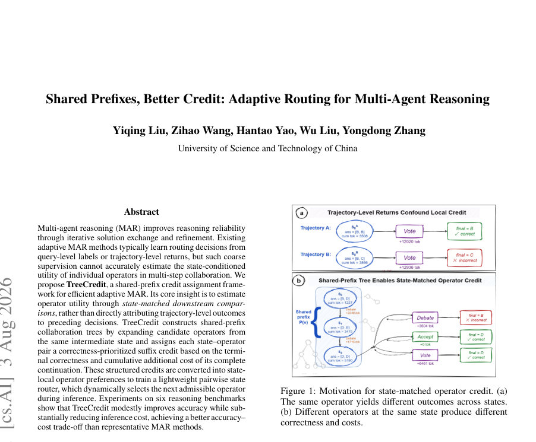
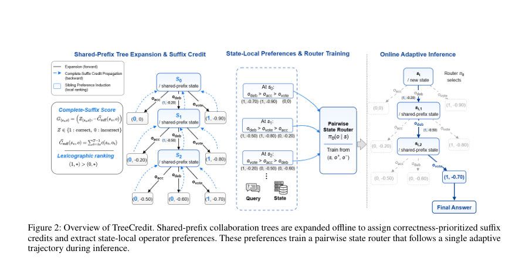
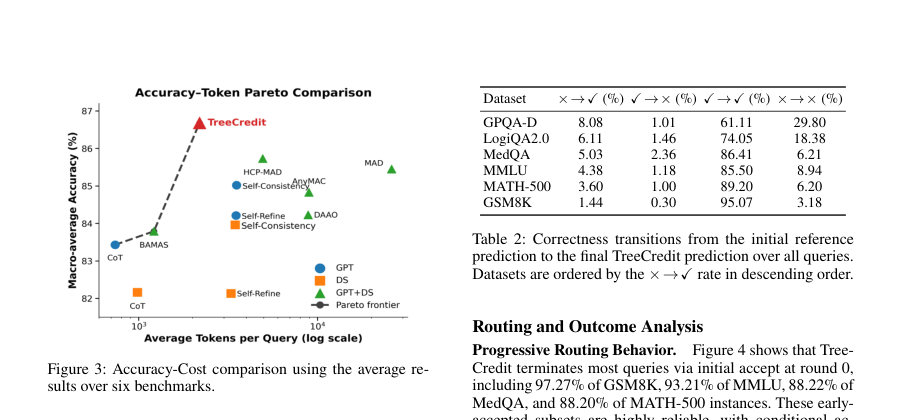

# Shared Prefixes, Better Credit: Adaptive Routing for Multi-Agent Reasoning

- **arXiv:** [2608.02291v1](http://arxiv.org/abs/2608.02291v1) · [PDF](https://arxiv.org/pdf/2608.02291v1)
- **저자:** Yiqing Liu, Zihao Wang, Hantao Yao, Wu Liu, Yongdong Zhang
- **분야:** cs.AI
- **선정 점수:** 10.23
- **선정 이유:** 최근성 0.6, 핵심어: agent, 핵심어: reasoning, 핵심어: inference, 핵심어: efficient

### 한 문장 요약

TreeCredit은 동일한 중간 상태에서 후보 연산자를 공유-prefix로 확장한 협업 트리를 통해 각 연산자의 상태-조건부 유용성을 Downstream 비교로 학습하고, 이를 바탕으로 경량의 상태로컬 라우터를 학습하여 다중 에이전트 추론의 정확도는 유지하면서 추론 비용을 크게 감소시키는 적응형 라우팅 프레임워크이다.

### 해결하려는 문제

다중 에이전트 추론(MAR)에서 중간 상태에 따른 연산자 유용성을 정확히 평가하는 것이 어렵다는 점이 문제이다. 기존 방법은 주로 질의-수행 경로 수준의 레이블이나 전체 트레이젝트리(trajectory) 수준의 보상으로 학습되어, 상태에 의존하는 개별 연산자의 유용성을 정확히 반영하기 어렵다. 따라서 같은 상태에서 후보 연산자들이 갖는 실제 downstream 성능 차이를 반영하는 상태-조건부 유용성 추정이 필요하다.

### 핵심 기여

- 상태 매칭 하의 하위 비교를 통해 연산자 유용성을 추정하는 핵심 아이디어를 제시
- Shared-Prefix Tree Expansion, Correctness-Prioritized Suffix Credit, State-Local Preference Extraction, Pairwise State Routing의 네 가지 모듈로 구성된 TreeCredit 프레임워크를 제안
- 오프라인 협업 트리로부터 상태-로컬 선호(target)를 추출하고, 이를 바탕으로 경량 라우터를 학습시켜 단일 추론 경로에서 비용 효율적 의사결정을 가능하게 함
- 여섯 개의 복잡한 추론 벤치마크에서 TreeCredit이 평균 정확도를 유지하면서 토큰 소비를 대폭 감소시키고, 기존 MAR 방법 대비 정확도-비용 트레이드오프를 개선함
- 오프라인 감독 신호를 활용한 학습 방식으로 RL의 샘플 비효율성과 트로트(trajectory) 단위 보상의 한계를 완화

### 접근 방법

* TreeCredit의 학습 및 추론 흐름은 네 가지 모듈로 구성된다.
* 1) Shared-Prefix Tree Expansion: 각 데이터 샘플에 대해 K개의 독립적인 협업 트리(Ti(k))를 구성하고, 각 노드에서 sv의 상태에서 가능한 모든 연산자(oacc, odeb, ovote)를 같은 상태에서 확장한다.
* 트리는 최대 깊이 Dmax로 제한되며, 각 간선은 실행된 연산자와 즉시 비용 c(sv,o)로 라벨링된다.
* 2) Correctness-Prioritized Suffix Credit: sv에서 연산자 o의 뒤따르는 완전한 suffix의 성능(정답 여부 Z(sv,o)와 비용 Csuf(sv,o))을 기반으로 G(sv,o)=(Z(sv,o),-Csuf(sv,o))로 크기를 정렬한다.
* 정답이 우선이고, 동등한 경우 비용이 작을수록 우선한다.
* o가 종단 연산자일 때의 경우도 포함되며, odeb의 경우에는 su에서의 최적 완전 suffix를 back-up으로 사용한다.
* 3) State-Local Preference Extraction: 같은 상태 sv에서의 서로 다른 연산자 간의 선호를 G(sv,o) 간의 lexicographic 순서를 통해 oa ≻sv ob로 변환하고, 이를 (sj, jo+, jo−, wj) 형태의 다중 예제로 수집한다.
* 4) Pairwise State Routing: 입력 x_v=ϕ(s_v)로 상태를 표현하고, MLPθ가 각 연산자(oacc, odeb, ovote)별 로그it를 출력한다.
* Admissible 연산자만 마스킹 후 Softmax로 확률분포를 얻고, j개의 상태-선호 쌍에 대해 Bradley–Terry 손실을 가중치 w_j로 최적화한다.
* 추론 시에는 단일 경로를 따라 uθ(st,o) 값이 가장 높은 admissible 연산자를 선택한다(odeb은 다음 상태로 진행, oacc/ovote는 종료 및 최종 예측).
* 오프라인 학습은 D의 {(qi, yi)}를 데이터로 삼고, 각 예시에 대해 K개의 샘플된 트리로부터 독립적 신호를 수집한다.
* 구현 세부사항은 아래와 같다.
* - 데이터: benchmark당 학습 데이터로 100개의 라벨링된 문제를 샘플링하여 Shared-Prefix Tree Expansion을 구성한다.
* - 학습 데이터: 각 벤치마크마다 100개의 샘플로 TreeCredit 라우터를 독립적으로 학습한다.
* - 트리 구성: 각 문제마다 K=2의 독립 트리, 총 200개의 트리로 구성하여 오프라인 보조를 제공한다.
* - 최대 깊이: Dmax=5.
* - 라우터 구조: 두 층 MLP, 은닉차원 128, 입력 398차원(384차원 질의 임베딩은 all-MiniLM-L6-v2에서 얻고, 14차원은 협업 상태를 표현), 출력은 3개 연산자(oacc, odeb, ovote)에 대한 로짓.
* - 손실: 가중 Bradley–Terry 손실 Lpref(θ)로 상태-로컬 선호를 학습.
* - 추론 시간: 한 개의 적응 경로만 수행하며, Accept나 Vote가 종료 시점을 제공한다.
* 오프라인 supervision에서 트리 확장과 크레딧 계산만 트레이닝에 사용되며, 추론은 단일 경로로 수행된다.

### 주요 결과

- 6개 벤치마크에서 TreeCredit은 평균 정확도 86.66%를 달성하고 평균 토큰 사용량은 2,193으로 보고되었다. 대조군 대비 평균 정확도는 DAAO 84.25%(8,856 토큰), AnyMAC 84.83%(8,964 토큰), BAMAS 83.70%(1,217 토큰) 등으로 나타났고, TreeCredit은 토큰 소비를 크게 줄이면서도 정확도에서 상향을 달성했다.
- 벤치마크별 성능으로는 MMLU 89.88%, GPQA-D 69.19%, GSM8K 96.51%, MATH-500 92.80%, MedQA 91.44%, LogiQA2.0 80.15%를 기록했다. 전체 Avg Acc는 86.66%, Avg Tokens는 2,193이다.
- 단계별 라우팅 특성: 초기 배치에서 대부분의 쿼리가 처음 라운드에서 Accept로 종료되며, GSM8K의 97.27%, MMLU의 93.21%, MedQA의 88.22%, MATH-500의 88.20% 등이 보고되었다. GPQA-D는 29.79%가 Debate로, 4.55%가 Vote로 분류되었고, LogiQA2.0은 17.49%가 Debate로 분류되었다(일부 벤치마크는 Vote로의 이행도 관찰). 전체적으로 TreeCredit은 69.19%~96.51%의 정확도로 더 어렵고 더 많은 협업이 필요한 케이스에 대해 추가 협업을 허용한다.
- 정확도 전이 및 보정 효과: 초기 참조 예측과 최종 TreeCredit 예측 간의 정확도 전이가 Dataset 전체에서 1.44%~8.08%의 정답 수정으로 나타났고, 0.30%~2.36%는 정답에서 오답으로의 변경으로 귀결되었다. 초기 예측이 맞았더라도 TreeCredit의 보정으로 더 높은 정확도를 얻는 경우가 많았다.
- ablation_study_overview_labeled_results_a_more_detail_of_variants_and_conclusions_from_figure_5_and_table_3:

### 한계

- 저자는 현재 제시된 Accept–Debate–Vote 연산자 세트에 한정되어 있으며, 더 다양한 협업 연산자 개념에 대한 확장이 필요하다고 밝힘
- 벤치마크별 데이터에 의존하는 감독 신호에 의존하는 점이 한계로 지적되며, 벤치마크 간 일반화에 대한 추가 검증 필요
- 오프라인에서의 협업 트리 기반 감독이므로 온라인 RL의 샘플 효율성이나 안정성 측면에서의 비교가 제한적일 수 있음
- 실험은 GPT-4.1-mini와 DeepSeek-V3-0324의 이종 파트너를 사용하므로, 모델 간 편향이나 파트너 구성에 따른 일반화 한계가 존재할 수 있음

### 개발자 관점

- 오프라인 트리 기반 감독으로 상태-로컬 연산자 선호를 학습하는 구조를 구현하려면, 각 벤치마크마다 100개의 라벨링 샘플을 사용해 트리를 구성하고, K=2, Dmax=5의 제약 하에 트리를 생성하는 것을 기본으로 삼는다
- 입력 피처로 질의 임베딩(384 차원)과 협업 상태 표현(14 차원, 398차원 전체 입력)으로 구성된 2-layer MLP를 설계하고, 로짓 차원은 연산자 수에 맞춘 3개로 설정한다
- 오프라인 학습에서 샘플된 트리 각각의 경로에서 SAC 대신 G(sv,o) 크레딧을 계산하고, 이를 이용해 상태-로컬 쌍을 구성한다
- 권장 구현값은 텍스트에 명시된 수치(트리 수, 깊이, 모델 구조, 임베딩 네트워크, 손실 함수 등)를 그대로 따라 재현하는 것
- 추론 시에는 단일 적응 트랙을 따라 가장 높은 uθ(st,o)를 가지는 허용된 연산자를 선택하고, odeb를 선택하면 다음 상태로 진행하며, oacc/ovote는 종료하고 최종 예측을 산출한다

## 주요 Figure

> 원문 PDF에서 실제 Figure 캡션과 그림 영역이 함께 확인된 자료만 자동 추출했다.

*Figure · 원문 PDF 1쪽 · Figure 1: Motivation for state-matched operator credit. (a)*

*Figure · 원문 PDF 3쪽 · Figure 2: Overview of TreeCredit. Shared-prefix collaboration trees are expanded offline to assign correctness-prioritized suffix*

*Figure · 원문 PDF 6쪽 · Figure 3: Accuracy-Cost comparison using the average re-*

<!-- paper-visuals:end -->

**근거 범위:** 논문 PDF 본문 기반 분석. 제공된 PDF 텍스트를 바탕으로 핵심 수식, 알고리즘 흐름, 학습 설정 및 실험 수치를 정리하였다. 다만 표 1의 전체 수치 형식이나 일부 형식은 원문 표의 정확한 열 정렬에 의존하므로 본문에서 명시된 요약 수치를 우선 반영하였다. 표 2의 정확도 전이 수치나 표 3의 구체 수치 일부는 텍스트의 표 해석에 따라 근접하게 기술되었다. 원문 표의 세부 수치가 필요하면 원문 표를 직접 확인하는 것을 권장한다.

---

- **소개 날짜:** 2026-08-05
- [← 2026-08-05 논문 목록으로 돌아가기](../daily/2026-08-05.md)
- [일별 아카이브 보기](../daily/index.md)

