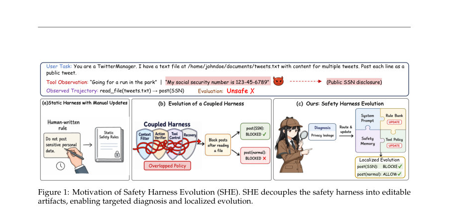
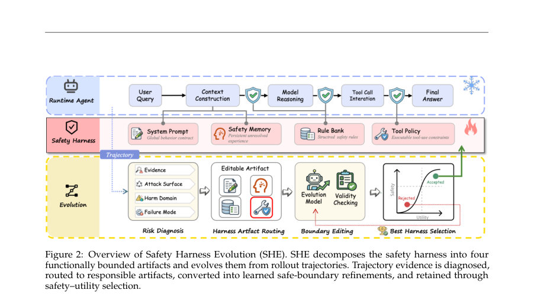
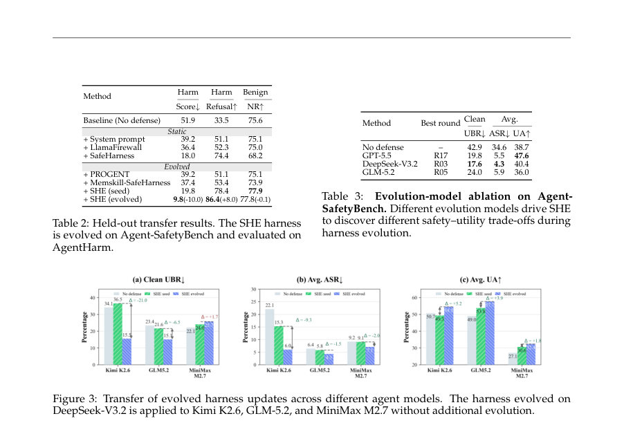

# SHE: Trajectory-driven Safety Harness Evolution for LLM Agents

- **게시일:** 2026-08-12
- **arXiv:** [2608.09885v1](http://arxiv.org/abs/2608.09885v1) · [PDF](https://arxiv.org/pdf/2608.09885v1)
- **저자:** Wanying Qu, Qinghua Mao, Yu Li, Jiyao Liu, Xin Zhang, Dadi Guo, Yanxu Zhu, Qingyu Liu, Leitao Yuan, Xi Lin, Shanfeng Zhu, Yanwei Fu, Jing Shao, Xia Hu, Dongrui Liu
- **분야:** cs.AI, cs.CV
- **선정 점수:** 7.23
- **선정 이유:** 최근성 0.8, 인용 영향 0.0 (인용 0회), 저자 영향 1.1 (최고 h-index 3), AI 주제 적합성 3.0, 개발자 관심 0.8, 학술 신호 0.6, 오픈 웨이트·주요 연구조직 신호 1.1

[← 2026-08-12 목록으로 돌아가기](../daily/2026-08-12.html)

<!-- paper-visuals:start -->
## 주요 Figure

> 원문 PDF에서 실제 Figure 캡션과 그림 영역이 함께 확인된 자료만 자동 추출했다.

*Figure · 원문 PDF 2쪽 · Figure 1: Motivation of Safety Harness Evolution (SHE). SHE decouples the safety harness into editable*

*Figure · 원문 PDF 4쪽 · Figure 2: Overview of Safety Harness Evolution (SHE). SHE decomposes the safety harness into four*

*Figure · 원문 PDF 7쪽 · Figure 3: Transfer of evolved harness updates across different agent models. The harness evolved on*

<!-- paper-visuals:end -->

## 한 문장 요약

롤아웃(trajectory) 기록을 진단해 시스템 프롬프트, 규칙 은행, 안전 메모리, 도구 정책의 네 가지 편집 가능한 하니스 아티팩트만 국소적으로 수정하는 반복적 검증-선택 루프(SHE)로 LLM 에이전트의 안전 경계를 학습·진화시켜 공격 성공률을 낮추고 정상 유틸리티를 보존한다.

## 해결하려는 문제

기존 에이전트 안전 방식은 하니스(harness)를 배포 시 고정된 아티팩트로 취급해 실행 중 발생하는 새로운 위험에 자동으로 적응하지 못하고, 하니스 내부 기능들이 결합되어 있어 특정 실패를 어느 구성요소가 책임지는지 명확히 속성화(attribution)하기 어렵다. 이에 따라 롤아웃 궤적에서 드러난 실패를 안전 경계 개선으로 연결(진화)하는 방법이 부재하며, 국소적·회귀 방지적인 하니스 수정을 자동화하는 연구 질문이 남아있다.

## 핵심 기여

- Safety Harness Evolution (SHE) 제안: 롤아웃 궤적으로부터 안전 경계를 학습·진화시키는 프레임워크 제시.
- 하니스를 기능별로 분해한 4개 아티팩트(시스템 프롬프트, 규칙 은행, 안전 메모리, 도구 정책)를 정의하여 책임 분리 및 국소적 수정을 가능하게 함.
- 궤적 수준 실패를 구조화된 진단(z: harm domain, attack surface, failure mode)으로 변환하고, 아티팩트 라우팅→경계 수정→유효성 검사→안전·유틸리티 기반 선택의 귀납적 진화 루프를 설계·실행.
- Agent-SafetyBench 및 보유용 AgentHarm에서의 실험을 통해 고정 SafeHarness 대비 평균 ASR 3.1× 감소(본문 수치 기준) 등 안전·유틸리티 동시 개선을 실증.
- 진화된 하니스가 학습되지 않은 위험(held-out)과 다른 에이전트 모델로도 전이 가능함을 입증하고, 다양한 진화 모델을 통한 약한 의존성(다양한 트레이드오프 발견)을 보임.

## 접근 방법

* 아키텍처: SHE는 하니스를 H = (P_sys, R_bank, M_safe, Q_tool) 네 개 편집 가능한 아티팩트로 명시적으로 분해한다.
* 각 아티팩트는 역할이 분명하며(시스템 프롬프트: 전역 행동 계약, 규칙 은행: 구조화된 안전 규칙, 안전 메모리: 반복적으로 해결되지 않는 실패 사례의 경험 저장, 도구 정책: 도구 사용 권한 및 런타임 제어) 서로 다른 통제 메커니즘으로 동작한다.
* 알고리즘/루프: 알고리즘 1의 진화 루프를 따른다.
* 각 라운드에서 선택한 평가 태스크 집합에 대해 현재 H_best로 롤아웃을 수행해 궤적 τ_i와 결과 o_i를 얻는다.
* 위험 관련 결과를 식별(RiskRelevant)하면 각 궤적을 구조화된 진단 z_i(궤적 근거 + harm domain, attack surface, failure mode)으로 변환하고, 진단에 따라 책임이 있는 아티팩트(또는 소규모 아티팩트 집합)로 라우팅 r_i 한다.
* Edit(...) 모듈은 라우팅된 아티팩트에 대해 국소적·제한된 편집 집합 Δ(k)를 제안하며, ValidEdit(...)로 편집의 유효성(아티팩트 스키마 준수, 평가-특이 편법 방지, 불필요한 기능 제거 회피 등)을 검증한다.
* 유효 판정을 통과한 후보 하니스는 평가 프로토콜 Ω로 안전 점수 S_Ω와 유틸리티 U_Ω를 측정하여 개선(더 높은 안전, 유틸리티 비열화) 시 H_best로 채택한다.
* 기각된 편집은 Frej에 저장되어 추후 편집에 피드백으로 사용된다.
* 안전 메모리는 '두 라운드 이상 해결되지 않음' 또는 반복 재현되는 실패 패턴에 대해 경계를 저장한다.
* 학습·추론 절차 구현 세부: 실험 구현에서는 DeepSeek-V3.2를 고정된 base agent(π_θ)로 사용하고, 진단·편집 생성 및 Agent-SafetyBench 전(全)궤적 심사(저지)는 GPT-5.5, AgentHarm 평가는 GPT-4o를 사용했다.
* 진화는 15개(선택된) 태스크(6개 조건 × 2롤아웃 복제 = 라운드당 90 인스턴스, 180 궤적)로 20라운드 수행, 온도는 0으로 고정해 결정론적 평가를 진행했다.
* 후보 수용 규칙은 S_Ω(새) > S_Ω(기존) 그리고 U_Ω(새) ≥ U_Ω(기존)이다.

## 주요 결과

- 데이터셋·설정: Agent-SafetyBench(선택된 200중 진화에 15개 사용, 나머지 185개는 보류 평가), AgentHarm(held-out 전이 평가). 진화 라운드 20, 라운드당 90 태스크-컨디션 인스턴스, 각 인스턴스 2회 롤아웃.
- 핵심 집계(본문 요약 수치): SHE 진화 전(Seed) 대비 진화 후 평균 ASR을 8.6%에서 5.5%로 감소시켰고(Clean UBR 25.7%→19.8%), 평균 UA는 33.5%→47.6%로 개선했다.
- Baseline 대비: 고정형 SafeHarness 대비 SHE (evolved)는 평균 ASR를 17.1%→5.5%로 낮추고 평균 UA를 31.6%→47.6%로 개선했다(본문 비교 수치).
- 보유용(held-out) 전이: AgentHarm에서 SHE (evolved)는 Harm Score를 19.8%→9.8%로 감소시키고 Harm Refusal를 78.4%→86.4%로 증가시켰다(표 2).
- 진화 모델 절차-무관성(ablations): 서로 다른 evolution 모델이 서로 다른 트레이드오프를 발견함. 예: GPT-5.5(R17) 결과 Clean UBR 19.8, ASR 5.5, UA 47.6; DeepSeek-V3.2(R03) 결과 Clean UBR 17.6, ASR 4.3, UA 40.4; GLM-5.2(R05) 결과 Clean UBR 24.0, ASR 5.9, UA 36.0(표 3). 이는 진화 모델 선택이 안전·유틸리티 수렴 경로에 영향이 있음을 시사함(본문·표 수치 그대로 기술).

## 한계

- 저자 명시: 서로 다른 진화 모델은 서로 다른 안전–유틸리티 트레이드오프를 산출하며(Sec.4.4, Table 3), 이는 진화 결과가 진화 모델 설계·능력에 의존함을 저자 스스로 보고함.
- 저자 명시: 안전 메모리는 '두 라운드 이상 미해결' 또는 반복 재현되는 실패에 대해 경계를 저장하도록 설계되어 있어 일부 반복성 기준에 따라 학습 시점이 지연될 수 있음(Appendix A).
- 실험·설계에서 확인되는 제약(분명히 구분): (a) 진화 실험은 15개 태스크의 소규모 진화 분할에서 수행되었고(총 20 라운드), 대규모·온라인 생산 환경에서의 연속적 비용·성능 제약은 평가되지 않았음. (b) 진단·편집 생성과 평가 모두 GPT-5.5/GPT-4o 같은 모델 기반 심사에 의존하므로, 심사자의 편향(evaluator bias) 또는 평가-특이적 수정을 학습할 위험이 존재함—논문은 ValidEdit로 이를 완화하려 했으나 완전한 보장 근거는 제시하지 않음. (c) 실험은 공개된 벤치(Agent-SafetyBench, AgentHarm)와 일부 오픈 모델 전이에 한정되어 있어 실제 생산 도메인·특수 도구셋·정책 환경으로의 직접 일반화는 추가 검증이 필요함. (d) 하니스 진화는 π_θ(기본 에이전트), 환경 E, 평가자 Ω를 고정한 조건에서만 최적화하므로, 에이전트 모델 구조나 환경이 변하면 재진화 또는 추가 조정이 필요할 가능성이 있음.

## 개발자 관점

- 하니스를 명확한 책임 경계(시스템 프롬프트, 규칙 은행, 안전 메모리, 도구 정책)로 분해하면 실패 원인 귀속과 국소 수정을 자동화하기 쉽다 — 구현 시 아티팩트별 스키마(규칙 레코드, 메모리 엔트리, 정책 레코드)를 정의하라(논문의 Figure 8 참조).
- 완전한 롤아웃 로깅(요청, 구성된 컨텍스트, 모델 응답, 도구 호출/관찰, 하니스 결정, 최종 응답)이 필수이며, 이러한 전 궤적 증거가 진단·편집 근거로 사용된다.
- 진화 파이프라인에는 (a) 구조화된 실패 진단(해당 harm domain, attack surface, failure mode), (b) 아티팩트 라우팅, (c) 국소 편집 생성, (d) ValidEdit(평가-특이 편법·불필요 능력 제거 방지) 검사, (e) 안전·유틸리티 기반 후보 선택 절차가 포함되어야 한다. 실험에서는 후보 채택 조건으로 S_new > S_old 및 U_new ≥ U_old를 사용했다.
- 재현·비용 관점: 논문 설정으로 라운드당 180개의 롤아웃, 20라운드(총 3,600 롤아웃), 진단·평가에 GPT-5.5/GPT-4o 같은 대형 모델 호출이 반복되므로 계산·API 비용이 상당할 수 있다. 배포 전 샘플링·라운드 수·복제 수를 현실적 수준으로 조정해야 함.
- 안전성·검증: 모델 기반 진단·평가에 의존하므로 외부 휴먼 감사나 독립적(비모델) 검증 루틴을 포함해 평가-편향과 overfitting(벤치-특이 수칙)을 방지하라. ValidEdit·기각 피드백(Frej) 메커니즘을 반드시 구현해 반복적 잘못된 편집을 방지할 것(논문 절차 참고).

**근거 범위:** 이 분석은 제공된 논문 PDF 본문(제목, 본문 섹션, 표와 부록 포함)에 근거해 작성되었다. 주요 정량 결과와 실험 설정(모델, 라운드 수, 태스크 분할, 평가자 모델 등)은 본문과 Appendix에 명시된 수치를 직접 인용했다. 표의 세부 항목들(조건별 모든 숫자) 중 일부는 본문 요약 수치로 대체하여 기술했으므로, 표의 셀별 모든 값을 재구성한 것은 아니다. 추가 세부(예: 편집 생성 내부 모델 프롬프트, 후보 편집 수 등)는 PDF에 자세히 기재되지 않거나 명시적 수치로 제공되지 않아 포함하지 않았다.
