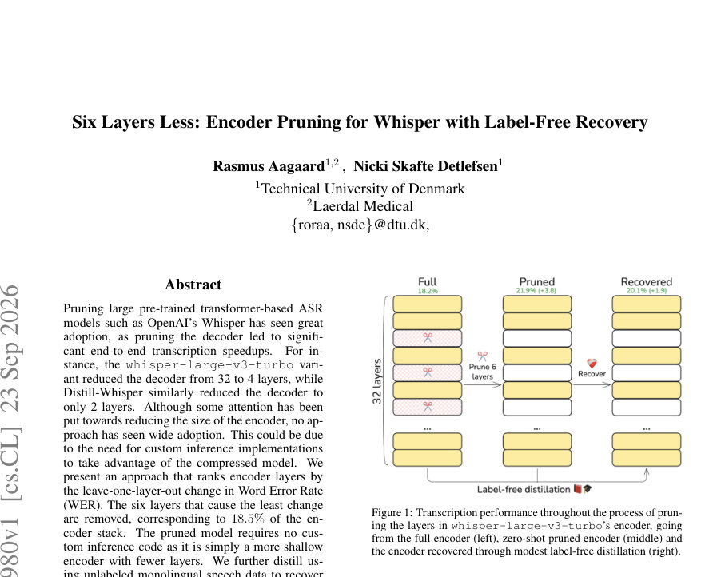
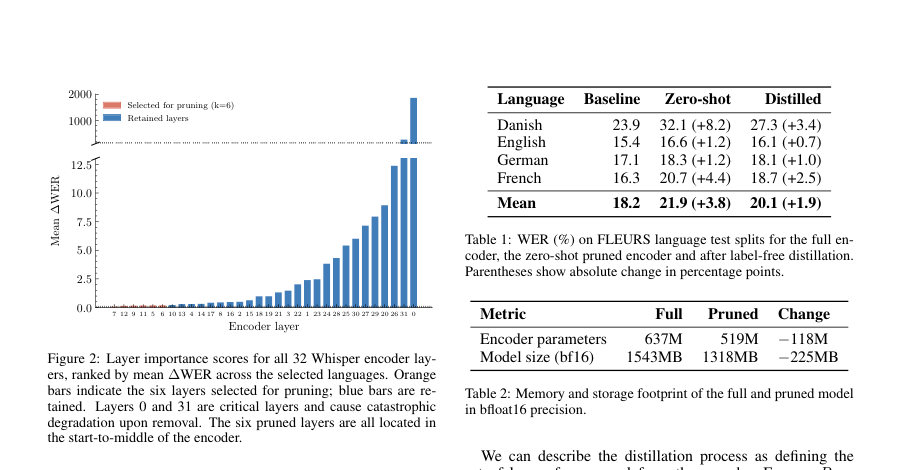
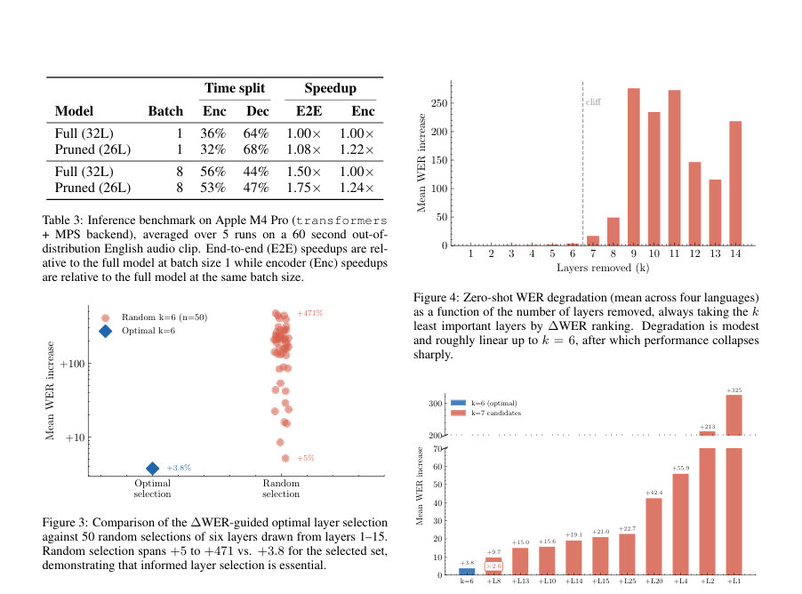

# Six Layers Less: Encoder Pruning for Whisper with Label-Free Recovery

- **게시일:** 2026-09-24
- **arXiv:** [2609.27980v1](http://arxiv.org/abs/2609.27980v1) · [PDF](https://arxiv.org/pdf/2609.27980v1)
- **저자:** Rasmus Aagaard, Nicki Skafte Detlefsen
- **분야:** cs.CL, cs.LG
- **선정 점수:** 5.22
- **선정 이유:** 최근성 1.2, 인용 영향 0.0 (인용 0회), 저자 영향 0.0 (최고 h-index 0), AI 주제 적합성 2.0, 개발자 관심 0.5, 학술 신호 0.6, 오픈 웨이트·주요 연구조직 신호 1.0

[← 2026-09-24 목록으로 돌아가기](../daily/2026-09-24.html)

<!-- paper-visuals:start -->
## 주요 Figure

> 원문 PDF에서 실제 Figure 캡션과 그림 영역이 함께 확인된 자료만 자동 추출했다.

*Figure · 원문 PDF 1쪽 · Figure 1: Transcription performance throughout the process of prun-*

*Figure · 원문 PDF 2쪽 · Figure 2: Layer importance scores for all 32 Whisper encoder lay-*

*Figure · 원문 PDF 3쪽 · Figure 3: Comparison of the ∆WER-guided optimal layer selection*

<!-- paper-visuals:end -->

## 한 문장 요약

Whisper의 인코더에서 중요도 기반(leave-one-layer-out WER)으로 6개 레이어를 제거해 인코더를 18.5% 얕게 만들고, 레이블 없는(MSE) 지식증류로 성능을 부분 회복하는 방법을 제안한다.

## 해결하려는 문제

대형 사전학습 트랜스포머 ASR(예: Whisper)에서 디코더 압축은 널리 채택되어 전반적 추론 속도를 높였으나 인코더 축소는 채택이 적다. 이는 인코더 압축이 종종 사용자 정의 추론 구현을 요구하기 때문이며, 연구 질문은 '기존 추론 라이브러리를 그대로 사용하면서 인코더 레이어 일부를 제거해도 성능을 크게 해치지 않고, 레이블 없는 방법으로 손실을 회복할 수 있는가?'이다.

## 핵심 기여

- 32개 레이어 인코더의 leave-one-layer-out WER 증가(∆WER)를 이용해 레이어 중요도를 산정하고, 덜 중요한 6개 레이어([5,6,7,9,11,12])를 제거해 인코더를 18.5%(6/32) 줄인 실용적 방법을 제시함.
- 제로샷(파인튜닝 없이) pruning으로 발생한 성능 저하를 레이블 없는(hidden-state MSE) 지식증류로 부분 회복시키는 간단한 복구 절차를 제시함.
- 데이터 기반(∆WER) 선택이 무작위 선택보다 필수적임을 보이고(k=6 무작위 조합 n=50 대비 평균 WER 증가가 훨씬 큼), 제거 가능한 한계(k=6)와 그 이후의 급격한 성능 붕괴(cliff)를 분석함.
- 프루닝된 모델은 별도 추론 코드 없이 기존 추론 라이브러리에서 즉시 교체 가능하며(shallower encoder), 파라미터·저장소 절감과 소비자 하드웨어에서의 추론 속도 향상을 실증함.

## 접근 방법

* 레이어 중요도 산정: FLEURS 테스트셋의 네 언어(덴마크어, 영어, 독일어, 프랑스어)를 대상으로 원본 인코더와 각 레이어를 하나씩 제거한(leave-one-layer-out) 인코더로 WER을 측정하고, 언어별 ∆WER의 평균으로 32개 인코더 레이어를 정렬함.
* 레이어 제거: ∆WER 기준으로 중요도가 가장 낮은 6개 레이어([5,6,7,9,11,12])를 선택하여 PyTorch nn.ModuleList를 복사해 해당 레이어를 제외함(아키텍처 변경은 레이어 수 감소뿐).
* 제로샷 평가: 바로 WER을 측정(파라미터 재학습 없음).
* 레이블-없는 지식증류(복구): 원본(teacher) 인코더와 프루닝된(student) 인코더의 히든 상태 차이를 MSE로 최소화(LMSE(x)=1/n \|\|Enc(x)-Enc/R(x)\|\|^2_2).
* 학습 세팅: encoder만 업데이트(원본 인코더·디코더는 동결), People’s Speech(영어) 데이터셋의 validation split을 사용, AdamW 옵티마이저, batch size 8, 2000 steps, 500 step마다 평가으로 수렴 관찰, 학습 시간 약 0.5시간(A100 GPU).
* 인퍼런스 벤치: Transformers 라이브러리 + Apple MPS 백엔드에서 Apple M4 Pro로 60초 외삽(영어) 오디오에 대해 측정.

## 주요 결과

- 평가 데이터·기준: FLEURS 테스트셋의 덴마크어·영어·독일어·프랑스어에 대한 WER(원본 모델 = baseline).
- 언어별 WER (Baseline → Zero-shot → Distilled): 덴마크 23.9 → 32.1 (+8.2) → 27.3 (+3.4); 영어 15.4 → 16.6 (+1.2) → 16.1 (+0.7); 독일 17.1 → 18.3 (+1.2) → 18.1 (+1.0); 프랑스 16.3 → 20.7 (+4.4) → 18.7 (+2.5).
- 평균 WER: Baseline 18.2% → Zero-shot pruned 21.9% (+3.8) → Distilled 20.1% (+1.9).
- 파라미터·저장소 변화(인코더): 전체 모델 인코더 파라미터 637M → 519M(−118M). 모델 크기(bfloat16) 1543MB → 1318MB(−225MB).
- 추론 속도(Apple M4 Pro, Transformers+MPS, 60s clip, 평균 5 runs): 배치1에서 전체 모델 E2E 기준 1.00×, 프루닝된 모델 E2E 1.22×(인코더만 비교 시 1.08×), 인코더 시간 비율 Full 36% → Pruned 32%. 배치8에서는 Full E2E 1.50×(baseline 배치1 기준), Pruned E2E 1.75×; 인코더 비율 Full 56% → Pruned 53%. 결과로 배치8에서 인코더 축소가 더 큰 E2E 이득을 줌. (Table 3 수치)

## 한계

- 저자가 명시한 한계: 평가 언어(덴마크·영어·독일어·프랑스어) 선택이 제한적이며 더 광범위한 언어 스윕이 필요함. 실험은 whisper-large-v3-turbo 인코더 스택에 한정되어 있어 다른 모델 규모나 아키텍처로 일반화되지 않을 수 있음. 또한 증류는 영어 단일 언어 데이터만 사용되어 다국어 복구에 한계가 있을 수 있음.
- 본문에서 합리적으로 확인되는 제약(분리 기술): 프루닝 경계가 뚜렷하여 k>6에서 WER이 급격히 악화(클리프 현상)하므로 제거 가능한 레이어 수가 매우 제한적임. 증류는 히든 스테이트 MSE만 사용했으며 학습률·스케줄 등 상세 하이퍼파라미터(예: learning rate 값)는 본문에서 제시되지 않아 재현 시 세부 튜닝이 필요함. 인퍼런스 속도 측정은 단일 하드웨어(Apple M4 Pro)와 구현(Transformers+MPS)에 한정되어 다른 HW/백엔드에서 동일한 이득을 보장하지 않음. 또한 증류 데이터는 영어 validation split만 사용(규모·시간 길이 명시 없음)되어 다양한 도메인·언어 일반화 성능은 미확인이다.

## 개발자 관점

- 레이어 선택은 데이터 기반(leave-one-layer-out ∆WER)으로 해야 하며, 무작위 선택은 심각한 성능 손실을 초래할 수 있다(본 연구의 random k=6 n=50 실험에서 평균 WER 증가 범위 +5%~+471% 대비 최적선택 +3.8%).
- 프루닝 구현은 PyTorch의 nn.ModuleList를 수정해 레이어를 제거하는 단순한 방식으로 가능하며, 결과 모델은 '더 얕은 인코더'이므로 별도 추론 코드 없이 기존 프레임워크(예: Transformers)에서 교체하여 사용할 수 있다.
- 레이어 제거 후 레이블 없는 지식증류(teacher hidden-state → student hidden-state MSE)는 소량의 계산 예산으로(배치8, 2000 steps, 약 0.5시간 on A100) 유의미한 성능 회복을 제공하므로 비용-효율적인 복구 방법임. 재현 시 People’s Speech(영어) validation split과 AdamW, batch8, 2000 steps 세팅을 참고하되 학습률 등 미기재 하이퍼파라미터는 실험적으로 조정해야 함.
- 배포 관점: 파라미터·저장소 절감(−118M 파라미터, −225MB bfloat16)과 소비자 하드웨어에서의 E2E 속도 향상(배치1 ~1.22×, 배치8 ~1.75×)이 실무적 이득을 제공할 수 있음. 다만 성능 저하(특히 저자원 언어인 덴마크어에서 크게 증가)를 감안해 적용 대상 언어·도메인에 대해 사전 검증이 필요함.
- 안전성·리스크: 저자원 언어·도메인에서 WER 악화가 클 수 있으므로 민감한 응용(의료 전사 등)에는 주의가 필요하며, 추론 백엔드·하드웨어 차이에 따른 성능·속도 변동을 검증해야 함.

**근거 범위:** 이 분석은 제공된 논문 PDF 본문(페이지 1–4, 표·그림 포함)을 기반으로 작성함. 표와 본문에 명시된 모든 수치(언어별 WER, 파라미터·크기 변화, 속도 향상, 제거된 레이어 목록, 학습 설정 등)는 PDF에서 직접 추출했음. 본문에 명시되지 않은 하이퍼파라미터 세부값(예: 학습률, 데이터의 정확한 샘플 수 등)과 일부 환경 종속 변수(다른 하드웨어/백엔드에서의 성능)는 PDF에서 확인되지 않아 본 분석에는 포함하지 않았음.
