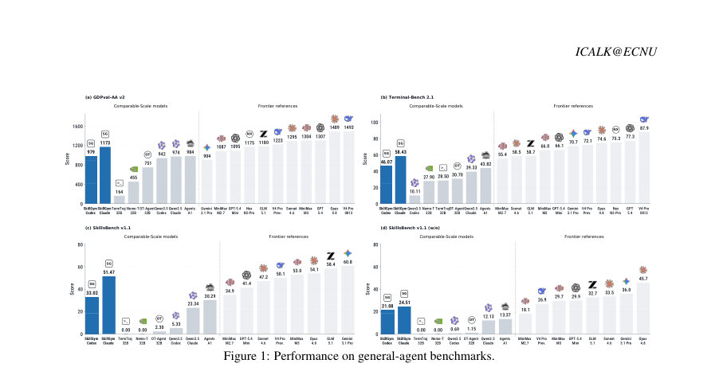
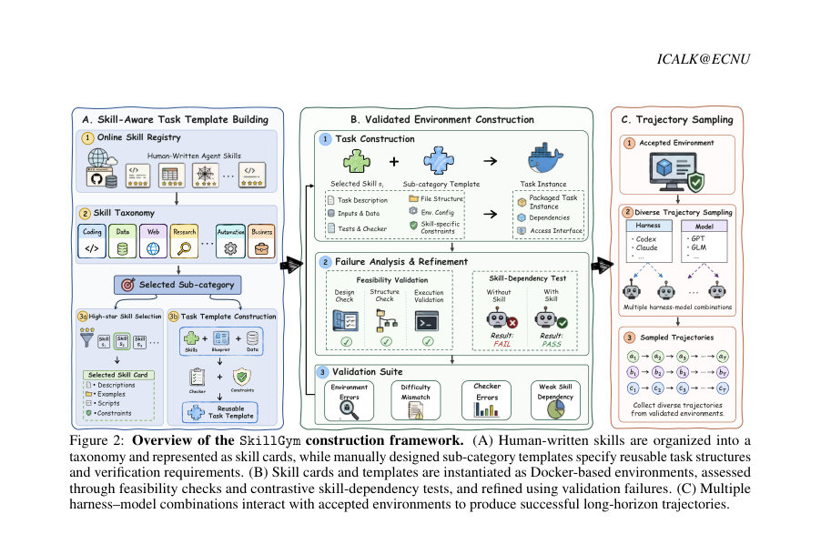
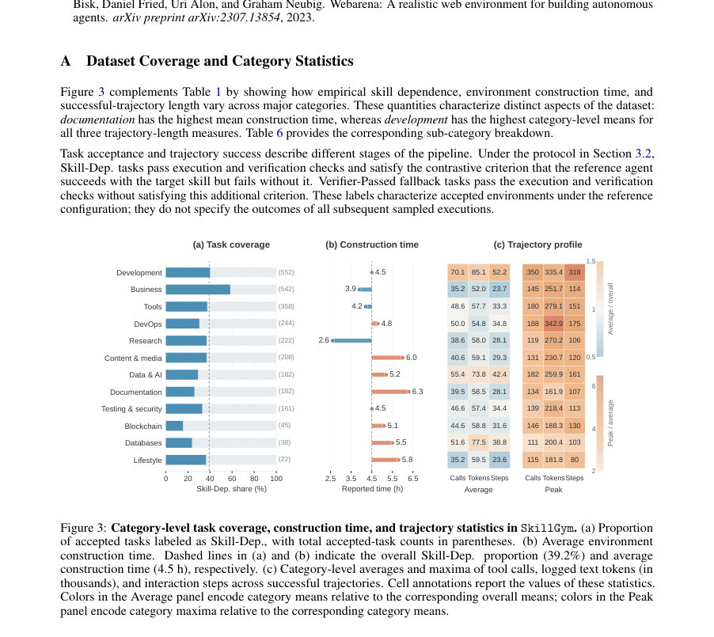

# SkillGym: Internalizing Human Skills into LLMs for Real-World Problem Solving

- **게시일:** 2026-09-24
- **arXiv:** [2609.27717v1](http://arxiv.org/abs/2609.27717v1) · [PDF](https://arxiv.org/pdf/2609.27717v1)
- **저자:** Zhilong Ge, Yuting Shao, Yutao Yang, Yuxuan Cai, Jie Zhou, Kai Chen, Bo Zhang, Qin Chen, Liang He
- **분야:** cs.CL
- **선정 점수:** 6.80
- **선정 이유:** 최근성 1.2, 인용 영향 0.0 (인용 0회), 저자 영향 0.0 (최고 h-index 0), AI 주제 적합성 3.0, 개발자 관심 0.8, 학술 신호 0.3, 오픈 웨이트·주요 연구조직 신호 1.6

[← 2026-09-24 목록으로 돌아가기](../daily/2026-09-24.html)

<!-- paper-visuals:start -->
## 주요 Figure

> 원문 PDF에서 실제 Figure 캡션과 그림 영역이 함께 확인된 자료만 자동 추출했다.

*Figure · 원문 PDF 2쪽 · Figure 1: Performance on general-agent benchmarks.*

*Figure · 원문 PDF 3쪽 · Figure 2: Overview of the SkillGym construction framework. (A) Human-written skills are organized into a*

*Figure · 원문 PDF 12쪽 · Figure 3: Category-level task coverage, construction time, and trajectory statistics in SkillGym. (a) Proportion*

<!-- paper-visuals:end -->

## 한 문장 요약

인간이 작성한 'agent skills' 문서를 재사용 가능한 실행 가능한 학습 환경으로 변환해 LLM이 절차적(워크플로우) 역량을 내부화하도록 학습시키는 SkillGym 프레임워크를 제안하고, 2,756개의 Docker화된 환경과 8,364개의 검증된 장기 실행 궤적을 공개하여 감독 미세조정(supervised fine-tuning)으로 실세계 문제 해결 성능을 크게 향상했음을 보인다.

## 해결하려는 문제

기존에는 인간이 작성한 agent skill(워크플로우·스크립트)이 주로 추론 시 외부 지침으로만 사용되어 검색 품질·컨텍스트 제약 등에 민감하고, 반복 사용이 모델의 재사용 가능한 능력으로 내재화되지 못한다. 연구 질문은 이러한 human-written skills를 어떻게 구체적이고 실행 가능한 과제로 접지(ground)하고, 코드 기반 검증으로 결과를 판정하여 LLM이 절차적 능력을 학습할 수 있는 훈련 환경으로 전환할 수 있는가이다.

## 핵심 기여

- SkillGym: human-written agent skills를 카테고리별 템플릿으로 구체적 과제로 인스턴스화하고 Docker 기반 실행 환경과 코드 기반 결과 검증기를 결합한 skill-to-task 파이프라인을 제안함.
- 콘스트라스티브 실행(참고 에이전트의 with-skill / without-skill 실행 비교)을 통해 경험적(skill) 의존성을 판정하는 2단계 검증 절차를 설계함(Feasibility + Skill-dependence).
- 2,756개의 수용된 환경(12개 대분류, 63개 소분류)과 다중 하네스·모델에서 수집한 8,364개의 성공 궤적(평균 49 tool 호출, 평균 63.4k 로깅 토큰)을 공개함.
- 수집된 검증 궤적으로 Qwen3.5-35B-A3B를 장기 문맥 감독 미세조정하여 여러 실세계 벤치마크에서 유의미한 성능 개선을 달성하고, 이를 통해 외부 스킬 의존도 없이도 절차적 역량이 향상될 수 있음을 보임.
- 환경·검증기·데이터·모델( SkillGym-Agent )을 공개해 재현 가능한 연구 자원으로 제공함.

## 접근 방법

* SkillGym는 세 단계로 구성된다.
* (1) Skill-aware template construction: OpenClaw 등의 온라인 스킬 레지스트리에서 고평점 스킬을 선별해 스킬 카드(Ki)를 구성하고, 소분류별 수동 제작 템플릿(Tc)을 정의하여 입력 자산, 파일 구조, 런타임 및 검증 요구사항을 규정한다.
* (2) Environment construction & validation: Ki와 Tc(i)를 결합해 Docker로 포장된 환경 Ei = (instruction xi, assets Ai, runtime ρi, verifier Vi)를 생성한다.
* 검증은(1) 실행·구조·검증기 통과 여부(Fi)와(2) 기준 에이전트의 with-skill/without-skill 대비 실행 결과(r+_i, r-_i)를 확인해 contrastive condition (r+_i, r-_i) = (1,0)이면 Skill-Dep.로 라벨링한다.
* 검증 실패는 환경·체커·난이도·약한 스킬 의존성 등으로 분류하여 수정한다.
* (3) Multi-harness trajectory sampling: Codex·Claude Code 등 여러 하네스와 여러 교사 모델(DeepSeek V4 Pro, GLM-5.2, GPT-5.4, Nex-N2-Pro 등)을 사용해 각 환경에서 롤아웃을 수행하고 코드 기반 verifier로 결과(성공/실패)를 판정하여 성공 궤적을 수집한다.
* 수집된 성공 궤적은 장문 컨텍스트 감독 미세조정에 사용되며(모든 LM 파라미터 업데이트, Megatron backend, 16×NVIDIA H200), 환경은 강화학습의 결과 보상(verifier)으로도 사용 가능하도록 설계됨.

## 주요 결과

- 데이터셋: 2,756개의 accepted task environments(12 major categories, 63 sub-categories). 이 중 1,081개(39.2%)가 Skill-Dep. 라벨, 1,675개가 Verifier-Passed(fallback). 평균 환경 구축 시간 4.5시간(카테고리별 2.6h~6.3h).
- 궤적 코퍼스: 총 48,152회 샘플링 중 8,364회(성공률 17.4%)가 verifier를 통과한 성공 궤적으로 저장됨. 성공 궤적 평균: 49.0 tool 호출, 63.4k 로그 텍스트 토큰, 35.2 상호작용 스텝(카테고리별 최대 평균치: 개발 카테고리에서 70.1 calls, 85.1k tokens, 52.2 steps).
- 벤치마크(같은 백본 Qwen3.5-35B-A3B 기준, Claude Code 하네스): GDPval-AA v2: 베이스 974 Elo → SkillGym-Agent 1,173 Elo (+199 Elo). Terminal-Bench 2.1: 39.33% → 58.43% (+19.10 p). SkillsBench v1.1 (w/ skills): 23.34% → 51.47% (+28.13 p). SkillsBench v1.1 (w/o skills): 12.13% → 24.51% (+12.38 p).
- Codex 하네스에서도 개선: GDPval-AA v2 942 → 979 (+37 Elo), Terminal-Bench 2.1 10.11% → 46.07% (+35.96 p), SkillsBench 등에서 유의미한 향상 보고.
- 비교: 35B SkillGym-Agent(Claude Code)는 SkillsBench(스킬 보조)에서 공개된 일부 고성능 모델(예: Claude Sonnet 4.6, GPT-5.4 Mini, DeepSeek V4 Pro (Preview))보다 높은 수치(51.47%)를 기록했다고 보고함(단, 공개 결과들은 하네스·평가 설정 차이가 있을 수 있음).

## 한계

- 저자가 명시한 한계: 논문은 주로 감독적 미세조정(supervised fine-tuning) 결과를 보고하며, 향후 작업으로 강화학습(reinforcement learning)에서 verifier 기반 보상을 활용하는 연구를 탐색하겠다고 밝힘—즉 현 구현은 RL 기반 최적화·failure-recovery 학습을 아직 본격적으로 다루지 않음.
- 저자가 명시한 근거성 한계: contrastive (r+ , r-) 검사는 '참고(reference) 에이전트 구성' 하에서의 경험적 의존성을 제공할 뿐, 모든 에이전트에 대해 해당 스킬이 필수적임을 보증하지는 않음(논문 본문에서 명확히 기술).
- 실험적 제약(본문에서 확인 가능): 샘플링된 전체 시도 대비 통과율이 낮음(성공률 17.4%), 즉 환경들이 현재 하네스·교사 조합에 대해 어렵게 설계되어 있음. 또한 환경 생성에 평균 4.5시간의 수작업·검증 비용이 필요해 대규모 확장 비용이 큼.
- 재현성·비교의 한계: 공개된 벤치마크·공개 모델 결과들은 하네스·평가 설정이 서로 달라 엄밀한 동등 비교가 불가능하다고 저자 스스로 명시함(따라서 SkillGym-Agent의 우위는 동일 설정 하에서의 절대 우위로만 해석해야 함).

## 개발자 관점

- 재현성: 환경은 Docker로 패키징되고 코드 기반 검증기(Vi)를 포함하며, 템플릿·환경·데이터·모델을 GitHub·Hugging Face로 공개 예정—이를 통해 실험 재현과 환경 확장이 용이함.
- 구현 요소: 스킬 카드(Ki)와 소분류 템플릿(Tc)을 분리해 수동 템플릿으로 인스턴스화하고, verifier는 입력 변조·단축 우회 검증(anti-shortcut) 등을 포함하도록 설계해야 함. 실패 로그·reflection을 통해 환경을 반복적으로 수정하는 파이프라인이 중요함.
- 학습·인프라: 저자들은 Qwen3.5-35B-A3B를 전체 파라미터 업데이트로 장문 컨텍스트 감독 미세조정했으며(Megatron backend, 16×NVIDIA H200), 하네스별 추론 설정(예: Claude Code: temperature=0.6, top_p=0.95, top_k=20; 컨텍스트 창 262,144 토큰)을 공개함. 대규모 장기 컨텍스트와 높은 계산 비용을 감안해야 함.
- 데이터 활용: 수집된 궤적은 평균 49 tool 호출, 63.4k 토큰이라는 장기·도구 중심 상호작용을 포함하므로 multi-step tool coordination 학습 샘플로 유용함. 성공·실패 궤적을 모두 보존해 실패 분석 및 강화학습 보상 신호로 활용 가능함.
- 운영·안전성: 환경은 실행 가능한 시스템(데이터·종속성 포함)을 제공하므로 악의적 입력·자원 고갈·우회(예: 입력 복사로 성공하는 경우) 같은 shortcut을 방지하는 검증기 설계가 필수임.

**근거 범위:** 이 분석은 제공된 논문 PDF 본문(모든 페이지)의 텍스트를 근거로 작성되었다. 본문에서 명확히 제시된 수치(환경·궤적 수, 평균 tool 호출·토큰·스텝, 성공률, 벤치마크 성능 개선 등)를 사용했으며, 저자가 공개할 예정이라고 명시한 리소스 링크들도 본문에 기재된 내용에 기반한다. 다만 학습 하이퍼파라미터(예: 학습률, 배치사이즈)와 일부 내부 구현 세부는 본문에 완전한 수치로 제시되지 않아 명시하지 않았으며, 공개 비교 대상 모델들의 성능은 논문에서 언급된 하네스·설정 차이로 인해 엄밀한 동등 비교가 어렵다는 점을 본문 근거로 함께 밝혀 둔다.
