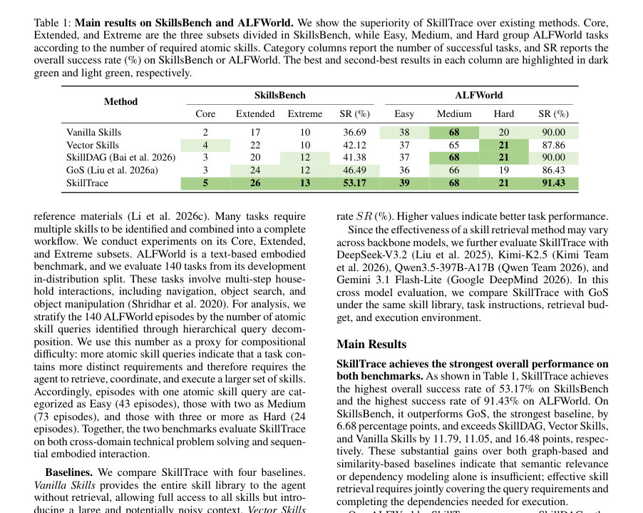

# SkillTrace: Traversing a Query-Skill Graph for Composable LLM Agents

- **arXiv:** [2608.02356v1](http://arxiv.org/abs/2608.02356v1) · [PDF](https://arxiv.org/pdf/2608.02356v1)
- **저자:** Yue Yao, Shengyuan Wang, Xin Chen, Minke Zhang, Jia He, Bingjun Luo, Tom Gedeon
- **분야:** cs.AI
- **선정 점수:** 9.25
- **선정 이유:** 최근성 0.6, 핵심어: large language model, 핵심어: llm, 분야 가중치 2.0, 구체적인 초록

<!-- paper-visuals:start -->
## 주요 그림·그래프·표

> 원문 PDF에서 자동 추출한 자료다. 정확한 해석은 원문 캡션과 본문을 함께 확인해야 한다.

*그림·그래프 · 원문 PDF 1쪽 · Figure 1: Motivation. We argue that independent skill re-*

*그림·그래프 · 원문 PDF 3쪽 · Figure 2: Overview of SkillTrace with an intuitive example. SkillTrace decomposes a complex query into atomic skill queries,*

*표 · 원문 PDF 5쪽 · Table 1: Main results on SkillsBench and ALFWorld. We show the superiority of SkillTrace over existing methods. Core,*

<!-- paper-visuals:end -->

### 한 문장 요약

쿼리-스킬 그래프의 세 수준(쿼리 간 구성관계, 쿼리와 스킬 후보 유사도, 선택된 후보들 간 의존성)을 활용해 사용자 쿼리를 계층화·매칭·의존성 전파로 완전한 실행 가능한 스킬 조합을 찾아내는 SkillTrace를 제안한다.

### 해결하려는 문제

복잡한 작업을 해결하기 위해 스킬 라이브러리에서 재사용 가능한 스킬들을 조합할 때, 단순히 개별적으로 관련 있는 스킬을 검색하는 것을 넘어서 ‘완전하고 실행 가능한’ 스킬 조합을 식별해야 하는 문제.

### 핵심 기여

- 쿼리-스킬 검색 문제를 세 가지 수준의 그래프로 구성(쿼리 간의 구성적 관계, 쿼리-후보 유사도, 선택된 후보 간 의존성)하여 서술한 점.
- 사용자 쿼리를 의미 계층으로 조직하고(semantic hierarchy), 그 위에서 스킬 쿼리와 후보를 매칭한 뒤 스킬 의존성에 대해 전파(propagation)하는 새로운 방법 SkillTrace 제안.
- SkillsBench와 ALFWorld 실험에서 state-of-the-art 성능을 달성했고(논문 초록 기준), 서로 다른 백본 언어 모델에 걸쳐 일관된 성능 향상을 보였다고 보고함.

### 접근 방법

세 수준의 그래프 설계: (1) 사용자 쿼리를 의미적 계층으로 분해하여 쿼리 간의 구성적 관계를 모델링, (2) 각 쿼리와 스킬 라이브러리의 후보들 사이 유사도를 기반으로 매칭 수행, (3) 후보들 간의 의존성 정보를 따라 그래프 상에서 정보를 전파하여 최종적으로 완전하고 실행 가능한 스킬 조합을 선택하는 파이프라인을 제안함. SkillTrace는 이 파이프라인을 통해 스킬 검색 및 조합 문제를 해결하며, 다양한 백본 언어 모델과 함께 동작하도록 설계되었음을 초록에서 주장함.

### 주요 결과

- SkillsBench에서 성공률 53.17%로 state-of-the-art 성능 달성(초록 기준).
- ALFWorld에서 성공률 91.43% 달성(초록 기준).
- 서로 다른 백본 언어 모델들에서 일관된 개선을 보였다고 보고함(초록만으로는 구체적 백본 목록 및 향상 폭은 확인 불가).

### 한계

- 초록만으로 확인하기 어려움: 사용자 쿼리를 의미 계층으로 분해하는 구체적 방법(예: 규칙 기반인지, 별도 모델을 학습시키는지)과 그 정확도 및 비용.
- 초록만으로 확인하기 어려움: 그래프 구성(노드/엣지의 정확한 정의), 유사도 측정 방식(벡터 유사도? 다른 메트릭?), 그리고 의존성 전파 알고리즘의 구체적 구현(예: 메시지 패싱, 확률적 전파 등).
- 초록만으로 확인하기 어려움: 학습/튜닝 절차(지도학습인지, 강화학습인지, 또는 비지도 매칭인지), 필요 훈련 데이터와 라벨링 요구사항.
- 초록만으로 확인하기 어려움: 계산 비용·추론 지연·메모리 사용량 등 실사용 관점의 효율성 및 확장성 정보가 없음. 대규모 스킬 라이브러리에서의 성능 유지 여부 불명확함.","초록만으로 확인하기 어려움: 제안 방법의 실패 모드(예: 잘못된 분해가 전체 조합을 망칠 가능성), 안전성·안정성에 관한 분석이나 에러 케이스가 제공되지 않음.","초록만으로 확인하기 어려움: 보고된 수치들의 통계적 유의성(표준편차, 신뢰구간, 비교 대상의 구체적 설정)과 재현성(코드·데이터 공개 여부)이 불명확함.

### 개발자 관점

- 스킬 검색·조합 문제를 그래프 관점(쿼리 구성관계, 쿼리-후보 유사도, 후보 간 의존성)으로 모델링하면 완전한 실행 계획을 찾기 수월해질 수 있음.
- 사용자 쿼리를 의미적 계층으로 분해하는 전처리 단계가 핵심이므로, 이 단계의 설계(예: 의미적 슬롯 분해, 서브쿼리 추출, 트리 구조화)에 신경 써야 함.
- 쿼리와 스킬 후보 매칭에는 강력한 임베딩/유사도 측정이 필요하며, 후보들 간 의존성(입출력 타입, 순서성 등)을 명시적으로 모델링하면 조합의 실행 가능성을 높일 수 있음.
- 의존성 정보를 그래프 전파로 통합하면 국소적 일치만으로는 놓치기 쉬운 전역 실행 가능성 검증이 가능하므로, 그래프 알고리즘(예: 메시지 패싱, 전파 기반 점수 집계)을 적용해 볼 만함.
- 백본 언어 모델에 독립적으로 성능을 개선했다고 하므로, 특정 LLM에 지나치게 결합되지 않는 인터페이스(스킬 표현, 유사도 계산기 등)를 설계하는 것이 실용적임(단, 초록만으로 구체적 인터페이스는 확인하기 어려움).","실험은 SkillsBench와 ALFWorld에서 수행되었으므로, 비슷한 벤치마크로 초기 검증을 하고, 이후 대규모·실세계 스킬 라이브러리로 확장 테스트를 권장함.","실제 적용 전 확인할 것: 방법의 계산 비용, 응답 지연, 스킬 라이브러리 크기 증가 시 성능 저하 여부, 그리고 분해 오류에 대한 복원력(recovery)과 디버깅 가능성."],

**근거 범위:** 이 분석은 논문 제목과 초록만을 바탕으로 작성되었음. 성능 수치(예: 53.17%, 91.43%)와 전반적 주장들은 초록에 기술된 내용을 그대로 인용했으며, 구현 세부사항·정확한 알고리즘·실험 설정·통계적 유의성 등은 초록만으로는 확인하기 어렵다.

---

- **소개 날짜:** 2026-08-05
- [← 2026-08-05 논문 목록으로 돌아가기](../daily/2026-08-05.md)
- [일별 아카이브 보기](../daily/index.md)

