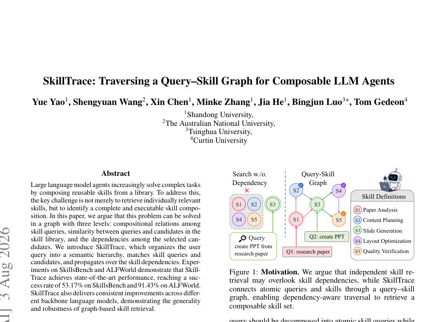
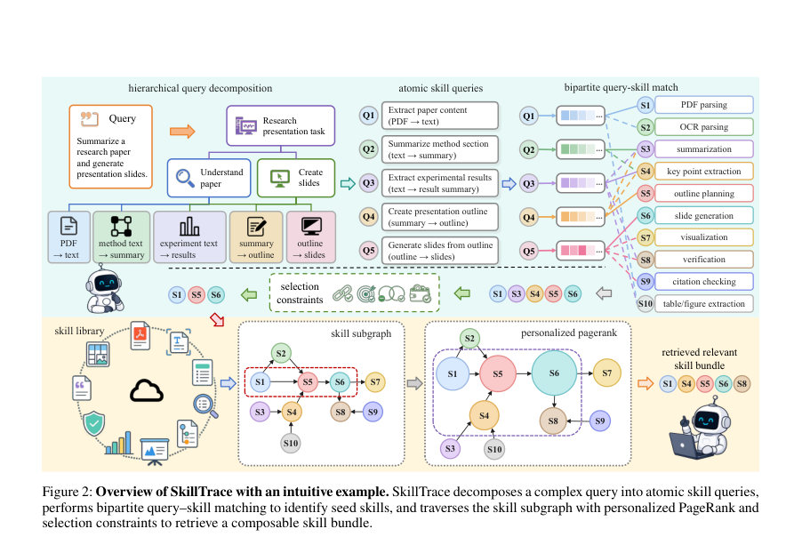
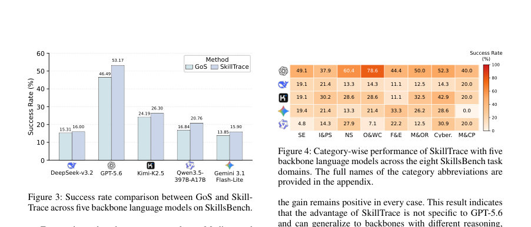

# SkillTrace: Traversing a Query-Skill Graph for Composable LLM Agents

- **arXiv:** [2608.02356v1](http://arxiv.org/abs/2608.02356v1) · [PDF](https://arxiv.org/pdf/2608.02356v1)
- **저자:** Yue Yao, Shengyuan Wang, Xin Chen, Minke Zhang, Jia He, Bingjun Luo, Tom Gedeon
- **분야:** cs.AI
- **선정 점수:** 9.25
- **선정 이유:** 최근성 0.6, 핵심어: large language model, 핵심어: llm, 분야 가중치 2.0, 구체적인 초록

### 한 문장 요약

쿼리 구성 관계, 쿼리–스킬 유사도, 스킬 의존성의 3계층 그래프를 탐색하여 실행 가능한 스킬 조합을 찾아내는 SkillTrace를 제안한다.

### 해결하려는 문제

복잡한 사용자 쿼리를 해석·분해하고, 구성 요구를 충족하는 스킬들의 조합을 동시에 식별하며 실행에 필요한 의존성까지 충족하는 완전하고 실행 가능한 스킬 구성을 찾는 문제이다. 기존 방법은 독립적인 쿼리-스킬 매칭이나 고정된 그래프 기반 접근에 의존하는 경향이 있어, 스킬 간 의존성, 실행 순서, 누가 어떤 입력/출력을 연결하는지와 같은 종합적 요건을 동시에 만족시키지 못하는 한계가 있다.

### 핵심 기여

- 3계층 쿼리-스킬 그래프(Gx,S) 구성 및 이를 통한 실행 가능한 스킬 구성 검색 프레임워크 제시: 계층적 쿼리 트리 Tx, 쿼리–스킬 이진 그래프 Bx,S, 스킬 의존성 그래프 DS를 결합한 구조화된 그래프 탐색.
- 
- Hierarchical Query Tree(HQT)로 사용자 쿼리를 원자적 스킬 쿼리 Ax로 분해하고 Leaf 쿼리로부터 스킬 매핑을 시작하는 쿼리 분해 프로세스 제시.
- 
- 쿼리–스킬 이진 그래프에서 각 원자 쿼리에 대해 가장 큰 시맨틱 유사도를 가지는 주 스킬을 매핑하고 Hungarian 알고리즘으로 일대일 매칭을 통해 Seed 스킬을 확정하는 프레임워크 제시.

### 접근 방법

* 시스템 구성은 다음과 같다.
* 먼저 Tx를 LM pθ로 구성적 semantic 트리로 생성하고, Ax를 얻는다(Leaf(Tx)).
* Ax와 스킬 라이브러리 S로부터 쿼리–스킬 이진 그래프 Bx,S를 구성하며 각 엣지 가중치는 wij = sim(fQ(qi), fS(sj))로 정의하고, qi에 대해 sj를 최대 시맨틱 유사도으로 선택한다(식 5).
* 이후 Bx,S에 대해 최대 가중치 매칭(Hungarian)을 수행하여 Px,S를 산출하고 시드로 삼는다.
* 스킬 의존성 그래프 DS는 S와 ED_S, WD_S로 구성되며, wD_ij = overlap(Oi, Ij)이고 임계치 δD 이상인 엣지만 그래프에 포함한다(식 6-7).
* 의존성 확장을 위해 Reverse Personalized PageRank를 적용하여 seed 벡터 p를 정규화하고 역방향 전파를 통해 r∗를 얻은 뒤, Px,S와 r∗의 TopK를 결합하여 최종 선택 집합 S∗_x를 얻는다(식 8-9).
* 알고리즘 1은 전체 파이프라인을 요약하며, 온라인 복잡도는 O(QN + Q^2N + K(N+E))로 요약된다(식 10).
* 하이퍼파라미터로 δD(0.6), α(0.2), K(ALFWorld에서 6), Q ≤ N, 최대 반복 50 등을 사용하며, 임베딩은 text-embedding-3-large(차원 3072), 그래프 구성은 오프라인으로 수행한다.
* 그래프 구성 시 각 스킬은 최대 8개의 연결 후보를 고려하며 의존성 엣지는 0.6 이상일 때만 보유한다.
* SkillsBench와 ALFWorld의 벤치마크에서 동일한 task, 스킬 라이브러리, 백본 모델, 실행 환경을 사용하고, ALFWorld의 스킬 번들 상한은 6개로 제한한다.
* 실험은 GPT-5.6를 기본 백본으로 삼아 SkillTrace의 비교를 수행했으며, Cross-Model 실험에서 DeepSeek-V3.2, Kimi-K2.5, Qwen3.5-397B-A17B, Gemini 3.1 Flash-Lite에서도 일반화되는 것을 확인했다.

### 주요 결과

- 주요 결과: SkillTrace는 SkillsBench에서 SR 53.17%, ALFWorld에서 SR 91.43%의 누적 성공률로 SOTA를 달성했다.
- SkillsBench에서 GoS를 6.68pp, SkillDAG/Vector Skills/ Vanilla Skills를 각각 11.79pp, 11.05pp, 16.48pp 차로 능가했다.
- ALFWorld에서 SkillTrace는 가장 강력한 Baseline들보다 각각 1.43pp, 5.00pp, 3.57pp 차로 상회했다.
- 교차 백본 실험에서 GPT-5.6을 포함한 5개 백본에서 SkillTrace가 일관되게 GoS보다 우수했고, 각 모델별 개선폭은 0.69pp에서 6.68pp까지 다양했다.
- 아블레이션 연구에서 HQT 제거 시 46.49%로 감소(-6.68pp), QSBG 제거 시 43.95%(−9.22pp), SDS 제거 시 40.22%(−12.95pp)로, 세 구성요소의 결합이 실행 가능한 구성 도출에 기여함을 확인했다.

### 한계

- 저자 명시적 한계 섹션은 보이지 않으며, 한계는 주로 실험 설계와 결과로부터 파생된다.
- 벤치마크가 SkillsBench(87 tasks, 200 스킬 라이브러리)와 ALFWorld(140 에피소드)로 한정되어 있어 다양한 도메인이나 실제 배포 환경에서의 일반화는 추가 검증이 필요하다.
- 백본 LLM 성능에 따라 성능 편차가 크며, 실험은 OpenAI 호스팅 API를 포함한 특정 하드웨어/환경에서 수행되었으므로 배포 시 의존성(네트워크/API 비용, 응답 지연 등)이 존재한다.
- 의존성 그래프의 구성은 offline으로 한 번 계산되며 큰 스킬 라이브러리에서의 확장성 문제 및 pairwise 비교 비용이 실질적으로 증가할 수 있다(실제 대규모 라이브러리에서의 확장성 여부는 추가 검증 필요).”,

### 개발자 관점

- 그래프 기반 스킬 검색의 재현성을 위해 그래프(의존성 그래프 DS)와 임베딩-based 쿼리–스킬 매핑(Bx,S)을 오프라인으로 프리컴퓨트하고 캐시하는 구조를 권장한다.
- 임베딩 차원(3072) 및 도메인별 스킬 라이브러리 구성(SkillsBench: 200개, ALFWorld: 37개 ALFWorld 스킬)처럼 고정된 구성을 사용하되, 대규모 라이브러리에서는 8개의 연결 후보, δD=0.6, 역방향 PPR의 α=0.2, TopK의 적절한 값(K) 등을 도메인에 맞춰 조정해야 한다.
- Hungarian 매칭과 ReversePPR를 포함하는 2단계 탐색 구조를 도입하면 독립적 스킬 랭킹 대비 실행 가능한 구성의 품질이 크게 개선되므로, 재현성을 위해 알고리즘 1의 흐름과 식(식 3-9, 12-13, 15-16)을 코드에 직접 반영하는 것이 권장된다.
- 패브릭(prompt) patom의 구체적 구성은 본문에 제시되지만, 실험에서의 프롬프트 민감도 및 재현성 이슈를 고려해 다양한 버전의 patom을 실험에 포함시키는 파일럿 연구를 권장한다.
- 실제 배포 시 비용과 속도 이슈를 고려해 온라인 추론 시 Q, N, E의 규모를 제어하고, 그래프 업데이트가 필요할 경우 오프라인에서 주기적으로 갱신하는 전략을 수립해야 한다.

## 주요 Figure

> 원문 PDF에서 실제 Figure 캡션과 그림 영역이 함께 확인된 자료만 자동 추출했다.

*Figure · 원문 PDF 1쪽 · Figure 1: Motivation. We argue that independent skill re-*

*Figure · 원문 PDF 3쪽 · Figure 2: Overview of SkillTrace with an intuitive example. SkillTrace decomposes a complex query into atomic skill queries,*

*Figure · 원문 PDF 6쪽 · Figure 3: Success rate comparison between GoS and Skill-*

<!-- paper-visuals:end -->

<!-- paper-visuals:start -->
## 주요 Figure

> 원문 PDF에서 실제 Figure 캡션과 그림 영역이 함께 확인된 자료만 자동 추출했다.

*Figure · 원문 PDF 1쪽 · Figure 1: Motivation. We argue that independent skill re-*

*Figure · 원문 PDF 3쪽 · Figure 2: Overview of SkillTrace with an intuitive example. SkillTrace decomposes a complex query into atomic skill queries,*

*Figure · 원문 PDF 6쪽 · Figure 3: Success rate comparison between GoS and Skill-*

<!-- paper-visuals:end -->

**근거 범위:** 논문 PDF 본문 기반 분석. 제공된 PDF 본문에서 발췌한 수치 및 알고리즘 상세를 바탕으로 작성했다. 다만 패턴 프롬프트 patom의 구체 구성이나 전체 구현 세부 등 본문에 제시되지 않은 세부는 재현에 필요한 수준으로 제한적으로 다루었고, 일부 수치의 맥락(특정 실험 설정의 세부) 은 본문에 명시적으로 제시되지 않아 확인이 필요한 부분이 있다.

---

- **소개 날짜:** 2026-08-05
- [← 2026-08-05 논문 목록으로 돌아가기](../daily/2026-08-05.md)
- [일별 아카이브 보기](../daily/index.md)

