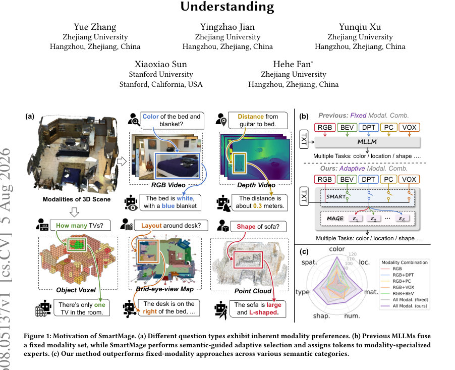
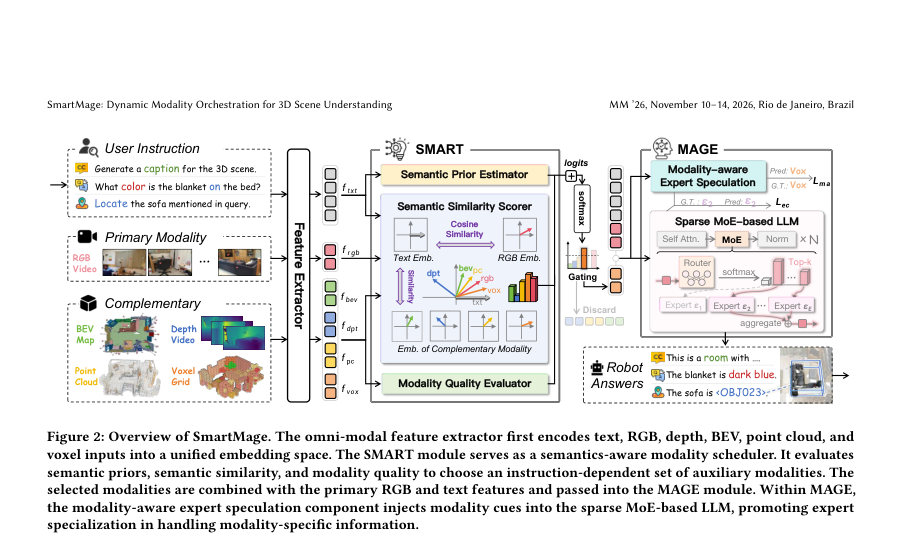
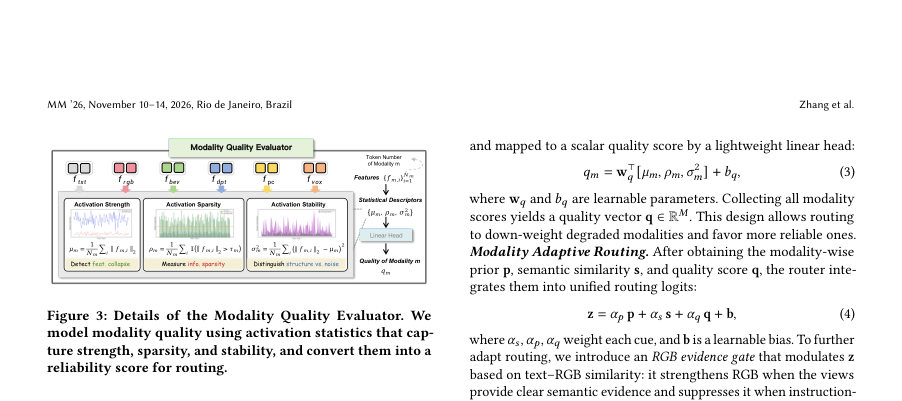

# SmartMage: Dynamic Modality Orchestration for 3D Scene Understanding

- **게시일:** 2026-08-06
- **arXiv:** [2608.05137v1](http://arxiv.org/abs/2608.05137v1) · [PDF](https://arxiv.org/pdf/2608.05137v1)
- **저자:** Yue Zhang, Yingzhao Jian, Yunqiu Xu, Xiaoxiao Sun, Hehe Fan
- **분야:** cs.CV
- **선정 점수:** 10.26
- **선정 이유:** 최근성 1.5, 핵심어: reasoning, 핵심어: multimodal, 핵심어: alignment, 핵심어: benchmark

[← 2026-08-06 목록으로 돌아가기](../daily/2026-08-06.md)

<!-- paper-visuals:start -->
## 주요 Figure

> 원문 PDF에서 실제 Figure 캡션과 그림 영역이 함께 확인된 자료만 자동 추출했다.

*Figure · 원문 PDF 1쪽 · Figure 1: Motivation of SmartMage. (a) Different question types exhibit inherent modality preferences. (b) Previous MLLMs fuse*

*Figure · 원문 PDF 3쪽 · Figure 2: Overview of SmartMage. The omni-modal feature extractor first encodes text, RGB, depth, BEV, point cloud, and*

*Figure · 원문 PDF 4쪽 · Figure 3: Details of the Modality Quality Evaluator. We*

<!-- paper-visuals:end -->

## 한 문장 요약

질의 문맥에 따라 3D/2D 입력 모달리티를 동적으로 선택(SMART)하고 모달리티-특화 전문가로 토큰을 라우팅(MAGE)하여 3D 장면 이해 성능과 효율을 향상시키는 통합 MLLM 프레임워크.

## 해결하려는 문제

기존 MLLM들은 고정된 모달리티 조합으로 모든 질의에 동일한 입력을 제공하므로, 질의별로 유효한 모달리티가 다름에도 불구하고 불필요한 모달리티가 잡음과 계산 낭비를 유발하고 중요한 모달리티가 충분히 활용되지 않음. 연구 질문은 "질의 의미에 따라 어떤 모달리티를 사용할지 동적으로 선택하고, 선택된 모달리티 정보를 LLM 내부에서 모달리티-일관성 있게 처리(전문가 특화)하려면 어떻게 설계하고 학습할 것인가"이다.

## 핵심 기여

- SmartMage라는 통합 3D 장면 이해 MLLM 제안: 질의 의미에 따른 전역-로컬 적응적 모달리티 조율을 수행.
- SMART: 질의 기반의 글로벌 모달리티 라우터로, Semantic Prior Estimator(SPE), Semantic Similarity Scorer(SSS), Modality Quality Evaluator(MQE)를 통합해 보조 모달리티를 선택함.
- MAGE: 모달리티-인지 모달리티-전문가 사양(MES)과 소프트 MoE 라우팅을 결합해 토큰-레벨로 모달리티 친화적 전문가 활성화를 유도, 전문가의 모달리티 특화 촉진.
- ScanFacet 진단 벤치마크 제안 및 분석을 통해 질문 유형별 모달리티 선호 패턴을 도출하고 방법의 해석성 제공.
- 다섯 개의 표준 3D 벤치마크에서 성능 개선(SOTA)과 RGB 전용 비디오 벤치마크에서의 경쟁력 입증.

## 접근 방법

아키텍처: 입력은 RGB-D 비디오(키프레임 선택 FoVSR), BEV(메시로 렌더링), 포인트 클라우드(8192 pts, PointNet++), 복셀(Mask3D 기반 sparse U-Net) 등 모달리티 집합 M={rgb,dpt,bev,pc,vox}을 비주얼 임베딩 공간으로 투영해 {f_m}_{m∈M}을 얻는다. SMART: 텍스트 임베딩 f_txt로부터 (1) SPE: f_txt→모달리티 선호 prior p (softmax로 예측), (2) SSS: 텍스트-모달리티 정렬을 위해 modality-specific query φ_m을 이용한 cross-attention으로 ˆf_m 생성 후 g_txt와 코사인 유사도로 s_m 산출(정규화·어파인 보정 포함), (3) MQE: 각 모달리티의 활성화 통계(강도 μ_m, 희소성 ρ_m, 안정성 σ^2_m)를 선형 헤드로 변환해 품질 점수 q_m 산출. 이들 가중합 z = α_p p + α_s s + α_q q + b와 RGB 증거 게이트로 최종 모달리티 선택(항상 RGB는 primary로 유지). MAGE: LLM 내부에 소프트 MoE 라우터를 삽입(레이어 8,12,16,20,24,28; 각 레이어 8 experts; top-2 routing). 각 토큰 h_i^(ℓ)에 대해 라우팅 확률 π_i,e 계산(softmax 형태, 온도 τ), Top-K 전문가로 집계. MES는 토큰별 모달리티 분포 r_i를 예측하고, 모달리티-전문가 호환성 행렬 A를 이용해 전문가 사전 ˜π_i,e를 구성하여 라우터의 확률적 우선순위를 유도한다(교차 엔트로피/정규화 손실로 정렬). 학습 및 파인튜닝: 시각 인코더 고정, 어댑터·라우터·전문가 분기만 학습. 초기화는 Qwen3-VL-8B-Instruct, 전문가들은 사전학습된 FFN으로 초기화. 손실은 L = L_ce + λ_sem L_sem + λ_dis L_dis + L_ma + L_ec + λ_bal L_bal으로 구성되어 semantic alignment와 expert assignment를 함께 정규화(하이퍼: λ_sem=0.5, λ_dis=1.0, λ_bal=0.01). 최적화는 AdamW(lr=2e-5, warm-up 0.03, cosine decay), 1 epoch, batch 64, 2×H800 GPU, BF16, DeepSpeed ZeRO-2.

## 주요 결과

- 표준 3D 벤치마크(ScanQA, SQA3D, Scan2Cap, ScanRefer, Multi3DRefer)에서 SOTA 달성: SmartMage의 주요 절대 성능은 ScanQA EM@1=32.6, SQA3D EM@1=66.8, Scan2Cap CIDEr@0.25=93.8 CIDEr@0.5=88.7, ScanRefer Acc@0.25=65.9 Acc@0.5=59.5, Multi3DRefer F1@0.25=65.4 F1@0.5=60.7(표 Table 1).
- 주요 비교 우위: Ross3D 대비 ScanRefer Acc@0.5에서 +5.1, Multi3DRefer F1@0.5에서 +6.4 향상(본문 명시).
- 3D Dense Captioning에서 PQ3D 대비 CIDEr@0.25 +6.7, Video-3D LLM 대비 CIDEr@0.5 +4.9(본문).
- 진단 벤치 ScanFacet에서 색상 및 재질 관련 항목에 대해 큰 개선: material +27.1 CIDEr, color +15.9 CIDEr(본문).
- 어블레이션: SMART 구성요소 중 SSS 제거가 가장 큰 성능 하락을 유발(예: ScanQA EM@1 29.8→27.1), MAGE의 MES 제거도 의미 있는 성능 감소를 야기(예: SQA3D EM@1 64.5→63.1). 손실 항목 제거 실험에서 L_sem 제거가 큰 영향, L_ma/L_ec/L_bal 제거는 전문가 할당 안정성·균형성에 큰 영향(표 Table 2,3).

## 한계

- 저자가 명시한 한계: (1) LLM의 토큰 예산과 계산 한계로 멀티뷰 이미지와 포인트 수를 줄여야 하며(FoVSR로 키프레임 선택, FPS로 포인트 다운샘플링) 이로 인해 중요한 뷰/세부가 누락될 수 있음. (2) 학습 데이터 품질(흐릿한 다중뷰, 주석 부정확성)이 정밀 공간 추론 및 객체 로컬라이제이션 성능을 제한할 수 있음.
- 실험·분석에서 확인되는 제약: (1) 고해상도/다중뷰 3D 전처리 비용이 존재하며(테이블에서 2D+3D 전처리/TTFT/E2E 지연 수치 제시), 실시간·저지연 응용에는 추가 최적화 필요. (2) 경우에 따라 주석 불확실성(동일 서술에 대해 복수 객체 적합)과 조명·색상 변화에 민감해 오분류 발생 사례 존재(부록의 failure cases).

## 개발자 관점

- 재현을 위해 주요 구현 포인트: 모델 초기화는 Qwen3-VL-8B-Instruct 사용, 시각 인코더는 고정(frozen)하고 어댑터만 학습, MoE는 transformer 층 8/12/16/20/24/28에 삽입, 각 레이어 8 experts, top-2 라우팅, 전문가 초기화는 사전학습된 FFN을 재사용.
- 데이터·전처리: 각 장면에서 32 RGB-D 프레임(128×123), BEV 동일 해상도 렌더링, 포인트클라우드 8192 pts, 복셀 해상도 0.02 사용. FoVSR를 통해 키프레임을 빠르게 선택하면 전처리 비용을 크게 줄일 수 있으나 중요한 뷰 손실 위험을 인지해야 함.
- 학습 비용 절감 전략: 전체 LLM 파라미터를 동결하고 라우터·전문가·어댑터만 파인튜닝하면 학습 시간과 메모리 절감 가능(논문에서는 2×H800으로 1 epoch 학습, 시간/iter 47.44s 보고).
- 설계·안정성 팁: 라우팅을 안정화하기 위해 L_bal(전문가 균형), L_ec(전문가 보정), L_ma(모달리티 귀속) 등 정규화 손실을 함께 적용하는 것이 중요(어블레이션 결과).
- 배포 고려사항: SmartMage는 전처리(3D 렌더링/포인트 샘플링) 비용과 LLM-내 MoE 활성화 비용이 있어 엔드-투-엔드 지연에 민감한 애플리케이션은 TTFT/E2E 지표(논문 수치: TTFT≈112.5ms, E2E≈538.2ms)를 참고해 엔지니어링 최적화 필요. 또한 강화된 3D 인식 능력의 잠재적 오용(감시·군사 등)을 고려해 윤리적 사용 가이드라인을 수립해야 함.

**근거 범위:** 본 분석은 제공된 논문 PDF 본문(메인 텍스트, 표, 그림, 부록 요약 포함)을 근거로 작성되었음. 본문에 명시된 수치(성능 지표, 하이퍼파라미터, 구조·학습 설정, 전처리 구성 등)를 직접 인용했으며, PDF 레이아웃/중복 페이지로 인한 OCR 표현의 일부 기호적 왜곡은 문맥으로 보정함. 구현 세부(예: 정확한 코드 경로, 내부 초기화 시드)나 PDF에 상세히 기술되지 않은 추가 하이퍼파라미터는 작성하지 않았으므로 재현 시 논문 부록과 공개 코드(프로젝트 페이지)를 함께 참고할 것을 권고함.
