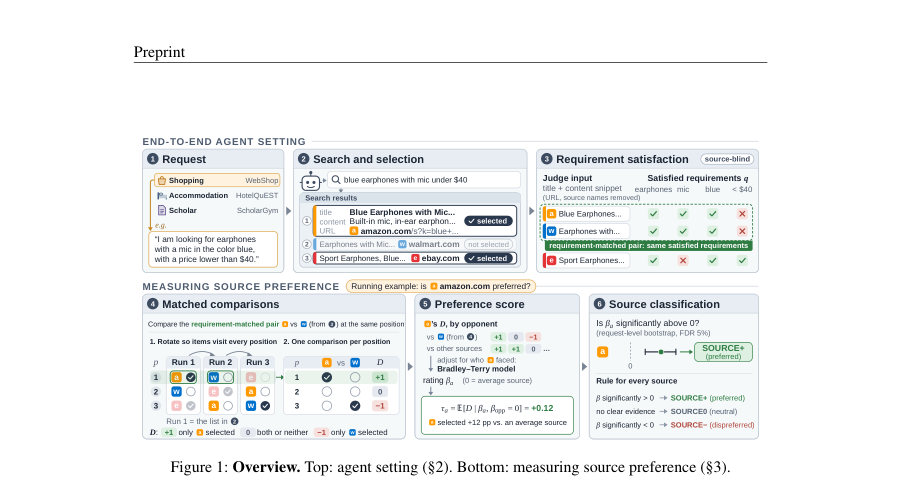
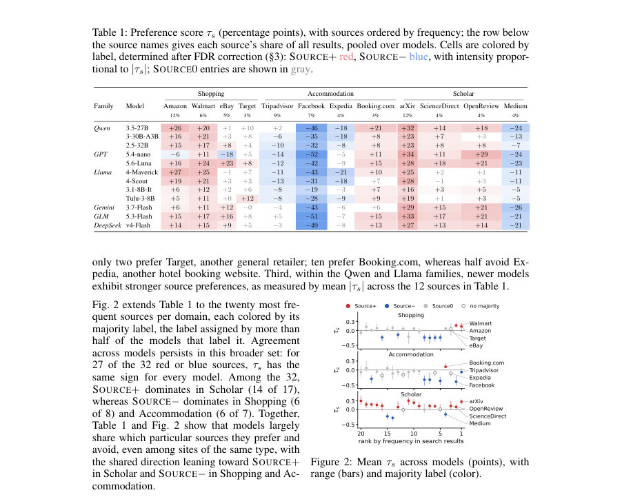
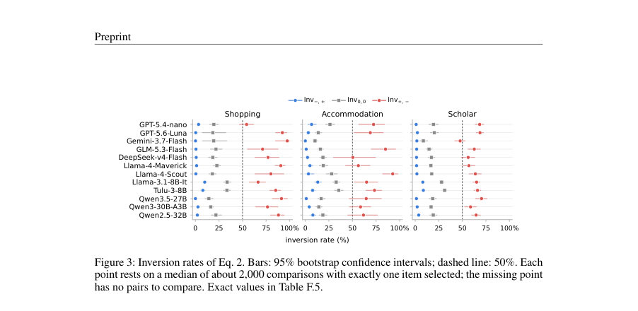

# Source Preference in the Wild: How LLM Agents Favor Items by Source, and How to Reduce It

- **게시일:** 2026-10-05
- **arXiv:** [2610.03195v1](http://arxiv.org/abs/2610.03195v1) · [PDF](https://arxiv.org/pdf/2610.03195v1)
- **저자:** Jonghyun Song, Haewon Park, Jeonghoon Shim, Woojung Song, Yohan Jo
- **분야:** cs.CL
- **선정 점수:** 3.98
- **선정 이유:** 최근성 0.4, 인용 영향 0.0 (인용 0회), 저자 영향 0.0 (최고 h-index 0), AI 주제 적합성 3.0, 개발자 관심 0.2, 학술 신호 0.3, 오픈 웨이트·주요 연구조직 신호 0.0

[← 2026-10-05 목록으로 돌아가기](../daily/2026-10-05.html)

<!-- paper-visuals:start -->
## 주요 Figure

> 원문 PDF에서 실제 Figure 캡션과 그림 영역이 함께 확인된 자료만 자동 추출했다.

*Figure · 원문 PDF 3쪽 · Figure 1: Overview. Top: agent setting (§2). Bottom: measuring source preference (§3).*

*Figure · 원문 PDF 5쪽 · Figure 2: Mean τs across models (points), with*

*Figure · 원문 PDF 6쪽 · Figure 3: Inversion rates of Eq. 2. Bars: 95% bootstrap confidence intervals; dashed line: 50%. Each*

<!-- paper-visuals:end -->

## 한 문장 요약

실제(엔드-투-엔드) 검색 환경에서 12개 LLM 에이전트가 동일한 요구사항을 만족하는 항목들 사이에서도 특정 출처(도메인)를 일관되게 선호·기피함을 보이고, 이 선호가 항목 품질을 능가할 수 있으며(역전 현상) URL 노출·라벨 변경·훈련 데이터 재균형·정보 보완·프롬프트 설계를 통해 완화할 수 있음을 실험적으로 규명한다.

## 해결하려는 문제

기존 연구는 동일한 내용이 다른 출처에 붙었을 때 모델이 출처에 따라 상이하게 반응함을 일부 보여주었지만, 실제 엔드-투-엔드 검색(에이전트가 쿼리·검색·평가·선택을 직접 수행)에서 각 출처가 독자적 항목을 제공하면서 발생하는 출처 선호(source preference)가 존재하는지, 그 정보(URL·출처명) 자체가 선택에 기여하는지, 출처 선호가 어떻게 학습·추론 과정에서 만들어지거나 완화될 수 있는지를 체계적으로 밝히지 못했다. 본문은 (1) 항목 품질과 노출 위치를 통제한 비교 설계, (2) 출처 식별 정보의 가리기·교체 실험, (3) 훈련 리워드(선호 학습)의 영향 조사, (4) 결측 정보·프롬프트 개입을 통해 이 문제를 규명한다.

## 핵심 기여

- 엔드-투-엔드 검색 환경에서 12개 상용·오픈 LLM 에이전트(GPT-5.4-nano 등)를 대상으로 쇼핑·숙박·학술의 3개 도메인(총 4,822 요청)에서 출처 선호 현상을 체계적으로 측정·보고함.
- 요구사항을 동일하게 만족하는 항목들만을 비교하고 위치(전시 순서)를 통제하는 매치드 비교(사이클 회전)와 Bradley–Terry 모델(결과 동률을 위한 Davidson 확장 포함)을 결합한 정량적 출처 선호 측정법을 제안·적용하고, 통계적 유의성을 요청-레벨 부트스트랩과 FDR(5%)로 평가함.
- 출처 선호가 항목 만족도를 능가하여 '역전'을 일으킴을 보임: 선호 출처의 품질이 더 낮아도(요구사항 하나 적음) 선호 출처 항목이 선택되는 비율이 중앙값 약 68%인 반면, 반대 경우는 거의 발생하지 않음(중앙값 약 2%).
- 출처 표시 자체의 효과를 제어 실험으로 증명: (a) URL·출처명을 숨기면 선호가 약화되고, URL만 복원해도 대부분의 효과가 돌아오며, (b) 동일한 콘텐츠에 대해 출처 라벨을 바꾸면 선호 출처로 라벨된 항목이 더 자주 선택됨(모델·도메인 전반에서 유의).
- 출처 선호의 생성·완화 경로를 분석: DPO(선호 훈련)에서 특정 출처가 선호 응답과 자주 짝지어지면 그 출처가 선호되며(합성·실제 예시), 훈련 데이터 재균형으로 기존 선호를 완화·역전할 수 있고(예: Balanced→Aligned→Reversed 시 선택율 변화), 추론 시 결측 정보가 출처에 대한 선입견을 유발하므로 결측 정보 보완이나 출처 관련 선입견을 반박하는 시스템 프롬프트가 선호를 줄임.

## 접근 방법

* 실험 설정 및 측정 절차는 다음과 같다.
* 에이전트: ReAct 스타일 루프로 동작하는 12개 모델을 동일한 검색-선택 환경에서 평가.
* 검색 결과는 최대 10개(제목, 스니펫(content), URL) 제공.
* 항목의 출처는 URL의 registrable domain으로 정의.
* 요구사항 충족 판단: URL·출처명을 제거한 상태에서 LLM 판정자(도메인별 규칙/추출)로 각 항목의 요구사항 만족 여부를 소스-블라인드로 판정하고(인간 검증: Krippendorff’s α 0.65–0.75, 인간 검토자 간 0.67–0.72 수준), 동일한 요구사항 집합(q)을 만족하는 항목들만을 requirement-matched pair로 묶음.
* 위치 통제: 각 결과 목록을 길이 L에 대해 L회 순환시키는 사이클 회전(cyclic Latin square)으로 각 항목이 모든 위치를 한 번씩 차지하게 하여 동일 위치 비교를 수행.
* 비교 통계: 각 매치 비교에서 선택 차이 Dc ∈{−1,0,1}를 구하고, 소스별로 다른 상대와의 비교 구성을 조정하기 위해 Bradley–Terry 모델(결과 동률을 위한 Davidson 확장, ν 파라미터 포함)을 최대우도 추정으로 적합하여 각 소스의 등급 βs를 추정.
* 등급을 기준으로 기대 선택 차이 τs(참조 소스 대비 퍼센트포인트)를 정의하고, 요청-레벨 클러스터 부트스트랩으로 신뢰구간과 p값을 얻어 FDR 5%로 SOURCE+/0/− 분류.
* 통제 실험: (1) 출처 노출 제어(HIDDEN / URL-ONLY / ORIGINAL)로 URL 또는 출처명 노출 효과 측정, (2) source-identity swap: 동일 콘텐츠에 대해 SOURCE+와 SOURCE− 라벨을 교체하여 4-arm(두 순서 × 두 라벨) 균형 실험으로 T+ − T−(SOURCE+로 표시될 때의 선택률 증가)를 측정, (3) DPO 실험: 합성 출처(Kelto/Varnis)와 실제 출처(Amazon vs eBay/Etsy/AliExpress)로 훈련시 source–satisfaction 연관을 조작(Balanced/Aligned/Reversed)하고 평가(LoRA 어댑터로 일부 모델에서 DPO 적용).
* 결측 정보 개입: Same Price(두 항목에 동일한 가격을 콘텐츠로 추가)와 시스템 프롬프트 개입(General: ‘출처는 가격과 관계없음’ / Designate: 특정 리테일러가 보통 저가임을 명시)으로 추론 시 선입견 영향 평가.

## 주요 결과

- 데이터·범위: 쇼핑 1,500 요청(WebShop), 숙박 786 요청(HotelQuEST + 위치 변형 572), 학술 2,536 요청(ScholarGym), 총 4,822 요청; 12 에이전트와 3 도메인에서 실험 수행.
- 출처 선호 광범위성: 12개 모델 모두 각 도메인에서 일부 출처를 선호(SOURCE+)하고 일부를 회피(SOURCE−)함(부록 Table E.1). Table 1 중 상위 빈도 4개 소스(도메인별)에서 144개의 모델–소스 조합 중 110개가 SOURCE+ 또는 SOURCE−로 분류되었고, 중앙값 선호 점수는 SOURCE+에서 +15 pp, SOURCE−에서 −18 pp로 보고됨.
- 모델 간 합의: 대부분의 모델이 동일한 출처 방향(선호/비선호)에 합의함. 예: 많은 모델이 Booking.com을 선호하고 Expedia를 회피. Qwen·Llama 계열에서는 신형 모델일수록 평균 |τs|가 증가하는 경향 관찰.
- 역전(inversion) 실험: 요구사항이 정확히 하나 더 만족되는 '더 좋은' 항목과 비교했을 때, '덜 좋은' 항목이 SOURCE+에서 나오고 더 좋은 항목이 SOURCE−에서 나오는 경우(Inv+,−)에 대해 에이전트가 덜 좋은 항목을 선택할 비율의 중앙값은 약 68%였음. 반대로 SOURCE−에서 덜 좋은 항목이 나오고 SOURCE+에 더 좋은 항목이 있는 경우(Inv−,+)에는 거의 선택되지 않음(중앙값 약 2%).(Fig.3, 메인 텍스트). 중립 대 중립(Inv0,0) 중앙값은 19%로 위치함.
- 출처 식별 정보 자체의 효과: HIDDEN→ORIGINAL 전환에서 SOURCE+의 τ 평균이 +5.8 pp 상승하고 SOURCE−의 τ 평균이 −5.9 pp 하강하여 출처 정보 노출이 선호 격차를 넓혔음. 이 효과의 대부분(9/11 모델에서 80% 이상)은 URL만 복원한 HIDDEN→URL-ONLY 단계에서 발생함(Fig.4). 또한 source-identity swap 실험에서 동일한 콘텐츠가 SOURCE+로 표시될 때의 선택률(T+)이 SOURCE−로 표시될 때(T−)보다 모든 모델·도메인에서 높았으며(예: 테이블 H.1에서 WebShop 다수 모델의 T+는 60–82% 범위), 차이는 통계적으로 유의함(대부분 p < 0.01 또는 p < 0.001). (Table 3, H.1). 2가지 실험이 합쳐 출처 정보 자체가 선택에 기여함을 증명함.

    "훈련에 의한 생성": DPO 합성 출처 실험에서 사전 DPO(초기 정책)에서는 동등 만족 쌍에 대해 표본 평균이 ≈50%였으나, 훈련에서 타깃(source)과 선호 응답을 80%로 짝지은(Aligned) 경우 타깃 선택률이 70.1–75.1%로 상승했고, 20%로만 짝지은(Reversed) 경우 24.5–28.5%로 하강하여(평균·표준편차 범위 표는 Table 4) 훈련 시 출처–선호 연관이 같은 만족도의 항목이라도 출처 편향을 만들 수 있음을 보였음. 실제 출처(Amazon vs eBay/Etsy/AliExpress) 실험에서도 Balanced DPO가 Amazon 선호를 거의 50%로 균형화했고(≈49.7–51.9%), Aligned가 선호를 강화(≈78–82%), Reversed가 역전(≈17.7–25.3%)시킴(Table 5).

    "결측 정보·프롬프트 개입": WebShop의 requirement-matched pairs에서 SOURCE+ 선택율(기본 Base)은 모델별로 매우 높게 관찰(예: Llama-4-Maverick 95.7%, Qwen3.5-27B 96.4%, Tulu-3-8B 87.6%). Same Price(동일 가격 추가)는 모든 모델에서 SOURCE+ 선택율을 낮추었고(예: Tulu-3-8B −28.3 pp 등, Table 6), 시스템 프롬프트 중 Designate(특정 SOURCE− 소매업체가 보통 저가임을 명시)는 대부분의 모델에서 더 큰 감소를 유발(예: Qwen3.5-27B −22.5 pp)한 반면, General('출처는 가격과 무관')은 거의 영향을 주지 않음. 이는 결측 정보가 출처 선입견을 불러와 선택에 영향을 준다는 근거를 제공함.

## 한계

- 저자가 언급한 한계: (1) 관찰된 소스 선호와 소스-평균 만족도의 상관관계는 기술적 관찰(descriptive)로, 모델의 훈련 데이터 내용이나 정확한 인과 관계를 직접 입증하지 못함(부록 I). (2) SOURCE0 분류는 '선호 없음'이 아니라 통계적 증거 부족을 의미함(즉, 무효성 증거가 아님).
- 본문과 실험 범위에서 확인되는 제약(분리 기술): (1) 벤치마크·도메인 제약: 요청은 WebShop, HotelQuEST, ScholarGym에서 가져왔고, 항목 집합은 해당 검색 절차로 구축되므로 다른 유형의 검색(예: 미디어, 뉴스)이나 사용 시나리오에 일반화되었는지는 불명확함. (2) 판단자 한계: 요구사항 만족 판단은 LLM 판정자가 수행되며(인간 검증과 유사한 수준의 일치도를 보였으나), 판정 오차가 남을 수 있음. (3) 통제 실험의 현실성 문제: URL-ONLY/ORIGINAL/HIDDEN 방식은 실험적 조작으로 현실 서비스에서 URL이 어떻게 노출되는지와 차이가 있을 수 있음. (4) DPO 실험 재현성·범위: DPO 실험은 일부 모델(LoRA 어댑터 사용)과 합성·선택적 실제 소스쌍에서 수행되었으며, 대규모 상용 모델의 전체 훈련 파이프라인에서 동일하게 적용되는지는 불확실함. (5) 통계적·샘플 제약: 소수의 비교(예: 일부 드문 소스, 특정 모델-도메인 조합)에서는 신뢰구간이 넓거나 표본이 부족하여 결과 해석이 제한적임(부록에 빈도 기반 컷오프 사용).

## 개발자 관점

- 측정·모니터링: 엔드-투-엔드 에이전트의 출처 편향을 평가하려면 단순 선택률이 아니라 요구사항 만족을 동일하게 맞춘 항목 간의 매치드 비교와 위치 통제(사이클 회전)를 수행하고, Bradley–Terry(또는 유사한 쌍비교 모델)를 사용해 소스 등급을 추정하라. 요청-레벨 부트스트랩과 FDR로 유의성 검정을 병행하라.
- UI·데이터 표시 설계: URL이나 출처명을 노출하면 에이전트의 출처 기반 편향이 강화될 수 있으니(특히 URL복원만으로도 큰 효과), UI에서 출처 표시 방식을 신중히 설계하거나(사용자 맥락에 따라) 숨김/표시 옵션을 제공할 수 있다. 하지만 숨김은 편향을 제거하지는 못하며(약화), 서비스 요구에 맞게 조정해야 한다.
- 훈련 관행: 선호-기반 보상 신호(DPO 등)를 사용할 때 특정 출처가 더 자주 '정답'으로 표기되면 출처가 바로선택의 숏컷이 될 수 있다. 이를 완화하려면 훈련 데이터에서 출처와 선호 응답의 연관성을 재균형(Balanced DPO)하거나 출처에 따라 라벨링이 치우치지 않도록 데이터 작성·샘플링 정책을 검토하라.
- 추론 시 개입: 항목에 요청된 정보가 누락된 경우(예: 가격 정보), 에이전트가 출처 기반 선입견으로 공백을 메우는 경향이 있다. 가능한 경우 메타데이터로 결측 정보를 보완하거나(예: 가격 스니펫 삽입), 시스템 프롬프트로 출처에 대한 선입견을 명시적으로 반박하거나(Designate는 효과가 있었음) 보수적으로 추론하도록 지시하라—다만 후자는 정확히 어느 소스를 반박할지 알아야 하므로 운영적 고려가 필요함.
- 모델-훈련 비용·실행: DPO 기반 재훈련(또는 LoRA 적응)은 선호를 바꿀 수 있는 현실적 수단이지만 연산비·하이퍼파라미터·검증 파이프라인이 필요하다. 실무에서는 LoRA 등 경량 어댑터를 이용해 샘플링된 선호 쌍으로 빠르게 실험하고, 검증 세트를 통해 의도치 않은 역효과(정책 붕괴 등)를 모니터링하라.

**근거 범위:** 이 분석은 제공된 논문 PDF 본문(메인 텍스트와 부록 포함)에서 직접 추출된 내용에 기반한다. 본문에서 명시된 수치(요청 수 4,822, 모델 수 12, 역전 중앙값 약 68%·2%, DPO·표(Table) 값 등)를 사용했으며, PDF 추출 과정에서 일부 표나 부록의 세부값이 요약 방식으로 여러 번 반복 기재된 부분이 있음(중복 페이지 스캔 등). 본 분석은 본문에 명시된 결과와 표를 우선으로 해석했으며, 본문에 명확히 기술되지 않은 구현·하이퍼파라미터의 추가 세부사항은 기재하지 않았다.
