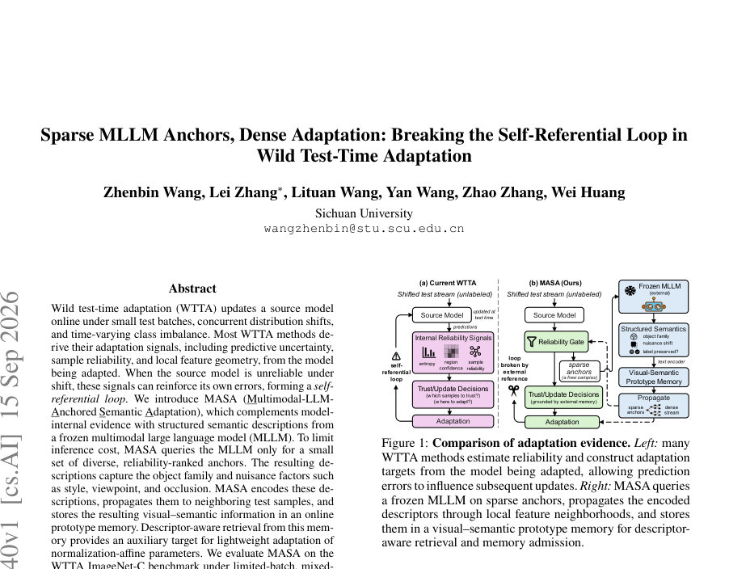
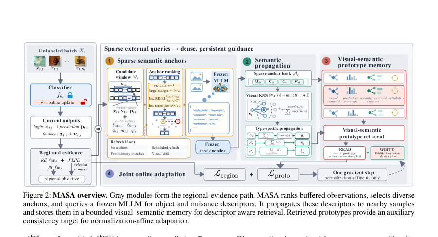
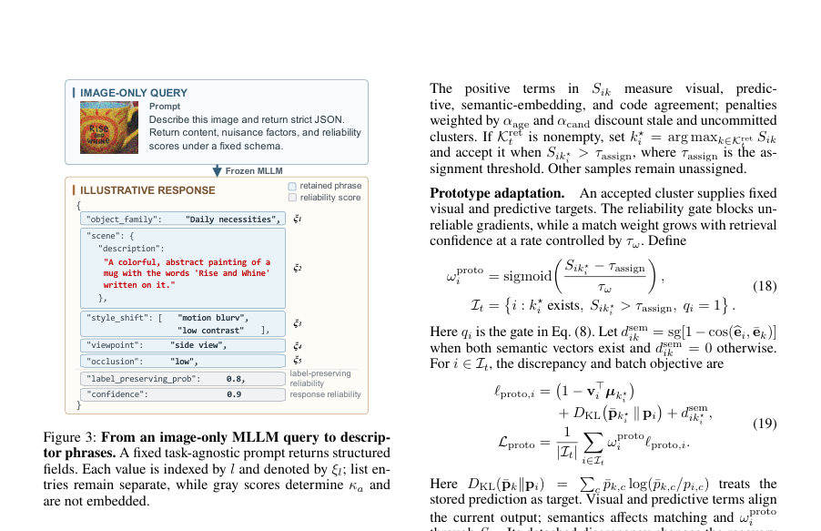

# Sparse MLLM Anchors, Dense Adaptation: Breaking the Self-Referential Loop in Wild Test-Time Adaptation

- **게시일:** 2026-09-16
- **arXiv:** [2609.17040v1](http://arxiv.org/abs/2609.17040v1) · [PDF](https://arxiv.org/pdf/2609.17040v1)
- **저자:** Zhenbin Wang, Lei Zhang, Lituan Wang, Yan Wang, Zhao Zhang, Wei Huang
- **분야:** cs.AI
- **선정 점수:** 5.16
- **선정 이유:** 최근성 1.2, 인용 영향 0.0 (인용 0회), 저자 영향 0.0 (최고 h-index 0), AI 주제 적합성 3.0, 개발자 관심 0.5, 학술 신호 0.6, 오픈 웨이트·주요 연구조직 신호 0.0

[← 2026-09-16 목록으로 돌아가기](../daily/2026-09-16.html)

<!-- paper-visuals:start -->
## 주요 Figure

> 원문 PDF에서 실제 Figure 캡션과 그림 영역이 함께 확인된 자료만 자동 추출했다.

*Figure · 원문 PDF 1쪽 · Figure 1: Comparison of adaptation evidence. Left: many*

*Figure · 원문 PDF 3쪽 · Figure 2: MASA overview. Gray modules form the regional-evidence path. MASA ranks buffered observations, selects diverse*

*Figure · 원문 PDF 5쪽 · Figure 3: From an image-only MLLM query to descrip-*

<!-- paper-visuals:end -->

## 한 문장 요약

모델 내부 신호에 의존해 자기강화(self-referential) 오류가 발생하는 WTTA에서, 소수의 신뢰도-선별된 이미지들에 대해 고정된 멀티모달 LLM(MLLM)으로 구조화된 객체·누이선스 묘사를 얻어 이를 지역 전파·프로토타입 메모리로 밀도화하고, 정규화 계수(affine)만 경량 적응하여 자기참조 루프를 완화하는 MASA를 제안한다.

## 해결하려는 문제

야생(test-time) 환경에서 배치가 매우 작고(심지어 단일 샘플), 동시 다중 분포 변화와 시계열적 클래스 불균형이 존재할 때 기존 WTTA 방법들은 예측 불확실도·샘플 신뢰도·지역 특징 기하 등 적응 신호를 적응 중인 동일한 모델에서 추출한다. 이 경우 소스 모델이 분포 이동 하에서 부정확하면 해당 내부 신호들이 자신의 오류를 강화하여 '자기참조 루프'를 형성하고 잘못된 업데이트를 반복하게 된다. 연구 질문은 외부의 구조화된 의미 정보(MLLM)를 소수의 앵커에만 질의해 비용을 제한하면서 온라인 스트림 전체에 걸쳐 재사용 가능한 지침으로 변환해 이 루프를 깨고 WTTA 성능을 향상시킬 수 있는가이다.

## 핵심 기여

- 소스 모델 내부 신호를 보완하기 위해 고정된 MLLM으로부터 구조화된 객체 계열 및 누이선스(style, viewpoint, occlusion 등) 묘사를 소수의 신뢰도-선별·다양한 앵커에 질의하는 '희소 의미 앵커(sparse semantic anchoring)' 전략을 제시함(텍스트-정렬된 분류기 불필요).
- 앵커로 얻은 서술을 전파(propagation)해 인접 테스트 샘플에 밀도화하고, 이를 시각·예측·의미 중심을 모두 유지하는 bounded visual–semantic prototype memory로 통합해 디스크립터-인지 검색(descriptor-aware retrieval)을 구현함.
- 검색된 프로토타입을 보조 일관성 목표(auxiliary target)로 사용하여 정규화 계수(affine scale/shift)만을 경량하게 업데이트하는 WTTA 파이프라인(MASA)을 설계하고, 예측-후-적응(predict-then-adapt) 및 복구 기준을 포함한 온라인 절차를 제안함.
- ImageNet-C의 제한 배치(배치 크기 1), 혼합 도메인, 시간 변동 라벨-시프트 프로토콜에서 ResNet50-GN 및 ViT-Base-LN에 대해 기존 최첨단(ReCAP 등) 대비 일관된 성능 향상을 실험적으로 보임(여러 부착 실험 및 성분 소거 실험 포함).
- 소수 앵커 질의로 MLLM 비용을 상쇄하고, 텍스트 인코더로 묘사를 임베딩·집합화해 재사용함으로써 MLLM 출력을 직접 클래스 레이블로 사용하지 않고도 온라인 적응 신호로 재활용하는 실용적 절차를 제시함.

## 접근 방법

* MASA의 핵심 구성요소와 알고리즘 흐름(본문 기준):
* 문제 설정: 소스 분류기 f_{θsrc}를 초기화하고 온라인으로 각 시점 t에서 무라벨 배치 X_t를 받음.
* 예측은 업데이트 전(예측-후-적응), 업데이트는 선택된 정규화 계수(affine scale/shift) 파라미터만 1스텝 경사로 업데이트.
* 지역(모델 내부) 신호(두 단계 선택): ReCAP 기반의 Regional Entropy(ℓ_RE)·Regional Instability(ℓ_RI)와 DeYO의 패치 민감도(PLPD)를 결합한 two-stage 필터로 적응 후보 S_t를 구성(ℓ_RE 먼저 검사한 뒤 PLPD).
* 각 샘플에 대해 RE/RI/마진(m)·이전 예측 전환률(ϕ)을 계산해 신뢰도 게이트 q_i를 산출.
* 앵커 선정(희소 질의): 관찰 윈도우 W_t에 기록된 메타데이터(정규화된 특징 v, 예측 p, RE·RI·margin·transition 등)를 기반으로 지역 통계로 R^{anc}_i 점수를 계산(식 (10)).
* 중복 제거를 위해 farthest-point sampling으로 Ba개(기본 Ba=2) 앵커를 선택해 고정된, 작업-무관(prompt)한 이미지 전용 질의를 MLLM(논문에서는 기본 Qwen2-VL-2B)으로 보냄.
* MLLM 응답 처리: JSON 규격의 필드(객체 계열, 장면, style_shift, viewpoint, occlusion, 응답 신뢰도 c_{resp}, 객체 인지도 c_{obj} 등)를 받고, 각 값(문구 ξ_l)을 텍스트 인코더(E_text, 논문은 CLIP ViT-B/16 사용)로 임베딩해 정규화 평균으로 디스크립터 e_a를 구성하고 신뢰도 κ_a = max(c_resp·c_obj, κ_min)을 정의(식 (13)).
* 의미 전파(Descriptor propagation): 각 관찰 i에 대해 은닉 은행 At의 상위 Ka(기본 4) anchors와 코사인 유사도로 가중치 π_{ia}를 계산해 임베딩 bei와 신뢰도 bκ_i를 보간(식 (14)).
* 코드는 영향력이 큰 앵커들로부터 수집.
* Visual–semantic prototype memory: 메모리는 K_t ≤ K_max(기본 64) 클러스터로 시각 중심 µ_k, 예측 프로토타입 0overline{p}_k, 의미 중심 0overline{e}_k, 코드셋 C_k, 신뢰도 ψ_k, 지지 수 n_k, 연령 age_k, drift d_k, 후보/확정 플래그 χ_k을 유지(식 (15)).
* 디스크립터-인지 검색: 현재 샘플 i에 대해 신뢰도 임계 τ_q를 넘는 클러스터들만 고려하고, 시각·예측·의미(코사인)·코드 자카드 합으로 점수 S_{ik}를 계산(식 (17)).
* 최댓값이 τ_assign를 넘으면 매칭을 수락하고 가중치 ω^{proto}_i = sigmoid((S-τ_assign)/τ_ω)로 프로토타입 손실 가중.
* 프로토타입 손실 및 지역 손실 결합: 각 배치의 손실 L_MASA = L_region + λ_proto L_proto(논문 기본 λ_proto=0.2).
* L_region은 RE·RI 기반의 지역 목표(가중치화)이고 L_proto는 검색된 프로토타입과의 시각·예측·의미 불일치(식 (19)).
* 한 스텝 SGD(또는 논문에서 지정한 옵티마이저 설정)로 정규화-affine 파라미터 ϑ만 갱신.
* 메모리 업데이트: 적응 후에(그래디언트와 분리) detached된 특징/예측으로 클러스터를 upsert하거나 신규 후보 생성(식 (20)-(23)).
* 신뢰도·지원도 기준으로 후보→확정 전환, 용량 초과 시 유틸리티 기준으로 삭제(식 (24)).
* 복구: 지수이동평균으로 L_MASA를 추적하고(ρ_rec, τ_rec), 평균이 τ_rec보다 작으면 초기화(모델·메모리·윈도우 재설정).
* 구현 세부: MLLM 및 텍스트 인코더는 frozen, 앵커 질의는 이미지 전용(no class hint 기본), 앵커 수·갱신 주기·임계값 등 하이퍼파라미터는 부록에 명시(예: Ba=2, T_ref=64, K_max=64 등).

## 주요 결과

- 데이터셋 및 벤치마크: ImageNet-C의 WTTA 프로토콜(제한 배치(bs=1), 혼합 도메인, 시간 변동 라벨-시프트)에서 ResNet50-GN과 ViT-Base-LN 백본으로 평가(본문과 부록의 설정 사용).
- 제한 배치(Severity 5): 평균 정확도(표 1)에서 MASA는 ResNet50-GN에서 48.4%(ReCAP 46.4%), ViT-Base-LN에서 66.5%(ReCAP 65.7%)를 달성. 논문은 두 백본에서 각각 15개 오염 종류 중 13개에서 1위라고 보고함.
- 시간 변동 라벨-시프트(Severity 5): 표 2에서 MASA는 ResNet50-GN 48.2%(ReCAP 45.8%), ViT-Base-LN 64.0%(ReCAP 63.0%)로 보고되어 ReCAP 대비 각각 +2.4 / +1.0 포인트 향상.
- 혼합 도메인(Severity 5 & 4 평균): 표 3에서 MASA는 ResNet 평균 47.4%(ReCAP 46.4%), ViT 평균 63.7%(ReCAP 63.3%)로 소폭 개선.
- 성분(구성요소) 소거(표 4): 전체(Full) 48.2%/64.0% 대비, '프로토타입 손실 제거(−proto-loss)'가 가장 큰 감소를 보이며 46.5%/63.2%로 각각 −1.7 / −0.8 포인트 감소. '시각 매칭만' 46.8%/63.3%, '전파 제거(−propagation)' 47.2%/63.6%, '신뢰도 게이트 제거(−reliability)' 46.9%/63.5%, 'PLPD 제거(−PLPD)' 47.6%/63.8% 등으로 여러 요소가 상호 보완적임을 시사함(본문 표 4). 참고: 표 4의 값들은 라벨-시프트 평균 결과임을 본문에서 명시함(섹션 Ablation).

## 한계

- 저자 명시 한계(본문 Appendix E): (1) 평가가 ImageNet-C의 합성 오염에 기반해 자연스럽게 발생하는 도메인 드리프트, 오픈셋 도착, 혹은 밀집 예측(dense prediction) 과제 등으로 일반화되는지는 불확실함. (2) 고정된 MLLM과 텍스트 인코더가 필요하며 앵커 질의는 희소화했지만 추가 지연(latency)과 메모리 오버헤드가 존재하고, 잘못되거나 불명확한 묘사가 신뢰도 필터를 통과해 프로토타입 메모리에 유입될 가능성이 있음(저자가 제안한 향후 방향: 경량 인코더, 적응적 질의 예산, 명시적 디스크립터 불확실성). (3) 외부 묘사가 모델의 전체 적응 경로를 완전히 독립시키지 못함: 앵커 랭킹·전파·전이 통계는 여전히 분류기 예측과 특징 기하학에 의존하므로 표현이 심각하게 붕괴하거나 클래스 정체가 윈도우보다 빠르게 변하면 신뢰할 수 없는 증거가 선택될 수 있음.
- 본문 실험·구현에서 드러나는 제약(논문 본문에서 합리적으로 확인되는 한계): 실험이 ImageNet-C에 집중되어 실제 온라인 운영 환경(실세계 연속 드리프트, 레이턴시/처리량 요구)에서의 비용-정밀도 균형과 질의 지연에 대한 실측 결과는 제공되지 않음. 또한 MLLM 질의 비용·추론 지연 또는 서버 배포 비용에 대한 정량적 분석은 본문에 없음.

## 개발자 관점

- 재현성·구현: 부록 C에 상세 하이퍼파라미터와 구현 세부가 제공됨(예: 사용된 MLLM Qwen2-VL-2B 및 텍스트 인코더 CLIP ViT-B/16는 고정(frozen), anchor budget Ba=2, rpool=8, K_max=64, T_ref 기본 64, λ_proto=0.2, 앵커 이웃 Ka=4, τ_assign=0.6 등). 논문은 WTTA 공개 구현(기준 ReCAP)을 기반으로 했고, 코드 링크를 제공한다고 명시함.
- 경량 업데이트 설계: 모델 파라미터 중 정규화 계수(affine scale/shift)만 업데이트하므로 파라미터 변경폭과 계산 비용이 상대적으로 작음(한 배치당 1 스텝 SGD). 다만 메모리 특징 추출을 위해 업데이트 전 별도 전방 패스가 필요함(추가 비용).
- MLLM 도입 실무 팁: 앵커 희소화(Ba 작게, 기본 2)와 이웃 전파로 MLLM 질의를 인접 샘플에 재사용해 질의 당 비용을 상쇄함. MLLM에 '클래스 힌트'를 제공하면(MASA 기본은 'no hint') 오히려 성능이 떨어질 수 있으므로(논문 Table 6, 예: 예측 클래스 힌트는 약간 성능 저하) 실제 운영에서는 클래스 힌트 사용에 주의할 것.
- 신뢰도·보호 장치: MLLM 응답의 응답 신뢰도·객체 인지도(c_resp, c_obj)와 모델 내부 RE·RI·margin·transition 통계를 결합해 질의 대상과 메모리 저장을 제한하는 여러 임계값(τ_store, τ_q 등)을 두어 잘못된 묘사가 메모리에 유입되는 위험을 완화함. 운영 환경에서는 이 임계값 튜닝과 복구(¯ℓ_t 기반) 모니터링이 중요함.
- 배포·비용 고려: 실서비스에선 MLLM 추론 비용(메모리·레이턴시)과 앵커 질의 빈도를 균형있게 설계해야 함. 기본적으로 MASA는 질의 비용을 완전히 제거하지 않고 '암호화/재사용'으로 상쇄하므로, 저지연 환경에서는 더 경량 MLLM 또는 로컬 텍스트 인코더 사용을 고려해야 함.

**근거 범위:** 분석은 제공된 논문 PDF 본문(메인 텍스트 및 부록, 페이지 1–12) 기반으로 작성함. 표와 식, 알고리즘·하이퍼파라미터는 본문·부록의 명시값을 사용했음. 모델 추론 지연·실제 서버 비용·실세계 드리프트에서의 성능 등 정량적 수치가 논문에 제공되지 않아 해당 항목은 본문에서 확인 불가하며 생성하지 않았음. 코드 링크는 논문에 언급되어 있으나 본 분석에서는 외부 코드나 추가 자료를 열람하지 않고 PDF 본문만을 근거로 작성함.
