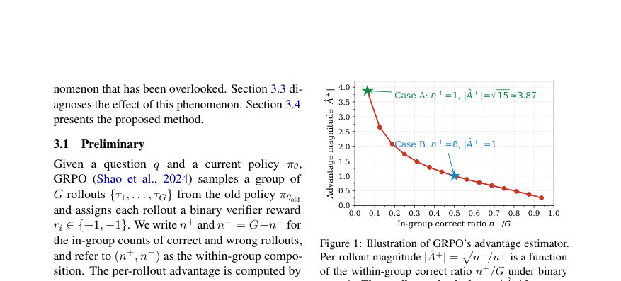
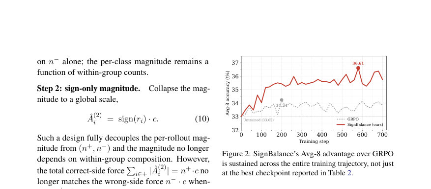
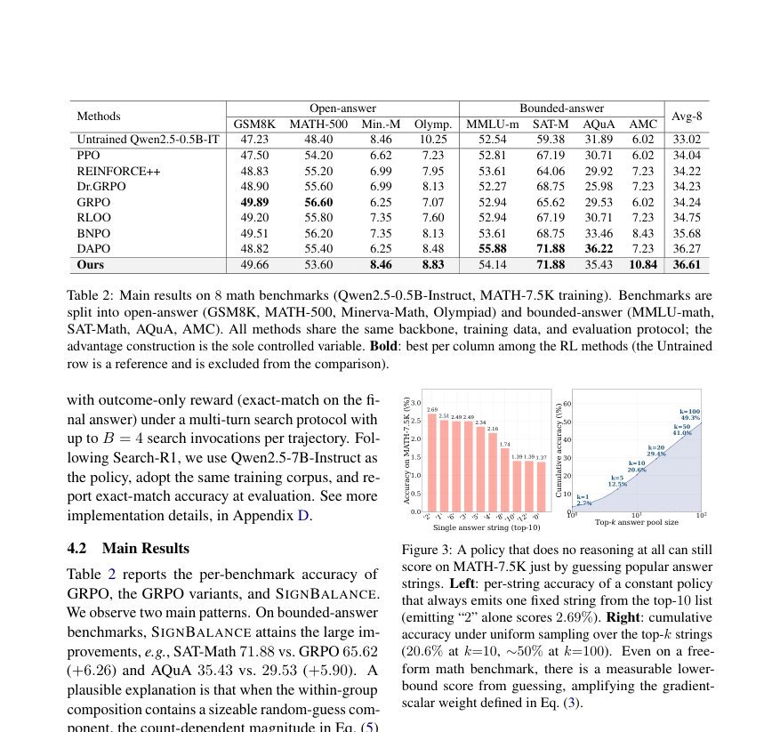

# Spurious Advantage Hidden in GRPO

- **게시일:** 2026-09-06
- **arXiv:** [2609.04063v1](http://arxiv.org/abs/2609.04063v1) · [PDF](https://arxiv.org/pdf/2609.04063v1)
- **저자:** Jiamian Wang, Samyadeep Basu, Koustava Goswami, Tong Yu, Zhiqiang Tao
- **분야:** cs.AI
- **선정 점수:** 4.08
- **선정 이유:** 최근성 0.5, 인용 영향 0.0 (인용 0회), 저자 영향 0.0 (최고 h-index 0), AI 주제 적합성 2.8, 개발자 관심 0.5, 학술 신호 0.3, 오픈 웨이트·주요 연구조직 신호 0.0

[← 2026-09-06 목록으로 돌아가기](../daily/2026-09-06.html)

<!-- paper-visuals:start -->
## 주요 Figure

> 원문 PDF에서 실제 Figure 캡션과 그림 영역이 함께 확인된 자료만 자동 추출했다.

*Figure · 원문 PDF 3쪽 · Figure 1: Illustration of GRPO’s advantage estimator.*

*Figure · 원문 PDF 5쪽 · Figure 2: SignBalance’s Avg-8 advantage over GRPO*

*Figure · 원문 PDF 6쪽 · Figure 3: A policy that does no reasoning at all can still*

<!-- paper-visuals:end -->

## 한 문장 요약

GRPO의 그룹내 보상 통계에 의한 크기(advantage)가 추측으로 얻은 정답에도 크게 반응하는 'spurious advantage'를 규명하고, 그 집단구성(n+, n−) 의존성을 제거하는 SIGNBALANCE를 제안하여 bounded-answer 및 다중턴 탐색 에이전트에서 성능을 개선한다.

## 해결하려는 문제

기존 GRPO는 그룹 내 정답/오답 구성에 따라 각 롤아웃에 부여하는 magnitude(ˆA)가 결정되며(이진 보상에서 |ˆA+| = sqrt(n−/n+)), 이로 인해 추측(guess)으로 얻은 정답도 추론으로 얻은 정답과 동일한 큰 가중치를 받을 수 있다. 이 'spurious advantage'는 (1) 후보 수가 작은 bounded-answer(예: 다지선다), (2) 표면적으로는 open-answer이나 유한한 하위 케이스를 포함하는 훈련 집합(예: MATH-7.5K의 일부 범주), (3) 많은 경로가 동일한 정답으로 귀결되는 다중턴 검색 에이전트에서 나타나며, 정책을 추측 기반 행태로 오도할 수 있다.

## 핵심 기여

- GRPO의 advantage 추정치에 존재하는 'spurious advantage' 현상을 규정하고, 이것이 정책을 추측형 행동으로 오도할 수 있음을 밝힘.
- spurious advantage가 크게 나타나는 세 가지 구조적 경우(유한 답집합, open-answer 내 유한 하위케이스, 다중턴 검색 에이전트)를 통일적으로 분석함.
- within-group 구성에 의존하지 않는 새로운 advantage 추정치 SIGNBALANCE를 제안함(검증기 부호 유지, 글로벌 스케일, stop-gradient 기반 클래스별 재스케일로 배치 수준 제로-평균 복원).
- 수정된 추정치를 기존 PPO/GRPO 루프에 드롭인으로 적용하여 추가 모델·추론 비용 없이 bounded-answer 수험 및 검색 에이전트에서 실험적으로 성능 향상을 보임.

## 접근 방법

* 원 논문은 GRPO의 기존 per-rollout advantage ˆAi = (ri − µ)/(σ + ε) (이진 보상에서 ˆA+ = +sqrt(n−/n+), ˆA− = −sqrt(n+/n−))가 within-group 구성 (n+, n−)에 의존함을 출발점으로 한다.
* 제안한 SIGNBALANCE는 세 단계로 설계되었다.
* (Step 1) 클래스별(정답/오답) 내부 정규화를 시도해 클래스 간 혼합 영향을 줄임.
* (Step 2) magnitude를 전역 상수 c로 고정하고 verifier의 sign만 유지(ˆAi = sign(ri)·c)하여 (n+, n−) 의존성 제거.
* (Step 3, 최종안) 배치 수준 제로-평균(총정답 측의 총힘 = 총오답 측의 총힘)을 복원하기 위해 stop-gradient로 계산한 per-class 비율 ρ = sg[n+/n−]을 이용해 ˆA+ = c, ˆA− = −c·ρ로 재스케일한다.
* 이 식은 GRPO 손실의 Eq.(1) 자리에 드롭인으로 들어가며 전역 스케일 c(논문 구현에서는 c=1)를 제외한 추가 파라미터나 추론비용을 요구하지 않는다.
* 실험 설정은 G=16 롤아웃, 최대 응답 길이 8192, 학습률 1e-6, KL 계수 β=1e-3, 최대 1000 스텝 등으로 고정하고 백본(Qwen2.5 계열)과 데이터(MATH-7.5K 등)를 동일하게 유지한 뒤 advantage만 교체해 비교하였다.

## 주요 결과

- MATH(0.5B, Qwen2.5-0.5B-Instruct, MATH-7.5K 훈련): 8개 수학 벤치의 Avg-8에서 SIGNBALANCE는 36.61%로 표준 GRPO(34.24%)보다 높았다 (Table 2).
- 동일 설정에서 bounded-answer 벤치에서 큰 개선을 보였다: SAT-Math 71.88% vs GRPO 65.62% (+6.26), AQuA 35.43% vs GRPO 29.53% (+5.90).
- 스케일 확장(3B, Qwen2.5-3B-Base): 8개 벤치 Avg-8에서 SIGNBALANCE 43.78%로 GRPO 42.80%를 상회하며(표준적인 per-bench 리더 수가 증가), 일부 경쟁/대회형 벤치(Gaokao, AMC, AIME 등)에서 우위를 보였다 (Table 3).
- 다중턴 검색 에이전트(Qwen2.5-7B-Instruct, Search-agent, 최대 B=4): 6개 텍스트 QA 평균 Avg-6에서 SIGNBALANCE가 37.80%로 Search-R1의 36.00%보다 높았고, 2WikiMultiHopQA에서 특히 큰 개선(35.20% vs 27.58%, +7.62)을 기록했다 (Table 4).
- MATH-7.5K 데이터 분석에서 표면적 기반 카테고리화 결과 bounded 카테고리(5/11)가 전체의 55.95%를 차지함을 보고하여(표 1) nominally open-answer 데이터셋에서도 유한 답집합 사례가 상당 비중임을 보여주었다. 단일 문자열 '2'만 항상 출력해도 2.69%의 정확도를 얻고(top-1), 상위-10 문자열에서 균등 샘플링 시 누적 정확도는 20.6%, 상위-100일 때 49.3%까지 도달한다는 분석을 제시했다(그림 3).

## 한계

- 저자가 명시한 한계: 실험은 수학 추론 및 다중턴 검색 에이전트 설정에 한정되어 있으며, 보다 일반적인 환경(예: 다양한 도구 선택이 필요한 에이전트 등)에서의 검증은 아직 이루어지지 않았다.
- 저자가 명시한 한계: 정책의 '향상된 추론 능력'에 대한 정량적 지표(예: 추론 신뢰도, 난이도별 불확실성 거동 등)는 본문에서 계량적으로 측정되지 않았다.
- 실험 범위 제약: 제안 방법은 주로 G=16, 특정 백본(Qwen2.5 계열), MATH-7.5K 및 지정된 검색 코퍼스 등 제한된 환경에서 평가되었으므로 다른 그룹 크기·데이터·아키텍처에서 재현성은 추가 검증이 필요하다.
- 현상황의 트레이드오프: ablation에서 sign-only(스텝2)는 bounded-answer에서 개선을 보이나 일부 열린-답안 벤치(MATH-500 등)에서는 성능 저하가 관찰되어(force-balance 복원 필요), 무조건적인 sign-only 적용은 바람직하지 않다(논문 Table 5).

## 개발자 관점

- SIGNBALANCE는 GRPO의 within-group 표준화(ˆAi 계산) 부분을 드롭인으로 교체하면 되며, 추가 모델이나 추론 비용을 요구하지 않는다(실험 구현에서 전역 스케일 c=1 사용).
- 재현을 위해 정책·데이터·옵티마이제이션 파이프라인을 GRPO 실험과 동일하게 유지하고(백본, G, 학습률, KL 계수 등), advantage 추정치만 교체하면 정확한 비교가 가능하다(논문은 이 점을 통제 변수로 유지).
- bounded-answer 비율(pg 추정)이 높은 작업(다지선다, 유한 표면 포함 데이터셋, 많은 경로가 동일한 정답으로 귀결되는 다중턴 검색)에 SIGNBALANCE 적용을 우선 고려하면 추측성 정책 학습을 줄일 수 있다.
- force-balance(배치 수준 제로-평균)를 stop-gradient로 복원하는 설계가 중요하다: 단순 sign-only는 bounded에서 유리하지만 열린-답안에서 불리할 수 있으므로 Step3 형태(ˆA+ = c, ˆA− = −c·sg[n+/n−])를 권장한다.
- 실무적 비용·안전성: 방법은 파라미터 없음(전역 scale 제외), 계산·추론 비용 증가 없음, 정책이 '행동으로 정답을 맞추는' 추측 행태를 학습하는 위험을 낮추는 효과가 있어 실서비스에서의 불투명한 shortcut 학습 완화에 유용할 수 있다.

**근거 범위:** 본 분석은 제공된 논문 PDF 본문(본문·표·그림·부록)에 근거하였다. 수치, 알고리즘, 실험 설정과 주요 결과는 본문/부록에서 직접 인용하였다. 다만 내부 구현의 미세한 하이퍼파라미터(예: 체크포인트 선택 기준의 상세 절차, 일부 내부 옵티마이저 설정)나 실행환경 세부(하드웨어, 난수 시드)는 본문에서 부분적으로만 언급되어 있어 재현 시 추가 확인이 필요하다.
