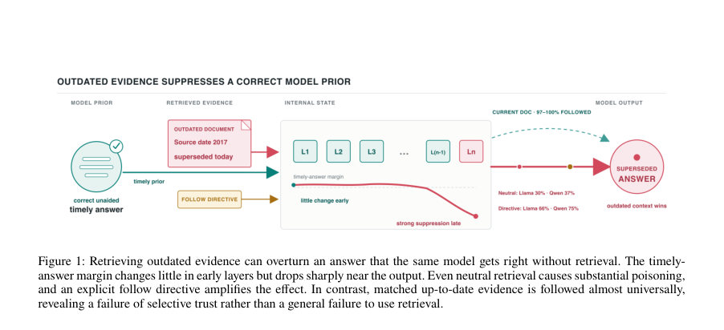
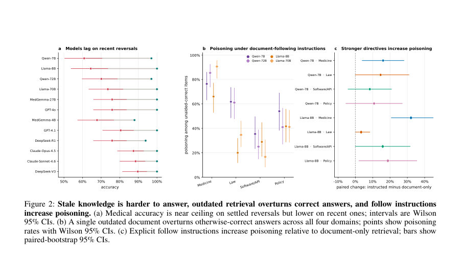
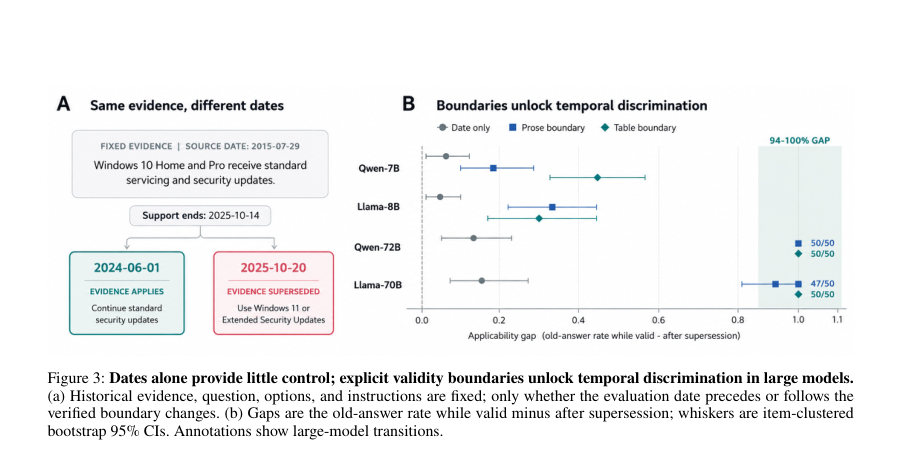

# Stale-Document Poisoning: When Outdated Retrieval Overrides Correct Model Answers

- **게시일:** 2026-09-28
- **arXiv:** [2609.31342v1](http://arxiv.org/abs/2609.31342v1) · [PDF](https://arxiv.org/pdf/2609.31342v1)
- **저자:** Md Shamim Ahmed, Lukas Galke Poech, Richard Röttger
- **분야:** cs.CL
- **선정 점수:** 6.60
- **선정 이유:** 최근성 0.5, 인용 영향 0.0 (인용 0회), 저자 영향 0.0 (최고 h-index 0), AI 주제 적합성 2.9, 개발자 관심 0.0, 학술 신호 0.8, 오픈 웨이트·주요 연구조직 신호 2.5

[← 2026-09-28 목록으로 돌아가기](../daily/2026-09-28.html)

<!-- paper-visuals:start -->
## 주요 Figure

> 원문 PDF에서 실제 Figure 캡션과 그림 영역이 함께 확인된 자료만 자동 추출했다.

*Figure · 원문 PDF 3쪽 · Figure 1: Retrieving outdated evidence can overturn an answer that the same model gets right without retrieval. The timely-*

*Figure · 원문 PDF 5쪽 · Figure 2: Stale knowledge is harder to answer, outdated retrieval overturns correct answers, and follow instructions*

*Figure · 원문 PDF 6쪽 · Figure 3: Dates alone provide little control; explicit validity boundaries unlock temporal discrimination in large models.*

<!-- paper-visuals:end -->

## 한 문장 요약

검색 기반 증거가 오래되면 모델의 올바른 응답을 뒤집을 수 있음을 규명하고, 동일한(바이트 동일) 역사적 문서가 평가일자와 명시적 유효성 경계에 따라 모델 신뢰를 어떻게 바꾸는지 행동·내부·인과 분석으로 입증하며 메디컬·법·소프트웨어·정책 분야의 317개 전환 사례로 평가·완화(재랭커) 실험을 수행한다.

## 해결하려는 문제

기존 RAG(검색 보강 생성)는 모델 학습 시점 이후 바뀐 지식을 보정하기 위해 외부 근거를 불러오는 방식이나, 불러온 문서 자체가 오래되어 더 이상 적용되지 않는(또는 적용을 멈춘) 경우 그 진실성은 여전히 모델의 판단을 압도해 잘못된 답변을 유발할 수 있다. 본 논문은 (1) 동일 모델이 검색 없이 올바르게 답한 항목을, (2) 같은 역사적 문서(내용은 변경 없음)를 제공했을 때 왜·얼마나 자주 잘못 답하게 되는지(행동적 poisoning), (3) 모델이 문서 작성일·유효기간만으로 적용 가능성을 판단하는지, (4) 내부 상태·어텐션이 이 결정을 매개하는지 등을 본문 실험으로 분리·검증한다.

## 핵심 기여

- 소스 검증된 317개 지식 전환(knowledge reversals) 벤치마크 공개(의학 87, 법 100, 소프트웨어/API 60, 플랫폼 정책 70) 및 고정 스냅샷으로 재현 가능하게 평가 체계화.
- 검색된 오래된 문서가 검색 없이 정답을 내던 모델을 잘못 답하게 만드는 ‘stale-document poisoning’ 현상을 여러 모델·도메인에서 행동적으로 정량화함(문서-지시 조건별 영향 포함).
- 50개 검증 전환에서 문서를 완전히 동일하게 유지한 채 평가일자만 바꿔 ‘날짜만으로’와 ‘명시적 유효성 경계(문장·표) 제공’ 조건을 비교하여, 날짜 정보만으로는 불충분하지만 명시적 경계는 큰 모델에서 거의 완벽하게 적용 판단을 이끌어냄을 보여줌.
- 내부 인과적 개입(activation patching)으로 평가일자 관련 내부 상태가 응답에 직접 영향을 미침을 증명하고, 어텐션 헤드가 초기에 기여하며 동일 컴포넌트가 비시간적 비교 과제에도 관여함을 확인.
- 단일 고정 규칙의 시사성·최신성 기반 하이브리드 재랭커가 신뢰할 수 있는 날짜 메타데이터 하에서 4.6–10.0 포인트의 poisoning 감소를 달성함을 보이고, 메타데이터 품질 의존성을 강조함.

## 접근 방법

* 벤치마크·문서 구성: 각 항목은 질문 qi, 시점상 올바른 답(y*), 과거에는 올바랐으나 현재는 유효하지 않은 이전 답(y_old) 및 그 이전 답을 지지하는 날짜가 명시된 역사적 문서(di)로 구성됨.
* 평가 스냅샷(317개)을 고정해 재현성을 확보.
* 행동적 측정: 각 모델 m에 대해 Em(검색 없이 올바르게 답한 항목 집합)만을 분모로 하여 Pm(오래된 문서 제공 시 기존 정답을 뒤집는 비율)을 계산.
* 도메인·모델: 12개 모델(6 API-프론티어, 6 오픈웨이트) 사용; 내부·인과 분석에는 Qwen2.5-7B/72B 및 Llama-3.1-8B/70B 사용.
* Temporal-applicability 실험: 50개 전환에서 동일 문서·질문·지시문을 유지하고 평가일자만 변경(date-only)하거나 유효성 경계를 명시하는 두 포맷(문장·표)을 교차 적용해 적용률 격차(gi(t)) 측정.
* 인과 개입: 평가일자 위치의 내부 잔차(residual) 상태를 양방향으로 패치해 응답 로그잇 및 층별 전파를 추적, 어텐션·MLP 기여를 분해.
* 재랭커(검색사이드 완화): 고정 하이브리드 점수 s(d,q)=0.5*cos(d,q)+0.5*r(d)+0.1*Isup(d)로 상위 후보 재정렬해 다운스트림 poisoning 변화 측정.
* 자동 판정 및 인간 검증: 자유응답 자동 판정기(세 레이블)와 200표본 인간 검증(최종 자동판정 정확도 92.5%, macro-F1=0.894)으로 결과 일관성 확보.

## 주요 결과

- 벤치마크: 317개 전환(의학87, 법100, 소프트웨어60, 정책70)으로 평가.
- 모델별·시점별 성능: ‘정착된(settled)’ 전환에서는 거의 천장 수준, 최근(recent) 전환에서는 성능 하락 (예: Qwen-7B settled 0.97 → recent 0.61; Llama-8B settled 1.00 → recent 0.64; 표 Table 4).
- 행동적 poisoning: 동일 모델이 검색 없이 올바르게 답한 항목들에 대해 오래된 문서가 답을 뒤집는 비율이 높음. 기본(지시 없음) 상태에서 Llama 전체는 약 0.30, Qwen 전체는 약 0.37의 뒤집힘을 보고(본문 요약), 명시적 '문서 따르기' 지시가 있을 경우 Qwen은 0.75, Llama는 0.66까지 증가(예: 중립 헤더에서 follow 지시 전후 Qwen 0.37→0.75, n=51, OR=4.92; Llama 0.30→0.66, n=53, OR=4.50).
- 도메인·모델 간 폭: 오픈 모델 4종·4개 도메인에서 poisoning은 0.17–0.91 범위를 보임(표 Table 5).
- 대비 실험: 일치하는(up-to-date) 문서를 제공하면 97–100%의 복구율을 보이며(의학 87개 전항목 중 여러 모델이 87/87 또는 86/87 복구, Table 6), 이는 모델이 유효한 증거는 신뢰하지만 오래된 증거만 선택적으로 해석하지 못함을 시사.

## 한계

- 저자 명시 한계: 정착(settled) vs 최근 비교는 의학 도메인에 한정되고 서로 다른 문제 세트를 사용하므로 '최근성'과 '문제 난이도' 효과를 완전히 분리할 수 없음.
- 인과 분석 범위 제한: 인과 패치 실험은 각 대형 모델 당 최대 20개 행동적으로 적격한 항목을 사용하므로 결과는 조건부(behaviorally eligible) 기계적 영향으로 해석되어야 하며 전체 항목에 대한 일반적 인과 추정은 아님. (본문과 보충의 반복 언급)
- 헤드 수준 지역화 한계: 어텐션 헤드 선택·검증은 10 discovery / 10 confirmation 항목 규모로 수행되어 회로 전체를 규명하는 수준은 아님(저자도 '지역화 증거'로 명시).
- 재랭커 의존성: 검색단 완화는 날짜·메타데이터의 신뢰성에 크게 의존하며, 날짜가 없거나 잘못되면 효과가 작거나 역효과가 날 수 있음(본문 결과). 또한 의학 도메인 원문 자동 아카이브는 87개 중 39건만 자동 성공, 나머지 URL·캡처 상태는 릴리스에 보존되나 일부 소스 접근성 제약 존재(부록 A).

## 개발자 관점

- RAG 시스템은 단순 '최근 문서 우선'이 아니라 '유효성(validity) 인식'을 도입해야 한다: 문서의 유효기간(effective dates), supersession(대체·폐기) 관계, 명시적 유효성 구간을 인덱스·메타데이터로 보관할 것.
- 문서-따르기 지시문은 위험할 수 있음: 사용자 지시문이나 시스템 프롬프트로 '항상 문서를 따르라'고 강제하면 오래된 문서가 정답을 뒤엎을 가능성이 크게 증가하므로 프로덕션 면에서 지시 설계 주의 필요.
- 검색단 전처리(재랭킹)로 일부 완화 가능: 고정 하이브리드 재랭커(의미적 유사도+연도 정규화+supersession 신호)는 정확한 날짜 메타데이터가 있을 때 poisoning을 4.6–10.0 포인트 줄였으나 메타데이터 품질을 보장해야 함.
- 명시적 유효성 경계(문서 내부의 '유효기간'·'적용종료일' 표기)는 큰 모델에서 매우 효과적: 가능하면 출처에서 effective-date/expiry 정보를 구조화해 제공하고, RAG 파이프라인에서 이를 모델이 사용할 수 있게 노출할 것.
- 내부 진단·모니터링 필요: 어텐션·결정 토큰 레벨의 신호(본문의 late-layer shift 등)를 모니터링해 외부 증거가 의사결정에 미치는 영향도를 진단하고, 위험 임계치 초과 시 검토·차단하는 거버넌스 도입 권고. 또한 벤치마크·코드(저자 제공)를 활용해 배포 전 시스템별 poisoning 취약성 평가를 수행할 것.

**근거 범위:** 이 분석은 제시된 논문 PDF 본문(메인 텍스트 및 부록)만을 근거로 작성했습니다. 본문에 명시된 수치(예: 317개 항목 구성, 전환 개수, 모델별 비율, 인과 개입의 로그잇 이동량, 재랭커 효과 등)를 직접 인용했습니다. PDF에 언급되지 않거나 불완전하게 보고된 세부(예: 일부 모델의 정확한 학습 컷오프 날짜, 일부 아카이브 실패의 원인 분석 등)는 추정하지 않았습니다. 추가 구현 세부사항이나 최신 모델 변형은 원문과 저자 제공 릴리스(코드/데이터)를 참고해 확인하시기 바랍니다.
