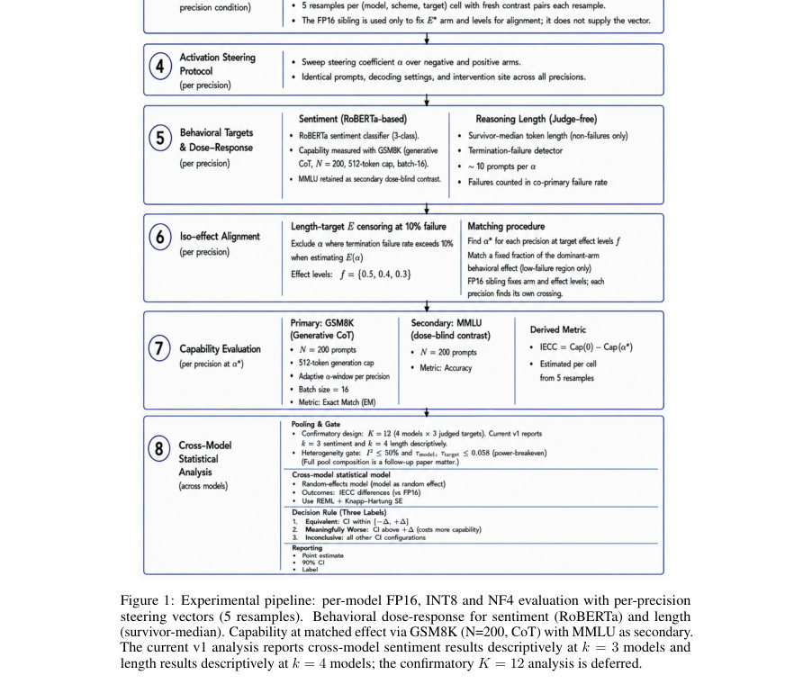
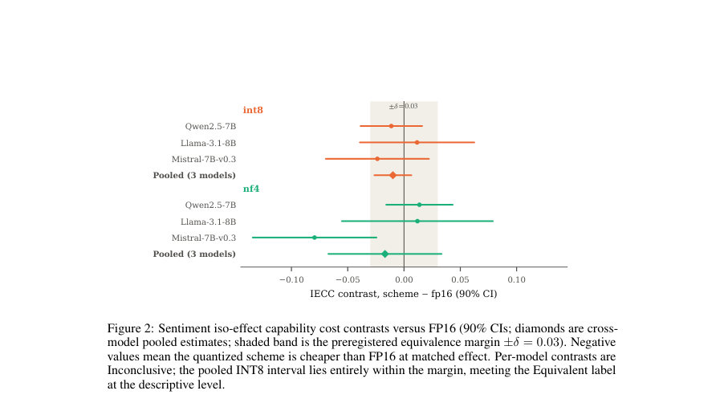
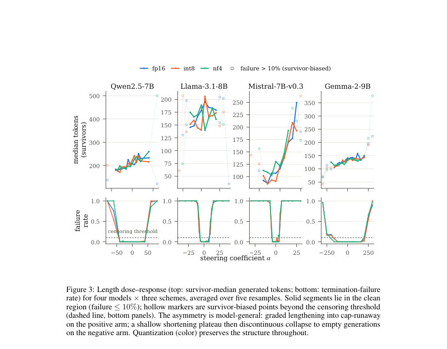

# Steering Under Compression: Dose-Response, Capability Cost, and Failure Asymmetry in Quantized LLMs

- **게시일:** 2026-09-09
- **arXiv:** [2609.06473v1](http://arxiv.org/abs/2609.06473v1) · [PDF](https://arxiv.org/pdf/2609.06473v1)
- **저자:** Saurav Bhandari, Benjamin Wade
- **분야:** cs.LG
- **선정 점수:** 7.26
- **선정 이유:** 최근성 0.4, 인용 영향 0.0 (인용 0회), 저자 영향 0.0 (최고 h-index 0), AI 주제 적합성 2.5, 개발자 관심 1.0, 학술 신호 0.6, 오픈 웨이트·주요 연구조직 신호 2.8

[← 2026-09-09 목록으로 돌아가기](../daily/2026-09-09.html)

<!-- paper-visuals:start -->
## 주요 Figure

> 원문 PDF에서 실제 Figure 캡션과 그림 영역이 함께 확인된 자료만 자동 추출했다.

*Figure · 원문 PDF 5쪽 · Figure 1: Experimental pipeline: per-model FP16, INT8 and NF4 evaluation with per-precision*

*Figure · 원문 PDF 10쪽 · Figure 2: Sentiment iso-effect capability cost contrasts versus FP16 (90% CIs; diamonds are cross-*

*Figure · 원문 PDF 11쪽 · Figure 3: Length dose–response (top: survivor-median generated tokens; bottom: termination-failure*

<!-- paper-visuals:end -->

## 한 문장 요약

무게 전용 양자화(INT8, NF4) 하에서 여러 7–9B 개방형 모델에 대해 대조적 활성화 추가(CAA)로 생성된 steering 벡터를 동일 정렬(iso-effect) 프레임워크로 평가하여, 양자화가 행동 제어 방향과 비용에 미치는 영향(능력비용, 용량 붕괴 및 실패 비대칭성)을 실험적으로 규명한다.

## 해결하려는 문제

활성화 스티어링(activation steering)은 추론 시 내부 활성화에 벡터를 주입해 모델 행동을 제어하는 경량적 수단이고, 사후(무재학습) 가중치 양자화는 배포 비용을 줄이는 표준적 기법이다. 그러나 스티어링 연구는 일반적으로 FP16 가정하에, 양자화 연구는 주로 벤치마크 정확도로 평가되어 두 기법이 만나는 실제 배포 상황에서 양자화가 스티어링에 미치는 영향(스티어링 방향 보존, 보정(칼리브레이션) 변화, 동일 행위 효과를 얻기 위한 능력비용 변화 등)은 체계적으로 규명되어 있지 않다.

## 핵심 기여

- 여러 7–9B 개방형 모델(Qwen2.5-7B, Llama-3.1-8B, Mistral-7B-v0.3, Gemma-2-9B)과 두 가지 행동 목표(판정된 감성, 판정 없는 추론 길이) 및 세 가지 배포 정밀도(FP16, INT8, NF4)에 걸쳐 무게 전용 양자화 하의 활성화 스티어링을 체계적으로 특성화했다.
- iso-effect(동일 효과) 프레임워크로 비교하여, 매칭된 행동 효과에서 감성 스티어링의 능력비용은 INT8에서 실질적 차이가 없고(풀된 3-모델 INT8 대비값 −0.010, 90% CI [−0.026,+0.007]), NF4는 비결정적이라는 주요 실험 결과를 보고했다. 반면 추론 길이 목표에서는 강한 실패 비대칭(긍정적 팔: 점진적 증가 → cap-runaway → 붕괴, 부정적 팔: 약한 단축 후 불연속적 종료)이 관찰되었다.
- floor-bounded(바닥 한계가 있는) 목표에서 사전등록된 naive E*사다리(ladder)가 붕괴 바닥에 닻을 내리는 방법론적 함정을 노출하고, 고실패 영역을 배제하는 검열(censored) E*구성을 도입해 해석 가능한 교차점을 복원했다.
- 양자화가 스티어링 벡터의 방향성을 크게 훼손하지 않는다는 정량적 증거(스티어링 벡터의 코사인 유사도: INT8 0.989–0.998, NF4 0.945–0.990)를 제공하고, 그러나 경우에 따라 양자화가 unsteered(α=0) 기준 능력을 크게 이동시킬 수 있음을(예: Mistral NF4: GSM8K 0.545→0.365) 정량화했다.

## 접근 방법

* 설계 개요: 각 모델에 대해 FP16(참조), bitsandbytes 스타일의 8-bit weight-only(INT8, W8A16/LLM.int8()) 및 4-bit weight-only(NF4, W4A16) 세 가지 배포 조건을 평가하고, 활성화는 FP16/BF16으로 유지하여 비교를 무게 양자화로 국한했다.
* 스티어링 벡터는 Contrastive Activation Addition(CAA) 스타일로 각 배포 조건 자체에서 동일한 대비(contrast) 쌍을 이용해 추출하며, 각 조건은 자기 자신의 벡터를 적용한다(교차 적용은 후속 연구로 유보).
* 스티어링은 모델별로 미리 정한 단일 잔차(residual) 스트림 레이어(예: Qwen layer 14 등)의 마지막 토큰 위치에 주입한다.
* 데이터 수집은 각 (모델, 스킴) 셀마다 5개의 데이터-레벨 리샘플을 사용해 대비 쌍·프롬프트·능력 항목을 재추출하고, 각 리샘플 내에서 FP16 실행이 iso-effect arm(우측/좌측)과 수준(E*)을 고정한다.
* 행동 효력(efficacy) 측정: 감성은 RoBERTa 분류기(three-way)로 판단; 길이는 생존자 중앙(survivor-median) 토큰 수로 측정하되 실패(trace가 끝나지 않거나 구조적 반복·높은 반복비를 일으키면 실패로 간주) 실패율이 높으면 해당 α를 배제한다.
* 능력비용(capability cost)은 주 능력 프로브로 GSM8K(N=200, Chain-of-Thought, greedy, generation cap 512; 길이 목표 수집시 max_new_tokens=2048로 명시됨)를 사용해 정확도(정답 숫자 일치)로 측정한다.
* iso-effect: E(α)에서 E*교차 α*는 사전등록된 분수 f∈{0.5,0.4,0.3} 중 FP16 sibling IECC(=cap(0)−cap(α*))가 신뢰역(0.10) 이하를 만족하는 최초 f를 채택하여 찾는다.
* 길이 목표의 바닥붕괴 문제를 해결하기 위해 실패율>0.10인 α들을 사전에 검열(censor)하고 제한된 FP16 곡선의 최대 생존 효과에 기반해 E*를 정의한다.
* 집계: 리샘플 간 대비는 IECCr(scheme)−IECCr(FP16)로 정의하고 REML로 τ^2를 추정한 뒤 수정된 Knapp–Hartung 표준오차로 합산(자세한 수식 본문 참조).
* 모델 간 풀링은 무작위효과 모델과 사전등록된 이질성 게이트(I2<50% 등)에 의해 시행된다.

## 주요 결과

- 감성(3개 모델 풀, 각 5 리샘플): 표 2에 따른 per-model 대비는 모두 'Inconclusive'로 판정되었으나, 세 모델을 묶은 pooled INT8 대비는 −0.010(90% CI [−0.026,+0.007])로 사전등록된 ±δ=0.03 범위 내에 있어 설명적(데스크립티브) 수준에서 Equivalent로 간주되었다. NF4 pooled는 −0.017(90% CI [−0.067,+0.033])로 Inconclusive였다. 각 모델별 수치(90% CI): Qwen INT8 −0.011 [−0.039,+0.016], Qwen NF4 +0.014 [−0.016,+0.043]; Llama INT8 +0.012 [−0.039,+0.063], NF4 +0.012 [−0.055,+0.079]; Mistral INT8 −0.024 [−0.070,+0.022], NF4 −0.080 [−0.135,−0.024].
- 추론 길이(4개 모델, 5 리샘플): 길이 목표는 강한 실패 비대칭을 보였다. 양(길게) 팔은 α 증가에 따라 중앙 토큰 수가 점진적으로 증가하다가 cap-runaway(생존 생성물이 토큰 캡에 근접해 급증)와 전반적 종료 붕괴로 이어졌다. 음(짧게) 팔은 12–30% 범위의 단축(모델별 차이: Llama ∼30% at α=−6, Mistral ∼27% at −4, Qwen ∼15% at −25, Gemma ∼12% at −160) 이후 즉시 빈 출력으로 붕괴하는 불연속적 실패를 보였다. 예시: Qwen 중앙 토큰수 174→203→258(α=0→+40 예시), Mistral INT8 생존자 중앙 643 tokens at α=+5(단일 리샘플), Qwen NF4 725 at +60, Llama FP16 338 at +12(본문 수치).
- E*사다리 고장 및 검열: 길이 목표에서 naive E*사다리는 효과의 최댓값 대신 '붕괴 바닥'에 닻을 내려 교차점이 붕괴구간(모든 생성이 실패한 α와 바로 이전 생존 α 사이의 보간 구간)에 위치하는 문제가 발생했다. 검열 규칙(실패율>0.10인 α 제외)이 적용되면 FP16 수용율이 회복되고(예: FP16 acceptance 0→3–5/5 등), 교차점이 깨끗한 구간으로 복원되었다. 단, 검열 이전에 배치된 능력 프로브 창 때문에 일부 셀은 교차가 능력측정 그리드에서 2–4 스텝 이격되어 보간 한계가 존재한다는 한계가 보고되었다.
- 기준 능력 이동(baseline shift): 세 모델(Qwen, Llama, Gemma)은 α=0에서 스킴별 GSM8K 정확도가 대체로 4포인트 이내로 유지되었으나, Mistral은 FP16 0.545 → INT8 0.480 → NF4 0.365로 NF4에서 약 18포인트의 큰 하락을 보였다(길이 캠페인 기준). 동일한 감소가 감성 캠페인에서도 복제되었다(0.544→0.498→0.351). 이는 양자화가 스티어링보다 더 큰 배포 위험이 될 수 있음을 시사한다.
- 스티어링 벡터의 방향 보존: 같은 리샘플·대비 쌍에서 각 스킴별로 독립 추출한 steering 벡터들은 FP16 벡터와 매우 높은 코사인 유사도를 보였다( INT8: 0.989–0.998, NF4: 0.945–0.990 ). 코사인 순서(일관성): cos(FP16,INT8) > cos(FP16,NF4) > cos(INT8,NF4), 즉 INT8에서 추출한 벡터는 거의 투명하고 NF4는 더 노이즈가 많다.

## 한계

- 저자가 명시한 한계: (1) 모델 수와 크기 범위 제한(k=3 감성, k=4 길이, 7–9B 범위)으로 교차-모델 이질성(τ_model) 추정이 불정밀하며 사전등록된 K=12 확증적 호출을 제시하지 못함; (2) 연구는 bitsandbytes 스타일의 weight-only 양자화(INT8, NF4)에만 제한되며 활성화 양자화(W8A8/W4A4)나 GPTQ/AWQ/SmoothQuant/QuaRot 같은 다른 알고리즘은 제외됨; (3) 단일 스티어링 방법(CAA)과 모델별 단일 site·layer만 사용함; (4) 길이 목표의 효력 해상도는 약 10 프롬프트/α로 능력축(N=200)에 비해 거칠며, 길이의 능력비용 보고는 한 쪽 팔(positive 또는 negative)에 제한된 경우가 있음; (5) 영어 평가만 수행.
- 본문에서 확인되는 추가 제약(저자가 명시적으로 구분 가능): 감성 풀링 결과는 설명적(데스크립티브) 수준이며 확증적 결론은 전체 예정된 K=12 풀을 필요로 한다는 점, 길이 목표의 검열 규칙 적용 이후에도 일부 교차점이 능력 프로브 그리드에서 보간-제한(2–4 스텝 거리)을 받는 점, 벡터의 교차-적용(예: FP16에서 추출한 벡터를 양자화 모델에 적용) 실험은 수행하지 않아 그 영향은 미검증이라는 점.

## 개발자 관점

- 감성(stemming) 제어용 스티어링은 INT8 환경에서 FP16과 거의 동일하게 동작하므로, 감성 제어 목적의 배포에서는 bitsandbytes INT8이 비용-효율적 대안이 될 수 있다(다만 모델별 검증 필요).
- 추론 길이 제어는 치명적 '붕괴(cliff)' 리스크를 동반하므로 생산 환경에서는 평균 응답(효력 곡선)뿐만 아니라 per-α 실패율(termination/failure rate)을 1차 신호로 모니터링해야 한다. 길이 제어에서는 실패율 임계(예: 10%)를 기준으로 스티어링 강도를 검열·제한하는 정책을 권장한다.
- 배포 전 반드시 무스티어링(α=0) 기준 성능을 측정하라: NF4와 같이 일부 스킴은 unsteered 성능을 크게 악화시켜(예: Mistral NF4 GSM8K 0.545→0.365) 스티어링의 상대적 비용 해석을 왜곡할 수 있다.
- 실무 관행: 스티어링 벡터는 배포 스킴 자체에서 추출·적용하는 것이 논문 설계(각 스킴이 자체 벡터를 추출)와 일치하므로, 실제 서비스에선 배포된(양자화된) 모델에서 벡터를 추출해 적용하는 것이 보수적이다. 교차-적용(다른 정밀도 벡터 사용)은 본 연구에서 평가되지 않았다.
- 방법론적 권고: 바닥 한계가 있는 목표에서는 E*의 naive 정의가 실패를 측정하게 되므로, 실패율 기준(논문은 10%를 주안으로 제시)으로 α를 검열하고 생존 최대 효과에 기반해 iso-effect를 정하는 검열(E*-censoring) 절차를 도입하라. 또한 last-position 스티어링은 단일-패스 MMLU 같은 다지선다형 단일 전방통과 평가에 대해 dose-blind(효력 보이지 않음)이므로 능력 프로브 선택에 유의해야 한다.

**근거 범위:** 이 분석은 제공된 논문 PDF 본문(페이지 1–17)의 텍스트를 근거로 작성하였다. 본문에 명시된 수치(예: pooled 대비, 코사인 유사도 범위, GSM8K 정확도 변화, 리샘플 수 등)만을 사용했으며, 본문에 없거나 저자가 의도적으로 유보한 교차-적용 실험 등의 구현 세부사항은 생성하지 않았다.
