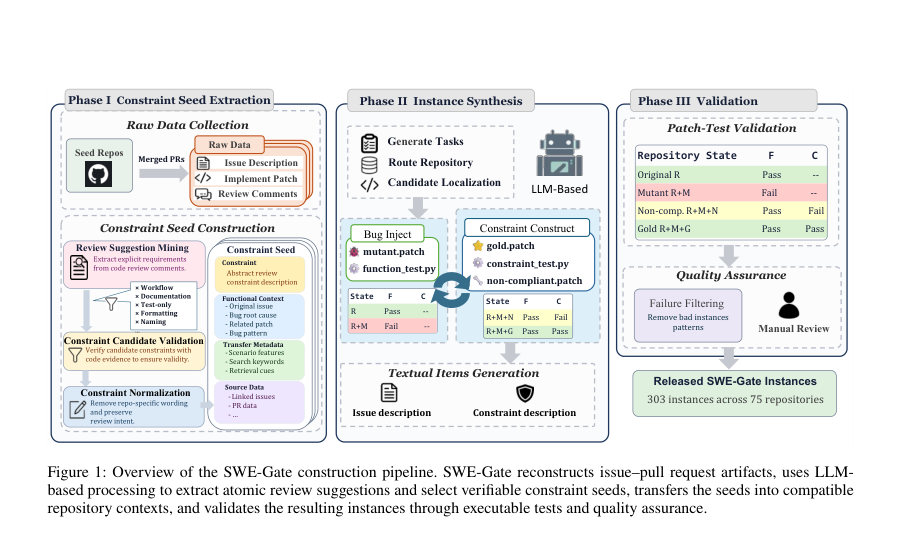
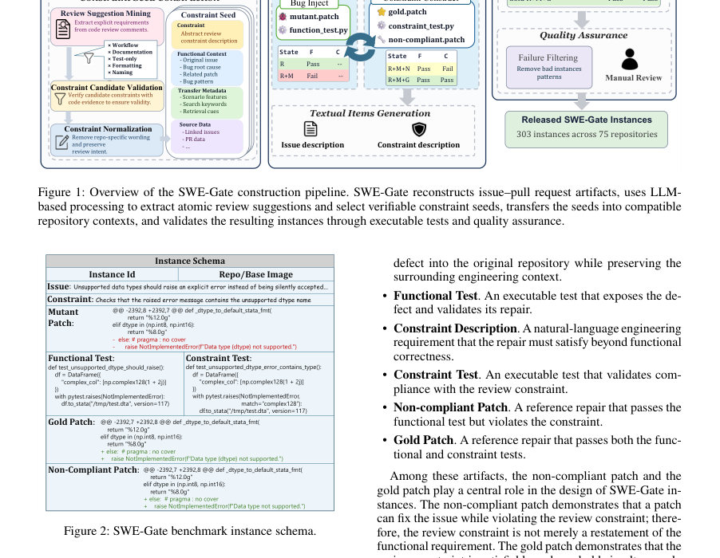

# SWE-Gate: Passing Functional Tests Is Not Enough for Software Engineering Agents

- **게시일:** 2026-09-05
- **arXiv:** [2609.04167v1](http://arxiv.org/abs/2609.04167v1) · [PDF](https://arxiv.org/pdf/2609.04167v1)
- **저자:** Xin He, Yanlin Wang, Mingwei Liu, Jiachi Chen, Hongyu Zhang, Guanbin Li
- **분야:** cs.SE, cs.AI
- **선정 점수:** 5.72
- **선정 이유:** 최근성 0.8, 인용 영향 0.0 (인용 0회), 저자 영향 0.0 (최고 h-index 0), AI 주제 적합성 3.0, 개발자 관심 1.2, 학술 신호 0.8, 오픈 웨이트·주요 연구조직 신호 0.0

[← 2026-09-05 목록으로 돌아가기](../daily/2026-09-05.html)

<!-- paper-visuals:start -->
## 주요 Figure

> 원문 PDF에서 실제 Figure 캡션과 그림 영역이 함께 확인된 자료만 자동 추출했다.

*Figure · 원문 PDF 3쪽 · Figure 1: Overview of the SWE-Gate construction pipeline. SWE-Gate reconstructs issue–pull request artifacts, uses LLM-*

*Figure · 원문 PDF 3쪽 · Figure 2: SWE-Gate benchmark instance schema.*

<!-- paper-visuals:end -->

## 한 문장 요약

리뷰에서 도출한 수용 제약(review constraints)을 실행 가능한 테스트로 명시하고, 기능 테스트 통과 여부뿐 아니라 제약 준수를 별도로 평가하는 저장소 수준 소프트웨어 수리 벤치마크 SWE-Gate를 제안하여 LLM 기반 코딩 에이전트의 실무 수용성 평가 격차를 규명한다.

## 해결하려는 문제

기존의 저장소 수준(Repository-level) 수리 벤치마크들은 주로 PR에 포함된 기능(동작) 테스트의 통과 여부만으로 패치 성공을 판정한다. 그러나 실제 코드 리뷰 과정에서는 호환성, 예외 의미 유지, 리소스 생명주기 등 리뷰에서 제기되는 추가적이고 객관적으로 검증 가능한 수용 제약(review-derived acceptance constraints, 이하 review constraints)이 패치 채택 여부에 큰 영향을 미친다. 기능 테스트 통과만으로는 이러한 리뷰 제약 준수를 보장하지 않으므로 에이전트의 실무 통합 가능성을 과대평가할 위험이 있다. 논문은 이 문제를 해결하기 위해 (1) 리뷰 코멘트에서 제약을 추출하고, (2) 기능 실패와 제약 위반이 분리되어 검증 가능한 인스턴스를 합성·검증하는 방식으로 에이전트를 평가하는 SWE-Gate를 제안한다. 또한 RQ로서 (i) 에이전트의 듀얼(기능·제약) 성능, (ii) 제약 명시 제공의 영향, (iii) 어떤 제약 카테고리가 어려운지를 조사한다.

## 핵심 기여

- SWE-Gate: 리포지토리 수준에서 '리뷰로 도출된 수용 제약'을 실행 가능한 테스트로 포함하여 기능 정확성뿐 아니라 제약 준수를 함께 평가하는 최초의 벤치마크를 제안함.
- 듀얼 차원 평가 프로토콜: 기능 테스트(F)와 제약 테스트(C)를 분리하여 각각 실행가능한 오라클로 검증하고, 기능만 통과하는 '비준수(non-compliant)' 패치와 기능·제약을 모두 만족하는 '골드' 패치를 함께 제공함으로써 두 차원을 명확히 분리하여 평가할 수 있게 함.
- 반자동 합성 프레임워크와 데이터셋: 실제 병합된 PR의 리뷰 코멘트에서 원자적 제안(atomic suggestion)을 추출하고, 이를 다른 적합한 리포지토리 컨텍스트로 전이·인스턴스화하는 반자동 파이프라인을 통해 75개 오픈소스 Python 리포지토리에서 총 303개의 품질 보증된 인스턴스를 생성함.
- 실험적 발견: 공통 Mini-SWE-Agent 스캐폴드와 4개 LLM(GPT-5.5, GPT-5.4-mini, DeepSeek-V4-Flash, GPT-4o-mini)으로 평가한 결과, 기능 테스트를 통과한 644개의 생성 패치 중 221개(34.3%)가 제약을 위반하여 기능 전용 평가가 에이전트 성능을 과대평가함을 실증함.
- 재현성: 인스턴스(비준수·골드 패치, 기능 및 제약 테스트), 코드 및 실험 결과를 공개한 복제 패키지 제공(저자 GitHub 링크).

## 접근 방법

* 전체 접근은 'constraint-first' 파이프라인으로 구성된다.
* 주요 단계는 다음과 같다.
* 원자료 수집 및 시드(repo) 지정: 병합된 PR, 리뷰 코멘트, 연결 이슈, 변경된 파일 및 unified diff를 GitHub API로 수집하여 원자료로 사용한다.
* 시드 리포지토리는 성숙한 오픈소스 Python 프로젝트로 선정하여 실제 리뷰의 공학적 의도를 확보한다.
* 제약 시드 추출(Phase I): LLM을 이용해 리뷰 코멘트에서 명시적으로 표현된 요청을 원자적 제안으로 분해(문제/요청/근거/카테고리 등)하고, 규칙 기반 필터링으로 워크플로우·문서화·포맷팅 등 검증 불가한 항목을 제거한다.
* 이후 결정적(heuristic/LLM 보조) 검증을 통해 사용자-가시성, 코드 증거, 분리 가능한 검증 오라클 가능성 등을 확인해 'constraint seed'로 정제한다.
* 인스턴스 합성(Phase II): 제약 시드를 호환되는 대상 리포지토리로 전이한다(도메인 매핑, 검색 키워드·시나리오 특징 등).
* 합성 에이전트는 점진적 generate–execute–refine 워크플로우를 따른다.
* 1단계에서 mutant.patch(버그 주입)와 function_test를 생성해 원본은 통과하고 mutant는 실패하도록 보장한다(F: pass on R, fail on R+M).
* 2단계에서 constraint_test, non-compliant.patch(기능 통과하나 제약 실패), gold.patch(기능·제약 모두 통과)를 생성하고 실행 피드백으로 보정한다.
* 인스턴스 유효성은 표(Table 1)의 검증 행렬을 만족해야 한다.
* 품질 보증(Phase III): Docker 기반 컨테이너에서 전체 검증 행렬을 자동으로 실행(원본 R은 F 통과, R+M은 F 실패, R+M+N은 F 통과 C 실패, R+M+G는 F,C 모두 통과).
* 자동 검증을 통과한 후보에 대해 LLM 보조 의미적 리뷰 규칙과 사람의 최종 검토를 거쳐 비현실적·평판 파괴적·테스트에 과도히 의존한 인스턴스를 제거한다.
* 인스턴스 산출물: 각 인스턴스는 issue description, mutant patch, function_test, constraint description, constraint_test, non-compliant patch, gold patch 를 포함한다.
* 평가 절차: 에이전트(모든 실험에 공통 Mini-SWE-Agent 사용, 최대 100 interaction steps)는 대상 리포지토리와 issue만(Constraint-Omitted, −C) 또는 issue와 제약 문서(Constraint-Provided, +C)를 입력으로 받아 패치를 생성한다.
* 생성된 패치는 깨끗한 버그 주입 상태에 적용되어 기능·제약 테스트로 검증된다.
* 생성자가 테스트 파일을 변경한 경우 해당 변경은 평가 전 폐기하여 테스트 유출을 방지한다.
* 모델·메트릭: 실험에 사용된 LLM은 GPT-5.5, GPT-5.4-mini, DeepSeek-V4-Flash, GPT-4o-mini이며, 메트릭은 Functional Success Rate(FSR), Constraint Following Rate(CFR, 기능 성공 중 제약 준수 비율), Joint Success Rate(JSR, 전체 인스턴스 중 양쪽 통과 비율), Hidden Failure Rate(HFR=1−CFR)이다.

## 주요 결과

- 데이터셋: 75개의 오픈소스 Python 리포지토리에서 303개의 SWE-Gate 인스턴스(다중 라벨 카테고리, 주요 카테고리: Error Semantics 152, Schema/Metadata/Typing 143 등).
- 전체(+C, Constraint-Provided) 성능(표 2): GPT-5.5 — F.Pass 227, Joint Pass 160, FSR 74.9%, CFR 70.5%, JSR 52.8%. GPT-5.4-mini — F.Pass 187, Joint Pass 120, FSR 61.7%, CFR 64.2%, JSR 39.6%. DeepSeek-V4-Flash — F.Pass 202, Joint Pass 130, FSR 66.7%, CFR 64.4%, JSR 42.9%. GPT-4o-mini — F.Pass 28, Joint Pass 13, FSR 9.2%, CFR 46.4%, JSR 4.3%. (모든 수치는 논문 Table 2에 기재된 값임)
- 숨겨진 실패(Hidden failures): 총 644개의 기능 통과 패치 중 423개만이 제약도 통과하여 기능 통과 중 221개(34.3%)가 제약을 위반함(Table 3). 모델별 HFR: GPT-5.5 29.5% (67/227), GPT-5.4-mini 35.8% (67/187), DeepSeek-V4-Flash 35.6% (72/202), GPT-4o-mini 53.6% (15/28).
- 제약 문서 제공 효과(−C vs +C, Table 4): 제약을 제공하면 모든 모델에서 CFR 및 JSR가 증가함. 예: GPT-5.5의 CFR은 −C에서 54.6%에서 +C에서 70.5%로 +15.9 포인트, JSR은 41.3%→52.8%로 +11.5 포인트 증가. 반면 FSR은 일부 모델에서 약간 감소(예: GPT-5.4-mini 71.6%→61.7%)하여 기능 성공과 제약 준수 사이의 트레이드오프가 관찰됨.
- 카테고리별 차이(Table 5): 기능 성공 이후 제약 준수 비율(CFR)은 제약 유형에 따라 상이함. 상대적으로 낮은 CFR을 보인 카테고리에는 Scope Generalization, Lifecycle Cleanup/Resource, Encoding/Escaping/Quoting, Schema/Metadata/Typing 등이 포함되고, 높은 CFR을 보인 카테고리에는 Missing-vs-Empty/Sentinel Distinction, Ordering/Argument Preservation 등이 있음(테이블의 상세 수치 참고).

## 한계

- 저자 명시 한계(논문 본문에서 언급):
  - 현재 SWE-Gate는 Python 리포지토리만 포함하므로 언어 확장이 필요함(결론에 명시).
  - 아직 실행 가능한 테스트로 표현하기 어려운 리뷰 요구사항은 벤치마크에 포함되지 않음(결론에서 'non-executable' 요구에 대한 신뢰할 수 있는 평가 방법 필요성 언급). 
  - 인스턴스 합성 과정에 LLM 보조가 포함되어 있어 합성·선별 편향 가능성 및 현실성 향상을 위해 더 넓은 메인테이너 피드백이 필요함(결론과 품질 보증 섹션에서 언급).
- 실험·범위에서 확인되는 제약(본문 근거 기반, 저자와 구분):
  - 모델·설정 제한: 실험에 사용된 LLM은 네 가지에 국한되며 공통 스캐폴드(Mini-SWE-Agent)와 상호작용 예산(최대 100단계)을 사용함. 결과는 이 스캐폴드/예산에 종속적일 수 있음(실험 설정에서 명시). 
  - 생성 샘플링 수 제한: 각 조건에 대해 '각 인스턴스당 모델당 한 번의 생성'만 수행되어(본문에 기재) 결과는 생성 다변성이나 안정성 분석을 포함하지 않음. 저자도 이 점을 '관찰된 트레이드오프'로 해석할 것을 권고함. 
  - 카테고리 분석 한계: 카테고리들이 중복(다중 라벨)이며 일부 카테고리 샘플 수가 작아(테이블 및 데이터셋 섹션) 통계적 비교는 기술적(서술적)임을 저자도 밝힘. 
  - 제약은 '검증 가능한(실행 가능한) 제약'에 한정되며, 리뷰에서 흔히 나오는 주관적·설계적 코멘트 전부를 포괄하지 못함.
- (참고) 추가 상세 구현·데이터 파일은 보조 자료(논문이 참조)와 공개 레포지토리에서 확인해야 함. 일부 전이 매핑·검색 단서의 세부값은 보조 자료에 있다고 명시되어 본문에서 완전 확인 불가능함.

## 개발자 관점

- 재현·데이터 접근: 논문은 인스턴스(303개), 패치, 기능·제약 테스트와 복제 패키지를 공개하므로 연구·제품 환경에서 재현 가능성이 높다(저자 GitHub 링크 참고). 다만 보조 자료에 포함된 전이 매핑·세부 규칙은 별도 확인 필요.
- 평가·검증 원칙: 기능 테스트만 통과하는 패치가 상당 비율로 제약을 위반하므로(논문: 기능 통과 중 34.3%가 제약 위반) CI/자동화된 리뷰 파이프라인에선 기능 테스트 외에 프로젝트·리뷰 유도 제약을 별도 오라클로 검증하는 것이 필요하다. SWE-Gate처럼 constraint_test를 분리해 자동화하면 숨은 실패를 잡을 수 있다.
- 입력 설계(프롬프트·제약 제공): 실험 결과 제약 문서를 에이전트에 명시적으로 제공하면(Constraint-Provided) 제약 준수(CFR)와 전체 합격(JSR)이 의미 있게 향상되므로(예: GPT-5.5 JSR +11.5pt), 실제 에이전트 설계 시 리뷰 요구사항을 명시적으로 주입하거나 다중 목적 목표를 보존하도록 유도하는 프롬프트/보상 구조가 유용하다.
- 엔지니어링·배포 비용: SWE-Gate의 합성·검증 파이프라인은 LLM 호출, 컨테이너 기반 테스트 실행, 수동 QA 단계를 포함하므로 대규모 확장·운영에는 상당한 계산·인적 비용이 필요하다(논문의 반자동·컨테이너 검증, 및 LLM 보조 단계 근거).
- 안전성·편향 관리: 인스턴스 합성에 LLM이 관여하므로 합성 편향이 존재할 수 있다. 배포 전에는 수동 검토·프로젝트 메인테이너 피드백을 포함시키고, 테스트 고정(benchmark tests 변경 금지) 및 평가용 테스트 수정 차단(논문에서 평가 전 테스트 변경 폐기 규칙)이 필요하다.

**근거 범위:** 이 분석은 제공된 논문 PDF 본문(페이지 1–11)에 근거하여 작성되었으며, 표와 본문에서 직접 인용 가능한 수치(예: 인스턴스 수 303, 리포지토리 수 75, 표 2/3/4/5의 수치 등)를 사용했습니다. 보조 자료(구체적 전이 매핑, 실험의 단계별 후보 수 등)는 본문에서 참조되지만 PDF에 포함된 보조자료 전문은 제공되지 않아 그 부분의 세부값은 확인하지 못했습니다. 또한 실험은 '각 인스턴스당 모델당 한 번의 생성'이라는 본문 언급에 근거하였고, 반복 샘플링에 따른 변동성 분석은 본 논문 본문에 포함되어 있지 않습니다.
