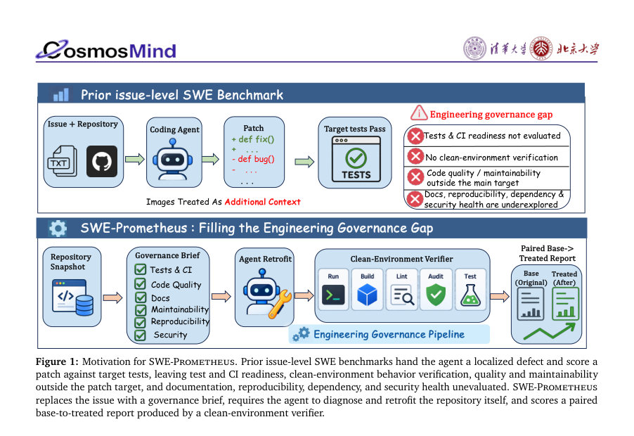
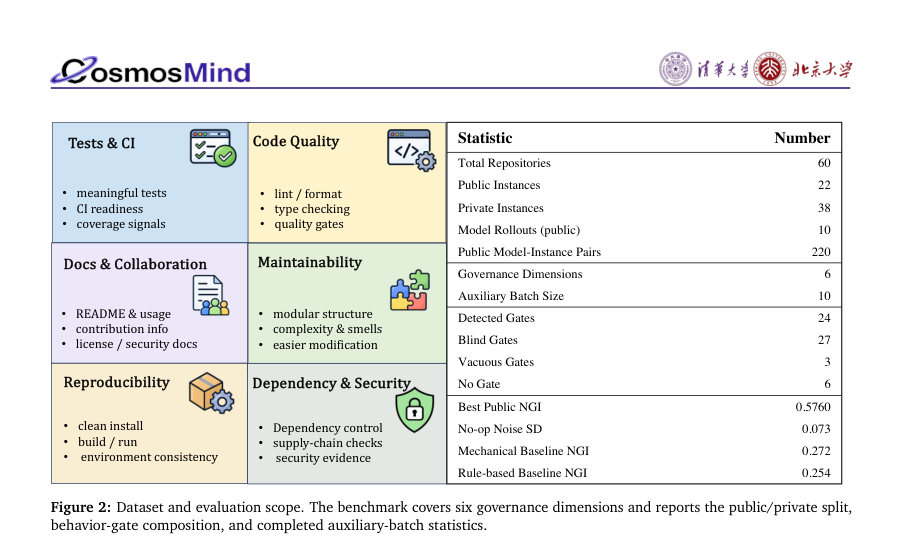
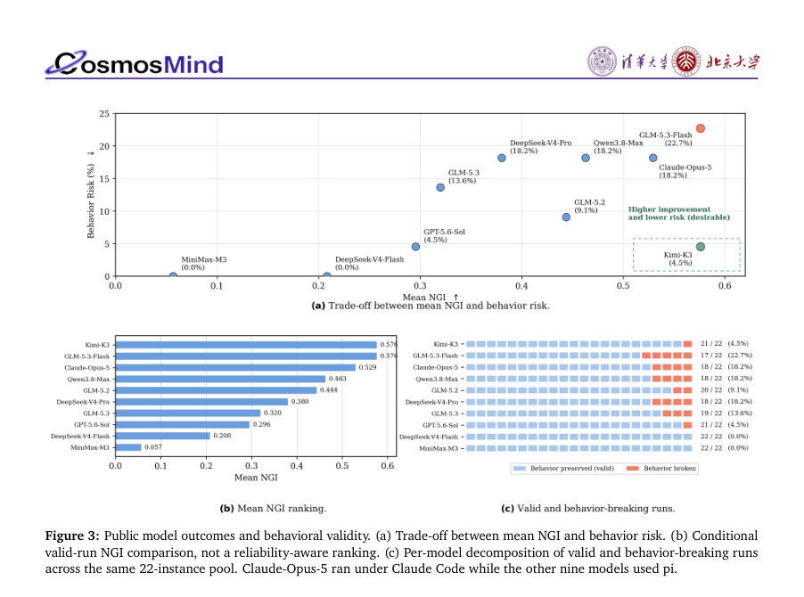

# SWE-Prometheus: Measuring Engineering Governance Improvements in Real-World Repositories

- **게시일:** 2026-09-25
- **arXiv:** [2609.29465v1](http://arxiv.org/abs/2609.29465v1) · [PDF](https://arxiv.org/pdf/2609.29465v1)
- **저자:** Jiajun Wu, Leixin Sun, Zihan Tan, Yitao Liu, Shuo Li, Jiaru Qian, Shanghaoran Quan, Chuangxin Zhao, Yangxu Liao, Yang Liu, Bin Chong, Guancheng Wan
- **분야:** cs.AI, cs.SE
- **선정 점수:** 7.33
- **선정 이유:** 최근성 1.2, 인용 영향 0.0 (인용 0회), 저자 영향 0.0 (최고 h-index 0), AI 주제 적합성 3.0, 개발자 관심 0.6, 학술 신호 1.0, 오픈 웨이트·주요 연구조직 신호 1.6

[← 2026-09-25 목록으로 돌아가기](../daily/2026-09-25.html)

<!-- paper-visuals:start -->
## 주요 Figure

> 원문 PDF에서 실제 Figure 캡션과 그림 영역이 함께 확인된 자료만 자동 추출했다.

*Figure · 원문 PDF 2쪽 · Figure 1: Motivation for SWE-Prometheus. Prior issue-level SWE benchmarks hand the agent a localized defect and score a*

*Figure · 원문 PDF 5쪽 · Figure 2: Dataset and evaluation scope. The benchmark covers six governance dimensions and reports the public/private split,*

*Figure · 원문 PDF 9쪽 · Figure 3: Public model outcomes and behavioral validity. (a) Trade-off between mean NGI and behavior risk. (b) Conditional*

<!-- paper-visuals:end -->

## 한 문장 요약

실제 저장소 스냅샷과 '레트로핏(개선)' 목표를 주고 에이전트가 리스크를 식별·우선순위화·검증하도록 하여 6개 거버넌스 차원에서 실행 가능한 증거와 클린 환경 검증을 통해 저장소 공학 거버넌스 개선을 측정하는 벤치마크(SWE-Prometheus)를 제안한다.

## 해결하려는 문제

기존 저장소-수준 벤치마크는 대개 사람이 발견한 특정 이슈와 그것을 검증하는 기능적 신호(테스트·레퍼런스 패치)를 전제로 한다. 이로 인해 테스트·CI 준비성, 재현 가능한 환경, 문서·유지보수성, 의존성·공급망 보안 등 저장소 전반의 '공학 거버넌스' 개선 능력은 측정되지 않는다. 또한 단순히 구성 파일을 추가하는 것만으로 점수를 얻을 수 있어 실행 기반의 실질적 개선과 구별되지 않는다.

## 핵심 기여

- 저자들은 저장소 자체를 진단하고 우선순위를 정해 제한된 예산으로 유의미한 개선을 수행하도록 요구하는 'Repository Retrofit'이라는 개방형 과제를 정식화했다.
- SWE-Prometheus라는 벤치마크를 도입하여(60개 실제 저장소: 공개 22개, 비공개 38개) 6개 거버넌스 차원(Tests & CI, Code Quality Gates, Documentation & Collaboration, Structure & Maintainability, Reproducible Environment, Dependency & Security)을 쌍으로 된 base/treated 증거, 클린-환경 프로브, 동작 게이트, 그리고 교차 판정(두 독립 교사판단)을 통해 평가하도록 설계했다.
- 10개 모델을 공개 22개 저장소 공용 서브셋에서 벤치마크하여 개선량(정규화된 거버넌스 개선 NGI)과 동작 파손률을 보고하고, no-op·템플릿·규칙 기반 등의 진단적 대조실험을 포함한 여러 품질 제어를 제시했다.
- 벤치마크 설계·릴리스 규칙(증거 보존·변이 테스트를 통한 게이트 강도 표기·공개/비공개 분리·머신리더블 기록 등)과 평가 프로토콜(패치 적용 후 독립적 클린 복사에서 동일 프로브 실행 및 행동 게이트 적용)을 제시했다.

## 접근 방법

* 작업 단위는 고정된 저장소 스냅샷(base_commit)과 일반적 거버넌스 브리프를 제공한다.
* 에이전트는 저장소를 탐색하고, 우선순위를 정해 변경을 제안하는 단일 패치(여러 파일 포함)를 제출할 수 있다.
* 평가자는 (1) base 상태에서 설치·테스트·품질·의존성·보안 프로브를 실행해 증거를 수집하고, (2) 제출된 패치를 독립된 클린 복사에 적용한 후 동일한 프로브를 재실행해 treated 증거를 수집한다.
* 두 상태의 증거는 각 거버넌스 차원별 1–5 점수(4는 해당 저장소 유형에서 '수용가능')로 채점되며, 증거는 실행 가능한 검사나 구조화된 판단이 있어야 인정된다.
* 행동 게이트(특징화 테스트)는 base에서 유효성을 확인한 후 treated에서 재검증하며 실패하면 behavior_broken으로 표기하고 해당 실행은 NGI 집계에서 제외한다.
* 변이시험(mutation testing)으로 게이트 강도를 detected/blind/vacuous/none으로 표기해 게이트의 판별력을 명시한다.
* NGI는 정의 가능한 차원 Di에 대해 각 차원의 개선( treated−base )을 (5−base)로 정규화한 평균으로 계산된다.
* 실행 로그·명령·종료코드·타임아웃·도구 버전 등 모든 증거를 보존하고 두 독립 교사가 동일 증거를 각각 판정하여 판정자 간 일치도를 제공한다.

## 주요 결과

- 데이터셋: 60개 실제 저장소(공개 22, 비공개 38). 공개 서브셋에서 10개 모델의 공용 롤아웃(총 220 모델-인스턴스 페어)을 공개했다.
- 공개 22개 서브셋 결과(유효(valid) 실행만 집계): 모델별 mean NGI 범위는 0.0568 (MiniMax-M3)에서 0.5760 (Kimi-K3, GLM-5.3-Flash)까지이며 관찰된 행동 파손률은 0%에서 22.7%까지(예: GLM-5.3-Flash: valid 17, broken 5, breakage 22.7%). (Table 15)
- 보조 10-저장소 고정 배치(auxiliary): no-op 평균 NGI −0.009, 중앙값 0.000, 표준편차 0.073(엔드투엔드 변이). 두 독립 교사는 동일 no-op 증거의 60개 저장소-차원 점수 중 57개에서 정확히 일치했고 평균 절대 점수 스프레드는 0.067이었다.
- 템플릿·규칙 기반 대조: 고정 템플릿(mechanical) 평균 NGI 0.272, 규칙 기반(rule-based) 0.254으로 이 둘은 공개 배치에서 여러 모델보다 높은 값을 보였다. 그러나 이 두 베이스라인의 개선은 Tests & CI, Code Quality Gates, Documentation 차원에 집중되었고 Reproducible Environment(D5)와 Dependency & Security(D6)에서는 개선이 관찰되지 않았다.
- 매치드(같은 인스턴스 대비) 비교: 고정 10-저장소 배치에서 에이전트가 강한 템플릿보다 명확히 더 잘한 리포지토리는 Kimi-K3가 9승 1패, GLM-5.3-Flash가 8승 1패(나머지는 대체로 템플릿 대비 우세하지 않음). (Figure 4, Table 19)  

## 한계

- 저자가 명시한 제한: 공개 서브셋(22개)과 각 모델-인스턴스 당 단일 롤아웃으로 인해 측정의 분해능이 제한된다. 현재 구성으로는 80% 검정력과 α=0.05에서 약 0.19 NGI 차이만 검출 가능하며(보조 배치는 약 0.27), 0.10의 해상도를 얻으려면 약 110 paired 관측(현재 서브셋에서 모델-인스턴스 당 약 5회 반복 롤아웃)이 필요하다고 저자들은 밝힘.
- 저자가 밝힌 제약과 본문에서 합리적으로 확인되는 한계 구분: (저자 언급) 템플릿이 구성 파일을 추가해 점수를 올릴 수 있으나 실행 기반의 의미있는 개선(특히 D5·D6)은 보장하지 못함. (검증 가능한 한계) 행동 게이트 강도가 약할 경우(변이시험에서 blind/vacuous) 파손을 놓칠 가능성이 있으며, vacuous gate에서는 관찰된 파손률이 0%로 측정 잡음일 수 있음(게이트 강도별 파손률: detected 13%, blind 8%, vacuous 0%).
- 범위 제한: 공개 서브셋은 전체 분포의 무작위 샘플이 아닌 공유 비교 셋으로 설계되어 있어 전체 저장소 분포를 대표하지 않을 수 있다.

## 개발자 관점

- 벤치마크 설계: 개선을 증명하려면 구성 파일 추가만으로는 부족하며 '쌍으로 된(base→treated) 실행 가능한 증거'와 '클린 환경에서의 재실행'을 필수로 설계해야 한다.
- 행동 안전성: 특징화(behavior) 테스트를 base에서 먼저 검증하고 treated에서 재실행하는 행동 게이트를 도입해 행동 회손을 탐지해야 하며, 게이트의 판별력(변이시험 결과)을 기록·보고해야 한다.
- 판정·재현성: 동일 증거에 대해 독립 판정자(또는 모델)에 의한 이중 판정과 판정 스프레드 보존을 통해 심사 신뢰도를 제공하고, 로그·명령·도구 버전·출력 등 모든 증거를 아카이브해야 한다.
- 대조실험 필요성: no-op(빈 패치), 템플릿(레포지토 무시), 규칙 기반 대조를 함께 실행해 단순한 아티팩트 추가로부터의 '허위 개선'을 판별해야 한다.
- 릴리스·운영 지침: 실행 환경 정의(environments/), 프로브(probes/), 실행 트레이스(runs/)와 결과(results/)·분석 스크립트(analysis/)를 함께 공개하여 재현을 보장하고, 예산·토큰·시간 등 실행 비용은 가용한 제공자 회계만 기록해야 한다.

**근거 범위:** 이 분석은 제공된 논문 PDF 본문(지문 안의 본문, 표, 그림 캡션 및 부록 포함)에 근거해 작성되었다. PDF 텍스트가 중복 추출된 부분이 있어 동일 문장이 반복 보이는 경우가 있으나 본문 내 명시 수치(예: 저장소 수 60, 공개 22, NGI 및 파손률, no-op 표준편차 등)와 실험 절차·제약은 본문에서 직접 확인한 내용으로 기재하였다. 모델 내부 하이퍼파라미터·비용 추정 등 본문에 명시되지 않은 구현 세부사항은 포함하지 않았다.
