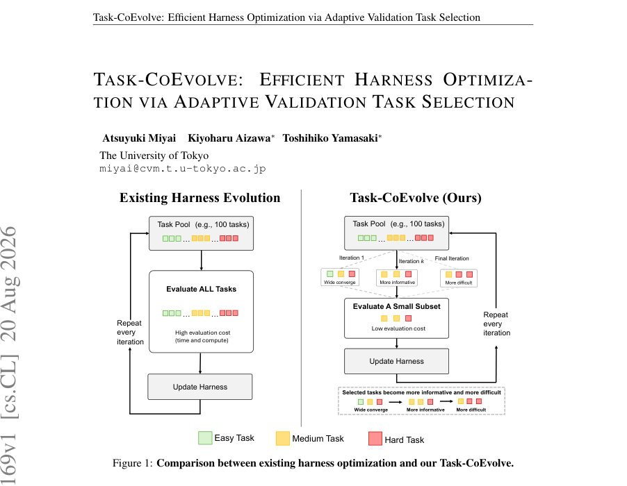
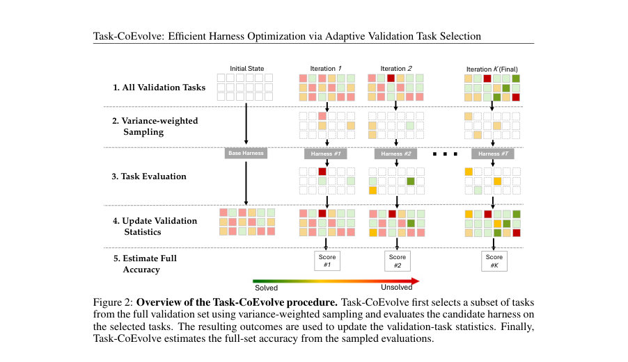

# Task-CoEvolve: Efficient Harness Optimization via Adaptive Validation Task Selection

- **게시일:** 2026-08-21
- **arXiv:** [2608.20169v1](http://arxiv.org/abs/2608.20169v1) · [PDF](https://arxiv.org/pdf/2608.20169v1)
- **저자:** Atsuyuki Miyai, Kiyoharu Aizawa, Toshihiko Yamasaki
- **분야:** cs.CL, cs.AI, cs.LG
- **선정 점수:** 7.48
- **선정 이유:** 최근성 0.7, 인용 영향 0.0 (인용 0회), 저자 영향 1.4 (최고 h-index 8), AI 주제 적합성 3.0, 개발자 관심 0.8, 학술 신호 0.5, 오픈 웨이트·주요 연구조직 신호 1.1

[← 2026-08-21 목록으로 돌아가기](../daily/2026-08-21.html)

<!-- paper-visuals:start -->
## 주요 Figure

> 원문 PDF에서 실제 Figure 캡션과 그림 영역이 함께 확인된 자료만 자동 추출했다.

*Figure · 원문 PDF 1쪽 · Figure 1: Comparison between existing harness optimization and our Task-CoEvolve.*

*Figure · 원문 PDF 4쪽 · Figure 2: Overview of the Task-CoEvolve procedure. Task-CoEvolve first selects a subset of tasks*

<!-- paper-visuals:end -->

## 한 문장 요약

검증 태스크의 분별력에 따라 유동적으로 검증 하위집합을 샘플링하고 샘플링 확률을 보정해 전체 검증 점수를 추정함으로써 하네스(harness) 자동 최적화의 평가 비용을 크게 줄이는 방법(Task-CoEvolve)을 제안한다.

## 해결하려는 문제

기존의 하네스 자동 최적화는 매 반복마다 고정된 전체 검증 집합을 전수 평가해 후보 하네스를 비교하므로, (1) 개별 과제가 실행 비용이 큰 경우 평가 비용이 전체 최적화에서 지배적이며, (2) 하네스가 진화함에 따라 동일하게 전수 평가되는 과제들 중 많은 부분이 더 이상 후보를 구별하는 데 정보가 적어지는 등 평가의 정적·비효율성 문제가 있다. 본 연구는 제한된 평가 예산 하에서 어떤 검증 과제들을 언제 사용할지 최적화하는 문제(평가 비용 대비 평가 신호의 정보량을 균형 있게 확보하면서 다른 반복 간 비교 가능성을 유지하는 문제)를 다룬다.

## 핵심 기여

- 문제 설정: 하네스 최적화에서 '어떤 과제로 후보를 평가할지'를 최적화하는 새로운 문제 방향을 제시함(검색 후보 수를 줄이는 대신 후보 당 평가 비용을 줄이는 관점).
- Task-CoEvolve 제안: 과제의 분별력(과거 성공/실패 이력의 베르누이 분산)에 기반한 분산 가중 샘플링으로 유정보다 분별력 높은 과제에 예산을 집중하고, 샘플링 확률을 이용한 설계 기반(full-set) 점수 추정으로 서로 다른 하위집합에서의 비교를 일관되게 가능하게 함.
- 추정기 선택 실무 규칙: 데이터셋/과제 풀 구조에 따라 H´ajek 추정(식 3)과 앵커 차이 추정(식 4) 중 적합한 추정기를 선택하는 경험적 지침을 제시함.
- 광범위한 실험: 온라인 텍스트 분류(3개 데이터셋)와 Terminal-Bench 2.1(89개 장기 실행 과제)에 적용해, 20% 평가 예산에서 전체 전수 탐색(full search)에 근접하는 성능을 유지하면서 평가 횟수를 67–80% 절감함을 보임.
- 분해 실험 및 분석: 구성요소별 제거 실험(부분 재샘플링, 설계 기반 추정, 분산 가중 선택)과 점수 추정의 순위 상관(스피어만)·선택자 순위 분석을 통해 각 구성 요소의 기여와 한계(예: 적은 예산에서의 순위 신호 약화)를 정량적으로 제시함.

## 접근 방법

* 문제 정의: 검증 과제 집합 T={1..N}에 대해 하네스 h의 과제 t에 대한 성공률 x_t(h) (r번 실행의 평균)을 정의하고 전체 점수 S(h)= (1/N) sum_t x_t(h)를 목표로 함.
* Task-CoEvolve 전체 절차는 다음 단계로 구성된다.
* Phase 0(초기화): 탐색 시작 전 두 개의 시작 하네스(논문과 동일하게 zero-shot과 few-shot)를 전체 검증 집합에 대해 평가해 모든 과제에 대한 초기 역사(¯p_t)를 확보한다.
* Phase 1(분산-가중 샘플링): 각 과제 t에 대해 과거 관측의 평균 ¯p_t와 관측 횟수 n_t를 유지하고 샘플링 가중치 w_t = max(¯p_t(1−¯p_t), ℓ_t) + λ/√n_t (식 2)로 정의하여 분산이 크고 관측이 적은 과제에 우선적으로 확률을 부여한다.
* ℓ_t는 지금까지 한 번도 풀리지 않은 과제에 대해 작은 플로어 ℓ를 넣는 항이다.
* 이 가중치에 따라 매 반복마다 크기 m=⌈ρN⌉인 하위집합 S_k을 재샘플링한다.
* Phase 2(샘플링-인지 전수 추정): 샘플링 설계에 따른 각 과제의 포함 확률 π_t=Pr[t∈S_k]을 몬테카를로(논문에서는 4,000반복)로 추정하고, 두 가지 추정기 중 상황에 맞는 것을 사용해 전체 점수 ˆS(h)를 추정한다.
* H´ajek 추정(식 3)은 각 관찰을 1/π_t로 가중치 하여 정규화하고, 앵커 차이 추정(식 4)는 각 관찰의 편차(x_t(h)−¯p_t)를 1/π_t로 보정해 역사적 평균에 더해 전체 평균을 복원한다.
* 선택 규칙: 각 반복에서 후보들의 ˆS(h)를 통해 ˆS-max(최댓값) 기준으로 최종 선택 후보를 결정하고, 동점은 가장 이른 반복을 선택한다.
* Phase 3(최종 선택): 최종적으로 모든 생성된 후보들 중 ˆS가 가장 높은 것을 최종 하네스로 채택한다.

## 주요 결과

- 온라인 텍스트 분류(데이터셋: USPTO, S2D, Law; 총 N=130 검증 예제): Meta-Harness(Full search, ρ=100%) 평균 최종 테스트 정확도 48.6% (표 1). Task-CoEvolve은 ρ=7%에서 평균 47.6±0.9%, ρ=20%에서 평균 49.3±0.8%를 기록해(표 1) 동일한 예산에서 Naive 및 Random-Resample을 상회하고 ρ=20%에서는 Full search(48.6%)보다 높게 나타남. 개별 데이터셋 예: USPTO에서 Task-CoEvolve(20%) 19.3±1.2% vs Full 17.0±1.0% 등(표 1).
- Terminal-Bench 2.1(89과제, 모델: GPT-5.6-Luna, Qwen3.6-35B-A3B): Full search(ρ=100%)의 전체 합계 통과율 평균 52.8% (표 2). Task-CoEvolve(ρ=20%)는 GPT-5.6-Luna에서 61.8%, Qwen3.6에서 41.6%, 평균 51.7%로 Full search에 거의 근접(약 1% 차이, 표 2).
- 검색 비용(토큰·시간): GPT-5.6-Luna 기준 Full search 입력 토큰 2,888M, 비용 117 USD, 시간 22.2h. Task-CoEvolve(20%)는 입력 토큰 579M(−80% vs Full), 비용 30 USD, 시간 11.5h(표 3). Qwen3.6 기준 입력 토큰은 Full 741M → Task-CoEvolve 246M(−67%), 시간 38.0h → 20.5h(표 3).
- 샘플 평가·추정 관련: ρ=20%에서 ˆS와 전체 정답 사이의 스피어만 상관계수는 0.62로 괜찮은 순위 신호를 제공했고(표 6), ˆS-max로 선택된 후보는 전체 후보군(60명) 중 12위였음(실제 점수 51.3% vs 최상위 54.7%). 반면 ρ=7%에서는 상관계수 0.13으로 순위 신호가 약해지지만 최종 선택 후보는 60명 중 10위(표 6).

## 한계

- 저자 명시 한계: 각 후보 하네스가 평가받을 과제 수 m(=⌈ρN⌉)을 평가 전에 고정하므로(논문 결론) early-stopping(이미 명백히 열등한 후보를 빨리 중단)이나, 두 후보 간 판별이 어려운 경우 더 많은 과제를 동적으로 배정하는 기능을 제공하지 못함.
- 본문에서 확인되는 제약(추가): (1) 추정기 선택 민감도: H´ajek 추정과 앵커 차이 추정기 중 어느 것을 쓸지 Phase-0(두 시작 하네스의 전수 평가)에 따라 규칙적으로 결정해야 하며(부록 A), 잘못 선택하면 추정 불안정(예: 희소 샘플에서 한 과제의 1/π_t 가 추정치를 지배하는 현상)이 발생함. (2) 비용 집중 현상: 분산-가중 샘플링은 정보가 높은 장기 실행 과제에 예산을 집중시켜 전체 평가 수는 줄이나 개별 반복당(또는 선택된 샘플의) 입력 토큰·실행 시간이 증가할 수 있음(표 3에서 Task-CoEvolve의 평균 입력 토큰/시도는 Naive보다 높음). (3) 몬테카를로로 포함확률 π_t를 추정하기 위한 추가 계산 비용(논문에서 4,000 반복 사용)이 존재함.
- implementation·범위 관련 한계: 실험은 특정 메타-대리자(Claude Opus 4.6)와 초기 하네스(Zero-shot, Few-shot) 구성에 의존하며, 매우 강한 모델(DeepSeek-V4-Flash)에서는 탐색으로 얻을 성능 여지가 적어(부록 C) 방법의 개선 여지가 제한적임.

## 개발자 관점

- 재현을 위한 필수 절차: Phase-0에서 두 시작 하네스를 전체 검증 집합에 대해 평가해 초기 ¯p_t를 확보해야 하며(논문은 이를 '필요한 비용'으로 간주), 이후 샘플링·추정을 이 역사로부터 시작함(본문 Section 3.3, Appendix E.1).
- 샘플링 가중치와 하이퍼파라미터: w_t = max(¯p_t(1−¯p_t), ℓ_t) + λ/√n_t를 사용. 논문에서 사용한 값은 ℓ=0.125, λ=0.025, 포함확률 추정 몬테카를로 반복 4,000, 역사 윈도우는 '모든 과거'로 설정(표 D). 같은 값이 온라인 텍스트 분류와 Terminal-Bench 2.1에 사용됨.
- 추정기 선택 규칙: Phase-0 결과를 보고 과제 풀 구조에 따라 선택. (i) 각 풀 내 평균 성공률이 0 또는 1 근처이고 풀을 나누어 처리할 수 있으면 H´ajek(식 3)를 권장. (ii) 풀의 성공률이 중간(near 0.5)이고 드물게 샘플되는 과제가 극단적 영향력을 줄 수 있으면 앵커 차이 추정(식 4)을 사용하라(본문 Section 3.3, Appendix A).
- 탐색/평가 실무: Terminal-Bench 같은 장기 실행 과제에서는 실패·인프라 오류에 대한 재시도 규칙(논문에서 최대 2회 재시도)을 구현해야 하며(Section 4.3), 분산-가중 샘플링은 비용이 큰 과제를 더 자주 뽑을 수 있으므로 예산(토큰·시간) 관리와 병렬성 전략을 설계해야 함(논문에서 10-way 병렬 실행을 사용).
- 성능 모니터링 및 안전성: ˆS의 순위 신호는 예산(ρ)에 민감하므로(표 6) 소규모 검증 예산(예: 7%)에서는 ˆS가 최상 후보를 찾지 못할 수 있으니(논문: 7%에서 선택자는 전체 60명 중 10위), 개발 중에는 더 큰 ρ로 검증하거나 주기적 전수 평가로 보정하라.

**근거 범위:** 이 분석은 제공된 논문 PDF 본문(본문, 표, 부록)을 기반으로 하였으며, 수치·실험 설정·하이퍼파라미터는 본문과 부록에서 직접 확인 가능한 값만 인용했습니다. 본문에 기술되지 않거나 명시적 근거가 없는 구현 세부사항(예: 내부 코드 구조, 추가 비공개 파라미터 등)은 추정하지 않았습니다.
