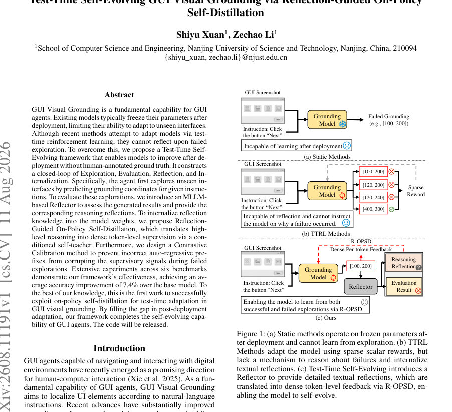
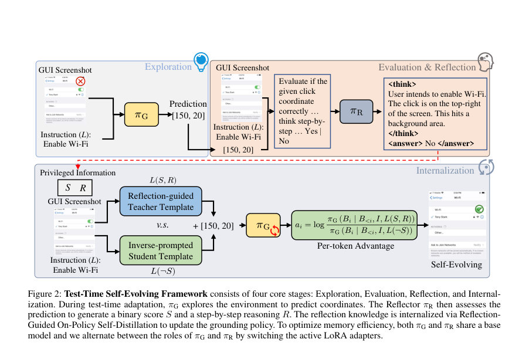
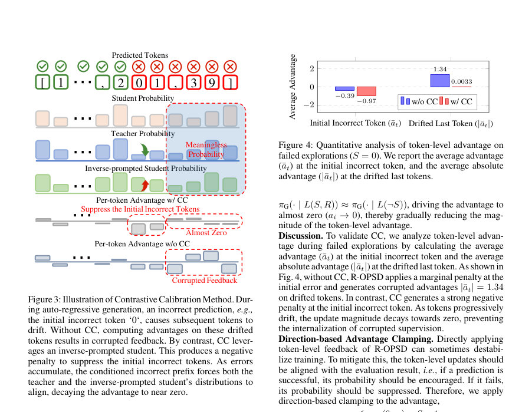

# Test-Time Self-Evolving GUI Visual Grounding via Reflection-Guided On-Policy Self-Distillation

- **게시일:** 2026-08-13
- **arXiv:** [2608.11191v1](http://arxiv.org/abs/2608.11191v1) · [PDF](https://arxiv.org/pdf/2608.11191v1)
- **저자:** Shiyu Xuan, Zechao Li
- **분야:** cs.CV, cs.AI, cs.CL
- **선정 점수:** 5.98
- **선정 이유:** 최근성 0.8, 인용 영향 0.0 (인용 0회), 저자 영향 0.0 (최고 h-index 0), AI 주제 적합성 2.8, 개발자 관심 0.8, 학술 신호 0.5, 오픈 웨이트·주요 연구조직 신호 1.1

[← 2026-08-13 목록으로 돌아가기](../daily/2026-08-13.html)

<!-- paper-visuals:start -->
## 주요 Figure

> 원문 PDF에서 실제 Figure 캡션과 그림 영역이 함께 확인된 자료만 자동 추출했다.

*Figure · 원문 PDF 1쪽 · Figure 1: (a) Static methods operate on frozen parameters af-*

*Figure · 원문 PDF 4쪽 · Figure 2: Test-Time Self-Evolving Framework consists of four core stages: Exploration, Evaluation, Reflection, and Internal-*

*Figure · 원문 PDF 5쪽 · Figure 3: Illustration of Contrastive Calibration Method. Dur-*

<!-- paper-visuals:end -->

## 한 문장 요약

테스트 시점에 MLLM 기반 Reflector의 단계적 추론(Reflection)을 활용해 자기-교사(on-policy) 토큰 수준 증류(R-OPSD)와 대조 보정(Contrastive Calibration)으로 GUI 비주얼 그라운딩 모델을 무감독으로 배포 후 적응시키는 프레임워크를 제안한다.

## 해결하려는 문제

기존 GUI 그라운딩 모델은 학습 후 파라미터를 고정한 채 배포되어 보지 못한 인터페이스·레이아웃에 적응하지 못한다. 최근의 테스트-타임 RL 계열 방법들은 희소한 스칼라 보상(성공/실패)으로만 적응하여 실패의 원인이나 수정 방향에 대한 정보를 제공하지 못한다. 또한, 자가 생성(prefix) 기반의 auto-regressive 좌표 생성에서 잘못된 접두사(prefix)가 있으면 후속 교사가 제공하는 토큰 수준 감독(signal)이 오염되어 학습을 망칠 수 있다.

## 핵심 기여

- Test-Time Self-Evolving 프레임워크 제안: Exploration, Evaluation, Reflection, Internalization의 폐쇄 루프를 통해 배포 후 무감독 자기-진화 능력을 부여함.
- MLLM 기반 Reflector 설계: 예측된 좌표에 대해 step-by-step 추론을 출력하고 이진 평가(S)와 진단적 텍스트 반영(R)을 생성하여 평가·해석 정보를 제공함.
- Reflection-Guided On-Policy Self-Distillation (R-OPSD): Reflector의 평가 S와 반영 R을 조건화한 자기-교사를 구성하여 고수준 자연어 반영을 토큰 단위의 밀집한 감독 신호로 변환함.
- Contrastive Calibration (CC): 실패한 탐색에서 잘못된 auto-regressive 접두사가 교사의 감독을 오염시키는 문제를 완화하기 위해 반대( inverse-prompted ) 학생을 도입하고 초기 오류에 대해 음의 우위를 부여하여 오염된 신호의 내부화를 억제함.
- 광범위한 실험 및 분석: 6개 벤치마크(예: ScreenSpot, ScreenSpot-v2, ScreenSpot-Pro, MMBench-GUI, OSWorld-G 등)와 ablation을 통해 평균 성능 향상과 구성요소 유효성을 증명함.

## 접근 방법

* 아키텍처 및 절차: 기본 GUI 그라운더 πG(예: Qwen2.5-VL, Qwen3-VL)에 LoRA 어댑터를 사용해 메모리 효율적으로 πG와 Reflector πR를 번갈아 활성화하여 공유 베이스 모델을 사용한다.
* 테스트-타임 에피소드 루프는 다음과 같다: (1) Exploration: πG(I, L)로 좌표 B를 auto-regressive 토큰 시퀀스로 샘플링(temperature=1.0, top-p=0.95).
* (2) Evaluation & Reflection: MLLM 기반 Reflector πR에 (I, L, B)를 입력해 형식 준수 보상(r_format)과 이진 정답 보상(r_binary)을 포함한 GRPO로 학습된 Reflector가 <think>...</think>에 단계적 추론 R을, <answer>Yes\|No</answer>로 S를 출력한다.
* Reflector는 오프라인으로 약 10K 샘플(GroundCUA 기반)로 GRPO(그룹 크기 K=8, lr=1e-4, batch=64, 1 epoch)로 학습되고 테스트타임에는 고정된다.
* (3) Internalization: R-OPSD는 πG의 자가-교사화 기법으로, 교사 확률을 πG(Bi \| B<i, I, L(S,R))로, 학생 확률을 πG(Bi \| B<i, I, L)로 사용해 토큰 수준의 이득 ai = log π_teacher / π_student 를 정의하고 L_OPD = -Σ sg(ai) log πG(Bi \| ...)를 최적화한다.
* (4) Contrastive Calibration: 실패(S=0)에서 inverse-prompted student πG(·\|L(¬S))를 만들어 분모를 대체하여 ai = log πG(Bi\|...,L(S,R)) / πG(Bi\|...,L(¬S))로 계산하면 초기 오류 토큰에서 음의 이득이 발생하여 초기 오류를 억제하고, 접두사가 점차 무너질수록 교사·역학생 분포가 수렴해 이득이 0으로 소멸되도록 설계했다.
* (5) 안정성 기법: 방향 기반 이득 클램핑(ai는 S=1일 때 max(0,ai), S=0일 때 min(0,ai))과 쿼리-레벨 GRPO 이득을 표준화해 토큰-레벨 이득과 합성(통합 계수 λ, 실험적 최적값 λ=0.2)을 사용한다.

## 주요 결과

- 평균 성능: 논문은 평균 정확도( Element Accuracy )에서 베이스 모델 대비 평균 +7.4% 향상을 보고함(여러 실험 설정에서).
- Qwen2.5-VL-3B (베이스 Avg.=50.2): SSv2에서 적응 시 +7.2 → Avg 57.4; MMG 적응 시 +7.4 → Avg 57.6 (Table 1).
- Qwen3-VL-2B (베이스 Avg.=65.7): SSv2 적응 후 Avg 69.4 (+3.7); MMG 적응 후 Avg 70.3 (+4.6) (Table 1).
- 대형 모델 확장: Qwen2.5-VL-7B에서 MMG 적응 시 MMG 정확도 68.2 → 79.2(+) (Table 6). Qwen3-VL-8B에서도 SSv2/MMG 등에서 소폭 향상(예: SSv2 92.9 → 94.5) 보고됨 (Table 6).
- Reflector 성능: 오프라인 GRPO로 학습된 Reflector의 이진 평가 성능은 Qwen2.5 기반에서 Accuracy 89.5 (zero-shot 76.5 → 89.5), Qwen3 기반에서 91.7 (zero-shot 80.5 → 91.7) (Appendix Table 4). 반영된 정밀도/재현율도 각각 보고됨(예: Qwen3 기반 Precision 88.8, Recall 95.7). (Appendix).

## 한계

- 저자가 명시한 한계: Reflector는 완벽할 필요는 없고 '충분히 정보성 있는' 평가와 반영을 제공한다는 약한 가정을 사용하며, 이 가정 하에서 R-OPSD가 성능을 개선한다고 주장함(본문). 또한 전체 프레임워크는 Reflector의 품질에 의존한다(부록에서 Reflector 신뢰도 분석 제시).
- 본문·실험에서 드러나는 제약(분석적 한계, 저자가 직접적으로 진술하지 않은 부분):
-  - Reflector 학습을 위해 GroundCUA 기반으로 약 10K 라벨(생성된 예측에 대한 정답 여부)이 필요한데, 이 오프라인 데이터와 라벨링 규칙(그룹 필터링, 균형 샘플링)에 의존하므로 완전한 무감독성은 아니다(Appendix 설명).
-  - R-OPSD와 CC는 auto-regressive 좌표 토큰화 및 텍스트 좌표 표현(문자열 '[x,y]' 등)에 의존하며, 시각적 바운딩박스(이미지에 그리기)로 privileged 정보를 줄 경우 성능이 저하됨(부록에서 Ours + V가 성능 감소로 보고됨). 즉 입력·출력 형식 설계에 민감함(Appendix Tables 7–8).

## 개발자 관점

- 재현성·구현: 기본 구현은 Qwen2.5-VL / Qwen3-VL 계열을 베이스로 LoRA 어댑터를 교체하는 방식으로 구현되며 3B/2B 모델은 약 10GB GPU, 7B/8B 모델은 약 30GB GPU로 실험 가능하다고 보고함(Implementation).
- Reflector 학습: Reflector는 GRPO로 오프라인 학습(약 10K prediction-label pairs, group size K=8, lr=1e-4, batch=64, 1 epoch)해야 하며 출력 포맷( <think>...</think>, <answer>Yes|No</answer> )을 엄격히 강제해야 파싱·내재화가 가능함(본문·Appendix).
- Internalization 하이퍼파라미터: R-OPSD는 λ=0.2가 감도 분석에서 최적으로 보고되었고 내부화는 2 epochs, lr=1e-4, batch=64로 수행됨. 샘플링은 temperature=1.0, top-p=0.95로 설정됨(Implementation).
- 계산·비용: GRPO(쿼리 그룹 K=8)를 사용하는 기존 RL 대비 R-OPSD(w/ CC)는 학습 시간을 약 0.34×(151분 vs 449분)로 줄여 비용 효율적이며, 최종적으로 QA(쿼리-레벨 이득)까지 포함하면 학습 시간이 증가(≈1.73×)하므로 자원-성능 트레이드오프가 존재함(Appendix Table 5).
- 배포·안전성: Reflector의 오분류가 내부화 신호에 악영향을 줄 수 있으므로 운영에서는 Reflector 성능 모니터링(정확도/정밀도/재현율), 로그·검증 루틴을 두고 필요시 휴지기(fallback) 정책을 마련해야 함. 또한 시각적 privileged prompting(이미지에 박스 그리기)은 성능 저하를 유발하므로 권장되지 않음(부록 실험).

**근거 범위:** 본 분석은 제공된 논문 PDF 본문(본문 + Appendix)에 수록된 표, 수치, 알고리즘 설명을 근거로 작성되었다. 표(Table 1,2,3,4,5,6 등)와 본문 문단에서 직접 인용 가능한 수치만 사용했으며, 저자가 명시적으로 밝히지 않은 구현 세부(예: 일부 옵티마이저 세팅의 추가 세부, 데이터 전처리의 모든 파라미터)는 추정하지 않았다. PDF에 포함된 그림·표를 텍스트로 추출한 내용을 바탕으로 요약했으며, 코드·데이터 공개 시 세부 재현성에 대한 추가 확인이 필요하다.
