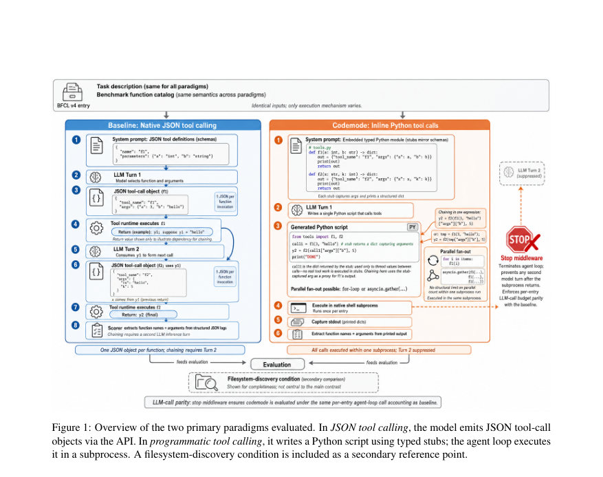
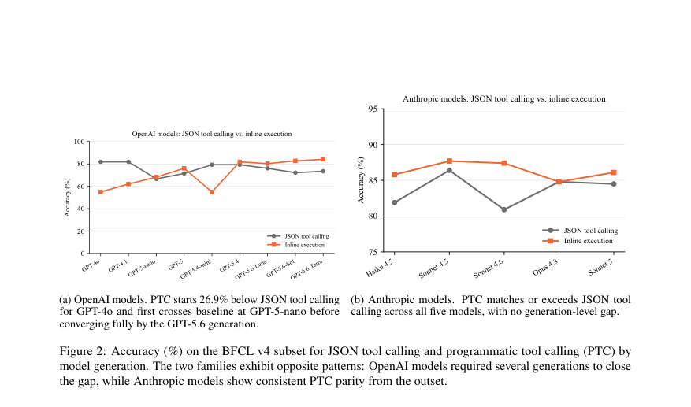

# The Bitter Lesson of Tool Calling

- **게시일:** 2026-08-08
- **arXiv:** [2608.06370v1](http://arxiv.org/abs/2608.06370v1) · [PDF](https://arxiv.org/pdf/2608.06370v1)
- **저자:** Ishan Patel, Sahil Sen, Elias Lumer, Vamse Kumar Subbiah
- **분야:** cs.CL
- **선정 점수:** 4.75
- **선정 이유:** 최근성 0.7, 인용 영향 0.0 (인용 0회), 저자 영향 0.0 (최고 h-index 0), AI 주제 적합성 2.2, 개발자 관심 0.8, 학술 신호 1.0, 오픈 웨이트·주요 연구조직 신호 0.0

[← 2026-08-08 목록으로 돌아가기](../daily/2026-08-08.html)

<!-- paper-visuals:start -->
## 주요 Figure

> 원문 PDF에서 실제 Figure 캡션과 그림 영역이 함께 확인된 자료만 자동 추출했다.

*Figure · 원문 PDF 3쪽 · Figure 1: Overview of the two primary paradigms evaluated. In JSON tool calling, the model emits JSON tool-call*

*Figure · 원문 PDF 8쪽 · Figure 2: Accuracy (%) on the BFCL v4 subset for JSON tool calling and programmatic tool calling (PTC) by*

<!-- paper-visuals:end -->

## 한 문장 요약

코드 실행 방식(typed Python stubs)을 통해 LLM의 도구 호출을 단일 스크립트로 처리하는 'programmatic tool calling(PTC)'이 309개 항목의 BFCL v4 벤치마크와 세 가지 어블레이션(연쇄, 병렬, 컨텍스트 로트)에서 JSON 기반 네이티브 함수 호출과 비교해 대다수 모델에서 동등하거나 우수한 성능을 보이는지를 실험적으로 평가한다.

## 해결하려는 문제

기존의 도구 호출 배포 패턴은 모델이 API에 대해 엄격한 JSON 객체를 출력하도록 요구한다. 코드 생성에 능한 모델에게 JSON 포맷은 설계상의 선택일 뿐이며, 다중 단계 체인, 높은 병렬 팬아웃, 컨텍스트 오염 등 실제 조건에서 JSON 호출이 구조적 한계(추가 추론 턴 필요, 팬아웃에서 호출 누락 등)를 가지는지, 그리고 이를 '도구를 코드로 노출'하는 방식(PTC)이 대체 가능한지에 대한 체계적 비교가 부재하다.

## 핵심 기여

- BFCL v4의 대표 309개 항목(8개 카테고리)을 사용해 14개 모델(2024.11–2026.07 출시)을 대상으로 JSON 도구 호출과 programmatic tool calling(타입된 Python 스텁 + 서브프로세스 실행)을 직접 비교한 최초의 대규모 실험적 평가를 제시한다.
- PTC가 BFCL v4 메인 평가에서 14개 모델 중 11개 모델에서 JSON 도구 호출과 동등하거나 우수함을 보였고(모델 세대별 차이 확인), 특히 GPT-5.6 계열에서 최대 10.6% 절대 성능 향상을 보였음을 보고한다.
- 세 가지 어블레이션(연쇄(chaining), 병렬(fan-out), 컨텍스트 로트(context rot))을 설계·실행해 PTC가 연쇄 길이 증가 시 이득이 커지고(체인 길이 ≥12에서 최대 18.8% 절대 격차 보고), 병렬 열거(enumeration)에서 구조적으로 높은 팬아웃을 처리하며(JSON은 모델별 임계치에서 호출 누락), 컨텍스트 플러딩에 대해 안정적임을 실증한다.
- 실험에서 사용한 구현 세부(typed Python stubs, subprocess execute, stop middleware로 단일 에이전트 턴 보장), 평가 기준(정규화된 문자열 비교에 의한 정확도, 열거 vs 집계 구분)과 평가 허심(에러 발생 시 0점) 등을 공개하고, 결과와 평가 허브를 함께 배포함. 

## 접근 방법

* 평가 코어(공통 정의): 각 항목은 자연어 쿼리 q, 사용 가능한 함수 집합 F(타입 시그니처 포함), 정답 함수 호출 집합 C*로 정의된다.
* 정답 판정은 스코어러의 정규화(구두점 제거, 소문자화) 후 예측된 호출 집합이 C*와 정확히 일치하는지로 한다.
* 두 패러다임은 동일한 수의 LLM 호출을 소비하도록 설계되어 직접 비교가 가능하다.
* JSON tool calling(레퍼런스): 시스템 프롬프트에 함수 스키마를 JSON 툴 정의로 포함하고 모델이 각 호출마다 구조화된 JSON 객체를 API를 통해 출력하도록 요구한다.
* 모델-퍼롬프트-응답 루프에서 각 도구 호출은 별도의 출력(즉, 추가 추론 턴)을 요구할 수 있다.
* Programmatic tool calling(PTC): 시스템 프롬프트에 BFCL 함수 스키마로부터 생성한 typed Python 스텁 모듈 소스(각 함수는 인자를 받아 그대로 dict로 반환)를 임베드한다.
* 모델은 이 모듈을 임포트하고 필요한 함수들을 호출하는 Python 스크립트를 작성해 한 번만 execute(예: python3 -c '...')를 호출한다.
* 에이전트 루프는 해당 스크립트를 네이티브 서브프로세스로 실행하고 stdout을 캡처하여 스코어러가 호출 이름·인자 값을 추출한다.
* 서브프로세스 실행 후 추가 추론 턴은 발생하지 않으며 다음 모델 호출을 중단시키는 stop middleware가 존재한다.
* 벤치마크/셋업: BFCL v4에서 309개 항목(8개 카테고리: simple_python, multiple, parallel, parallel_multiple, live_simple, live_multiple, live_parallel, live_parallel_multiple)을 표본추출해 사용.
* 세 어블레이션은 chaining(n=52, 체인 길이 2–20, 장거리 편중), parallelism(n=32, 팬아웃 7–48 + 프로브 N∈{60,70,72,75,100}), context rot(n=31 조건당, filtered vs flood(128 schemas))으로 구성.
* 모든 모델은 temperature=0으로 실행.
* 오류(문법/런타임)는 해당 항목에서 0으로 채점.
* 스코어/지표: 기본 지표는 “정확도(accuracy) = 모든 필요한 호출이 존재하고 올바르게 파라미터화된 항목의 비율”.
* 병렬 어블레이션에서는 열거(enumeration) 정확도(필요한 모든 N 호출이 발생했는가)와 집계(aggregation) 정확도를 분리 보고.
* 신뢰구간은 95% Wilson CI를 사용.

## 주요 결과

- 데이터셋: BFCL v4의 309개 표본 항목(8개 카테고리). 모델: 총 14개(Anthropic: Claude Haiku 4.5, Sonnet 4.5, Sonnet 4.6, Opus 4.8, Sonnet 5; OpenAI: GPT-4o, GPT-4.1, GPT-5-nano, GPT-5, GPT-5.4-mini, GPT-5.4, GPT-5.6-{Luna,Sol,Terra}).
- 메인(BFCL v4): PTC는 14개 모델 중 11개 모델에서 JSON 도구 호출과 동등하거나 우수한 정확도를 보였다. GPT-5.6 계열(GPT-5.6-Sol, GPT-5.6-Terra 등)은 각자 자사 JSON 베이스라인 대비 절대 10.6%의 개선을 달성(예: GPT-5.6-Sol 72.2% → 82.8%; GPT-5.6-Terra 73.5% → 84.1%; 표는 Table 2 참조). 전 모델 평균으로는 일부 카테고리(특히 parallel, parallel_multiple)에서 PTC가 평균 -14.1%로 낮게 나타났으나 이는 세 개의 OpenAI 모델의 '\n' 인코딩 실패가 주된 원인으로 분석됨.
- 체이닝 어블레이션(n=52): 체인 길이 증가에 따라 PTC의 우위가 확대된다. 체인 길이 ≥12에서 JSON 대비 최대 18.8% 절대 격차를 관찰(본문 기여 항목). 개별 모델 예: Claude Sonnet 5: 80.8% →96.2% (절대 +15.4%). GPT-4.1은 '\n' 인코딩 버그로 인해 PTC에서 성능이 급락(98.1% →40.4%).
- 병렬 어블레이션(n=32): PTC는 14개 모델 중 13개에서 JSON 대비 열거 정확도(enumeration)에서 동등하거나 우수했다. GPT-5은 71.9% →96.9%로 최대 개선을 보였고, PTC는 고팬아웃에서 100% 열거 정확도를 유지하는 반면 JSON은 모델별 임계치에서 호출 누락을 보였다(예: Claude Sonnet 5의 경우 JSON 열거 정확도는 N≤70에서 100% 유지, N=72에서는 75%, N=100에서는 0%로 급락; PTC는 N=100에서도 100%). 단, 집계(aggregation) 정답은 일부 모델이 실제로 모든 호출을 실행하지 않고 파라메트릭 지식을 사용해 정답을 출력하는 경우가 관찰되어 열거 정확도를 주요 지표로 취급.
- 컨텍스트 로트(n=31/조건): 'filtered' 조건에서 'flood'(128 schemas)로 전환 시 JSON 평균 변화는 −2.3%였고 PTC 평균 변화는 +5.5%였다. 파일시스템-발견 방식(filesystem-discovery) 내부 조건은 평균 −32.0%로 큰 성능 저하를 보였다. 일부 모델(GPT-4.1, GPT-4o, GPT-5.4-mini)은 플러딩에서 정보가 오히려 도움이 되어 성능이 개선됨을 보고함(예: GPT-4.1 +12.9%).  

## 한계

- 저자 명시 한계: 1) BFCL v4에서 사용한 스텁은 echo-return(인자를 그대로 반환) 방식으로 실제 API 호출 결과를 반환하지 않음 — 따라서 본 연구는 인자 직렬화(argument serialization) 정확도를 측정하며, 반환값이 다운스트림 호출에 영향을 주는 환경으로 일반화할 수 없음. 2) 어블레이션 항목 수가 작아(n=31–52) 개별 모델 결과의 신뢰구간이 넓어 방향성으로 해석해야 함. 3) BFCL v4의 LLM-judge 모드와 관련된 라벨 노이즈 가능성(최근 감사에서 20% 불일치 보고) — 본 연구는 결정론적 스코어러를 사용했으나 근원 라벨의 노이즈를 상속할 수 있음. 4) PTC는 시스템 프롬프트에 스텁 템플릿을 포함하므로 입력 토큰의 고정 오버헤드가 존재함(체이닝에서 PTC는 JSON 대비 입력 토큰의 약 1.5× 사용).
- 추가로 본문에서 합리적으로 확인되는 제약: 5) 일부 모델(GPT-4o, GPT-4.1, GPT-5.4-mini)은 멀티라인 스크립트에서 '\n' 이스케이프 시퀀스를 문자로 출력하는 실패 모드를 보였음(이로 인한 문법 오류가 PTC 성능 저하 원인). 6) PTC의 집계 정확도는 모델이 실제로 호출을 실행했는지 여부를 보장하지 않으며, 집계 정답을 얻기 위해 실제 호출을 누락하는 행위가 관찰되어 도구 실행 확인이 필요한 경우 별도 검증 필요. 7) 성능 패턴이 모델 '세대'에 따라 분류되는 경향이 있으나, 정확한 원인(학습 데이터, 토크나이저, 시스템 프롬프트 처리 등)은 본문에서 규명되지 않음.

## 개발자 관점

- 재현/구현: PTC는 'typed Python stubs'를 시스템 프롬프트로 모델에 제공하고 모델에게 한 번의 python3 -c '...' execute 호출을 하게 하여, 에이전트 루프에서 해당 스크립트를 네이티브 서브프로세스로 실행해 stdout을 파싱하는 방식으로 구현된다. stop middleware로 서브프로세스 반환 후 추가 추론 턴을 차단해 '한 턴당 도구 실행'을 보장해야 한다. 저자들이 평가 허브와 항목 ID 리스트를 함께 공개했으므로 재현성이 높다.
- 프롬프트/출력 형식 주의: 멀티라인 스크립트는 실제 개행('
' 문자)이 필요하며 일부 모델에서 '\\n' 이스케이프 출력을 하는 실패 모드가 존재하므로, 배포 시 모델/버전별로 샘플 검증을 수행해 이스케이프 처리 문제를 탐지해야 한다.
- 배포·비용·지연 고려: PTC는 시스템 프롬프트에 스텁 소스를 포함하므로 고정 입력 토큰 오버헤드가 존재한다(체이닝에서 약 1.5×). 그러나 팬아웃이 크면(JSON에서 모든 호출을 토큰으로 열거할 때) PTC가 토큰 비용에서 유리해지며(교차점 N ≈26 보고), 체이닝에서는 추론 턴 감소로 전체 지연이 절반 수준으로 감소하는 경우가 많다. 실제 배포에서는 팬아웃 규모·지연·토큰 과금 모델을 고려한 선택이 필요하다.
- 안전성·검증: 본 실험은 echo-return 스텁을 사용했으므로 실제 사이드 이펙트가 있는 API를 호출하는 환경에서는 서브프로세스 실행을 엄격히 샌드박스해야 하며, PTC가 실제로 호출을 수행했는지 확인하려면 열거(enumeration) 로그 또는 서버측 레코드를 추가로 검증해야 한다.
- 유효성 검증: 병렬 집계 문제(모델이 파라메트릭 지식으로 정답을 출력하고 실제 호출을 생략함)를 방지하려면 열거 정확도를 주요 검사 지표로 삼고, '모든 호출이 실제로 실행되었는지'를 검증하는 메커니즘(예: 스텁이 검증 토큰을 반환하거나 서버가 호출 로그를 기록)을 도입해야 한다.

**근거 범위:** 본 분석은 제공된 논문 PDF 본문 전체(본문, 표, 부록)를 근거로 작성되었다. 본문에 명시된 실험 수치(예: 309-entry, 14개 모델, PTC가 11/14 모델에서 동등·우수, GPT-5.6 계열 10.6% 개선 등)와 표 값을 우선 인용했다. 일부 문장에서는 본문에서 표현이 다소 상이한 수치(예: 결론의 10.7% vs 본문·초록의 10.6%)가 나타나므로 본문 테이블과 초록의 수치(10.6%)를 우선 사용했다. 어블레이션별 표본 수가 작아 개별 모델 결과의 신뢰구간이 넓으며(본문에서 95% Wilson CI 표기), 본 분석에서는 저자들이 명시한 한계와 본문에서 합리적으로 확인되는 추가 제약을 구분해 기재했다.
