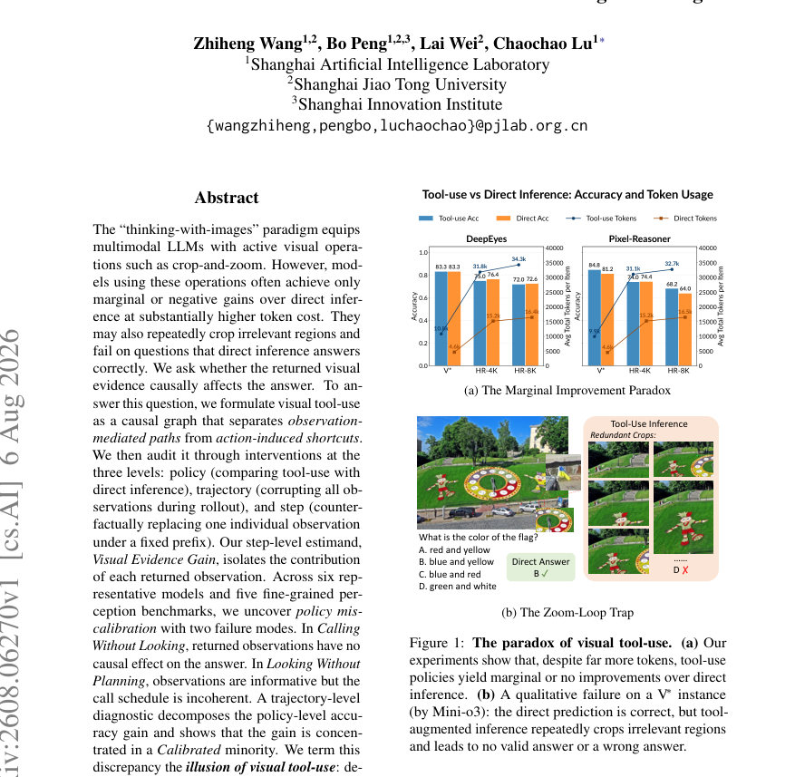
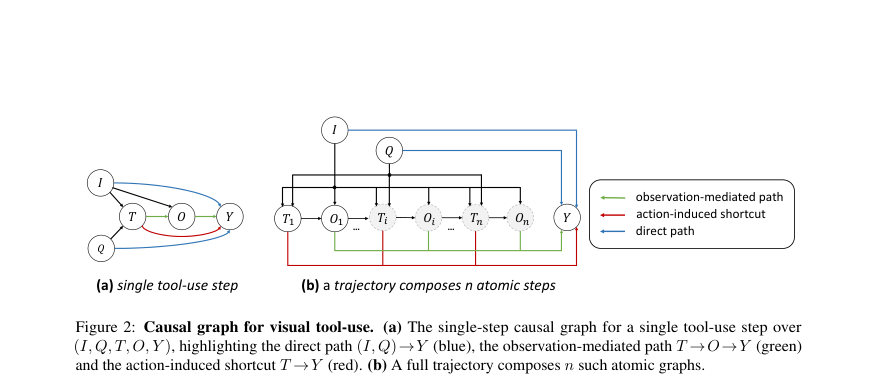
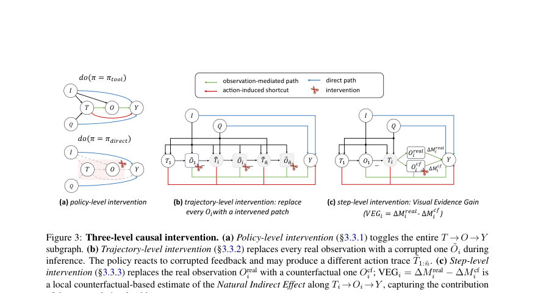

# The Illusion of Visual Tool-Use: A Causal Audit of Thinking with Images

- **게시일:** 2026-08-08
- **arXiv:** [2608.06270v1](http://arxiv.org/abs/2608.06270v1) · [PDF](https://arxiv.org/pdf/2608.06270v1)
- **저자:** Zhiheng Wang, Bo Peng, Lai Wei, Chaochao Lu
- **분야:** cs.AI
- **선정 점수:** 4.19
- **선정 이유:** 최근성 0.5, 인용 영향 0.0 (인용 0회), 저자 영향 0.0 (최고 h-index 0), AI 주제 적합성 2.6, 개발자 관심 0.8, 학술 신호 0.3, 오픈 웨이트·주요 연구조직 신호 0.0

[← 2026-08-08 목록으로 돌아가기](../daily/2026-08-08.html)

<!-- paper-visuals:start -->
## 주요 Figure

> 원문 PDF에서 실제 Figure 캡션과 그림 영역이 함께 확인된 자료만 자동 추출했다.

*Figure · 원문 PDF 1쪽 · Figure 1: The paradox of visual tool-use. (a) Our*

*Figure · 원문 PDF 3쪽 · Figure 2: Causal graph for visual tool-use. (a) The single-step causal graph for a single tool-use step over*

*Figure · 원문 PDF 4쪽 · Figure 3: Three-level causal intervention. (a) Policy-level intervention (§3.3.1) toggles the entire T →O →Y*

<!-- paper-visuals:end -->

## 한 문장 요약

생성형 멀티모달 모델의 'thinking-with-images'(crop-and-zoom 등) 동작이 실제로 예측에 인과적으로 기여하는지를 세 단계(정책/궤적/단계) 개입과 계량적 지표(Visual Evidence Gain)로 진단해, 집계적 성능 개선이 소수의 '캘리브레이티드' 롤아웃에 집중되어 있음을 밝힌 논문.

## 해결하려는 문제

문제: thinking-with-images 패러다임은 모델이 이미지에 대해 능동적 시각 연산(예: crop-and-zoom)을 수행하게 하여 미세 증거를 획득한다는 직관에 기초하지만, 실험에서는 도구 호출(툴-유즈)이 직접 추론(direct inference)에 비해 토큰 비용은 크게 증가시키는 반면 정확도 향상은 작거나 음수인 경우가 많고, 종종 동일 문항에서 반복적으로 무의미한 크롭을 수행하여 오히려 실패하는 사례가 관찰됨. 핵심 연구 질문은 '반환된 시각적 관찰(visual evidence)이 최종 정답에 인과적으로 영향을 주는가?' 이며, 관찰에 의한 경로(observation-mediated)와 행동에 의한 지름길(action-induced shortcut)을 골격으로 분리해 인과적으로 규명하는 것이다.

## 핵심 기여

- 시각 도구 사용(visual tool-use)을 (I, Q, T_i, O_i, Y)를 포함하는 인과 그래프로 공식화하고, 관찰(Obsevation) 경로와 행동(토큰화된 액션) 지름길을 구분한 이론적 틀을 제시 (§3).
- 정책(policy) 수준(툴-유즈 vs 직접), 궤적(trajectory) 수준(모든 관찰을 런타임에 훼손), 단계(step) 수준(고정 접두사 하에 개별 관찰을 반사실적으로 대체)으로 구성된 3단계 개입 프로토콜을 설계하고 실행 (§3.3).
- 단계 수준의 추정량 Visual Evidence Gain(VEG)을 정의하여 각 반환 관찰이 즉시 다음-토큰 수준에서 정답 선호도(probability gap)에 미치는 순(반사실적) 기여를 분리 계산 (§3.3.3).
- 6개 대표적 thinking-with-images 모델(DeepEyes, Pixel Reasoner, Mini-o3, Qwen3-VL-8B, Qwen3-VL-4B, Thyme)과 5개 세분화 인지 벤치마크(V*, HR-Bench-4K/8K, VisualProbe, MME-RealWorld-Lite)에 적용해 정책 부정합(policy miscalibration)이라는 두 가지 실패 모드(CWL, LWP)를 규명하고, 롤아웃을 네 그룹(No-call, Mode1=CWL, Mode2=LWP, Calibrated)으로 분류하는 진단기를 제안하여 정책 수준의 정확도 향상이 소수의 Calibrated 그룹에 집중됨을 정량적으로 분해 (§4).

## 접근 방법

* 방법 요약: (1) 인과적 형식화: 한 스텝의 인과 그래프는 입력 이미지 I와 질의 Q로부터 정책 π가 도구 행동 T_i(크롭 좌표 등)를 생성하고, 시각 엔진 E_tool이 해당 행동으로부터 관찰 O_i(크롭 이미지)를 반환하며, 최종 답 Y는 (I, Q, T_1:n, O_1:n)에 의해 결정된다는 구조적 인과 모델(SCM)을 사용한다(Fig.2).
* 이 그래프에서 (I,Q)→Y 직접 경로, T→O→Y 관찰 매개 경로, T→Y 행동 지름길을 구분한다.
* (2) 세 수준 개입: 정책 수준(do(π=π_tool) vs do(π=π_direct))으로 ATEpolicy를 측정하고(정책-수준 비교); 궤적 수준에서는 런타임에 모든 반환 관찰 O_i를 동일-형태의 훼손된 관찰(주요: RANDOM-CROP, 보조: NOISE, BLANK)로 대체해 ATE_traj를 측정(후속 행동과 중단 결정도 영향 받음); 단계 수준에서는 고정된 접두사와 동일한 도구 행동 T_i 아래에서 실제 관찰 O_real_i와 반사실적 O_cf_i를 교체해, <answer> 토큰 직전의 옵션-제한 소프트맥스 기반 확률 갭 g를 읽어들여 ∆M_real = g_real - g_prev, ∆M_cf = g_cf - g_prev를 구하고 VEG_i = ∆M_real - ∆M_cf로 계산하여 Ti→Oi→Y의 관찰 매개 기여를 국소적으로 추정한다.
* (3) 진단기: 각 롤아웃에 대해 도구 호출 수 n, 호출 전 갭 g0, 궤적별 최대 VEG V_max, 도구 한도 도달 여부(Hit-MaxT), 포스트-채도 과다 호출(POER)을 특징으로 계산하고 임계치(τ_sat=0.95, ε=0.01)를 이용해 네 그룹으로 분류하는 결정 규칙을 제시(Alg.1).
* (4) 평가 설정: 여섯 모델을 공개 체크포인트 그대로 사용하고, MCQ는 옵션-제한 소프트맥스를, 오픈엔디드에는 길이 정규화된 금지지 우도(readout)로 확장해 적용.
* 모든 실험은 본문과 부록에 명시한 복원 가능한 서버·디코딩 설정으로 수행(코드 공개).

## 주요 결과

- 정책 수준(π_tool vs π_direct): 모델 간 편차가 큼(Table 1). 예: DeepEyes는 거의 차이 없음(예: V*: 83.3/83.3 → ∆≈0 pp), Mini-o3는 일부 벤치에서 큰 개선(VisualProbe에서 +21.3 pp; V*에서 +5.5 pp), Qwen3-VL-8B는 V*에서 +6.9 pp 등. 전반적으로 정책-단위 ATE는 제한적이고 불균일함.
- 궤적 수준(런타임 관찰 교란, RANDOM-CROP): 일부 모델은 큰 성능 붕괴를 보임(Table 2). 예: Mini-o3는 V*에서 도구 관찰을 무작위 크롭으로 대체하면 정확도가 87.8%→23.6%로 −64.2 pp 감소하며(또한 Hit-MaxT=84.8%), Qwen3-VL-8B는 V*에서 91.1%→30.4%로 −60.7 pp, Qwen3-VL-4B는 −48.2 pp 등. 반면 DeepEyes와 Thyme 등은 넓게 무영향 내지 약한 영향. 강건성 확인: BLANK/NOISE 대체와 force-answer 실험에서도 일부 손실은 트렁케이션(예: 예답 미제출)으로 설명되지만 남는 손실은 유효한 시각 증거 상실을 시사(부록 B.4).
- 단계 수준(VEG): 모델별 행태 차이(Table 3, Fig.4–5). DeepEyes는 구조적으로 비활성(대부분의 호출에서 VEG≈0, |VEG|<0.01 비율 높음), Mini-o3는 정보 드라이븐이나 희석된 효과(일부 호출에서 유의미한 VEG를 보이나 다수 호출은 무효), Qwen3-VL-8B는 포화(saturation) 의존: 사전 신뢰(g_{i−1})가 낮을 때 비포화 호출은 큰 양(정확한 롤아웃) 또는 큰 음(잘못된 롤아웃)으로 집중됨. POER(포화 이후의 불필요한 호출)도 관찰되어 Mini-o3, Qwen 모델에서 의미있는 비율을 보임(Fig.5(b): Mini-o3 POER ≈12.4%, Qwen3-VL-8B ≈17.8%).
- 진단·분해: 롤아웃을 No-call / Mode1(CWL) / Calibrated / Mode2(LWP)로 분류하고 정책-수준 ATE를 그룹 기여로 분해한 결과(Cf. Table 5): 정책-수준의 긍정적 ATE는 주로 'Calibrated' 소수 집단에 의해 제공되며, Mode1(CallingWithoutLooking)과 Mode2(LookingWithoutPlanning)는 대부분 무효 또는 해로운 기여를 함(예: Qwen3-VL-8B의 총 ATE ≈+6.9 pp 중 Calibrated 기여 ≈+7.6 pp, 다른 그룹이 일부 상쇄).

## 한계

- (저자가 명시한 한계) 모델 접근성 제약: 실험은 공개 오픈소스 thinking-with-images 모델들로 수행되었고, 단계 수준(VEG)은 토큰-레벨 점수에 대한 화이트박스 접근이 필요하므로(닫힌 소스 모델에 동일한 절차 적용 불가) 일반화는 열려 있음(본문 §6·한계).
- (저자가 명시한 한계) 도구 범위 제한: 실험은 주로 CROP-AND-ZOOM 도구에 집중했으며 OCR, 시멘틱 분할, 비디오 프레임 선택 등 다른 유형 도구에 동일한 패턴이 적용된다고 단정하지 않음(본문 §6).
- (저자가 명시한 한계) RL-트랩(RL-trap)은 가설: 정책 불일치(Mode1/Mode2)를 outcome-only 강화학습이 야기한다는 가설을 제시했으나, 이를 훈련 수준에서 인과적으로 입증하려면 통제된 학습실험이 필요하며 본 논문에서는 제시된 결과와 일관되는 가설로 남음(본문 §5·한계).
- (추가 실험적 제약으로 확인되는 한계) 단계 수준 VEG는 순간적 다음-토큰 읽어내기(option-restricted softmax에 기초)로 국소적 영향(다음-토큰 선호도 변화)을 측정하므로, 자유-형태 최종 생성의 전체 인과효과를 완전히 포착하지 못할 수 있음(본문·부록 A.3). 또한 일부 통계치는 디코딩 난수성에 따라 변동성이 있어 복수 시드 반복 실험이 필요함(부록 C.1·B.5에서 반복실험으로 안정성 점검).

## 개발자 관점

- 재현성·접근성: 코드와 실험 파이프라인(모델 체크포인트, 시스템 프롬프트 치환, 관찰 교란 구현, VEG 계산)은 공개되어 있어 오픈체크포인트 기반 재현이 가능함. 다만 VEG 단계는 토큰-레벨 로그잇에 접근할 수 있어야 하므로 닫힌 API 환경에서는 재현이 제한된다(본문·부록 A.1,A.3).
- 운영(인퍼런스) 실용성: 정책 수준에서 단순히 도구를 호출하는 것만으로는 효과가 보장되지 않으므로(Mode1), 운영 시스템은 도구를 호출하기 전 사전 신뢰(g0)가 이미 높은 경우 도구 호출을 회피하거나(백오프), 포화 상태 이후 불필요한 추가 호출을 억제하는 조기종결(early stopping) 규칙을 도입해야 함(본문 §5·운영적 사용).
- 학습·보상 설계: outcome-only RL은 T→Y 지름길(행동으로 보상 획득)을 강화하고 중간 단계의 유해·중복 호출에 대한 처벌이 없으므로, 프로세스 인식(process-aware) 보상·크레딧 분배(예: VEG 기반 스텝-레벨 피드백)를 도입해 캘리브레이티드 행동을 보상하고 Mode1/Mode2를 억제하는 방향이 유망함(논문 제안 및 논의).
- 비용·자원: thinking-with-images는 도구 호출로 토큰 및 계산 비용이 크게 증가(본문 Fig.1 참조). 배포 시 도구 호출 수와 평균 토큰 사용량을 모니터링하고, 캘리브레이티드 집단에만 집중되도록 호출을 제약하여 비용-효율을 개선해야 함.
- 안전·신뢰성: 반환 관찰이 실제로 정답에 인과적으로 기여하는지를 검증하는 VEG 같은 로컬 인과 진단을 통합해 도구-의존 출력의 근거(grounding)를 검사함으로써 비근거적(performative) 호출에 의한 오도(risk)를 줄일 수 있음.

**근거 범위:** 분석 근거: 본 응답은 사용자가 제공한 논문 PDF 본문(본문과 부록 포함)의 텍스트를 기반으로 작성함. 표와 그림의 수치(예: Table 1–5, Fig.1–5 및 부록 표)는 PDF에서 추출된 값을 그대로 인용했으며, 일부 표 형식(특히 VEG 관련 표)의 열 레이아웃이 압축되어 읽기 어려운 부분이 있었으므로 VEG의 평균값·분할 통계는 본문과 표의 서술적 설명을 우선해 요약했음. 닫힌 소스 모델에의 적용 가능성, 학습-레벨 원인 규명(RL-trap) 등은 논문이 명시한 바와 같이 미확정(hypothesis)임을 명시함.
