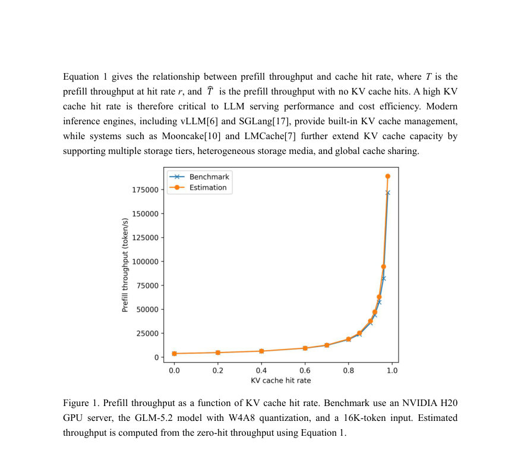
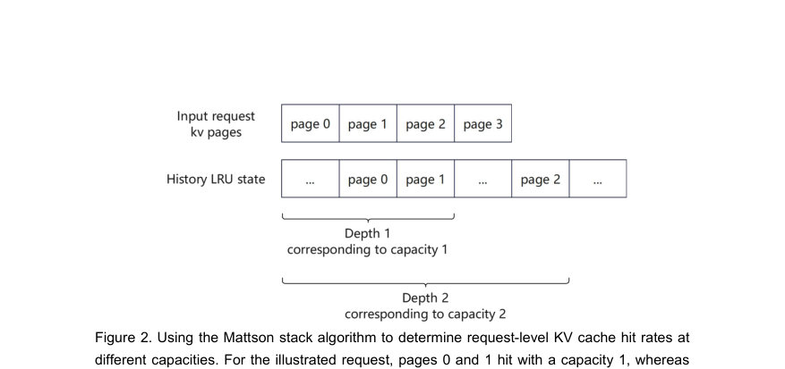
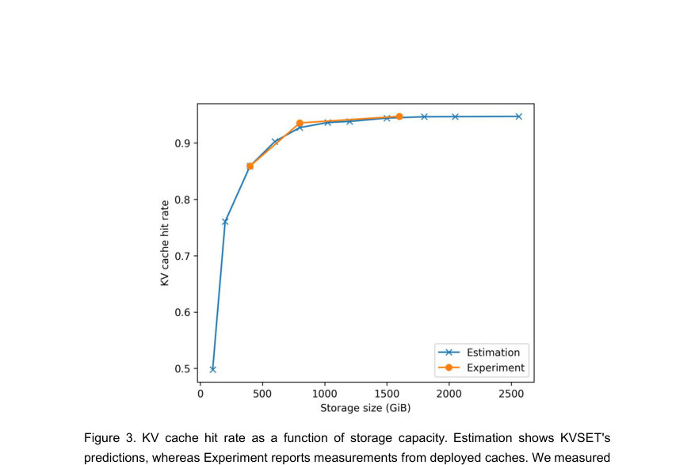

# The KV Cache Working Set: Online Capacity Planning for LLM Inference Systems

- **게시일:** 2026-09-24
- **arXiv:** [2609.27746v1](http://arxiv.org/abs/2609.27746v1) · [PDF](https://arxiv.org/pdf/2609.27746v1)
- **저자:** Luchang Li, Shuaishuai Wang, Zhao Ruan, Dongfang Li, Bozhao Gong
- **분야:** cs.DC
- **선정 점수:** 5.17
- **선정 이유:** 최근성 1.2, 인용 영향 0.0 (인용 0회), 저자 영향 0.0 (최고 h-index 0), AI 주제 적합성 2.3, 개발자 관심 1.4, 학술 신호 0.3, 오픈 웨이트·주요 연구조직 신호 0.0

[← 2026-09-24 목록으로 돌아가기](../daily/2026-09-24.html)

<!-- paper-visuals:start -->
## 주요 Figure

> 원문 PDF에서 실제 Figure 캡션과 그림 영역이 함께 확인된 자료만 자동 추출했다.

*Figure · 원문 PDF 2쪽 · Figure 1. Prefill throughput as a function of KV cache hit rate. Benchmark use an NVIDIA H20*

*Figure · 원문 PDF 4쪽 · Figure 2. Using the Mattson stack algorithm to determine request-level KV cache hit rates at*

*Figure · 원문 PDF 5쪽 · Figure 3. KV cache hit rate as a function of storage capacity. Estimation shows KVSET's*

<!-- paper-visuals:end -->

## 한 문장 요약

LLM prefix(=KV) 캐시의 작업집합(working set) 용량을 온라인으로 추정하기 위해 Mattson 스택 알고리즘과 Fenwick 트리를 사용하여 단일 리플레이로 다수의 LRU 캐시 용량에 대한 히트율을 정확하게 계산하는 시스템(KVSET)을 제안한다.

## 해결하려는 문제

LLM 서비스에서 키-값(KV) 프리픽스 캐시는 반복되는 대화·툴 사용 이력의 재사용으로 전처리(prefill) 비용을 크게 줄이지만, 모든 과거 KV 상태를 보관하려면 비용이 과도하게 증가하고, 반대로 용량이 부족하면 히트율이 급격히 떨어진다. 기존 방법은 여러 후보 캐시 크기를 각각 시뮬레이션(replay)하여 필요한 용량을 찾는데, 정확한 추정을 위해 수십 개의 용량을 독립적으로 재플레이해야 하므로 계산·메모리 오버헤드가 크고 온라인 통합이 어렵다. 연구 질문은 '주어진 목표 히트율(또는 커버리지)을 달성하기 위해 최소로 필요한 KV 캐시 용량(working set)을 온라인으로 효율적이고 정확하게 추정할 수 있는가'이다.

## 핵심 기여

- Mattson 스택 알고리즘을 KV prefix(페이지 단위) 캐시 용량 분석에 적용하여 단일 리플레이로 다수의 LRU 용량에 대한 히트율을 동시에 계산하는 방법을 제시함.
- LRU 스택 거리를 효율적으로 계산하기 위해 Fenwick 트리를 사용하여 스택 거리 계산 비용을 낮추고 온라인 분석을 실용적으로 만듦.
- 단일 리플레이에서 각 요청의 페이지별 LRU 깊이(스택 거리)를 이용해 목표 히트율을 만족하는 최소 캐시 용량(최대 LRU 깊이에 기반)을 식별하는 절차를 제시함.
- 생산 환경 코드 에이전트 워크로드 트레이스(10,000 및 24,000 요청 등)를 사용하여 KVSET의 예측이 배포된 캐시 측정치와 밀접하게 일치함을 검증함.
- 온라인 요청 처리와 오프라인 트레이스 재생을 지원하는 오픈소스 구현을 제공함(저자 제공 깃허브 링크).

## 접근 방법

* 대상은 페이지(=KV 페이지) 단위의 LRU 프리픽스 캐시이다.
* 접근 방식은 다음과 같다.
* (1) 각 KV 페이지 접근을 토큰-프리픽스 재사용을 KV-페이지 참조 스트림으로 변환한다.
* (2) Mattson 스택 알고리즘 관점에서, 각 접근에 대해 그 페이지의 LRU 스택 거리(stack distance)를 계산하면 임의의 캐시 용량 C에서 히트 여부를 판단할 수 있다(스택 거리 < C 이면 히트).
* (3) 스택 거리 계산을 효율화하기 위해 KVSET은 Fenwick 트리(비트)를 사용하여 '해당 페이지보다 더 최근에 접근된 서로 다른 페이지 수'를 빠르게 계산한다.
* (4) 각 접근마다 얻은 스택 거리를 후보 용량들의 페이지번호와 비교하여, 하나의 트레이스 재플레이로 모든 후보 용량에 대한 히트/미스 결과를 동시에 집계해 용량→히트율 곡선을 얻는다.
* (5) 요청 수준의 목표 히트 수(또는 요청의 이론적 히트율)를 충족하기 위한 최소 캐시 용량은, 해당 요청에서 히트되어야 하는 접두사 페이지들의 최대 LRU 깊이를 기준으로 결정한다.
* 전체적으로 여러 캐시 인스턴스를 별도 시뮬레이션하지 않고 정확한 LRU 기반 히트율을 산출하는 것이 핵심이다.

## 주요 결과

- 평가에 사용된 데이터: 내부(production) 코딩 에이전트 워크로드 트레이스(논문 본문에서 10,000-요청 및 24,000-요청 시퀀스 언급).
- 실험 환경: NVIDIA H20 GPU, GLM-5.2 모델(W4A8 양자화), MTP 비활성화, KV 캐시는 FP8로 양자화되어 SGLang에서 토큰당 약 60 KB의 KV 저장공간을 차지함(본문 명시).
- 정량적 관찰: KVSET의 용량별 히트율 예측은 배포된(Mooncake+SGLang) 실제 캐시 측정과 '밀접하게 일치'한다고 보고됨(그림 3). 논문은 선택된 물리적 용량에서 실험 측정치를 비교하며 전반적인 곡선 일치성을 제시함(정밀 오차 숫자는 본문에 명시되어 있지 않음).
- 온라인 분석 사례: 24,000 요청 트레이스에서 누적(모든 과거 KV 상태를 보존할 경우)과 목표 커버리지(요청의 이론적 히트율을 보존하려는 비율)에 따른 추정 용량을 비교함. 결과 예시로 해당 워크로드에서 95% 커버리지에 약 1 TiB, 99% 커버리지에 약 5 TiB가 필요하다고 보고함. 99.9% 커버리지 요구량은 관찰된 트레이스 내에서 수렴하지 않음.
- 운영적 발견: 히트율은 저용량 영역에서 급격히 증가하고, 일정 용량 이후에는 한계 수익 감소 현상이 관찰되어(더 큰 저장공간을 투입해도 히트율 개선이 미미함) 커버리지 목표를 기준으로 계층형(메모리 vs 디스크) 캐시 용량을 결정할 것을 제안함.

## 한계

- 저자가 명시한 한계: KVSET은 'full-attention' 구성 요소의 KV 상태만 추정하며, 하이브리드 아키텍처(예: linear attention, sliding-window attention 등)가 포함된 경우에는 full-attention 레이어 요구량만 추정하고 Mamba 또는 SWA 상태에 대해선 모델·워크로드에 맞는 비율로 추가 메모리를 예약할 것을 권고함.
- 저자가 명시한 한계: KVSET은 LRU(최근 사용 순) 폐기 정책에만 적용되며, LRU 이외의 정책으로는 확장되지 않음(미래 작업으로 제시됨).
- 본문 실험·범위에서 드러나는 제약: 검증은 내부(사설) 생산 트레이스와 특정 엔진(SGLang)·아키텍처·모델(GLM-5.2)에서 수행되었으므로, 다양한 모델, 양자화 설정, 다른 KV 캐시 구현 또는 비-LRU 정책에서의 일반화 가능성은 본문에서 직접적으로 입증되지 않음.
- 평가에선 히트율 예측의 '밀접한 일치'만 보고하고 구체적 오차(예: 평균 절대 오차, RMSE, 퍼센트 오차 등) 수치는 본문에 제공되지 않아 정량적 정확도 한계가 있음.

## 개발자 관점

- 재현·구현: 오픈소스 구현(저자 제공 링크)을 통해 온라인(실시간 스트림)과 오프라인(트레이스 재생) 분석이 가능하므로, 실서버에 통합해 실시간 용량 모니터링과 경보를 구현할 수 있음.
- 통합·배포: KVSET은 별도의 캐시 인스턴스(다중 용량 시뮬레이션)를 유지하지 않으므로, 온라인 서비스에 통합해도 추가 메모리 풀 복제 비용이 들지 않음. 다만 입력 재사용을 KV-페이지 참조 스트림으로 정확히 변환하는 전처리 로직이 필요하다.
- 운영비용·용량 계획: 종합적 권고는 '커버리지 목표(base on request-level theoretical hit-rate)'를 기준으로 계층형 캐시(예: CPU 메모리 + 디스크) 크기를 산정하는 것임. 논문 사례에서 95% → 약 1 TiB(메모리층), 99% → 약 5 TiB(디스크 포함) 같은 실무적 가이드라인을 제공함(워크로드 의존적임).
- 성능·효율: Fenwick 트리를 사용한 스택 거리 계산으로 각 접근당 비용을 낮추어 수십 개 용량을 독립 시뮬레이션하는 전통적 방법보다 계산·메모리 오버헤드가 크게 줄어들며 온라인 분석이 실용적임(정확한 성능 수치는 본문에 수치로 제시되어 있지 않음).
- 제약·안전성: 현재 분석은 LRU 및 full-attention KV에 국한되므로, 하이브리드 어텐션 구조나 다른 폐기 정책을 사용하는 환경에서는 추가 추정(또는 다른 도구 병행)이 필요함. 또한 극단적 커버리지(예: 99.9%)는 트레이스 길이에 따라 수렴을 보이지 않을 수 있어 비용-성능 균형을 명시적으로 설정해야 함.

**근거 범위:** 이 분석은 제공된 논문 PDF 본문(페이지 1–9)의 텍스트를 근거로 작성되었음. 본문에 명시된 실험 설정(모델, 하드웨어, 트레이스 크기, 토큰당 KV 크기 등)과 저자의 명시적 한계들을 직접 인용·요약하였으며, 본문에 제시되지 않은 상세 수치(예: 예측 오차의 정확한 통계, 실행 시간·메모리 사용량의 정량적 비교)는 가정하거나 생성하지 않았음. 일부 결과(그림 3의 곡선 일치 등)는 본문 서술을 기반으로 정성적으로 기술했으며, 그림에서 추출 가능한 정밀 수치가 본문에 별도로 표기되어 있지 않아 정량적 오차 수치는 제공하지 못함.
