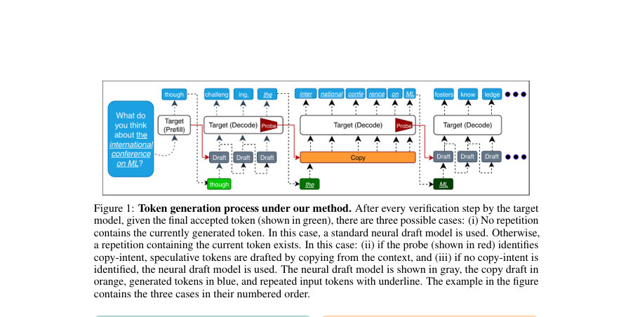
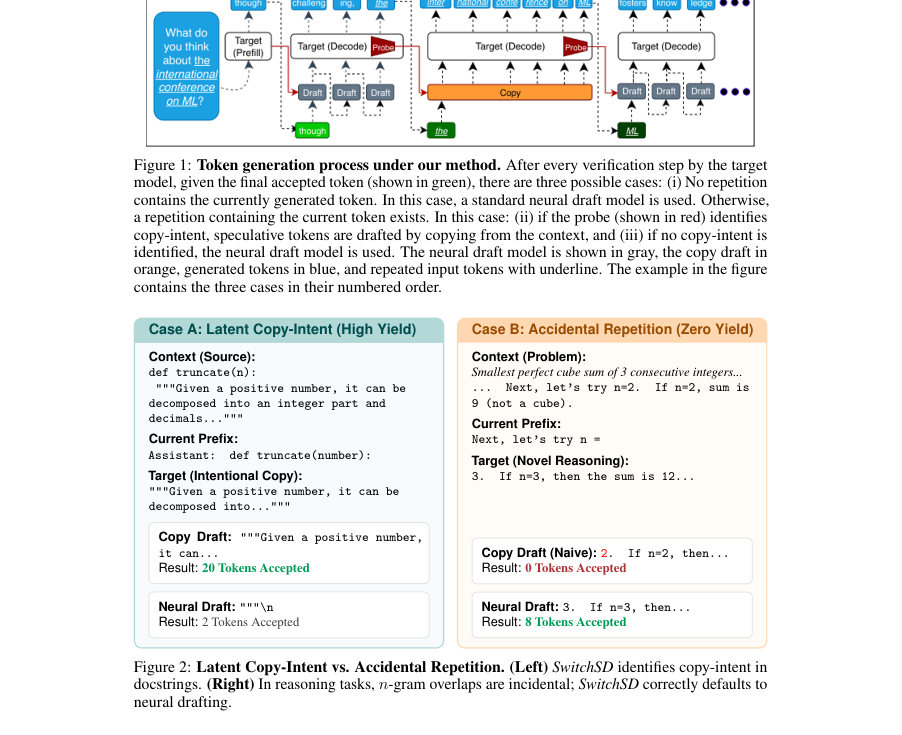
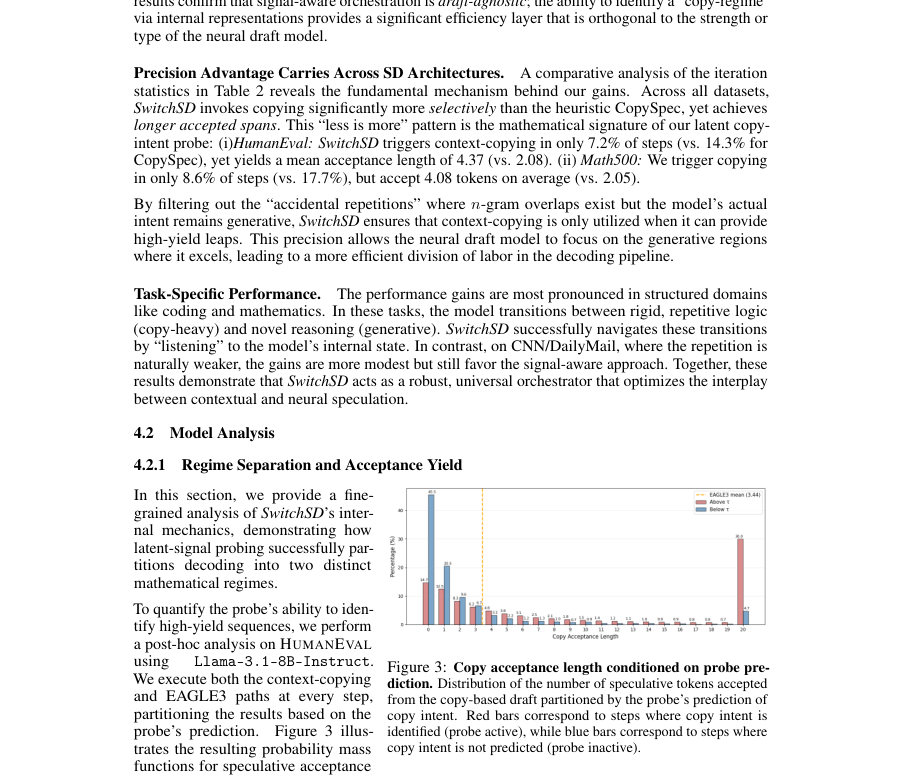

# To Copy or Not to Copy: Controlling Speculative Decoding via Intrinsic Model Signals

- **게시일:** 2026-09-18
- **arXiv:** [2609.20186v1](http://arxiv.org/abs/2609.20186v1) · [PDF](https://arxiv.org/pdf/2609.20186v1)
- **저자:** Roy Eisenstadt, Ido Cohen, Edo Cohen-Karlik, Lior Wolf, Itamar Zimerman
- **분야:** cs.CL
- **선정 점수:** 7.25
- **선정 이유:** 최근성 1.2, 인용 영향 0.0 (인용 0회), 저자 영향 0.0 (최고 h-index 0), AI 주제 적합성 3.0, 개발자 관심 0.2, 학술 신호 0.3, 오픈 웨이트·주요 연구조직 신호 2.5

[← 2026-09-18 목록으로 돌아가기](../daily/2026-09-18.html)

<!-- paper-visuals:start -->
## 주요 Figure

> 원문 PDF에서 실제 Figure 캡션과 그림 영역이 함께 확인된 자료만 자동 추출했다.

*Figure · 원문 PDF 2쪽 · Figure 1: Token generation process under our method. After every verification step by the target*

*Figure · 원문 PDF 2쪽 · Figure 2: Latent Copy-Intent vs. Accidental Repetition. (Left) SwitchSD identifies copy-intent in*

*Figure · 원문 PDF 7쪽 · Figure 3: Copy acceptance length conditioned on probe pre-*

<!-- paper-visuals:end -->

## 한 문장 요약

LLM의 내부 표현에서 '복사 의도(copy-intent)' 신호를 선형 프로브로 검출해 상황에 따라 문맥 복사 기반 초안과 신경망 초안(EAGLE3 등)을 동적으로 전환함으로써 추측적 디코딩의 효율을 높이는 SwitchSD를 제안한다.

## 해결하려는 문제

기존의 추측적 디코딩(Speculative Decoding)은 문맥 복사(예: n-gram 검색)와 신경망 기반 초안 사이에 트레이드오프가 존재한다. 표면적 n-gram 일치에 기반한 복사 기법은 우연한 반복(‘accidental repetitions’)을 구별하지 못해 복사 시도가 거부되어 오히려 처리량을 감소시키는 ‘speculation tax’를 초래한다. 본 논문은 복사가 단순 표면현상이 아니라 모델 내부의 잠재적 제어 신호에 의해 주도된다고 보고, 이를 검출해 복사와 신경망 초안 사이를 모델-인식적으로 전환하는 문제를 다룬다.

## 핵심 기여

- SwitchSD: 모델 내부 표현에 경량 선형 프로브를 학습시켜 복사-의도를 판단하고, 판단 결과에 따라 문맥 복사와 신경망 초안 경로를 동적으로 전환하는 추측적 디코딩 오케스트레이터를 제안함.
- 복사-우대(copy-favorable)와 생성적(generative) 디코딩 레짐의 분리를 실험적으로 보이며, 복사-레짐에서 훨씬 긴 수용(accepted) 연속 토큰을 얻어 효율을 높일 수 있음을 보임.
- 경량 선형 프로브 설계(바이어스 없음)와 층(layer)·서브레イヤ(주의(attention) 후) 선택, 임계값 선정 절차를 제시하고, AUC>0.99의 높은 선형 분리성을 보고함.
- CopyDiversity 등 의도 중심의 훈련 데이터 구축과 블록-삼각형(block-triangular) 어텐션을 이용한 병렬 검증, KV 캐시 동기화를 위한 lazy propagation 구현 등 실무적 설계를 포함한 전체 파이프라인을 제시함.
- 여러 벤치마크(HumanEval, Math500, CNN/DailyMail)와 모델군(LLaMA-3, Qwen3)에서 EAGLE3 및 기타 기준선 대비 최대 약 15%까지 전체 처리량 향상을 달성하고, 초안-독립적으로(초안이 EAGLE3든 SPS든) 이득을 제공함을 실험적으로 검증함.

## 접근 방법

* 아키텍처·알고리즘 요약: (1) 복사-의도 탐지 문제를 이진 분류로 정식화하고, 토큰 수준의 내부 은닉 표현 H^{(ℓ)}에서 작동하는 편향 없는 선형 프로브 p_ℓ(j)=σ(w_ℓ^⊤ H^{(ℓ)}_j)를 각 층별로 학습한다.
* 손실은 이진 교차엔트로피에 ℓ2 정규화를 더한 형태이다.
* (2) 학습 라벨은 약한 감독으로 정의되며, n_{train}=5 이상의 정확한 서열(verbatim) 반복에 속한 토큰을 copy-mode(Y=1)로 표기하는 프록시 레이블을 사용한다.
* (3) 데이터 구성: 논문 본문에 따르면 Claude Sonnet를 이용해 1,000개의 프롬프트로 모델 생성 응답을 얻어 수십만 개의 토큰-레벨 레이블을 추출하는 ‘컨트롤된 프로빙 데이터셋’을 구성하고(본문 §3.2), 부록(C)에는 CopyDiversity라는 800/200 트레인/검증 샘플 분할을 가진 큐레이션된 데이터셋도 설명함.
* (4) 층·서브레이어 선택: 모든 층의 프로브를 학습한 뒤 검증 세트에서 F1을 최대화하는 최적 층을 선택하고 임계값 τ를 F1 최적화로 정한다.
* 주로 중간 층의 attention 서브레이어(예: Llama-3.1-8B에서 layer 14) 표현이 최적이었다고 보고함.
* (5) 추론 규칙: 현재 토큰 위치 i에서 PR(H^{(ℓ)}_i) ≥ τ 이고 끝부분 κ-gram(κ=5)이 과거에 출현한 경우에만 문맥 복사 기반 초안을 활성화한다; 그렇지 않으면 신경망 초안을 사용한다.
* (6) 문맥 복사 경로: 최대 W=10개의 후보 연속문(각 최대 길이 D=20)을 최근성 기준으로 검색하여 블록-삼각형 어텐션을 통해 타깃 모델에서 병렬로 검증하고, 검증된 가장 긴 연속을 받아들인다.
* (7) 신경망 초안 경로: EAGLE3 또는 간단한 Speculative Sampling(SPS)을 사용해 초안을 생성한다.
* (8) KV 캐시 동기화: accepted 토큰은 다음 전방 계산에서 초안 모델에 전달하는 lazy propagation으로 동기화하여 오버헤드를 상쇄한다.

## 주요 결과

- 주요 벤치마크: HumanEval, Math500, CNN/DailyMail에서 처리량(tokens/sec)과 vanilla 대비 speedup을 측정함. 논문은 SwitchSD가 모든 9개 구성에서 기준선들(PLD, CopySpec, BanditSpec, EAGLE3 등)을 일관되게 능가한다고 보고함.
- 평균 속도향상(논문 본문): HumanEval에서 평균 2.31×, Math500에서 2.03×, CNN/DM에서 1.83× 처리량을 달성했다고 서술함.
- 모델·구체 결과 예시(표 자료 기반): LLaMA-3.1-8B HumanEval에서 Vanilla 38.30 Tok/s(1.00×), EAGLE3 87.50 Tok/s(2.28×), SwitchSD 98.63 Tok/s(2.58×). LLaMA-3.1-8B Math500: EAGLE3 79.38 Tok/s, SwitchSD 88.74 Tok/s. LLaMA-3.1-8B CNN/DM: EAGLE3 70.84 Tok/s, SwitchSD 77.00 Tok/s. (테이블 1의 값들을 본문에서 직접 인용함.)
- 문제 유형별·아키텍처 독립성: SwitchSD는 EAGLE3뿐 아니라 SPS 기반 초안에서도 이득을 보이며(예: Qwen3-8B 실험, Table 2), 복사-우대 작업(코딩·수학)에 특히 큰 이득을 냄.
- 프로브 성능: 선택된 층에서의 프로브 ROC AUC > 0.99, F1-optimal 임계값은 모델 예시(Llama-3.1-8B)에서 약 τ≈0.4로 보고됨. 프로브가 활성일 때의 최대 허용 speculative 길이(20토큰)에 도달하는 비율은 비활성 시보다 대폭 높아(예: 30.0% vs 4.7%) 수용 연속 길이를 크게 늘림.

## 한계

- 저자 명시 한계: 프로브 학습은 약한 감독(긴 verbatim 반복을 프록시 레이블로 사용)에 의존하므로 프로브가 표면적 반복을 학습할 위험이 있으며, 이 문제를 줄이기 위해 다양한 완성 샘플과 표현적 병목(단일 토큰의 은닉 상태) 설계를 사용했다고 밝힘(본문 §E).
- 데이터·도메인 범위 제한(본문 기반 관찰): 실험은 LLaMA-3, Qwen3 계열과 세 가지 벤치마크(HumanEval, Math500, CNN/DailyMail) 위주로 수행되어 다른 모델군·태스크로의 일반화는 본문에서 직접 검증되지 않음.
- 흰박스 접근 요구: SwitchSD는 대상 모델의 내부 은닉(H^{(ℓ)})을 읽을 수 있어야 하므로, 상용 폐쇄형 API나 내부 표현 접근이 제한된 환경에서는 적용이 불가능하거나 제약이 큼.
- 프록시 레이블 설계의 제약: 학습시 사용한 n_{train}=5 및 추론시 κ=5 같은 하이퍼파라미터는 긴 verbatim 복사에는 민감하지만, 더 짧은(그러나 의도적) 복사 행위를 놓칠 수 있음. 이는 저자도 프록시 라벨의 한계로서 논의함(본문 §3.2, Appendix E).

## 개발자 관점

- 재현·구현: 타깃 모델의 중간 attention 서브레이어 은닉에 접근할 수 있어야 하며, 각 모델·버전에 대해 층 선택(layer)과 임계값 τ를 검증 세트로 튜닝해야 한다. 프로브는 편향 없는 선형 투영으로 구현하므로 계산 오버헤드는 작으며, 학습은 BCE + ℓ2 정규화로 수행된다(정확한 학습률·에폭 등은 본문에 상세 수치는 없음).
- 데이터 준비: 의도 기반 레이블을 확보하기 위해 CopyDiversity처럼 복사-유도/혼합/비복사 프롬프트를 균형 있게 포함하는 데이터가 필요하다(본문은 Claude Sonnet을 통해 1,000 프롬프트로 합성 자극을 생성했다고 기술).
- 시스템 통합: 블록-삼각형 어텐션을 통한 W(=10) 후보 병렬 검증(각 후보 최대 D=20 토큰)은 모델의 어텐션 마스크를 제어할 수 있어야 하므로 인퍼런스 스택에 낮은 수준의 마스크 제어가 가능해야 한다. KV 캐시 동기화는 lazy propagation으로 구현해 오버헤드를 상쇄할 것을 권장함.
- 운영·비용: 프로브 평가 비용은 작으나 복사 후보 검색·병렬 검증 오버헤드가 존재한다. 실험은 NVIDIA H100에서 수행되었고 런타임은 모델·데이터셋에 따라 45분~17시간으로 다양하므로, 대규모 배포에서는 하드웨어·운영 비용을 고려해야 함.
- 안정성·품질: 논문은 SwitchSD가 정확한 생성 품질을 보존한다고 보고하므로(타깃 모델의 검증을 거치므로), 적용 시 품질 열화 없이 처리량을 개선할 수 있다. 다만 흰박스 접근이 전제이므로 개인정보·데이터 유출 관련 정책 검토가 필요할 수 있다(논문은 해당 위험을 직접 논의하지 않음).

**근거 범위:** 이 분석은 제공된 논문 PDF 본문(페이지 1–14)의 텍스트를 근거로 작성되었음. 본문에 명시된 수치(표, ROC AUC, Tok/s, speedup 등)와 설계(프로브 아키텍처, n_{train}=5, κ=5, W=10, D=20, layer 선택 예: layer 14, KV lazy propagation, H100 하드웨어 등)를 직접 인용·요약하였다. 다만 논문이 밝히지 않은 세부 하이퍼파라미터(학습률, 에폭 수, 정규화 계수 값 등)와 내부 구현의 미세한 운영 세부사항은 PDF에서 확인되지 않아 기술하지 않았다. 또한 본문 내에 컨트롤 데이터셋 관련 언급(Claude Sonnet로 1,000 프롬프트 생성)과 부록의 CopyDiversity(800/200 분할) 기술이 모두 존재하므로, 데이터 구성 관련 서술은 본문과 부록의 설명을 병기하여 정리했음을 밝힌다.
