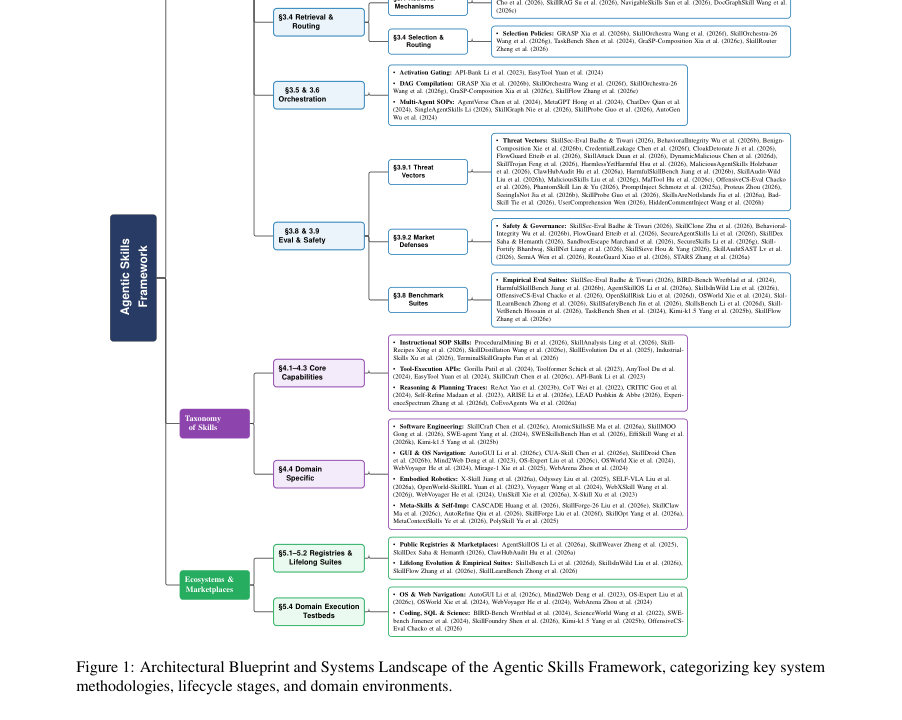

# Towards a Systems Foundation for Agentic Skills: Architecture, Lifecycle, and Security

- **게시일:** 2026-09-01
- **arXiv:** [2608.29596v1](http://arxiv.org/abs/2608.29596v1) · [PDF](https://arxiv.org/pdf/2608.29596v1)
- **저자:** Sanket Badhe, Deep Shah, Priyanka Tiwari, Nehal Kathrotia
- **분야:** cs.AI, cs.LG, cs.MA
- **선정 점수:** 4.56
- **선정 이유:** 최근성 0.6, 인용 영향 0.0 (인용 0회), 저자 영향 0.0 (최고 h-index 0), AI 주제 적합성 3.0, 개발자 관심 0.2, 학술 신호 0.8, 오픈 웨이트·주요 연구조직 신호 0.0

[← 2026-09-01 목록으로 돌아가기](../daily/2026-09-01.html)

<!-- paper-visuals:start -->
## 주요 Figure

> 원문 PDF에서 실제 Figure 캡션과 그림 영역이 함께 확인된 자료만 자동 추출했다.

*Figure · 원문 PDF 5쪽 · Figure 1: Architectural Blueprint and Systems Landscape of the Agentic Skills Framework, categorizing key system*

<!-- paper-visuals:end -->

## 한 문장 요약

에이전트용 '스킬(skill)'을 외부화된 절차적 지식으로 형식화하고, 이를 위한 아키텍처·9단계 수명주기·보안·생태계 설계를 통합한 시스템적 기준을 제시한다.

## 해결하려는 문제

현행 LLM 에이전트는 장기·복합 작업에서 초기 실행 오류가 전파되어 복구 불능 상태에 빠지고(신뢰성 문제), 성공한 절차 지식이 세션 경계에서 소실되어 누적 학습이 일어나지 않으며(재사용성 문제), 긴 절차를 컨텍스트에 직접 집어넣는 방식은 토큰 비용·정확도 저하를 유발하고, 파라미터화(fine-tuning)는 도구·조직 규약 변경을 따라가지 못한다. 본 논문은 이러한 한계들을 해결하기 위해 '외부화된 모듈형 절차적 스킬'을 정의하고, 그 설계·발견·저장·검색·조합·실행·적응·평가·보안 거버넌스 등의 전주기적 시스템 기반을 규정하려 한다.

## 핵심 기여

- 형식적 정의: 스킬을 s = (A, I, C, T, π, E) 형태의 여섯 튜플로 수학적으로 정식화하고, 스킬의 시스템적 식별 기준(캡슐화된 모듈성, 늦은 바인딩/동적 호출, 절차적 상태 변환)을 제시함.
- 절차적 스킬 레퍼런스 아키텍처: 발견(Discovery)부터 보안 거버넌스까지 9단계 수명주기(Discovery, Representation, Storage, Retrieval/Routing, Orchestration, Execution/Repair, Adaptation, Evaluation, Security)를 통합한 참조 아키텍처와 비교표 제공.
- 역량·도메인 분류: Instructional SOP, Tool-Execution, Latent Reasoning, Meta-Skills 등의 기능 분류와 소프트웨어 공학·GUI/OS 내비게이션·로보틱스·과학탐구 등 4개 운영환경에 대한 분류(표·사례 포함).
- 생태계·위협 모델링: 퍼블릭 레지스트리·마켓플레이스 역학, 실행 테스트베드, 스킬 생태계의 공격 벡터(예: 스킬 트로이, 자격증명 누출, 숨은 주석 인젝션) 및 런타임 방어·검증 메커니즘 분석.

## 접근 방법

* 논문은 문헌·시스템 사례를 종합하는 시스템·위성고찰(architectural survey) 방식으로 접근한다.
* 핵심 방법론적 요소는 다음과 같다: (1) 스킬을 수학적 여섯 튜플 s=(A,I,C,T,π,E)로 정의하고 활성화 함수 A(xt,g)과 권한 제약 Ts ⊆ T_permitted(xt)를 도입해 안전 경계와 늦은 바인딩을 형식화함; (2) 스킬 발견을 롤아웃 로그 H에서 재사용 가능한 서브정책 τ_i:j를 추출하는 연산자 D와, 후보를 검증·정제해 영구적 스킬 s*로 커밋하는 획득 연산자 A로 모델링함(수식(6)–(9)); (3) 표현 형식별(자연어 SKILL.md, 구조화 JSON/DSL, 실행 명세/코드, 계약 기반 하이브리드) 트레이드오프를 분석하고 '점진적 공개(progressive disclosure)'로 메타데이터만 먼저 로드하는 설계원칙을 제안함; (4) 스킬 저장소(에피소드 로그·절차 기억·그래프·계층적 메모리)와 검색·라우팅 정책(GRASP, SkillRouter 등), DAG 컴파일·오케스트레이션 기법을 정리함; (5) 스킬의 사전검증(V(s)) 메커니즘(유닛 테스트·샌드박스 실행, LLM 심판, 형식적 증명, HITL 리뷰)과 런타임 모니터링/권한 검사(STARS, RouteGuard, FlowGuard 등)를 아키텍처에 통합하여 보안 거버넌스를 설계한다.
* 논문 전반은 많은 최신 시스템(예: Voyager, SkillRL, Trace2Skill, SkillGen 등) 사례를 분류·비교하는 방식으로 실행된다.

## 주요 결과

- 정식화 결과: 스킬을 여섯 튜플(s=(A,I,C,T,π,E))로 정의하고, 스킬의 삼중(캡슐화·늦은 바인딩·절차적 변환) 기준을 통해 프롬프트·툴·워크플로우·기억과 구별함(Table 1).
- 수명주기 아키텍처: 발견→저작·표현→저장→검색·라우팅→조합·오케스트레이션→실행·수리→평생적응→평가→보안(총 9단계)으로 구성된 참조 프레임워크(그림 1 및 관련 표들)를 제시함.
- 비교표·택소노미: 저자들은 저작·발견·표현·저장·검색·오케스트레이션·평가·보안 등 각 단계별로 다수(논문에서 '10개의 비교표' 등으로 언급) 비교표를 제공하고, 발견·저작 패러다임 비교(Table 2)는 n=19 시스템을 정리함(표에 따라 Autonomous RL, AI-synthesized, Hybrid, Manual 등으로 분류됨).
- 보안·위협 분석: 스킬 생태계에서 발생 가능한 위협 벡터(예: 스킬 트로이, 프롬프트 주입, 숨은 주석 인젝션, 자격증명 유출 등)를 분류하고, 사전검증·샌드박스·런타임 감지·권한 모델(Ts⊆T_permitted) 등 방어 전략을 제안함.
- 설계적 관찰: RL 기반 발견법은 높은 샘플 복잡도(논문은 10^4–10^6 롤아웃 스텝을 예로 제시)로 현실 환경 적용이 어렵고, LLM 심판(LLM-as-judge)에 의존하는 전처리 게이트는 신뢰성 결함을 가질 수 있다고 정리함.

## 한계

- 저자가 명시한 한계: (1) 희소 보상 환경에서의 탐색-활용 격차로 인해 자율적 발견이 초기 역량 확보에 실패할 수 있음; (2) 무분별한 스킬 생성은 저장소 포화와 검색 혼동을 초래(스킬 확산 및 메모리 희석 문제); (3) LLM 심판의 신뢰성 한계(시커모니·문법·숨은 페이로드 미검출)로 인해 LLM 기반 전처리 검증만으로는 안전을 보장하기 어렵다는 점. 또한 스킬은 '호출 이전에 완전 검증 불가'라는 근본적 제약이 존재함.
- 본문 기반으로 확인되는 실험·평가 제약(분석자 판정): 본 논문은 주로 아키텍처·탈중심적 분류·위협 모델링을 제시하는 조사·정리적 연구로, 단일 통제 실험이나 표준화된 정량 비교(예: 대규모 벤치마크에서의 수치적 성능 향상)는 포함하지 않음. 따라서 제시된 설계의 실제 효율성·스케일·성능(지연, 성공률 등)은 이 논문만으로는 확인되지 않음.

## 개발자 관점

- 스킬을 설계할 때는 점진적 공개(메타데이터만 먼저 로드하고 실행 시 본문을 불러오는 방식)로 컨텍스트 토큰 비용을 줄일 것.
- 권한 기반 활성화(A(xt,g) 및 Ts ⊆ T_permitted(xt))를 런타임에 엄격히 검사하여 권한 상승·무단 외부 호출을 방지할 것.
- 스킬 등록 전 샌드박스 유닛테스트와 정적·형식 검사(가능하면 Datalog/계약 증명)를 결합한 전처리 게이트 V(s)를 도입하고, LLM 심판은 보조 검증 수단으로만 사용할 것(HITL 병용 권장).
- 자율 발견(특히 RL) 기법은 실제 환경에서 샘플 비용이 높으므로(논문: 10^4–10^6 롤아웃), 현실적 도메인에서는 AI 합성·하이브리드·교사 시연을 통한 보조 데이터가 필요함.
- 스킬 저장소 관리(중복 제거·중요도 기반 정리·주기적 리파인)는 검색 혼동을 줄이고 성능 저하를 방지하므로 SkillOps 등의 유지·관리 계층을 마련할 것(예: 스킬 정리·버전 관리·경량 인덱싱).

**근거 범위:** 본 분석은 제공된 논문 PDF 본문 텍스트를 근거로 작성되었다. 본문에서 제시된 정식화(s=(A,I,C,T,π,E)), 9단계 수명주기, Table 2의 n=19 시스템 비교, 샘플 복잡도(10^4–10^6 롤아웃) 및 저자가 명시한 병목(탐색-활용 갭, 스킬 확산, LLM 심판 신뢰성)를 직접 인용·요약하였다. 논문은 주로 아키텍처·분류·위협 분석 중심의 개념·시스템 정리 논문이며, 일관된 정량적 실험 결과(성능 수치 표준 벤치마크 비교)는 본문에 포함되어 있지 않아 성능 관련 수치는 제공하지 않았다.
